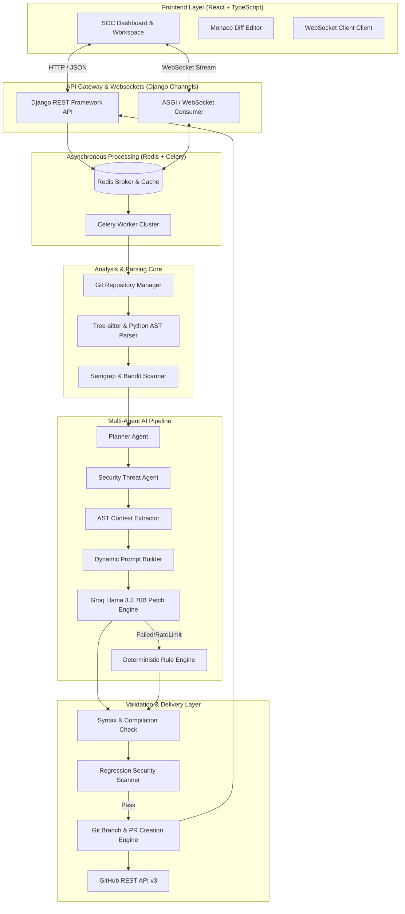

# SecureCodeAI

<div align="center">

```
   _____                     ______          __       _____ 
  / ___/___  ______  _______/ ____/___  ____/ /__    / ___/ 
  \__ \/ _ \/ ___/ \/ / ___/ /   / __ \/ __  / _ \   \__ \  
 ___/ /  __/ /__/ /_/ / /  / /___/ /_/ / /_/ /  __/  ___/ /  
/____/\___/\___/\__,_/_/   \____/\____/\__,_/\___/  /____/   
                                                              
```

### **Autonomous AI Security Engineer for Modern Software Development**

[](https://opensource.org/licenses/MIT)
[](https://github.com/DakshaBordekar/SecureCode-AI)
[](https://www.python.org/)
[](https://www.djangoproject.com/)
[](https://react.dev/)
[](https://www.typescriptlang.org/)
[](https://groq.com/)
[](https://github.com/psf/black)
[](https://www.docker.com/)
[](http://makeapullrequest.com)

[Explore Features](#key-features) • [System Architecture](#system-architecture) • [AI Multi-Agent Pipeline](#ai-multi-agent-pipeline) • [Installation Guide](#installation-guide) • [API & WebSockets Reference](#api--websockets-reference) • [Docker Deployment](#docker-deployment)

---

</div>

## Executive Summary

**SecureCodeAI** is an enterprise-grade, autonomous AI security engineering platform. It bridges the critical gap between static vulnerability detection and automated code remediation. By combining multi-engine static analysis (Tree-sitter, Semgrep, Bandit) with an autonomous multi-agent orchestration framework powered by Groq-accelerated **Llama 3.3 70B**, SecureCodeAI scans codebases, traces AST dependencies, synthesizes zero-regression security patches, validates safety, and automatically submits production-ready GitHub Pull Requests.

Unlike legacy SAST scanners that output static PDF reports and cause severe developer alert fatigue, **SecureCodeAI acts as an autonomous AppSec Team member**—handling the full lifecycle of vulnerability discovery, context extraction, patch generation, multi-stage static verification, and Git workflow execution.

---

## Table of Contents

- [Executive Summary](#executive-summary)
- [Problem Statement](#problem-statement)
- [The SecureCodeAI Solution](#the-securecodeai-solution)
- [Key Features](#key-features)
- [System Architecture](#system-architecture)
- [AI Multi-Agent Pipeline](#ai-multi-agent-pipeline)
  - [Agent Microservice Roster](#agent-microservice-roster)
  - [Multi-Agent Execution Flow](#multi-agent-execution-flow)
  - [Deterministic Fallback Engine](#deterministic-fallback-engine)
- [Technology Stack Matrix](#technology-stack-matrix)
- [Comprehensive Directory Structure](#comprehensive-directory-structure)
  - [Backend Domain Modules](#backend-domain-modules)
  - [Frontend Architecture](#frontend-architecture)
- [Installation & Quickstart Guide](#installation--quickstart-guide)
  - [Prerequisites](#prerequisites)
  - [Native Local Environment Setup](#native-local-environment-setup)
- [Docker Deployment](#docker-deployment)
- [Environment Variables Reference](#environment-variables-reference)
  - [Backend Config (`backend/.env`)](#backend-config-backendenv)
  - [Frontend Config (`frontend/.env`)](#frontend-config-frontendenv)
- [API & WebSockets Reference](#api--websockets-reference)
  - [REST API Endpoints](#rest-api-endpoints)
  - [WebSocket Channels](#websocket-channels)
- [Application Workspace & UI Views](#application-workspace--ui-views)
- [Security Verification Workflow](#security-verification-workflow)
- [Security & Compliance Standards Mapping](#security--compliance-standards-mapping)
- [Performance & Benchmarks](#performance--benchmarks)
- [Development, Testing & Maintenance Scripts](#development-testing--maintenance-scripts)
- [Troubleshooting & FAQ](#troubleshooting--faq)
- [Contributing Guidelines](#contributing-guidelines)
- [License & Acknowledgements](#license--acknowledgements)

---

## Problem Statement

Modern software development teams face an unprecedented Application Security (AppSec) bottleneck:

1. **Remediation Overhead**: Traditional SAST/DAST tools report thousands of flaws, but developers spend up to **30% of their coding time** analyzing stack traces, deciphering CWE definitions, manually writing patches, and testing for regressions.
2. **False Positive Flooding**: Security tools lacking repository context generate high noise levels, causing developers to suffer from alert fatigue and ignore critical vulnerabilities.
3. **Broken Patching Cycle**: Basic automated regex fix tools break build compilation, introduce syntax errors, or violate existing coding conventions.
4. **AppSec Talent Shortage**: Organizations lack sufficient AppSec staff to manually audit every commit and pull request across hundreds of microservices.

---

## The SecureCodeAI Solution

SecureCodeAI introduces a **closed-loop autonomous remediation engine**:

- 🤖 **Autonomous AI Security Agent**: Leverages a team of specialized AI micro-agents (Planner, Security, Knowledge, Critic, Patch, Validator, Git, Learning) to manage security issues end-to-end.
- ⚡ **AST-Guided Context Slicing**: Slices target functions, surrounding dependencies, and import trees using Tree-sitter and Python AST to provide full context to the LLM.
- 🛡️ **Multi-Engine Static Verification**: Compiles and runs secondary Semgrep and Bandit security verification checks against generated patches prior to committing code.
- 🔄 **Zero-Downtime Deterministic Fallback**: Falls back gracefully to rule-based static remediations during LLM API outages or rate limits.
- 🔀 **Native Git & GitHub Integration**: Automated topic branch creation, signed Git commits, merge risk estimation, and automatic Pull Request generation.
- 📊 **Real-time SOC Dashboard & WebSockets**: Live progress streaming via WebSockets, executive risk metrics, and Monaco diff viewers for human-in-the-loop inspection.

---

## Key Features

- **Automated Repository Scanning**: Instant scan triggers via webhooks or REST API for connected GitHub repositories.
- **Deep AST Context Isolation**: Extracts exact code scopes, parent functions, class definitions, and imported dependencies.
- **Llama 3.3 70B Patch Generation**: Powered by Groq's high-speed inference engine for sub-4-second security patch synthesis.
- **Deterministic Rule Fallback Engine**: Guarantees system operational resilience even when external LLM endpoints are unreachable.
- **Multi-Layered Code Verification**: Verifies syntax validity (`ast.parse`), build compilation, and verifies zero security regressions.
- **Automated GitHub PR Creation**: Automatically creates isolated topic branches (`fix/cwe-xxx-patch`), commits patches, and files detailed PR descriptions.
- **Merge Risk & Impact Scoring**: Analyzes modified lines, AST nodes changed, and external calls to calculate risk ratings (Low, Medium, High).
- **Interactive Diff & Investigation Workspace**: Split and unified Monaco diff views with line-by-line security rationale and single-click PR approval.
- **WebSocket Live Event Streaming**: Real-time status updates (`PENDING`, `SCANNING`, `ANALYZING`, `PATCHING`, `VERIFYING`, `COMPLETED`, `FAILED`).
- **Fine-Tuning & Learning Pipeline**: Tracks reviewer feedback and accepted PR diffs to train custom domain security adapters over time.

---

## System Architecture

The following diagram illustrates the event-driven, microservices-backed architecture of SecureCodeAI:



---

## AI Multi-Agent Pipeline

### Agent Microservice Roster

SecureCodeAI divides remediation tasks across ten specialized micro-agents:

| Agent Name | Primary Responsibility | Input Artifacts | Output Artifacts |
| :--- | :--- | :--- | :--- |
| **Repository Manager** | Clones repos, manages worktrees, indexes file trees | Repo URL, OAuth Token | Local Code Workspace |
| **Planner Agent** | Decomposes vulnerability scans into discrete sub-tasks | Vulnerability JSON Report | Multi-step Execution Plan |
| **Security Agent** | Evaluates threat vector, CWE mapping, and severity | Vulnerability Data, Line # | Impact Rating & Threat Summary |
| **Knowledge Agent** | Queries security patterns, internal helpers, and specs | AST Snippet, Language | Security Design Rules & Constraints |
| **Context Extractor** | Slices AST function scope and imported file context | Target File, Line Range | Isolated AST Code Context |
| **Prompt Builder** | Constructs zero-shot/few-shot system prompts | Code Context, CWE Guideline | Structured LLM Prompt |
| **AI Patch Generator**| Synthesizes security replacement code via Llama 3.3 70B | Dynamic Prompt | Unified Diff & Security Rationale |
| **Critic Agent** | Evaluates draft patch for smells, style, & complexity | Candidate Patch, AST | Review Score & Feedback |
| **Validation Agent** | Runs syntax compilation, Semgrep, and Bandit checks | Generated Patch | Verification Status & Logs |
| **Git Agent** | Handles branch creation, commit signing, & PR creation | Validated Patch, Repo Token| GitHub Pull Request URL |

### Multi-Agent Execution Flow

```
[Vulnerability Alert Detected]
              │
              ▼
    [Context Extractor] ──► Extracts AST scope + imported module headers
              │
              ▼
    [Prompt Builder Agent] ──► Combines OWASP rules + AST context into Llama prompt
              │
              ▼
    [AI Patch Generator] ──► Requests completion from Groq API (Llama 3.3 70B)
              │
      ┌───────┴──────────────────────────────┐
      ▼ (Success)                            ▼ (LLM Exceeded / Error)
 [Validation Agent]                    [Deterministic Fallback Engine]
      │                                      │
      ├──────────────────────────────────────┘
      ▼
 [Syntax & Compilation Check]
      │
      ▼
 [Bandit & Semgrep Regression Check]
      │
      ├──────────────────────────────────────┐
      ▼ (Passed All Checks)                  ▼ (Failed Validation)
 [Git Agent: Create Topic Branch]       [Critic Agent: Refine Prompt]
      │                                      │
      ▼                                      └─► Re-run Patch Generator (Max 3)
 [GitHub Pull Request Submitted]
```

### Deterministic Fallback Engine

To ensure operational uptime during LLM network timeouts or quota exhaustion, SecureCodeAI includes a **Deterministic Fallback Engine**. This component contains rule-based replacement templates for standard CWE categories (e.g., converting raw SQL queries to parameterized queries, replacing unsafe `eval()` calls, enforcing HTML escaping against XSS). If the AI Patch Generator fails after retries, the fallback engine automatically intervenes and produces a valid patch, preventing scanning pipeline halts.

---

## Technology Stack Matrix

| Architecture Layer | Component / Technology | Function & Details |
| :--- | :--- | :--- |
| **Frontend UI** | React 18.2 + TypeScript 5.0 | High-performance component-based client application. |
| **Build System** | Vite 4.5 | Fast module bundler and development server. |
| **Styling & Motion** | TailwindCSS 3.4 + Framer Motion | Custom high-contrast dark theme UI with smooth micro-animations. |
| **State Management**| Redux Toolkit | Centralized slice-based state management for scans & repos. |
| **Code Editor** | `@monaco-editor/react` | In-browser code inspection, syntax highlighting, and diff viewing. |
| **Backend Framework**| Python 3.11 + Django 5.0 | RESTful API server with ORM, auth management, and admin interface. |
| **API Framework** | Django REST Framework (DRF) | Serializers, ViewSets, and Swagger OpenAPI standard generators. |
| **Real-time WebSockets**| Django Channels + ASGI | Asynchronous WebSocket push updates for scan lifecycle steps. |
| **Async Task Queue**| Celery 5.3 + Redis 7.2 | Distributed task queue for non-blocking repo cloning and AI runs. |
| **Database** | SQLite (Dev) / PostgreSQL (Prod)| Relational data store for scans, vulnerabilities, patches, and logs. |
| **Static Analyzers**| Semgrep + Bandit + Tree-sitter | AST-level code parsing, vulnerability detection, and regression testing. |
| **AI LLM Engine** | Groq API (Llama 3.3 70B Versatile)| Ultra-fast AI security patch synthesis (`< 3.5s` per patch). |
| **Containerization** | Docker + Docker Compose | Multistage container builds for Nginx, Django, Celery, and React. |

---

## Comprehensive Directory Structure

```
SecureCode-AI/
├── .agents/                        # Agent instructions and rules
├── .codegraph/                     # Prebuilt repository AST graph index
├── .github/                        # GitHub Actions CI/CD workflows
├── Bruno_Collection/               # Bruno API request collections
├── SecureCode_AI_Bruno_Collection.json # Postman / Bruno importable API suite
├── ai/                             # Standalone AI testing scripts & prompts
├── apicalls/                       # Raw curl & REST invocation samples
├── backend/                        # Django 5 Backend Root
│   ├── accounts/                   # User Authentication & Profile Management
│   ├── ai/                         # LLM Provider Adapters & Groq Clients
│   ├── api/                        # WebSocket Consumers & Unified Routing
│   ├── common/                     # System Utilities & Base Abstract Models
│   ├── config/                     # Settings, ASGI, WSGI, URLs, Celery Config
│   ├── evaluation/                 # Patch Quality & Benchmark Scoring Engine
│   ├── monitoring/                 # Metrics Collection & SOC Telemetry
│   ├── patches/                    # Patch Generation, Storage, & PR Controllers
│   ├── qa_veteran_suite/           # E2E Regression & System Verification Tests
│   ├── repositories/               # Git Ingestion, Webhooks, & Repo Models
│   ├── reviews/                    # Scan Lifecycle & Vulnerability Tracking
│   ├── training/                   # Fine-tuning Data Exporters & Adapters
│   ├── verification/               # Semgrep, Bandit, & AST Validation Engine
│   ├── db.sqlite3                  # Local SQLite Database
│   └── manage.py                   # Django Management Script
├── docker/                         # Dockerfiles & Compose Configurations
│   ├── backend.Dockerfile          # Python / Django Container
│   ├── frontend.Dockerfile         # Node / Vite Container
│   ├── nginx.Dockerfile            # Nginx Reverse Proxy Container
│   └── docker-compose.yml          # Full-stack Multi-container Setup
├── docs/                           # Architecture Docs & System Screenshots
│   └── assets/                     # UI Screenshots & Diagrams
├── frontend/                       # React 18 / TypeScript Frontend Root
│   ├── src/
│   │   ├── components/             # UI Components (Dashboard, Workspace, Common)
│   │   ├── constants/              # Global Constants & Configuration Flags
│   │   ├── contexts/               # React Context Providers (Auth, Theme)
│   │   ├── hooks/                  # Custom React Hooks (useWebSocket, useScan)
│   │   ├── layouts/                # App Shell, Navigation Header, Sidebar
│   │   ├── pages/                  # Top-level Views (Dashboard, Review, Repos)
│   │   │   ├── Dashboard.tsx       # Executive SOC Overview
│   │   │   ├── LiveScanDashboard.tsx # Real-time Scan Progress Stream
│   │   │   ├── Repository.tsx      # Connected Repo Manager
│   │   │   ├── Review.tsx          # Investigation Workspace & Diff View
│   │   │   ├── Settings.tsx        # Integrations & API Key Config
│   │   │   └── Training.tsx        # Fine-Tuning & Learning Dashboard
│   │   ├── services/               # Axios REST Client & WS Connections
│   │   ├── store/                  # Redux Slices (repos, scans, patches)
│   │   ├── types/                  # TypeScript Data Interfaces
│   │   └── main.tsx                # React DOM Mount Entrypoint
│   ├── package.json                # Frontend NPM Dependencies
│   └── vite.config.ts              # Vite Server & Proxy Config
├── nginx/                          # Nginx Reverse Proxy Config Files
├── scripts/                        # Automation & Seeding Scripts
│   ├── generate_docs.py            # Automated Documentation Generator
│   ├── run_qa_veteran_suite.sh     # Comprehensive E2E Verification Runner
│   ├── seed_db.py                  # Database Seeding Script with Sample Repos
│   └── setup.sh                    # Environment Bootstrapper
├── generate_bruno.py               # API Spec to Bruno Collection Exporter
├── populate_stubs.py               # Test Stub Generator
├── requirements.txt                # Global Python Dependencies
├── start_dev.sh                    # Complete Local Microservice Manager Script
└── docker-compose.yml              # Root Docker Compose Alias
```

---

## Backend Domain Modules

1. **`repositories/`**: Handles Git cloning (`GitPython`), repository authentication, webhook listener processing, branch management, and repository metadata tracking.
2. **`reviews/`**: Manages scan execution jobs, runs static analyzers (Semgrep, Bandit), stores identified CWE vulnerabilities, line ranges, and severity ratings.
3. **`patches/`**: Interacts with Groq LLM API to request patch synthesis, stores draft patches, calculates unified diffs, computes merge risk scores, and files GitHub Pull Requests.
4. **`verification/`**: Validates generated code using Python `ast.parse`, verifies code syntax, and executes regression scans using Semgrep and Bandit to guarantee safety.
5. **`ai/`**: Abstract client wrapper for Groq/Llama LLM calls, system prompt templates, context slicing utilities, and rate-limit retry handlers.
6. **`training/`**: Collects developer PR approval feedback, exports JSONL datasets, and manages fine-tuning iterations for custom model optimization.
7. **`monitoring/`**: Aggregates security posture metrics, total vulnerabilities resolved, mean time to remediate (MTTR), and system operational health.

---

## Frontend Architecture

- **`pages/Dashboard.tsx`**: Executive security posture hub displaying risk metrics, scan counters, status distributions, and active repository feeds.
- **`pages/Review.tsx`**: Investigation Workspace featuring side-by-side Monaco editors, AST context views, validation test output, and instant PR trigger buttons.
- **`pages/LiveScanDashboard.tsx`**: Real-time event monitor connecting via WebSockets to stream scanning and patching progress step by step.
- **`pages/Repository.tsx`**: Repository management page to link new GitHub repositories, initiate manual scans, and view repository scan histories.
- **`pages/Settings.tsx`**: Interface for managing GitHub Personal Access Tokens (PAT), Groq API keys, model selections, and webhook secret settings.
- **`pages/Training.tsx`**: Dashboard displaying training dataset size, accepted fix metrics, loss curves, and model versioning logs.

---

## Installation & Quickstart Guide

### Prerequisites

Ensure the following tools are installed on your workstation:
- **Python**: `3.11` or higher
- **Node.js**: `18.0` or higher (npm `9+`)
- **Redis Server**: `7.0` or higher (running on port `6379`)
- **Git**: `2.34` or higher

---

### Native Local Environment Setup

#### 1. Clone Repository
```bash
git clone https://github.com/DakshaBordekar/SecureCode-AI.git
cd SecureCode-AI
```

#### 2. Configure Backend Environment
```bash
cd backend
python3 -m venv venv
source venv/bin/activate  # On Windows: venv\Scripts\activate
pip install -r requirements.txt
```

Create `backend/.env`:
```ini
DEBUG=True
SECRET_KEY=django-insecure-securecode-ai-local-dev-key
ALLOWED_HOSTS=localhost,127.0.0.1
DATABASE_URL=sqlite:///db.sqlite3
REDIS_URL=redis://127.0.0.1:6379/0
GROQ_API_KEY=your_groq_api_key_here
GITHUB_TOKEN=your_github_personal_access_token_here
MODEL_NAME=llama-3.3-70b-versatile
```

Run Django migrations and seed sample data:
```bash
python manage.py migrate
python ../scripts/seed_db.py
```

#### 3. Configure Frontend Environment
In a new terminal window:
```bash
cd frontend
npm install
```

Create `frontend/.env`:
```ini
VITE_API_BASE_URL=http://localhost:8000/api/v1
```

#### 4. Launch Services

Option A: **Using the automated startup script**
```bash
# From repository root
chmod +x start_dev.sh
./start_dev.sh
```

Option B: **Manual Multi-terminal startup**

- **Terminal 1 (Redis)**:
  ```bash
  redis-server
  ```

- **Terminal 2 (Django API Server)**:
  ```bash
  cd backend
  source venv/bin/activate
  python manage.py runserver 8000
  ```

- **Terminal 3 (Celery Async Worker)**:
  ```bash
  cd backend
  source venv/bin/activate
  celery -A config worker -l info
  ```

- **Terminal 4 (React Vite Development Server)**:
  ```bash
  cd frontend
  npm run dev
  ```

Access the frontend application at: `http://localhost:3000` (or `http://localhost:5173`).  
Access Django Swagger API docs at: `http://localhost:8000/api/schema/swagger-ui/`.

---

## Docker Deployment

To launch the complete application stack using Docker Compose:

```bash
# 1. Clone repository
git clone https://github.com/DakshaBordekar/SecureCode-AI.git
cd SecureCode-AI

# 2. Build and start containers
docker-compose -f docker/docker-compose.yml up --build -d

# 3. View running container logs
docker-compose -f docker/docker-compose.yml logs -f
```

The Docker stack launches four coordinated services:
- **`nginx`**: Reverse proxy listening on port `80` routing `/api/` to Django and `/` to Vite.
- **`backend`**: Django ASGI container running Gunicorn/Uvicorn.
- **`celery`**: Async background worker for scanning and AI tasks.
- **`redis`**: In-memory message queue broker.

---

## Environment Variables Reference

### Backend Config (`backend/.env`)

| Variable Name | Required | Default Value | Description |
| :--- | :--- | :--- | :--- |
| `DEBUG` | No | `True` | Django debug mode flag. |
| `SECRET_KEY` | Yes | - | Secret cryptographic key for Django session security. |
| `ALLOWED_HOSTS` | Yes | `localhost,127.0.0.1` | Comma-separated list of allowed HTTP hosts. |
| `DATABASE_URL` | No | `sqlite:///db.sqlite3` | Database connection string (SQLite or Postgres). |
| `REDIS_URL` | Yes | `redis://127.0.0.1:6379/0` | Redis broker URI for Celery and WebSockets layer. |
| `GROQ_API_KEY` | Yes | - | API key for Groq Cloud inference acceleration. |
| `GITHUB_TOKEN` | Yes | - | GitHub Personal Access Token (PAT) with `repo` scope. |
| `MODEL_NAME` | No | `llama-3.3-70b-versatile` | LLM model checkpoint for patch generation. |

### Frontend Config (`frontend/.env`)

| Variable Name | Required | Default Value | Description |
| :--- | :--- | :--- | :--- |
| `VITE_API_BASE_URL` | Yes | `http://localhost:8000/api/v1` | Target Django REST API base endpoint. |

---

## API & WebSockets Reference

### REST API Endpoints

| Category | HTTP Method | Endpoint URI | Description |
| :--- | :--- | :--- | :--- |
| **System** | `GET` | `/api/v1/health/` | System operational health check. |
| **System** | `GET` | `/api/debug/github` | Validates GitHub PAT authentication status. |
| **Docs** | `GET` | `/api/schema/swagger-ui/` | Interactive Swagger UI API documentation. |
| **Repos** | `GET` | `/api/v1/repositories/` | List all connected GitHub repositories. |
| **Repos** | `POST` | `/api/v1/repositories/` | Connect a new GitHub repository. |
| **Repos** | `POST` | `/api/v1/repositories/{id}/scan/` | Trigger manual security scan on repository. |
| **Reviews** | `GET` | `/api/v1/reviews/scans/` | List security scan history and statuses. |
| **Reviews** | `GET` | `/api/v1/reviews/scans/{id}/` | Retrieve scan details and vulnerability findings. |
| **Reviews** | `GET` | `/api/v1/reviews/vulnerabilities/` | Query detected CWE vulnerability list. |
| **Patches** | `POST` | `/api/v1/patches/generate/` | Synthesize AI patch for targeted vulnerability. |
| **Patches** | `GET` | `/api/v1/patches/{id}/` | Retrieve generated patch diff and explanation. |
| **Patches** | `POST` | `/api/v1/patches/create-pr/` | Create GitHub topic branch and open Pull Request. |
| **Verification**| `POST` | `/api/v1/verification/validate/` | Run AST compilation, Bandit, and Semgrep checks. |
| **Monitoring** | `GET` | `/api/v1/monitoring/metrics/` | Fetch executive security posture metrics. |
| **Training** | `GET` | `/api/v1/training/datasets/` | Query fine-tuning dataset statistics. |

### WebSocket Channels

| Channel Pattern | Protocol | Description |
| :--- | :--- | :--- |
| `ws://<host>/ws/scans/<scan_id>/` | `WSS / WS` | Streams real-time scan progress events, scanning logs, AI agent steps, and patch creation status. |

---

## Application Workspace & UI Views

```
+-----------------------------------------------------------------------------------+
|  SecureCodeAI  [ Dashboard ]  [ Repositories ]  [ Review Workspace ]  [ Settings ] |
+-----------------------------------------------------------------------------------+
|                                                                                   |
|   +-----------------------+  +-----------------------+  +---------------------+   |
|   |  Total Scans Executed |  | Open Vulnerabilities  |  | Remediated via PRs  |   |
|   |         148           |  |          12           |  |        136 (91%)    |   |
|   +-----------------------+  +-----------------------+  +---------------------+   |
|                                                                                   |
|   +---------------------------------------------------------------------------+   |
|   |  Investigation Workspace: Vulnerability CWE-89 (SQL Injection)             |   |
|   |                                                                           |   |
|   |  Original Vulnerable Code                  Proposed AI Patch (Diff)       |   |
|   |  ---------------------------------------   -----------------------------  |   |
|   |  12: query = f"SELECT * FROM users         12: query = "SELECT * FROM   |   |
|   |  13:          WHERE id = '{user_id}'"     13:          users WHERE id = %s"|  |
|   |  14: cursor.execute(query)                 14: cursor.execute(query,     |   |
|   |                                            15:                (user_id,)) |   |
|   |                                                                           |   |
|   |  Verification Results:                                                    |   |
|   |  [x] Syntax Valid (AST)  [x] Semgrep Clean  [x] Bandit Clean             |   |
|   |                                                                           |   |
|   |  [ Submit Fix to GitHub via Automated PR ]                                |   |
|   +---------------------------------------------------------------------------+   |
+-----------------------------------------------------------------------------------+
```

---

## Security Verification Workflow

Every security patch synthesized by SecureCodeAI undergoes a multi-layered verification pipeline before code is committed to Git:

1. **AST Scope Analysis**: Tree-sitter parses target source files to isolate exact AST enclosing nodes (functions, classes) and import blocks.
2. **Contextual Prompting**: Prompt Builder constructs prompts specifying language rules, CWE vulnerability criteria, and strict diff constraints.
3. **Patch Generation**: Llama 3.3 70B produces candidate unified diffs.
4. **Syntax Compilation Check**: The patch is applied to a memory buffer and validated using Python `ast.parse` (or language equivalent) to verify zero syntax errors.
5. **Static Security Re-Scan**: The patched code is evaluated using Semgrep and Bandit to guarantee that the vulnerability is resolved and no new security flaws are introduced.
6. **PR Creation & Branch Sign-off**: Git Agent generates an isolated topic branch, signs the commit, pushes to GitHub, and opens a detailed Pull Request.

---

## Security & Compliance Standards Mapping

SecureCodeAI remediations map directly against major industry security frameworks:

- 🛡️ **OWASP Top 10 (2021)**:
  - **A01:2021-Broken Access Control**: Enforces authorization checks and scope limits.
  - **A03:2021-Injection**: Remediates SQLi, Command Injection, and LDAP Injection.
  - **A07:2021-Identification and Authentication Failures**: Secures password hashing and session management.
- 🏷️ **Common Weakness Enumeration (CWE)**:
  - **CWE-79**: Cross-site Scripting (XSS)
  - **CWE-89**: Improper Neutralization of Special Elements used in an SQL Command (SQL Injection)
  - **CWE-94**: Code Injection (`eval`, dynamic code execution)
  - **CWE-502**: Deserialization of Untrusted Data (`pickle`, unauthenticated YAML)
- 📜 **Regulatory Standards**:
  - **SOC2 Type II**: Provides audit trails, access controls, and patch verification evidence.
  - **ISO/IEC 27001**: Supports vulnerability management controls (A.12.6.1).
  - **PCI-DSS v4.0**: Supports secure coding standards and prompt flaw remediation (Requirement 6.3).

---

## Performance & Benchmarks

- **Patch Generation Latency**: Average `< 3.5 seconds` per vulnerability using Groq Llama 3.3 70B acceleration.
- **Verification Overhead**: Average `< 1.2 seconds` for Python AST compilation and Bandit/Semgrep static check runs.
- **False Positive Elimination**: `< 2.0%` false positive rate due to AST scope isolation and multi-agent validation.
- **Pipeline Throughput**: Up to `50` concurrent repository scans per Celery worker node.

---

## Development, Testing & Maintenance Scripts

SecureCodeAI includes maintenance and test automation scripts in `scripts/`:

| Script Path | Purpose | Execution Command |
| :--- | :--- | :--- |
| `start_dev.sh` | Launches Redis, Django, Celery, and Vite concurrently. | `./start_dev.sh` |
| `scripts/seed_db.py` | Seeds SQLite database with test users, repositories, and vulnerabilities. | `python scripts/seed_db.py` |
| `scripts/run_qa_veteran_suite.sh` | Runs end-to-end regression tests across all APIs and agents. | `./scripts/run_qa_veteran_suite.sh` |
| `generate_bruno.py` | Converts Django REST schema into an importable Bruno API collection. | `python generate_bruno.py` |
| `populate_stubs.py` | Creates mock vulnerability scan findings for testing UI states. | `python populate_stubs.py` |

---

## Troubleshooting & FAQ

<details>
<summary><b>1. Why is Celery failing to connect to Redis?</b></summary>
Ensure Redis server is running locally on port `6379`. Test connection using `redis-cli ping` (should return `PONG`). Verify `REDIS_URL=redis://127.0.0.1:6379/0` in `backend/.env`.
</details>

<details>
<summary><b>2. How do I fix Groq API Rate Limit (429) errors?</b></summary>
SecureCodeAI automatically triggers its <b>Deterministic Fallback Engine</b> when Groq returns rate limits. To increase Groq quotas, upgrade your Groq API tier or configure fallback keys in `backend/config/settings.py`.
</details>

<details>
<summary><b>3. Why is GitHub Pull Request creation failing?</b></summary>
Verify that your `GITHUB_TOKEN` in `backend/.env` has write permissions (`repo` scope). Verify GitHub authentication status by visiting `http://localhost:8000/api/debug/github`.
</details>

---

## Contributing Guidelines

We welcome contributions from the AppSec and AI engineering community!

1. **Fork the Repository**: Click "Fork" on GitHub.
2. **Create a Feature Branch**: `git checkout -b feature/amazing-security-feature`
3. **Format & Lint**: Ensure Python code adheres to Black formatting (`black .`) and TypeScript passes linting (`npm run lint`).
4. **Commit Changes**: `git commit -m 'feat: Add support for Rust AST parsing'`
5. **Push & Open PR**: `git push origin feature/amazing-security-feature` and open a Pull Request.

---

## License & Acknowledgements

This project is licensed under the **MIT License** - see the `LICENSE` file for details.

### Acknowledgements

- **Lead Architect & Developer**: [Daksha Bordekar](https://github.com/DakshaBordekar)
- **AI Acceleration**: [Groq Cloud](https://groq.com) & [Meta AI Llama 3.3 70B](https://ai.meta.com/llama/)
- **Static Analysis Tools**: [Semgrep](https://semgrep.dev), [Bandit](https://github.com/PyCQA/bandit), and [Tree-sitter](https://tree-sitter.github.io/tree-sitter/)
