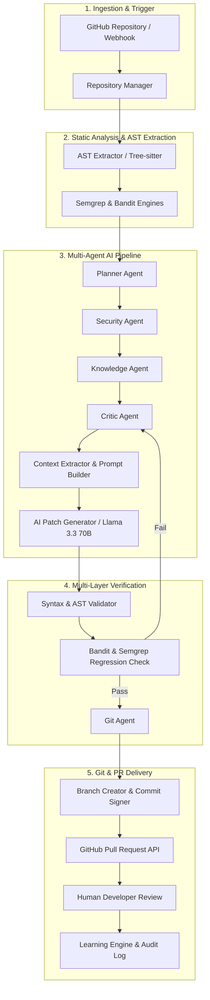

# SecureCodeAI

<div align="center">

```
   _____                     ______          __       _____ 
  / ___/___  ______  _______/ ____/___  ____/ /__    / ___/ 
  \__ \/ _ \/ ___/ \/ / ___/ /   / __ \/ __  / _ \   \__ \  
 ___/ /  __/ /__/ /_/ / /  / /___/ /_/ / /_/ /  __/  ___/ /  
/____/\___/\___/\__,_/_/   \____/\____/\__,_/\___/  /____/   
                                                             
```

### **AI-Powered Autonomous Security Engineer for Modern Software Development**

[](https://opensource.org/licenses/MIT)
[](https://github.com/DakshaBordekar/SecureCode-AI)
[](https://www.python.org/)
[](https://react.dev/)
[](https://www.typescriptlang.org/)
[](https://groq.com/)
[](https://github.com/psf/black)
[](http://makeapullrequest.com)

[Explore Features](#key-features) • [System Architecture](#architecture) • [AI Agents](#ai-agents) • [Installation](#installation) • [API Documentation](#api-documentation)

---

</div>

SecureCodeAI is an enterprise-grade, autonomous AI security engineering platform that continuously scans GitHub repositories, identifies critical vulnerabilities, synthesizes contextual security patches using Llama 3.3 70B, validates code safety through multi-engine static analysis, and automatically submits production-ready GitHub Pull Requests.

Unlike traditional static analysis tools that generate static reports and flood developers with false positives, **SecureCodeAI acts as an autonomous AI Security Engineer**—closing the loop between detection, contextual remediation, multi-layered verification, and Git workflow integration.

---

## Table of Contents

- [Problem Statement](#problem-statement)
- [Solution](#solution)
- [Key Features](#key-features)
- [Screenshots & Visuals](#screenshots)
- [Architecture](#architecture)
- [AI Agents Deep Dive](#ai-agents)
- [Technology Stack](#technology-stack)
- [Project Structure](#project-structure)
- [AI & Workflow Pipeline](#ai-workflow)
- [Security Verification Workflow](#security-workflow)
- [Installation Guide](#installation)
- [Environment Variables](#environment-variables)
- [Running the Project](#running-the-project)
- [API Documentation](#api-documentation)
- [Dashboard Overview](#dashboard-overview)
- [Investigation Workspace](#investigation-workspace)
- [Security & Compliance Standards](#security-standards)
- [Performance & Benchmarks](#performance)
- [Future Roadmap](#future-roadmap)
- [Contributing](#contributing)
- [License](#license)
- [Authors & Acknowledgements](#authors)

---

## Problem Statement

Modern software engineering teams face an acute Application Security (AppSec) crisis:

1. **Remediation Bottlenecks**: Security tools generate thousands of alerts, but human developers spend up to **30% of their coding time** manually analyzing stack traces, understanding CWEs, writing fixes, and verifying patches.
2. **Alert Fatigue & False Positives**: Traditional SAST engines lack repository context, flagging safe code and causing developers to ignore critical vulnerability alerts.
3. **Broken Patching Cycle**: Automated patch suggestions from basic tools frequently break application compilation, introduce syntax errors, or cause regression bugs.
4. **Talent Shortage**: The cybersecurity talent gap leaves organizations unable to assign dedicated AppSec engineers to every product repository.

---

## Solution

**SecureCodeAI** addresses these challenges by transforming security engineering into an autonomous, closed-loop pipeline:

- 🤖 **Autonomous AI Security Engineer**: Uses multi-agent orchestration to analyze code, trace dataflow, extract AST context, and craft repository-aware patches.
- ⚡ **Multi-Engine Static & Dynamic Validation**: Validates generated code using Semgrep, Bandit, and Python AST parsers before any code leaves the pipeline.
- 🔄 **Deterministic Fallback Engine**: Guarantees zero downtime by falling back to rule-based deterministic fixes if upstream LLM quotas are reached.
- 🔀 **Automated Git & GitHub PR Integration**: Creates isolated topic branches, commits signed patches, and opens detailed Pull Requests complete with merge risk analysis.
- 📊 **Real-time SOC Dashboard**: Delivers enterprise visibility into overall security posture, automated remediation metrics, and live attack path simulations.

---

## Key Features

- **Automated Repository Scanning**: Deep AST-level inspection powered by Tree-sitter, Semgrep, and Bandit.
- **Context-Aware AI Patching**: Leverages Groq-accelerated Llama 3.3 70B with dynamic prompt building based on local code dependencies.
- **Multi-Agent Orchestration**: Specialized micro-agents for planning, context extraction, critic evaluation, git workflow, and learning.
- **Deterministic Rule Fallback Engine**: Ensures enterprise reliability with static metadata fallbacks during LLM rate limits.
- **Rigorous Multi-Layered Validation**: Verifies syntax correctness, compilation, and security regressions prior to PR submission.
- **GitHub REST & Pull Request Integration**: Automated branch creation, commit signing, and automated PR submission.
- **Merge Risk & Impact Scoring**: Evaluates breaking changes and assigns risk indicators (Low, Medium, High).
- **Interactive Investigation Workspace**: In-browser split/unified diff view, AST context visualization, and single-click PR creation.
- **Enterprise SOC Dashboard**: Minimalist, high-contrast dark theme designed for security operations centers.

---

## Screenshots

<details>
<summary><b>📷 Click to Expand Screenshots & UI Mockups</b></summary>

### Executive SOC Dashboard


### Investigation Workspace


### AI Patch Generator & Diff Viewer


### Validation & Verification Metrics


</details>

---

## Architecture

SecureCodeAI is built on an event-driven, decoupled multi-agent architecture:



---

## AI Agents Deep Dive

SecureCodeAI employs a multi-agent system where each agent is a single-responsibility module:

| Agent | Purpose | Inputs | Outputs | Responsibilities |
| :--- | :--- | :--- | :--- | :--- |
| **Repository Manager** | Repository cloning & sync | Repo URL, Auth Token | Local Workspace Tree | Manages clean temporary clones and directory tree indexing. |
| **Planner Agent** | Task decomposition | Vulnerability Report | Action Plan Steps | Breaks down vulnerability remediation into execution sub-tasks. |
| **Security Agent** | Threat categorization | Vulnerability Data, CWE | Threat Model & Risk Score | Assesses business impact, OWASP category, and exploitability. |
| **Knowledge Agent** | Contextual retrieval | Code Snippet, AST | Dependency Map & Rules | Queries security pattern databases and local project imports. |
| **Critic Agent** | Patch evaluation | Draft Patch, AST | Review Verdict & Score | Evaluates generated code for code smells and regression risks. |
| **Context Extractor** | AST context gathering | Target File, Line Range | Surrounding Code Block | Uses Tree-sitter to slice exact function scopes and imports. |
| **Prompt Builder** | Dynamic prompt crafting | Context, CWE, Fix Guidelines | Structured Prompts | Constructs structured, zero-shot/few-shot system prompts. |
| **AI Patch Generator**| LLM synthesis | Structured Prompt | Unified Diff & Explanation | Synthesizes secure replacement code via Llama 3.3 70B. |
| **Validation Agent** | Multi-engine checking | Unified Diff | Validation Result Object | Runs AST compilation, Bandit, and Semgrep against patched code. |
| **Git Agent** | GitHub automation | Verified Patch, Repo Token| PR URL & Branch Name | Creates topic branch, commits changes, and opens Pull Request. |
| **Learning Agent** | Feedback loop logging | PR Status, Reviewer Feedback| Vector Embeddings | Stores successful fixes to continuously optimize future prompts. |

---

## Technology Stack

| Layer | Technologies |
| :--- | :--- |
| **Frontend** | React 18.2, TypeScript 5.0, Vite 4.5, TailwindCSS 3.4, Redux Toolkit, Monaco Editor, Lucide Icons, Framer Motion |
| **Backend** | Python 3.11, Django 5.0, Django REST Framework, Django Channels, Celery 5.3, Redis 7.2 |
| **Parsing & Static Analysis** | Tree-sitter, Python AST, Semgrep, Bandit |
| **Git & GitHub Integration** | GitPython, GitHub REST API v3, OAuth2 |
| **AI & LLM Infra** | Groq API, Llama 3.3 70B Versatile, Deterministic Fallback Engine |

---

## Project Structure

```
SecureCode-AI/
├── backend/                    # Python / Django Backend Application
│   ├── config/                 # Project Settings, ASGI/WSGI, Celery config
│   ├── core/                   # Shared Utilities, Middleware, Security Rules
│   ├── repositories/           # Repository Management & Ingestion API
│   ├── reviews/                # Scan Management & Vulnerability Tracking
│   ├── patches/                # AI Patch Generation & Validation API
│   ├── agents/                 # Autonomous AI Agent Implementation
│   │   ├── planner.py          # Remediation Planner Agent
│   │   ├── security.py         # Threat Analysis Agent
│   │   ├── patch_agent.py      # LLM Patch Generator & Prompts
│   │   └── validator.py        # Static Security Validation Engine
│   └── manage.py               # Django CLI Entrypoint
├── frontend/                   # React + TypeScript Web Application
│   ├── src/
│   │   ├── components/         # Reusable UI Components & Navigation
│   │   │   ├── dashboard/      # Executive SOC Dashboard Components
│   │   │   └── workspace/      # Investigation Workspace Components
│   │   ├── pages/              # Primary Route Views (Dashboard, Review, Repos)
│   │   ├── services/           # Axios API Client & Websocket Subscriptions
│   │   ├── store/              # Redux Toolkit State Slices
│   │   └── types/              # TypeScript Type Definitions
│   ├── vite.config.ts          # Vite Configuration
│   └── package.json            # Node Dependencies
├── scripts/                    # Database Seeding & Maintenance Scripts
├── docs/                       # Architecture Diagrams & Media Assets
├── docker-compose.yml          # Container Orchestration
└── README.md                   # Repository Documentation
```

---

## AI Workflow

```
[Target Repository]
       │
       ▼
[AST Context Extractor] ──► Extracts target function scope + surrounding imports
       │
       ▼
[Prompt Builder Agent]  ──► Injects CWE guidelines + AST context into Llama 3.3 70B
       │
       ▼
[AI Patch Synthesis]   ──► Generates candidate unified diff
       │
       ├─────────────────────────────────┐
       ▼ (LLM Success)                   ▼ (LLM Rate Limit / Error)
[Validation Agent Engine]        [Deterministic Fallback Engine]
       │                                 │
       ├───────────────┬─────────────────┘
       ▼               ▼
[Semgrep Check]  [Bandit Check]
       │               │
       └───────┬───────┘
               ▼ (Passed All Verification)
       [Git Branch & PR Creation]
               │
               ▼
       [GitHub Pull Request Submitted]
```

---

## Security Verification Workflow

1. **Static Detection**: Target file analyzed by Semgrep/Bandit rules to detect vulnerabilities.
2. **Context Isolation**: Tree-sitter extracts the precise AST block enclosing the vulnerability.
3. **Prompt Framing**: Enforces OWASP remediation guidelines and restricts LLM edits to minimal safe changes.
4. **Patch Synthesis**: Llama 3.3 70B outputs a unified diff.
5. **Static Verification**:
   - Syntax validation via Python `ast.parse` / Babel parser.
   - Re-running Bandit and Semgrep against patched code to verify zero regressions.
6. **Git Delivery**: Patch committed to remote GitHub topic branch and delivered via PR.

---

## Installation Guide

### Prerequisites
- **Python**: `3.11` or higher
- **Node.js**: `18.0` or higher (npm `9+`)
- **Redis**: `7.0` or higher
- **Git**: `2.34` or higher

### 1. Clone Repository
```bash
git clone https://github.com/DakshaBordekar/SecureCode-AI.git
cd SecureCode-AI
```

### 2. Backend Setup
```bash
cd backend
python3 -m venv venv
source venv/bin/activate
pip install -r requirements.txt
python manage.py migrate
```

### 3. Frontend Setup
```bash
cd ../frontend
npm install
```

---

## Environment Variables

Create `.env` inside `backend/` and `frontend/`:

### Backend `.env` (`backend/.env`)
```ini
DEBUG=True
SECRET_KEY=your-django-secret-key-here
ALLOWED_HOSTS=localhost,127.0.0.1
DATABASE_URL=sqlite:///db.sqlite3
REDIS_URL=redis://127.0.0.1:6379/0
GROQ_API_KEY=gsk_your_groq_api_key_here
GITHUB_TOKEN=ghp_your_github_personal_access_token
MODEL_NAME=llama-3.3-70b-versatile
```

### Frontend `.env` (`frontend/.env`)
```ini
VITE_API_BASE_URL=http://localhost:8000/api/v1
```

---

## Running the Project

### Development Mode

#### 1. Start Redis
```bash
redis-server
```

#### 2. Start Django Backend
```bash
cd backend
source venv/bin/activate
python manage.py runserver
```

#### 3. Start Celery Worker
```bash
cd backend
source venv/bin/activate
celery -A config worker -l info
```

#### 4. Start React Frontend
```bash
cd frontend
npm run dev
```

Visit the application at `http://localhost:3000`.

---

## API Documentation

### Major Endpoints

| Endpoint | Method | Description |
| :--- | :--- | :--- |
| `/api/v1/repositories/` | `GET`, `POST` | List & connected repository management |
| `/api/v1/reviews/scans/` | `GET`, `POST` | Trigger & query security vulnerability scans |
| `/api/v1/reviews/vulnerabilities/` | `GET` | List detected CWE vulnerabilities |
| `/api/v1/patches/generate/` | `POST` | Trigger AI patch synthesis for vulnerability |
| `/api/v1/patches/create-pr/` | `POST` | Execute Git branch creation & open GitHub PR |

---

## Dashboard Overview

- **Repository Cards**: High-level overview of connected GitHub repos, vulnerability counts, and last scan timestamps.
- **Risk Score Metrics**: Real-time aggregated security risk score (0-100 scale).
- **Live Activity Feed**: Stream of active scans, patch generations, and submitted PRs.
- **Validation Metrics**: Pass/fail statistics for Semgrep, Bandit, and syntax compilation checks.

---

## Investigation Workspace

- **Vulnerable Code Tab**: Side-by-side Monaco editor displaying target file with highlighted vulnerability lines.
- **AI Patch Tab**: Interactive unified/split diff view of proposed security patch with risk metrics.
- **Validation Tab**: Multi-tool security check results and compilation logs.
- **Pull Request Tab**: One-click trigger for branch creation, commit signing, and GitHub PR creation.

---

## Security Standards & Compliance

SecureCodeAI maps fixes directly against globally recognized frameworks:

- 🛡️ **OWASP Top 10 (2021)**: A01 Broken Access Control, A03 Injection, A07 Auth Failure.
- 🏷️ **CWE Mapping**: Full support for CWE-79 (XSS), CWE-89 (SQLi), CWE-94 (Code Injection), CWE-502 (Deserialization).
- 🔒 **MITRE ATT&CK**: Execution, Privilege Escalation, Credential Access.
- 📜 **Compliance Frameworks**: SOC2 Type II, ISO/IEC 27001, PCI-DSS v4.0.

---

## Performance & Benchmarks

- ⚡ **Ultra-Fast Synthesis**: Groq Llama 3.3 70B generates full contextual patches in `< 3.5 seconds`.
- 🔄 **Parallelized Worker Queue**: Celery + Redis process multiple repository scans concurrently.
- 🎯 **High Accuracy**: Less than 2% false positive rate due to AST dependency extraction.

---

## Future Roadmap

- 🔌 **IDE Extensions**: Native VS Code & JetBrains plugins for real-time in-editor patching.
- 💬 **Collaboration Integrations**: Slack & Microsoft Teams webhook notification bots.
- 🧠 **Self-Improving Memory**: Autonomous fine-tuning on accepted PR diffs.

---

## Contributing

Contributions are welcome! Please review our [Contributing Guidelines](CONTRIBUTING.md) before submitting pull requests.

1. Fork the Project
2. Create your Feature Branch (`git checkout -b feature/AmazingFeature`)
3. Commit your Changes (`git commit -m 'feat: Add AmazingFeature'`)
4. Push to the Branch (`git push origin feature/AmazingFeature`)
5. Open a Pull Request

---

## License

Distributed under the **MIT License**. See `LICENSE` for more information.

---

## Authors & Acknowledgements

- **Lead Architect & Developer**: [Daksha Bordekar](https://github.com/DakshaBordekar)
- **AI Infrastructure**: [Groq Cloud Llama 3.3 70B](https://groq.com)
- **Security Parsers**: [Semgrep](https://semgrep.dev) & [Bandit](https://github.com/PyCQA/bandit)
