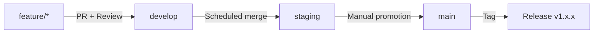
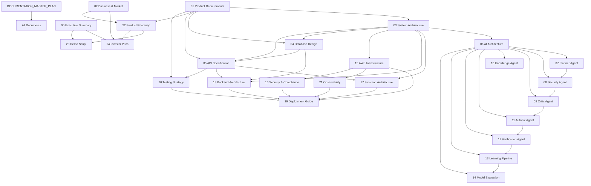

# SecureCode AI — Documentation Master Plan

> **Document Identifier:** `SCAI-DMP-001`
> **Version:** `1.0.0`
> **Status:** `ACTIVE`
> **Classification:** `INTERNAL — ENGINEERING`
> **Created:** `2026-07-29`
> **Last Revised:** `2026-07-29`
> **Author:** CTO / Principal Architect
> **Approved By:** Engineering Leadership
> **Canonical Path:** `docs/DOCUMENTATION_MASTER_PLAN.md`

---

Every document in the SecureCode AI documentation suite MUST reference this file as its governing specification. No document may contradict any standard defined here. Any deviation requires a formal amendment to this plan before the deviating document is merged.

---

## Table of Contents

1. [Executive Overview](#1-executive-overview)
2. [Purpose of the Documentation Suite](#2-purpose-of-the-documentation-suite)
3. [Documentation Philosophy](#3-documentation-philosophy)
4. [Target Audience](#4-target-audience)
5. [Business Context](#5-business-context)
6. [Engineering Context](#6-engineering-context)
7. [Product Vision](#7-product-vision)
8. [Mission](#8-mission)
9. [Core Principles](#9-core-principles)
10. [Writing Standards](#10-writing-standards)
11. [Formatting Standards](#11-formatting-standards)
12. [Markdown Standards](#12-markdown-standards)
13. [Naming Standards](#13-naming-standards)
14. [Architecture Standards](#14-architecture-standards)
15. [Diagram Standards](#15-diagram-standards)
16. [Code Example Standards](#16-code-example-standards)
17. [JSON Standards](#17-json-standards)
18. [Sequence Diagram Standards](#18-sequence-diagram-standards)
19. [Folder Structure Standards](#19-folder-structure-standards)
20. [Repository Standards](#20-repository-standards)
21. [Branching Strategy Standards](#21-branching-strategy-standards)
22. [Technology Stack Standards](#22-technology-stack-standards)
23. [AWS Standards](#23-aws-standards)
24. [AI Standards](#24-ai-standards)
25. [Prompt Engineering Standards](#25-prompt-engineering-standards)
26. [Testing Standards](#26-testing-standards)
27. [Security Standards](#27-security-standards)
28. [Performance Standards](#28-performance-standards)
29. [Documentation Dependency Graph](#29-documentation-dependency-graph)
30. [Complete Documentation Tree](#30-complete-documentation-tree)
31. [Complete Document Descriptions](#31-complete-document-descriptions)
32. [Generation Order](#32-generation-order)
33. [Revision Strategy](#33-revision-strategy)
34. [Ownership Matrix](#34-ownership-matrix)
35. [Future Expansion Rules](#35-future-expansion-rules)
36. [Cross-Referencing Rules](#36-cross-referencing-rules)
37. [Traceability Rules](#37-traceability-rules)
38. [Quality Checklist](#38-quality-checklist)
39. [Acceptance Criteria](#39-acceptance-criteria)
40. [Definition of Done](#40-definition-of-done)

---

## 1. Executive Overview

SecureCode AI is an enterprise-grade autonomous AI Security Engineer platform. It ingests source code repositories, identifies vulnerabilities across the OWASP Top 10 and CWE taxonomies, explains each vulnerability in human-readable language, generates verified secure patches, and delivers Git-ready pull requests — all without human intervention in the default workflow.

The platform is built on a multi-agent architecture orchestrated by LangGraph, powered by Amazon Bedrock foundation models, and deployed on AWS infrastructure via Amazon ECS. Six specialised agents — Planner, Security, Critic, Knowledge, AutoFix, and Verification — collaborate through a directed graph workflow to produce security remediations that are validated by static analysis tools (Semgrep, Bandit) and automated test suites (Pytest) before any code change is proposed.

Beyond the core scan-fix-verify loop, SecureCode AI implements a closed-loop learning pipeline. Engineer feedback on generated patches is captured, structured into JSONL training datasets, and fed into fine-tuning jobs on Amazon SageMaker using PEFT/QLoRA techniques. An evaluation pipeline benchmarks candidate models against the current production model on a curated security test suite. Models that outperform the incumbent are promoted through a staged rollout controlled by Amazon EventBridge and feature flags.

This document — the Documentation Master Plan — is the single authoritative source that governs the structure, standards, conventions, ownership, dependencies, and generation order of every document in the `docs/` directory. It exists so that:

- Any engineer can author a new document and be certain it will be consistent with every other document.
- Any reviewer can evaluate a document against an objective checklist.
- Any stakeholder can trace a business requirement from the Product Requirements Document through to the specific API endpoint, database table, agent prompt, and test case that implements it.
- Any future employee can onboard by reading the documentation suite in the prescribed order and arrive at a complete understanding of the system.

**This document does not contain implementation details.** It defines the rules that implementation documents must follow.

---

## 2. Purpose of the Documentation Suite

The documentation suite serves seven distinct purposes. Each purpose maps to a specific audience and a specific subset of documents.

| # | Purpose | Primary Audience | Documents |
|---|---------|-----------------|-----------|
| 1 | **Business Justification** | Executives, Investors, Board | `00_EXECUTIVE_SUMMARY.md`, `02_BUSINESS_AND_MARKET_ANALYSIS.md`, `24_INVESTOR_PITCH.md` |
| 2 | **Product Definition** | Product Managers, Designers, QA | `01_PRODUCT_REQUIREMENTS_DOCUMENT.md`, `22_PRODUCT_ROADMAP.md`, `23_DEMO_SCRIPT.md` |
| 3 | **System Architecture** | Architects, Tech Leads, Senior Engineers | `03_SYSTEM_ARCHITECTURE.md`, `06_AI_ARCHITECTURE.md`, `15_AWS_INFRASTRUCTURE.md` |
| 4 | **Component Specification** | Engineers assigned to each component | `04_DATABASE_DESIGN.md`, `05_API_SPECIFICATION.md`, `07` – `12` (agent docs), `17_FRONTEND_ARCHITECTURE.md`, `18_BACKEND_ARCHITECTURE.md` |
| 5 | **AI Engineering** | AI Engineers, ML Engineers | `06_AI_ARCHITECTURE.md`, `07` – `12` (agent docs), `13_LEARNING_AND_FINE_TUNING_PIPELINE.md`, `14_MODEL_EVALUATION.md` |
| 6 | **Operations** | DevOps, SRE, Security Engineers | `15_AWS_INFRASTRUCTURE.md`, `16_SECURITY_AND_COMPLIANCE.md`, `19_DEPLOYMENT_GUIDE.md`, `20_TESTING_STRATEGY.md`, `21_OBSERVABILITY_AND_MONITORING.md` |
| 7 | **Governance** | All teams, Auditors | `DOCUMENTATION_MASTER_PLAN.md`, `README.md` |

Every document must declare which of these seven purposes it serves in its frontmatter metadata block.

---

## 3. Documentation Philosophy

### 3.1 Implementation-Ready

Every document must contain enough detail that an engineer who has never seen the codebase can implement the described component by reading only the documentation suite. Statements like "use industry best practices" or "follow standard conventions" are prohibited. If a practice is required, the specific practice must be named, the specific configuration must be shown, and the reasoning must be stated.

### 3.2 Decision-Justified

Every architectural, design, or technology choice must include a `### Decision Rationale` subsection that answers:

1. What alternatives were considered?
2. Why was this option selected?
3. What are the known trade-offs?
4. Under what conditions should this decision be revisited?

### 3.3 Single Source of Truth

No concept may be defined in more than one document. If a concept is needed in multiple documents, it is defined in exactly one canonical document and referenced by all others using the cross-reference syntax defined in [Section 36](#36-cross-referencing-rules).

### 3.4 Traceable

Every requirement in `01_PRODUCT_REQUIREMENTS_DOCUMENT.md` must be traceable forward to at least one API endpoint in `05_API_SPECIFICATION.md`, at least one database entity in `04_DATABASE_DESIGN.md`, and at least one test case in `20_TESTING_STRATEGY.md`. The traceability mechanism is defined in [Section 37](#37-traceability-rules).

### 3.5 Versioned

Every document carries a semantic version in its frontmatter. The version increments follow the rules defined in [Section 33](#33-revision-strategy).

### 3.6 Reviewable

Every document must pass the quality checklist defined in [Section 38](#38-quality-checklist) before it is merged into `main`.

---

## 4. Target Audience

| Audience | Role Description | Primary Documents | Access Level |
|----------|-----------------|-------------------|-------------|
| **Executive Leadership** | CEO, CTO, VP Engineering | `00`, `02`, `22`, `24` | Full |
| **Investors** | VCs, Angels, Board Members | `00`, `02`, `24` | Redacted (no source code examples) |
| **Product Managers** | Feature owners, roadmap managers | `01`, `22`, `23` | Full |
| **Backend Engineers** | Django, DRF, Celery developers | `03`, `04`, `05`, `18`, `19`, `20` | Full |
| **Frontend Engineers** | React, TypeScript, Vite developers | `03`, `05`, `17`, `20` | Full |
| **AI Engineers** | LangGraph, Bedrock, prompt engineering | `06`–`14`, `20` | Full |
| **DevOps Engineers** | Docker, ECS, CI/CD, monitoring | `15`, `19`, `21` | Full |
| **Security Engineers** | Compliance, threat modelling, pen testing | `16`, `20` | Full |
| **QA Engineers** | Test strategy, automation, coverage | `20`, `05` | Full |
| **New Hires** | All roles during onboarding | `README.md` → `00` → role-specific path | Full |

---

## 5. Business Context

### 5.1 Market Position

SecureCode AI operates in the Application Security Testing (AST) market, specifically targeting the intersection of Static Application Security Testing (SAST) and AI-assisted remediation. The platform differentiates from incumbent SAST tools (Snyk, SonarQube, Checkmarx, Veracode) by closing the gap between vulnerability detection and vulnerability remediation. Incumbent tools identify problems; SecureCode AI identifies problems AND fixes them with validated patches.

### 5.2 Revenue Model

Enterprise SaaS subscription priced per repository per month. Tiers:

| Tier | Repositories | Scans/Month | SLA | Features |
|------|-------------|-------------|-----|----------|
| **Starter** | 1–5 | 50 | 48h response | Scan + Report |
| **Professional** | 6–25 | 500 | 24h response | Scan + Report + AutoFix |
| **Enterprise** | 26+ | Unlimited | 4h response | Full platform + Learning Pipeline + Custom Models |

### 5.3 Compliance Targets

- SOC 2 Type II
- GDPR (data residency controls)
- ISO 27001 (information security)
- OWASP ASVS Level 2

### 5.4 Go-to-Market Timeline

| Milestone | Target Date | Documentation Dependency |
|-----------|------------|------------------------|
| MVP Demo | Q3 2026 | `00`, `01`, `23`, `24` |
| Private Beta | Q4 2026 | All documents through `22` |
| Public Launch | Q1 2027 | Complete suite |

---

## 6. Engineering Context

### 6.1 Repository Structure

The SecureCode AI monorepo is located at the root of this repository and follows this top-level structure:

```
SecureCode-AI/
├── ai/                    # AI Core — agents, training, evaluation
│   ├── agents/            # Base agent classes and orchestrator
│   ├── planner/           # Planner Agent module
│   ├── security/          # Security Agent module
│   ├── critic/            # Critic Agent module
│   ├── knowledge/         # Knowledge Agent module
│   ├── patches/           # AutoFix Agent (patch generation)
│   ├── verification/      # Verification Agent module
│   ├── training/          # Fine-tuning pipeline
│   ├── evaluation/        # Model evaluation pipeline
│   ├── prompts/           # Prompt template library
│   ├── memory/            # Agent memory (short-term + long-term)
│   └── utils/             # Shared AI utilities
├── backend/               # Django REST Framework application
│   ├── accounts/          # User management, authentication
│   ├── api/               # API routing and viewsets
│   ├── common/            # Shared utilities, base models
│   ├── config/            # Django settings, WSGI, ASGI
│   ├── evaluation/        # Model evaluation backend
│   ├── monitoring/        # Observability endpoints
│   ├── patches/           # Patch management models/views
│   ├── repositories/      # Repository ingestion models/views
│   ├── reviews/           # Review and feedback models/views
│   ├── training/          # Training job management
│   └── verification/      # Verification result storage
├── frontend/              # React + TypeScript + Vite SPA
│   └── src/
│       ├── components/    # Reusable UI components
│       ├── pages/         # Route-level page components
│       ├── store/         # Redux Toolkit state management
│       ├── services/      # API client services
│       ├── hooks/         # Custom React hooks
│       ├── contexts/      # React context providers
│       ├── layouts/       # Page layout wrappers
│       ├── routes/        # React Router configuration
│       ├── types/         # TypeScript type definitions
│       ├── utils/         # Utility functions
│       ├── styles/        # Global CSS and Tailwind config
│       ├── animations/    # Animation definitions
│       ├── constants/     # Application constants
│       └── assets/        # Static assets
├── docker/                # Container configuration
│   ├── docker-compose.yml
│   ├── backend.Dockerfile
│   ├── frontend.Dockerfile
│   └── nginx.Dockerfile
├── nginx/                 # Reverse proxy configuration
├── scripts/               # Development and deployment scripts
├── docs/                  # Documentation suite (this directory)
├── .github/               # CI/CD workflows
│   └── workflows/
└── .agents/               # AI agent configuration (Gemini)
```

### 6.2 Team Structure and Assignments

| Role | ID | Primary Responsibilities | Owned Directories |
|------|----|------------------------|-------------------|
| **Backend Engineer** | BE-1 | Django models, DRF viewsets, Celery tasks, PostgreSQL schema, Redis caching, API endpoints | `backend/` |
| **Frontend Engineer** | FE-1 | React components, TypeScript types, Redux state, Vite config, Tailwind styling, API integration | `frontend/` |
| **AI Engineer 1** | AI-1 | Planner Agent, Security Agent, Critic Agent, Knowledge Agent, prompt engineering, agent memory, agent orchestration, LangGraph workflow, response parsing, security reasoning, context retrieval, prompt optimisation, OWASP knowledge integration | `ai/planner/`, `ai/security/`, `ai/critic/`, `ai/knowledge/`, `ai/prompts/`, `ai/memory/`, `ai/agents/` |
| **AI Engineer 2** | AI-2 | AutoFix Agent, Verification Agent, learning pipeline, fine-tuning pipeline, evaluation pipeline, model registry, dataset generation, benchmark suite, model comparison, leaderboard | `ai/patches/`, `ai/verification/`, `ai/training/`, `ai/evaluation/`, `ai/utils/` |

### 6.3 Technology Stack Summary

| Layer | Technology | Version Constraint | Canonical Document |
|-------|-----------|-------------------|-------------------|
| **Backend Framework** | Django | `>=4.2.0, <5.0.0` | `18_BACKEND_ARCHITECTURE.md` |
| **REST API** | Django REST Framework | `>=3.14.0` | `05_API_SPECIFICATION.md` |
| **API Schema** | drf-spectacular | `>=0.26.2` | `05_API_SPECIFICATION.md` |
| **Database** | PostgreSQL | 15+ | `04_DATABASE_DESIGN.md` |
| **Cache / Message Broker** | Redis | `>=4.6.0` | `18_BACKEND_ARCHITECTURE.md` |
| **Task Queue** | Celery | `>=5.3.1` | `18_BACKEND_ARCHITECTURE.md` |
| **Frontend Framework** | React | 18+ | `17_FRONTEND_ARCHITECTURE.md` |
| **Frontend Language** | TypeScript | 5+ | `17_FRONTEND_ARCHITECTURE.md` |
| **Build Tool** | Vite | Latest | `17_FRONTEND_ARCHITECTURE.md` |
| **CSS Framework** | Tailwind CSS | 3+ | `17_FRONTEND_ARCHITECTURE.md` |
| **State Management** | Redux Toolkit | Latest | `17_FRONTEND_ARCHITECTURE.md` |
| **UI Components** | ShadCN UI | Latest | `17_FRONTEND_ARCHITECTURE.md` |
| **Agent Framework** | LangGraph | `>=0.0.15` | `06_AI_ARCHITECTURE.md` |
| **LLM Orchestration** | LangChain | `>=0.1.0` | `06_AI_ARCHITECTURE.md` |
| **Foundation Models** | Amazon Bedrock | N/A (managed) | `06_AI_ARCHITECTURE.md` |
| **Fine-Tuning** | PEFT + QLoRA | PEFT `>=0.6.0` | `13_LEARNING_AND_FINE_TUNING_PIPELINE.md` |
| **Model Hosting** | Amazon SageMaker | N/A (managed) | `14_MODEL_EVALUATION.md` |
| **Containerisation** | Docker + Docker Compose | Latest | `19_DEPLOYMENT_GUIDE.md` |
| **Container Orchestration** | Amazon ECS (Fargate) | N/A (managed) | `15_AWS_INFRASTRUCTURE.md` |
| **Object Storage** | Amazon S3 | N/A (managed) | `15_AWS_INFRASTRUCTURE.md` |
| **Secrets** | AWS Secrets Manager | N/A (managed) | `15_AWS_INFRASTRUCTURE.md` |
| **Monitoring** | Amazon CloudWatch | N/A (managed) | `21_OBSERVABILITY_AND_MONITORING.md` |
| **Event Bus** | Amazon EventBridge | N/A (managed) | `15_AWS_INFRASTRUCTURE.md` |
| **SAST — Python** | Bandit | `>=1.7.5` | `12_VERIFICATION_AGENT.md` |
| **SAST — Multi-language** | Semgrep | `>=1.45.0` | `12_VERIFICATION_AGENT.md` |
| **Test Framework** | Pytest | `>=7.4.0` | `20_TESTING_STRATEGY.md` |
| **Git Automation** | GitPython | Latest | `11_AUTOFIX_AGENT.md` |
| **Structured Logging** | structlog | `>=23.1.0` | `21_OBSERVABILITY_AND_MONITORING.md` |
| **Data Validation** | Pydantic | `>=2.4.0` | `06_AI_ARCHITECTURE.md` |
| **WSGI Server** | Gunicorn | `>=21.2.0` | `19_DEPLOYMENT_GUIDE.md` |
| **Source Control** | GitHub | N/A | `20_REPOSITORY_STANDARDS` |

---

## 7. Product Vision

**In three years, every software development team deploys SecureCode AI as the first reviewer on every pull request, and the mean time from vulnerability detection to verified remediation drops from days to minutes.**

The vision is decomposed into three phases:

| Phase | Timeframe | Capability |
|-------|-----------|-----------|
| **Phase 1 — Detect & Fix** | 2026 | Automated SAST scanning, vulnerability explanation, patch generation, patch verification, PR creation for Python repositories |
| **Phase 2 — Learn & Improve** | 2027 | Engineer feedback loop, JSONL dataset generation, model fine-tuning on SageMaker, automated model evaluation, champion/challenger deployment |
| **Phase 3 — Scale & Extend** | 2028 | Multi-language support (JavaScript, Go, Java, Rust), real-time IDE integration, GitHub App marketplace distribution, SOC 2 certification |

---

## 8. Mission

Eliminate the delay between when a security vulnerability is discovered and when it is safely remediated, by deploying AI agents that understand code, understand security, and produce verified fixes that engineering teams can merge with confidence.

---

## 9. Core Principles

These principles govern every technical decision across the platform. When two design options conflict, the higher-numbered principle yields to the lower-numbered principle.

| # | Principle | Description | Implication |
|---|-----------|-------------|-------------|
| 1 | **Security First** | The platform that fixes security bugs must itself be the most secure system in the organisation. No shortcut in authentication, authorisation, secret management, or data handling is acceptable. | Every API endpoint requires authentication. All secrets are in AWS Secrets Manager. All data at rest is encrypted with AES-256. All data in transit uses TLS 1.3. |
| 2 | **Correctness Over Speed** | A patch that introduces a new bug is worse than no patch. The verification pipeline must prove correctness before any patch is proposed. | Every generated patch passes Bandit, Semgrep, syntax checking, and Pytest before being surfaced to the user. |
| 3 | **Explainability** | Every AI decision must be explainable. The user must understand WHY a vulnerability was flagged and WHY a specific patch was chosen. | Agent outputs include structured reasoning chains. The Critic Agent validates explanations for clarity and accuracy. |
| 4 | **Closed-Loop Learning** | The system must improve with every interaction. Engineer feedback is the highest-value training signal. | Feedback is stored, structured, and fed into the fine-tuning pipeline. Model evaluation ensures regressions are caught before deployment. |
| 5 | **Modularity** | Every component must be replaceable without rewriting adjacent components. Agent boundaries, API contracts, and data schemas are the integration surfaces. | Agents communicate through typed Pydantic state objects. Backend modules communicate through Django signals and Celery task signatures. Frontend communicates with backend exclusively through the REST API. |
| 6 | **Observability** | If it is not logged, it did not happen. If it is not metriced, it cannot be improved. | Every agent invocation emits structured logs via structlog. Every API call emits latency and status metrics to CloudWatch. Every LLM call logs token usage, latency, and model version. |
| 7 | **Cost Awareness** | AWS and LLM API costs scale with usage. Every design decision must consider cost at production scale. | Token budgets per agent invocation. S3 lifecycle policies for training data. ECS auto-scaling with cost-ceiling guards. |

---

## 10. Writing Standards

### 10.1 Voice and Tense

- Use **present tense** for describing system behaviour. Example: "The Planner Agent analyses the repository structure and produces a scan plan."
- Use **imperative mood** for instructions. Example: "Configure the `DJANGO_SECRET_KEY` environment variable before starting the backend."
- Use **active voice** exclusively. Example: "The Security Agent detects SQL injection vulnerabilities" — NOT "SQL injection vulnerabilities are detected by the Security Agent."

### 10.2 Prohibited Patterns

The following patterns are banned from all documents. Any document containing these patterns fails the quality checklist.

| Pattern | Reason | Required Replacement |
|---------|--------|---------------------|
| "Best practices" | Vague. Which practices? | Name the specific practice and cite the source. |
| "Industry standard" | Vague. Which standard? | Name the standard (e.g., OWASP ASVS 4.0, RFC 7519). |
| "As needed" | Ambiguous trigger. | Define the specific condition. |
| "And so on" / "etc." | Incomplete specification. | List all items or define a rule. |
| "Should be" | Non-committal. | Use "MUST", "MUST NOT", "SHALL", "SHALL NOT" per RFC 2119. |
| "Simple" / "Simply" | Dismissive. Implies triviality. | Remove the word entirely. |
| "Obviously" / "Clearly" | Dismissive. If it were obvious, it would not need documentation. | Remove the word entirely. |
| "Leverage" | Corporate jargon. | Use "use". |
| "Utilize" | Corporate jargon. | Use "use". |
| "TBD" / "TODO" | Incomplete documentation must not be merged. | Complete the section or remove it and track in a GitHub issue. |

### 10.3 RFC 2119 Keywords

All documents use RFC 2119 keywords (MUST, MUST NOT, SHALL, SHALL NOT, SHOULD, SHOULD NOT, MAY) with their precise definitions. The first occurrence in each document MUST include the following sentence:

> The key words "MUST", "MUST NOT", "REQUIRED", "SHALL", "SHALL NOT", "SHOULD", "SHOULD NOT", "RECOMMENDED", "MAY", and "OPTIONAL" in this document are to be interpreted as described in [RFC 2119](https://www.ietf.org/rfc/rfc2119.txt).

### 10.4 Abbreviations

On first use in each document, every abbreviation MUST be spelled out followed by the abbreviation in parentheses. Example: "Static Application Security Testing (SAST)". Subsequent uses within the same document may use the abbreviation alone.

### 10.5 Technical Term Glossary

Every document that introduces domain-specific terms MUST include a `## Glossary` section at the end. Terms used across multiple documents are defined canonically in `README.md` and referenced by other documents.

### 10.6 Sentence Length

Maximum sentence length is 35 words. Sentences exceeding this limit MUST be split. The reasoning: long sentences increase cognitive load and introduce ambiguity in technical documentation.

### 10.7 Paragraph Length

Maximum paragraph length is 5 sentences. Paragraphs exceeding this limit MUST be broken into subsections or bullet lists.

---

## 11. Formatting Standards

### 11.1 Document Frontmatter

Every document MUST begin with a metadata block in the following exact format:

```markdown
# Document Title

> **Document Identifier:** `SCAI-XXX-NNN`
> **Version:** `MAJOR.MINOR.PATCH`
> **Status:** `DRAFT | REVIEW | ACTIVE | DEPRECATED`
> **Classification:** `PUBLIC | INTERNAL — ENGINEERING | CONFIDENTIAL`
> **Created:** `YYYY-MM-DD`
> **Last Revised:** `YYYY-MM-DD`
> **Author:** Role / Name
> **Reviewed By:** Role / Name
> **Canonical Path:** `docs/FILENAME.md`
> **Purpose:** Purpose category from Section 2
> **Dependencies:** Comma-separated list of document identifiers
```

### 11.2 Document Identifier Format

The document identifier follows the pattern `SCAI-{CATEGORY}-{SEQUENCE}`:

| Category Code | Category | Documents |
|--------------|----------|-----------|
| `DMP` | Documentation Master Plan | This document |
| `EXS` | Executive Summary | `00_EXECUTIVE_SUMMARY.md` |
| `PRD` | Product Requirements | `01_PRODUCT_REQUIREMENTS_DOCUMENT.md` |
| `BMA` | Business & Market | `02_BUSINESS_AND_MARKET_ANALYSIS.md` |
| `ARC` | System Architecture | `03_SYSTEM_ARCHITECTURE.md` |
| `DDB` | Database Design | `04_DATABASE_DESIGN.md` |
| `API` | API Specification | `05_API_SPECIFICATION.md` |
| `AIA` | AI Architecture | `06_AI_ARCHITECTURE.md` |
| `PLN` | Planner Agent | `07_PLANNER_AGENT.md` |
| `SEC` | Security Agent | `08_SECURITY_AGENT.md` |
| `CRT` | Critic Agent | `09_CRITIC_AGENT.md` |
| `KNW` | Knowledge Agent | `10_KNOWLEDGE_AGENT.md` |
| `AFX` | AutoFix Agent | `11_AUTOFIX_AGENT.md` |
| `VER` | Verification Agent | `12_VERIFICATION_AGENT.md` |
| `LFT` | Learning & Fine-Tuning | `13_LEARNING_AND_FINE_TUNING_PIPELINE.md` |
| `MEV` | Model Evaluation | `14_MODEL_EVALUATION.md` |
| `AWS` | AWS Infrastructure | `15_AWS_INFRASTRUCTURE.md` |
| `SCC` | Security & Compliance | `16_SECURITY_AND_COMPLIANCE.md` |
| `FEA` | Frontend Architecture | `17_FRONTEND_ARCHITECTURE.md` |
| `BEA` | Backend Architecture | `18_BACKEND_ARCHITECTURE.md` |
| `DEP` | Deployment Guide | `19_DEPLOYMENT_GUIDE.md` |
| `TST` | Testing Strategy | `20_TESTING_STRATEGY.md` |
| `OBS` | Observability & Monitoring | `21_OBSERVABILITY_AND_MONITORING.md` |
| `RDM` | Product Roadmap | `22_PRODUCT_ROADMAP.md` |
| `DEM` | Demo Script | `23_DEMO_SCRIPT.md` |
| `INV` | Investor Pitch | `24_INVESTOR_PITCH.md` |
| `RME` | README | `README.md` |

### 11.3 Heading Hierarchy

- `#` — Document title (exactly one per document)
- `##` — Major section (matches Table of Contents entries)
- `###` — Subsection
- `####` — Sub-subsection (maximum depth for narrative content)
- `#####` — Used only inside tables or extremely nested technical specifications

Never skip heading levels. A `###` MUST be preceded by a `##` in the same section.

### 11.4 Horizontal Rules

Use `---` (three hyphens) to separate major conceptual boundaries within a document. Do not use horizontal rules between every section; reserve them for transitions between fundamentally different topics (e.g., between "Standards" sections and "Document Descriptions" sections).

### 11.5 Emphasis

- **Bold** for key terms being defined, UI element names, critical warnings.
- *Italics* for emphasis on a word within a sentence. Used sparingly.
- `Code font` for file names, directory names, environment variables, CLI commands, function names, class names, database table names, column names, API endpoints, HTTP methods, status codes, configuration keys, and any string that appears literally in source code.
- Never use underscores for emphasis. Markdown interprets them inconsistently.

### 11.6 Lists

- Use `-` (hyphen) for unordered lists. Not `*` or `+`.
- Use `1.` for ordered lists. Let Markdown handle the numbering.
- Indent nested lists by 2 spaces.
- Every list item MUST be a complete phrase or sentence. Fragment list items (e.g., single words without context) are prohibited.

---

## 12. Markdown Standards

### 12.1 Line Length

Maximum line length in Markdown source files is 120 characters. Lines exceeding this MUST be soft-wrapped (Markdown auto-wraps paragraphs).

### 12.2 Blank Lines

- Exactly one blank line before and after every heading.
- Exactly one blank line before and after every code block.
- Exactly one blank line before and after every table.
- Exactly one blank line between list items that contain multi-line content.
- No trailing blank lines at the end of files.

### 12.3 Links

- Internal document links use relative paths: `[System Architecture](03_SYSTEM_ARCHITECTURE.md)`
- Internal section links use anchors: `[see Writing Standards](#10-writing-standards)`
- External links use full URLs with descriptive text: `[OWASP Top 10](https://owasp.org/www-project-top-ten/)`
- Never use bare URLs. Every URL MUST have descriptive link text.

### 12.4 Images

- All images are stored in `docs/assets/images/`.
- Image file names use kebab-case: `system-architecture-overview.png`.
- Every image MUST have alt text: ``
- Prefer Mermaid diagrams over static images. Static images are used only when Mermaid cannot express the diagram (e.g., screenshots, photos, complex UML).

### 12.5 Tables

- Every table MUST have a header row.
- Column alignment uses `:---` (left), `:---:` (centre), `---:` (right).
- Tables with more than 7 columns MUST be split into multiple tables or restructured as definition lists.
- Every cell MUST contain content. Use `N/A` for not-applicable cells, never leave cells empty.

### 12.6 Code Blocks

- Every code block MUST specify a language identifier: ` ```python `, ` ```json `, ` ```yaml `, ` ```bash `, ` ```typescript `, ` ```sql `, ` ```mermaid `.
- Code blocks without a language identifier are prohibited.
- Maximum code block length is 60 lines. Code examples exceeding this MUST be broken into annotated fragments with explanatory text between them.

---

## 13. Naming Standards

### 13.1 File Names

| Scope | Convention | Example |
|-------|-----------|---------|
| Documentation files | `NN_UPPER_SNAKE_CASE.md` (NN = 2-digit sequence) | `07_PLANNER_AGENT.md` |
| Python modules | `lower_snake_case.py` | `security_agent.py` |
| Python packages | `lower_snake_case/` (directory with `__init__.py`) | `ai/security/` |
| TypeScript components | `PascalCase.tsx` | `DashboardPage.tsx` |
| TypeScript utilities | `camelCase.ts` | `apiClient.ts` |
| TypeScript types | `PascalCase.ts` (in `types/` directory) | `ScanResult.ts` |
| CSS files | `kebab-case.css` | `global-styles.css` |
| Docker files | `service.Dockerfile` | `backend.Dockerfile` |
| Shell scripts | `lower_snake_case.sh` | `setup.sh` |
| Environment files | `.env`, `.env.example` | `.env` |
| Configuration files | Match the tool's convention | `tsconfig.json`, `tailwind.config.js` |

### 13.2 Database Naming

| Entity | Convention | Example |
|--------|-----------|---------|
| Tables | `lower_snake_case`, plural | `scan_results` |
| Columns | `lower_snake_case` | `created_at` |
| Primary keys | `id` (UUID) | `id` |
| Foreign keys | `{referenced_table_singular}_id` | `repository_id` |
| Indexes | `idx_{table}_{column}` | `idx_scan_results_repository_id` |
| Constraints | `chk_{table}_{rule}` | `chk_scan_results_severity_valid` |
| Enums | `UPPER_SNAKE_CASE` values | `CRITICAL`, `HIGH`, `MEDIUM`, `LOW` |

### 13.3 API Naming

| Entity | Convention | Example |
|--------|-----------|---------|
| URL paths | `lower-kebab-case`, plural nouns | `/api/v1/scan-results/` |
| Query parameters | `lower_snake_case` | `?severity=high&page_size=20` |
| Request/Response body fields | `lower_snake_case` (snake_case JSON) | `{ "repository_id": "uuid" }` |
| HTTP headers (custom) | `X-SecureCode-{Name}` | `X-SecureCode-Request-Id` |

### 13.4 Agent Naming

| Entity | Convention | Example |
|--------|-----------|---------|
| Agent classes | `{Name}Agent` | `PlannerAgent`, `SecurityAgent` |
| Agent state classes | `{Name}State` | `PlannerState`, `SecurityState` |
| Workflow functions | `{verb}_{noun}` | `create_scan_plan`, `detect_vulnerabilities` |
| Prompt template files | `{agent}_{purpose}.py` | `security_prompts.py` |
| LangGraph node names | `lower_snake_case` | `plan_scan`, `analyse_security` |
| LangGraph edge labels | `lower_snake_case` | `scan_complete`, `needs_review` |

### 13.5 Environment Variable Naming

| Scope | Convention | Example |
|-------|-----------|---------|
| Django settings | `DJANGO_{SETTING}` | `DJANGO_SECRET_KEY` |
| Database | `DB_{SETTING}` | `DB_HOST`, `DB_PORT`, `DB_NAME` |
| Redis | `REDIS_{SETTING}` | `REDIS_URL` |
| AWS | `AWS_{SERVICE}_{SETTING}` | `AWS_BEDROCK_REGION`, `AWS_S3_BUCKET` |
| Application | `SCAI_{SETTING}` | `SCAI_LOG_LEVEL`, `SCAI_MAX_TOKENS` |

---

## 14. Architecture Standards

### 14.1 System Layers

The system is organised into four layers. No layer may directly depend on a layer more than one level away.

```
┌──────────────────────────────────────┐
│        Layer 4: Frontend (React)     │  ← Communicates with Layer 3 only via REST API
├──────────────────────────────────────┤
│        Layer 3: Backend (Django)     │  ← Communicates with Layer 2 via Python imports
├──────────────────────────────────────┤
│        Layer 2: AI Core (LangGraph)  │  ← Communicates with Layer 1 via boto3 SDK
├──────────────────────────────────────┤
│    Layer 1: Infrastructure (AWS)     │  ← Managed services, no upstream dependencies
└──────────────────────────────────────┘
```

### 14.2 Communication Boundaries

| From | To | Allowed Mechanism | Prohibited |
|------|----|-------------------|-----------|
| Frontend → Backend | REST API over HTTPS | Direct database access, direct AI module imports |
| Backend → AI Core | Python function calls, Celery task dispatch | Direct AWS SDK calls for AI services (must go through AI Core) |
| AI Core → AWS | boto3 SDK, LangChain integrations | Direct HTTP calls to AWS endpoints (must use SDK) |
| Backend → Database | Django ORM | Raw SQL (except in migrations and annotated performance-critical queries) |
| Backend → Redis | django-redis cache backend, Celery broker | Direct redis-py calls (except in clearly scoped caching utilities) |
| Backend → External | `requests` library via a centralised HTTP client | Scattered direct `requests.get()` calls throughout modules |

### 14.3 Data Flow Direction

All data flows follow a strict request-response or event-driven pattern:

1. **Synchronous**: Frontend → Backend API → AI Core → Backend API → Frontend
2. **Asynchronous**: Frontend → Backend API (returns task ID) → Celery Worker → AI Core → Celery Result → Backend (persists result) → Frontend (polls or receives WebSocket update)
3. **Batch**: EventBridge Schedule → Celery Beat → Training Pipeline → SageMaker → Model Registry → Evaluation → Promotion Decision

### 14.4 Module Independence Rules

- Every Python package under `ai/` MUST define its public interface in `__init__.py`.
- No circular imports between packages at the same level.
- Every Django app under `backend/` MUST be independently testable with its own `tests/` directory.
- Every React component directory MUST contain its component file, its test file, and optionally its styles file.

---

## 15. Diagram Standards

### 15.1 Preferred Format

Mermaid is the primary diagram format. All diagrams embedded in documentation MUST be Mermaid unless the diagram cannot be expressed in Mermaid syntax (complex UML, screenshots, or photographic content).

### 15.2 Diagram Types by Purpose

| Purpose | Diagram Type | Mermaid Syntax |
|---------|-------------|----------------|
| System overview | Flowchart (LR or TB) | `graph LR` or `graph TB` |
| Data flow | Flowchart with labelled edges | `graph LR` with `-->|label|` |
| Request lifecycle | Sequence diagram | `sequenceDiagram` |
| Database schema | Entity-Relationship diagram | `erDiagram` |
| State machines | State diagram | `stateDiagram-v2` |
| Deployment topology | Flowchart with subgraphs | `graph TB` with `subgraph` |
| Agent workflow | Flowchart (LangGraph-style) | `graph TD` with conditional edges |
| Timeline / Roadmap | Gantt chart | `gantt` |
| Class hierarchy | Class diagram | `classDiagram` |

### 15.3 Diagram Styling Rules

- Every diagram MUST have a title comment: `%% Diagram: {descriptive title}`
- Node IDs use camelCase: `plannerAgent`, `scanResult`
- Node labels use human-readable text: `Planner Agent`, `Scan Result`
- Edge labels describe the data or event flowing: `-->|scan plan|`
- Subgraph titles use Title Case: `subgraph Backend Layer`
- Maximum nodes per diagram: 20. Diagrams exceeding this MUST be split into multiple diagrams with a master overview diagram linking them.
- Every diagram MUST be preceded by a one-sentence description of what the diagram shows.

### 15.4 Diagram Colour Coding

When colour is used (via Mermaid styling), the following palette is standard across all documents:

| Colour | Hex | Usage |
|--------|-----|-------|
| Blue | `#2563EB` | Backend components |
| Green | `#16A34A` | AI components |
| Purple | `#9333EA` | Frontend components |
| Orange | `#EA580C` | AWS infrastructure components |
| Red | `#DC2626` | Security-critical flows |
| Grey | `#6B7280` | External systems (GitHub, third-party APIs) |

---

## 16. Code Example Standards

### 16.1 Language Coverage

Every code example MUST be written in the actual language used by the component being documented:

| Component | Language | Framework Imports |
|-----------|---------|-------------------|
| Backend models | Python | `from django.db import models` |
| Backend views | Python | `from rest_framework.viewsets import ModelViewSet` |
| Backend tasks | Python | `from celery import shared_task` |
| Backend serializers | Python | `from rest_framework import serializers` |
| AI agents | Python | `from langgraph.graph import StateGraph` |
| AI prompts | Python | Template strings with `{variable}` placeholders |
| Frontend components | TypeScript (TSX) | `import React from 'react'` |
| Frontend state | TypeScript | `import { createSlice } from '@reduxjs/toolkit'` |
| Frontend API calls | TypeScript | `import axios from 'axios'` |
| Database schemas | SQL | PostgreSQL dialect |
| Infrastructure | YAML / JSON | Docker Compose, AWS CloudFormation |
| CI/CD | YAML | GitHub Actions |
| Shell commands | Bash | Prefixed with `$` for commands, no prefix for output |

### 16.2 Code Example Rules

1. Every code example MUST compile/parse without errors. No pseudocode.
2. Every code example MUST include imports. Do not omit imports for brevity.
3. Every code example MUST include type annotations (Python type hints, TypeScript types).
4. Every code example MUST include docstrings (Python) or JSDoc comments (TypeScript) on public interfaces.
5. Every code example MUST use the naming conventions from [Section 13](#13-naming-standards).
6. Variable names in code examples MUST match the actual variable names used in the codebase.
7. Code examples that show API request/response pairs MUST show complete JSON bodies including all required fields.
8. Code examples exceeding 60 lines MUST be split into annotated fragments.

### 16.3 Code Example Annotation

Every code example MUST be preceded by a sentence explaining what the example demonstrates and followed by a sentence explaining the key insight or decision in the example.

```
The following example shows how the PlannerAgent constructs a scan plan from the repository file tree:

{code block}

The `max_files_per_batch` parameter is set to 50 to stay within the Bedrock token limit of 100,000 tokens per request, assuming an average of 2,000 tokens per file.
```

---

## 17. JSON Standards

### 17.1 Formatting

- Indentation: 2 spaces (not tabs, not 4 spaces).
- All keys: `lower_snake_case`.
- All string values: double quotes.
- No trailing commas.
- No comments (JSON does not support comments).
- Maximum nesting depth: 4 levels. Structures deeper than 4 levels MUST be refactored into flatter structures with references.

### 17.2 API Request Example Format

Every API endpoint documentation MUST include at minimum one request example in the following format:

```json
{
  "endpoint": "POST /api/v1/scans/",
  "headers": {
    "Authorization": "Bearer <jwt_token>",
    "Content-Type": "application/json",
    "X-SecureCode-Request-Id": "uuid-v4"
  },
  "body": {
    "repository_id": "550e8400-e29b-41d4-a716-446655440000",
    "branch": "main",
    "scan_type": "full"
  }
}
```

### 17.3 API Response Example Format

```json
{
  "status_code": 201,
  "headers": {
    "Content-Type": "application/json",
    "X-SecureCode-Request-Id": "uuid-v4"
  },
  "body": {
    "id": "660e8400-e29b-41d4-a716-446655440001",
    "repository_id": "550e8400-e29b-41d4-a716-446655440000",
    "branch": "main",
    "scan_type": "full",
    "status": "queued",
    "created_at": "2026-07-29T12:00:00Z",
    "estimated_completion": "2026-07-29T12:05:00Z"
  }
}
```

### 17.4 Training Data Example Format (JSONL)

Training data examples MUST use the JSONL format (one JSON object per line) and MUST include all fields that the training pipeline expects:

```json
{"instruction": "Fix the SQL injection vulnerability in the following code.", "input": "cursor.execute(f\"SELECT * FROM users WHERE id = {user_id}\")", "output": "cursor.execute(\"SELECT * FROM users WHERE id = %s\", (user_id,))", "vulnerability_type": "CWE-89", "severity": "CRITICAL", "language": "python", "feedback_score": 5, "engineer_id": "eng-001"}
```

### 17.5 Configuration Example Format

Configuration examples MUST show the complete file, not fragments. If the file is long, annotated fragments are acceptable but MUST be preceded by a link to the complete example in the repository.

---

## 18. Sequence Diagram Standards

### 18.1 When to Use Sequence Diagrams

Sequence diagrams are REQUIRED for:

1. Every API endpoint that involves more than two services (e.g., Backend → AI Core → Bedrock).
2. Every asynchronous workflow (Celery task dispatch and result retrieval).
3. The complete scan-fix-verify lifecycle.
4. The complete learning pipeline lifecycle.
5. The complete model evaluation and promotion lifecycle.
6. User authentication and authorisation flows.

### 18.2 Participant Naming

Participants in sequence diagrams MUST use the following canonical names:

| Participant | Alias | Colour |
|-------------|-------|--------|
| Browser / React App | `FE` | Purple |
| Django REST API | `API` | Blue |
| Celery Worker | `Worker` | Blue |
| Planner Agent | `Planner` | Green |
| Security Agent | `Security` | Green |
| Critic Agent | `Critic` | Green |
| Knowledge Agent | `Knowledge` | Green |
| AutoFix Agent | `AutoFix` | Green |
| Verification Agent | `Verification` | Green |
| PostgreSQL | `DB` | Blue |
| Redis | `Cache` | Blue |
| Amazon Bedrock | `Bedrock` | Orange |
| Amazon S3 | `S3` | Orange |
| Amazon SageMaker | `SageMaker` | Orange |
| GitHub API | `GitHub` | Grey |
| Semgrep | `Semgrep` | Grey |
| Bandit | `Bandit` | Grey |

### 18.3 Sequence Diagram Rules

1. Every sequence diagram MUST show error paths (alt/else blocks).
2. Every sequence diagram MUST show the HTTP status codes returned.
3. Asynchronous operations MUST use dashed arrows (`-->>`) for responses.
4. Long-running operations MUST show activation bars.
5. Every diagram MUST be preceded by a one-sentence summary and followed by a numbered walk-through explaining each step.

---

## 19. Folder Structure Standards

### 19.1 Documentation Directory

```
docs/
├── DOCUMENTATION_MASTER_PLAN.md      # This document (governance)
├── README.md                          # Documentation index and onboarding
├── 00_EXECUTIVE_SUMMARY.md
├── 01_PRODUCT_REQUIREMENTS_DOCUMENT.md
├── 02_BUSINESS_AND_MARKET_ANALYSIS.md
├── 03_SYSTEM_ARCHITECTURE.md
├── 04_DATABASE_DESIGN.md
├── 05_API_SPECIFICATION.md
├── 06_AI_ARCHITECTURE.md
├── 07_PLANNER_AGENT.md
├── 08_SECURITY_AGENT.md
├── 09_CRITIC_AGENT.md
├── 10_KNOWLEDGE_AGENT.md
├── 11_AUTOFIX_AGENT.md
├── 12_VERIFICATION_AGENT.md
├── 13_LEARNING_AND_FINE_TUNING_PIPELINE.md
├── 14_MODEL_EVALUATION.md
├── 15_AWS_INFRASTRUCTURE.md
├── 16_SECURITY_AND_COMPLIANCE.md
├── 17_FRONTEND_ARCHITECTURE.md
├── 18_BACKEND_ARCHITECTURE.md
├── 19_DEPLOYMENT_GUIDE.md
├── 20_TESTING_STRATEGY.md
├── 21_OBSERVABILITY_AND_MONITORING.md
├── 22_PRODUCT_ROADMAP.md
├── 23_DEMO_SCRIPT.md
├── 24_INVESTOR_PITCH.md
└── assets/
    └── images/                        # Static diagram images (when Mermaid is insufficient)
```

### 19.2 File Numbering Rationale

Documents are numbered `00`–`24` to enforce a reading order that builds understanding layer by layer:

- `00`–`02`: Business context (WHY)
- `03`–`05`: System structure (WHAT)
- `06`–`14`: AI internals (HOW — intelligence)
- `15`–`18`: Platform internals (HOW — infrastructure)
- `19`–`21`: Operations (HOW — deployment and maintenance)
- `22`–`24`: Future and external (WHERE NEXT)

### 19.3 No Subdirectories for Documents

All documentation files live in the `docs/` root. No subdirectory nesting. The rationale: flat structure eliminates broken relative links, simplifies CI checks, and makes the generation order unambiguous.

---

## 20. Repository Standards

### 20.1 Monorepo Structure

SecureCode AI uses a monorepo. All backend, frontend, AI, infrastructure, and documentation code lives in a single Git repository. The rationale: with a four-person team, the coordination overhead of multiple repositories exceeds the isolation benefit.

### 20.2 Protected Branches

| Branch | Protection Rules |
|--------|-----------------|
| `main` | Requires 1 approval, requires CI pass, no force push, no deletion |
| `staging` | Requires CI pass, no force push |
| `develop` | No restrictions (integration branch) |

### 20.3 Branch Naming

All branches follow the pattern: `{type}/{ticket-id}/{short-description}`

| Type | Usage | Example |
|------|-------|---------|
| `feature` | New functionality | `feature/SCAI-42/planner-agent-workflow` |
| `fix` | Bug fixes | `fix/SCAI-57/scan-timeout-handling` |
| `docs` | Documentation changes | `docs/SCAI-99/api-specification` |
| `refactor` | Code restructuring without behaviour change | `refactor/SCAI-63/agent-base-class` |
| `infra` | Infrastructure and CI/CD changes | `infra/SCAI-71/ecs-task-definition` |
| `test` | Test additions or modifications | `test/SCAI-80/security-agent-unit-tests` |

---

## 21. Branching Strategy Standards

### 21.1 Git Flow (Modified)

SecureCode AI uses a modified Git Flow:



### 21.2 Commit Message Format

All commits follow the Conventional Commits specification:

```
{type}({scope}): {description}

{optional body}

{optional footer}
```

| Type | Usage |
|------|-------|
| `feat` | New feature |
| `fix` | Bug fix |
| `docs` | Documentation change |
| `style` | Formatting (no code logic change) |
| `refactor` | Code restructuring |
| `test` | Adding or modifying tests |
| `chore` | Build, CI/CD, dependency updates |
| `perf` | Performance improvement |
| `security` | Security fix or improvement |

Scope values: `backend`, `frontend`, `ai`, `infra`, `docs`, `agents`, `training`, `evaluation`.

### 21.3 Pull Request Template

Every pull request MUST include:

1. **Summary**: One-paragraph description of the change.
2. **Motivation**: Why this change is needed.
3. **Changes**: Bulleted list of files changed and the nature of the change.
4. **Testing**: How the change was tested.
5. **Documentation**: Which docs (if any) need updating.
6. **Checklist**: Pre-merge checklist (tests pass, lint pass, docs updated).

---

## 22. Technology Stack Standards

### 22.1 Version Pinning

All dependencies MUST be pinned with minimum version constraints and maximum major version constraints. The format:

- Python: `package>=MIN_VERSION,<NEXT_MAJOR` in `requirements.txt`
- Node.js: `"package": "^MAJOR.MINOR.PATCH"` in `package.json`

The rationale: minimum versions ensure required features are available. Maximum major version constraints prevent breaking changes from entering the build.

### 22.2 Dependency Addition Process

Adding a new dependency requires:

1. A GitHub issue documenting the need, alternatives considered, and licence compatibility.
2. Verification that the dependency's licence is compatible with commercial use (MIT, Apache 2.0, BSD are acceptable; GPL, AGPL are NOT).
3. A security audit of the dependency (check for known CVEs).
4. Approval from the Backend Engineer (Python dependencies) or Frontend Engineer (Node.js dependencies).

### 22.3 Prohibited Dependencies

| Dependency | Reason | Alternative |
|-----------|--------|-------------|
| Flask | Django is the chosen backend framework | Django |
| Express.js | No Node.js backend exists | Django |
| OpenAI SDK | Amazon Bedrock is the chosen LLM provider | boto3 + LangChain |
| MongoDB | PostgreSQL is the chosen database | PostgreSQL |
| SQLAlchemy | Django ORM is the chosen ORM | Django ORM |
| Material UI | ShadCN UI is the chosen component library | ShadCN UI |

---

## 23. AWS Standards

### 23.1 Region Strategy

Primary region: `us-east-1` (N. Virginia). The rationale: Amazon Bedrock has the broadest model availability in `us-east-1`.

Disaster recovery region: `us-west-2` (Oregon). Used only for S3 cross-region replication of training datasets and model artifacts.

### 23.2 Naming Convention for AWS Resources

All AWS resources follow: `scai-{environment}-{service}-{purpose}`

| Example | Explanation |
|---------|------------|
| `scai-prod-ecs-backend` | Production ECS service for the backend |
| `scai-staging-s3-training-data` | Staging S3 bucket for training datasets |
| `scai-prod-rds-primary` | Production RDS PostgreSQL instance |
| `scai-prod-secretsmanager-django` | Production Secrets Manager secret for Django |
| `scai-prod-eventbridge-training-trigger` | Production EventBridge rule for training pipeline |
| `scai-prod-sagemaker-finetune` | Production SageMaker training job prefix |

### 23.3 Tagging Standards

Every AWS resource MUST have these tags:

| Tag Key | Example Value | Purpose |
|---------|--------------|---------|
| `Project` | `SecureCodeAI` | Cost allocation |
| `Environment` | `prod` / `staging` / `dev` | Environment identification |
| `Owner` | `backend-team` / `ai-team` | Ownership for alerting |
| `CostCenter` | `engineering` | Finance tracking |
| `ManagedBy` | `terraform` / `manual` | Change tracking |
| `DataClassification` | `confidential` / `internal` | Security classification |

### 23.4 IAM Policy Standards

- Follow the principle of least privilege for every IAM role.
- No IAM user access keys. All authentication uses IAM roles via ECS task roles or SageMaker execution roles.
- Every IAM policy MUST specify exact resource ARNs. Wildcard (`*`) resource specifications are prohibited in production.
- Every IAM policy change requires review by the Backend Engineer AND one AI Engineer.

---

## 24. AI Standards

### 24.1 Agent Design Principles

Every agent in the system follows these design constraints:

1. **Single Responsibility**: Each agent performs exactly one category of reasoning. The Planner plans. The Security Agent detects. The Critic validates. No agent performs the responsibility of another agent.
2. **Typed State**: Every agent reads from and writes to a Pydantic-validated state object. Raw dictionaries are prohibited as inter-agent communication.
3. **Deterministic Routing**: Agent transitions in the LangGraph workflow are determined by explicit conditional edge functions. No agent decides on its own which agent to call next.
4. **Token Budget**: Every agent invocation has a maximum token budget (input + output). The budget is specified in the agent's configuration, not hardcoded.
5. **Timeout**: Every agent invocation has a maximum wall-clock timeout. The timeout is enforced by the LangGraph orchestrator, not by the agent itself.
6. **Idempotency**: Calling the same agent with the same state MUST produce the same output (given the same model and temperature=0). Non-deterministic behaviour is confined to model sampling, which is controlled by temperature settings.
7. **Structured Output**: Every agent returns structured output parsed by Pydantic models. Free-text responses from the LLM are parsed into structured schemas before being written to state.

### 24.2 Model Selection

| Use Case | Model | Provider | Rationale |
|----------|-------|----------|-----------|
| Security analysis (high-stakes reasoning) | Claude 3.5 Sonnet (or latest equivalent) | Amazon Bedrock | Strong code understanding, low hallucination rate |
| Patch generation (code writing) | Claude 3.5 Sonnet | Amazon Bedrock | High-quality code generation |
| Explanation generation (natural language) | Claude 3 Haiku (or latest equivalent) | Amazon Bedrock | Cost-effective for lower-complexity text generation |
| Fine-tuned model (after training pipeline) | Custom (based on Mistral 7B or CodeLlama) | Amazon SageMaker | Domain-specific performance from fine-tuning |

### 24.3 Prompt Versioning

- Every prompt template is stored as a Python string constant in `ai/prompts/`.
- Every prompt template has a version comment: `# Version: 1.3.0 — Added CWE reference injection`.
- Prompt changes are tracked in Git alongside code changes.
- Prompt A/B testing is managed via environment variables, not code branches.

### 24.4 Token Limits

| Agent | Max Input Tokens | Max Output Tokens | Rationale |
|-------|-----------------|-------------------|-----------|
| Planner | 8,000 | 4,000 | Repository metadata is compact |
| Security | 100,000 | 8,000 | Source code files can be large |
| Critic | 16,000 | 4,000 | Reviews a single finding + patch |
| Knowledge | 32,000 | 4,000 | OWASP/CWE context can be detailed |
| AutoFix | 100,000 | 16,000 | Needs full file context for accurate patches |
| Verification | 16,000 | 4,000 | Tool output is structured and compact |

---

## 25. Prompt Engineering Standards

### 25.1 Prompt Template Structure

Every prompt template MUST follow this structure:

```python
TEMPLATE_NAME: str = """
<system>
{system_instruction}
</system>

<context>
{context_data}
</context>

<task>
{task_description}
</task>

<constraints>
{constraints}
</constraints>

<output_format>
{output_schema}
</output_format>

<examples>
{few_shot_examples}
</examples>
"""
```

### 25.2 Prompt Sections

| Section | Required | Purpose |
|---------|----------|---------|
| `<system>` | Yes | Sets the agent's role, expertise, and behavioural boundaries |
| `<context>` | Yes | Injects runtime data (source code, scan results, OWASP data) |
| `<task>` | Yes | Describes the specific action the agent must perform |
| `<constraints>` | Yes | Defines what the agent must NOT do and quality thresholds |
| `<output_format>` | Yes | Specifies the exact JSON schema for the response |
| `<examples>` | Conditional | Required for Planner, Security, and AutoFix agents. Optional for others |

### 25.3 Prompt Quality Rules

1. Every prompt MUST instruct the model to output valid JSON matching a specified Pydantic schema.
2. Every prompt MUST include negative examples ("Do NOT generate patches that…").
3. Every prompt MUST specify the vulnerability taxonomy (OWASP Top 10, CWE) to use.
4. Every prompt MUST include a confidence score requirement (the model must output its confidence in each finding).
5. Prompts MUST NOT include instructions to apologize, hedge, or express uncertainty in natural language. Uncertainty is expressed through the confidence score field.

---

## 26. Testing Standards

### 26.1 Test Framework

| Layer | Framework | Command |
|-------|-----------|---------|
| Backend unit tests | Pytest + Django test client | `pytest backend/ --cov` |
| Backend integration tests | Pytest + Docker Compose services | `pytest backend/ -m integration` |
| Frontend unit tests | Vitest + React Testing Library | `npm run test` |
| Frontend E2E tests | Playwright | `npx playwright test` |
| AI agent tests | Pytest + mocked Bedrock responses | `pytest ai/ --cov` |
| AI prompt regression tests | Pytest + snapshot testing | `pytest ai/tests/prompts/` |
| API contract tests | Pytest + drf-spectacular schema validation | `pytest backend/api/tests/` |
| Security tests | Bandit + Semgrep | `bandit -r backend/ ai/` and `semgrep --config auto .` |

### 26.2 Coverage Requirements

| Layer | Minimum Line Coverage | Minimum Branch Coverage |
|-------|-----------------------|------------------------|
| Backend | 80% | 70% |
| Frontend | 75% | 65% |
| AI agents | 85% (logic code, excluding prompt strings) | 75% |
| API endpoints | 90% (every endpoint, every status code) | 80% |

### 26.3 Test Naming Convention

```
test_{method_or_function}_{scenario}_{expected_outcome}
```

Example: `test_security_agent_detect_sql_injection_returns_critical_finding`

### 26.4 Test Documentation

Every test file MUST have a module-level docstring explaining what component it tests and any special setup requirements (e.g., fixtures, mocked services, Docker containers).

---

## 27. Security Standards

### 27.1 Authentication

- All API endpoints (except `/api/v1/auth/login/` and `/api/v1/auth/register/`) require JWT bearer token authentication.
- JWT tokens use RS256 signing with rotating keys stored in AWS Secrets Manager.
- Access tokens expire after 15 minutes. Refresh tokens expire after 7 days.
- Refresh token rotation is enforced (every refresh invalidates the previous refresh token).

### 27.2 Authorisation

- Role-Based Access Control (RBAC) with three roles: `admin`, `engineer`, `viewer`.
- Every DRF viewset MUST define `permission_classes` explicitly. Relying on `DEFAULT_PERMISSION_CLASSES` alone is prohibited.
- Object-level permissions restrict users to repositories owned by their organisation.

### 27.3 Secret Management

- No secrets in environment variables on disk. All secrets are fetched at runtime from AWS Secrets Manager.
- The `.env` file is used for local development ONLY. It is listed in `.gitignore`.
- The `.env.example` file contains all required keys with placeholder values and is committed to Git.

### 27.4 Data Protection

- Data at rest: AES-256 encryption via AWS-managed keys (SSE-S3 for S3, RDS encryption for PostgreSQL).
- Data in transit: TLS 1.3 for all connections (HTTPS, database connections, Redis connections).
- PII fields in the database are marked in the schema documentation with a `[PII]` tag.
- Source code uploaded for scanning is stored in S3 with a 90-day retention policy, after which it is automatically deleted.

### 27.5 OWASP ASVS Compliance

The platform targets OWASP ASVS Level 2 compliance. The following controls are mandatory:

| ASVS Chapter | Control | Implementation |
|--------------|---------|----------------|
| V2: Authentication | Multi-factor authentication | Optional for users, enforced for admins |
| V3: Session Management | Secure token storage | httpOnly, Secure, SameSite=Strict cookies for refresh tokens |
| V5: Validation | Input validation on all API inputs | DRF serializer validation + Pydantic for AI inputs |
| V8: Data Protection | Encryption at rest and in transit | AWS SSE + TLS 1.3 |
| V9: Communication | HTTPS only | HSTS headers, redirect HTTP → HTTPS |
| V14: Configuration | No default credentials | Secrets Manager, no hardcoded passwords |

---

## 28. Performance Standards

### 28.1 API Latency Targets

| Endpoint Category | P50 Latency | P99 Latency | Rationale |
|-------------------|-------------|-------------|-----------|
| Read endpoints (GET) | < 100ms | < 500ms | Cached database queries |
| Write endpoints (POST/PUT) | < 200ms | < 1s | Single database write |
| Scan initiation (POST /scans/) | < 500ms | < 2s | Queues Celery task, returns task ID |
| Scan completion | < 5min (P50) | < 15min (P99) | Depends on repository size |

### 28.2 AI Agent Latency Targets

| Agent | P50 Latency | P99 Latency | Rationale |
|-------|-------------|-------------|-----------|
| Planner | < 5s | < 15s | Small input, structured output |
| Security | < 30s | < 90s | Large input (full files), complex reasoning |
| Critic | < 10s | < 30s | Medium input, validation logic |
| Knowledge | < 5s | < 15s | Retrieval + small generation |
| AutoFix | < 30s | < 90s | Large input, code generation |
| Verification | < 60s | < 180s | Runs external tools (Bandit, Semgrep, Pytest) |

### 28.3 Throughput Targets

| Metric | Target | Condition |
|--------|--------|-----------|
| Concurrent scans | 10 | Per ECS cluster |
| API requests/second | 100 | Per ECS backend task |
| LLM requests/minute | 30 | Per agent type (Bedrock throttle limit) |
| Database connections | 50 | Per backend instance (PgBouncer pool) |

### 28.4 Resource Limits

| Resource | Limit | Enforcement |
|----------|-------|-------------|
| Max repository size for scan | 500MB | Validated at upload |
| Max files per scan batch | 50 | Enforced by Planner Agent |
| Max patch size | 10,000 lines | Enforced by AutoFix Agent |
| Max concurrent Celery workers | 8 | Docker Compose / ECS task count |

---

## 29. Documentation Dependency Graph

The following diagram shows the dependency relationships between documents. An arrow from document A to document B means "A must be completed before B can be written" because B references content defined in A.



### 29.1 Dependency Rules

1. No document may reference a concept that is defined in a document that is generated AFTER it in the generation order.
2. If a document needs a concept from a later document, the concept must be forward-declared with a `[Forward Reference]` tag and the full definition must be in the later document.
3. Circular dependencies between documents are prohibited. The dependency graph MUST be a Directed Acyclic Graph (DAG).

---

## 30. Complete Documentation Tree

```
docs/
├── DOCUMENTATION_MASTER_PLAN.md   ← SCAI-DMP-001 (THIS DOCUMENT)
├── README.md                       ← SCAI-RME-001
├── 00_EXECUTIVE_SUMMARY.md         ← SCAI-EXS-001
├── 01_PRODUCT_REQUIREMENTS_DOCUMENT.md ← SCAI-PRD-001
├── 02_BUSINESS_AND_MARKET_ANALYSIS.md  ← SCAI-BMA-001
├── 03_SYSTEM_ARCHITECTURE.md       ← SCAI-ARC-001
├── 04_DATABASE_DESIGN.md           ← SCAI-DDB-001
├── 05_API_SPECIFICATION.md         ← SCAI-API-001
├── 06_AI_ARCHITECTURE.md           ← SCAI-AIA-001
├── 07_PLANNER_AGENT.md             ← SCAI-PLN-001
├── 08_SECURITY_AGENT.md            ← SCAI-SEC-001
├── 09_CRITIC_AGENT.md              ← SCAI-CRT-001
├── 10_KNOWLEDGE_AGENT.md           ← SCAI-KNW-001
├── 11_AUTOFIX_AGENT.md             ← SCAI-AFX-001
├── 12_VERIFICATION_AGENT.md        ← SCAI-VER-001
├── 13_LEARNING_AND_FINE_TUNING_PIPELINE.md ← SCAI-LFT-001
├── 14_MODEL_EVALUATION.md          ← SCAI-MEV-001
├── 15_AWS_INFRASTRUCTURE.md        ← SCAI-AWS-001
├── 16_SECURITY_AND_COMPLIANCE.md   ← SCAI-SCC-001
├── 17_FRONTEND_ARCHITECTURE.md     ← SCAI-FEA-001
├── 18_BACKEND_ARCHITECTURE.md      ← SCAI-BEA-001
├── 19_DEPLOYMENT_GUIDE.md          ← SCAI-DEP-001
├── 20_TESTING_STRATEGY.md          ← SCAI-TST-001
├── 21_OBSERVABILITY_AND_MONITORING.md ← SCAI-OBS-001
├── 22_PRODUCT_ROADMAP.md           ← SCAI-RDM-001
├── 23_DEMO_SCRIPT.md               ← SCAI-DEM-001
├── 24_INVESTOR_PITCH.md            ← SCAI-INV-001
└── assets/
    └── images/
```

---

## 31. Complete Document Descriptions

---

### 31.1 `README.md` — Documentation Index

| Attribute | Value |
|-----------|-------|
| **Document ID** | `SCAI-RME-001` |
| **Purpose** | Entry point for the documentation suite. Provides navigation, reading order, quick-start links, glossary of shared terms, and onboarding path per role. |
| **Target Audience** | All audiences. First document read by every new team member. |
| **Dependencies** | `DOCUMENTATION_MASTER_PLAN.md` (inherits all standards) |
| **Referenced Documents** | All 25 documents (as navigation links) |
| **Produced By** | CTO / Principal Architect |
| **Reviewed By** | All team leads |
| **Estimated Size** | 200–300 lines |

**Detailed Table of Contents:**

1. Project Overview
2. Quick Links
3. Reading Order by Role
4. Shared Glossary (canonical definitions of all cross-document terms)
5. Repository Structure Summary
6. Getting Started (local development setup)
7. Contributing Guidelines
8. Documentation Standards Summary (link to this master plan)
9. Contact and Ownership

**Key Sections:**

- **Reading Order by Role**: A table mapping each role to an ordered list of documents. Example: "AI Engineer 1 reads: 00 → 01 → 03 → 06 → 07 → 08 → 09 → 10 → 20."
- **Shared Glossary**: Canonical definitions for terms used across multiple documents (e.g., "scan", "finding", "patch", "verification", "pipeline").

**Expected Diagrams:** 1 (documentation suite overview as a flowchart)

**Expected JSON:** 0

**Expected Examples:** 1 (local development quick start commands)

**Expected Tables:** 3 (reading order, glossary, ownership)

**Expected Code Samples:** 1 (setup commands)

**Acceptance Criteria:**
- Every document in `docs/` is linked from `README.md`.
- The glossary contains definitions for at least 30 domain terms.
- The reading order is validated against the dependency graph.

---

### 31.2 `00_EXECUTIVE_SUMMARY.md` — Executive Summary

| Attribute | Value |
|-----------|-------|
| **Document ID** | `SCAI-EXS-001` |
| **Purpose** | Concise overview of SecureCode AI for executives and investors. Covers the problem, the solution, the market, the technology, the team, the roadmap, and the competitive advantage. No implementation details. |
| **Target Audience** | CEO, CTO, VP Engineering, Investors, Board Members |
| **Dependencies** | `DOCUMENTATION_MASTER_PLAN.md` |
| **Referenced Documents** | `01_PRODUCT_REQUIREMENTS_DOCUMENT.md`, `02_BUSINESS_AND_MARKET_ANALYSIS.md`, `22_PRODUCT_ROADMAP.md` |
| **Produced By** | CTO |
| **Reviewed By** | CEO, Product Manager |
| **Estimated Size** | 300–500 lines |

**Detailed Table of Contents:**

1. The Problem
2. The Solution
3. How It Works (high-level, non-technical)
4. Market Opportunity
5. Technology Overview (one paragraph per layer)
6. Competitive Advantage
7. Team
8. Product Roadmap (summary table)
9. Business Model
10. Key Metrics and KPIs
11. Investment Ask (if applicable)

**Key Sections:**

- **The Problem**: Quantified cost of security vulnerabilities (cite industry reports). Average time from detection to remediation. The gap that existing tools leave.
- **How It Works**: Six-step flow (Ingest → Plan → Analyse → Fix → Verify → Deliver) with one sentence per step. No technical jargon.
- **Competitive Advantage**: Feature comparison table against Snyk, SonarQube, Checkmarx, GitHub Copilot Autofix.

**Implementation Depth:** Executive level. No code, no schemas, no configurations.

**Expected Diagrams:** 2 (high-level product flow, competitive positioning matrix)

**Expected JSON:** 0

**Expected Examples:** 0

**Expected Tables:** 4 (team, roadmap, competitive comparison, pricing tiers)

**Expected Code Samples:** 0

**Acceptance Criteria:**
- Readable by a non-technical investor in under 10 minutes.
- Every claim about market size cites a source.
- The competitive comparison is factual and verifiable.

---

### 31.3 `01_PRODUCT_REQUIREMENTS_DOCUMENT.md` — Product Requirements Document

| Attribute | Value |
|-----------|-------|
| **Document ID** | `SCAI-PRD-001` |
| **Purpose** | Defines every functional and non-functional requirement. Each requirement has a unique ID, priority, acceptance criteria, and traceability to the system architecture, database, API, and test strategy. |
| **Target Audience** | Product Managers, Engineers, QA, Architects |
| **Dependencies** | `DOCUMENTATION_MASTER_PLAN.md`, `00_EXECUTIVE_SUMMARY.md` |
| **Referenced Documents** | `03_SYSTEM_ARCHITECTURE.md`, `04_DATABASE_DESIGN.md`, `05_API_SPECIFICATION.md`, `20_TESTING_STRATEGY.md` |
| **Produced By** | Product Manager + CTO |
| **Reviewed By** | All engineers |
| **Estimated Size** | 800–1200 lines |

**Detailed Table of Contents:**

1. Introduction
2. Stakeholders
3. User Personas
4. Functional Requirements
   - 4.1 Repository Management
   - 4.2 Security Scanning
   - 4.3 Vulnerability Reporting
   - 4.4 Patch Generation
   - 4.5 Patch Verification
   - 4.6 Pull Request Creation
   - 4.7 Engineer Feedback
   - 4.8 Training Dataset Management
   - 4.9 Model Training and Evaluation
   - 4.10 User Management
   - 4.11 Dashboard and Analytics
5. Non-Functional Requirements
   - 5.1 Performance
   - 5.2 Security
   - 5.3 Scalability
   - 5.4 Reliability
   - 5.5 Usability
   - 5.6 Maintainability
6. Requirement Traceability Matrix
7. Prioritisation (MoSCoW)
8. Release Mapping

**Key Sections:**

- **Requirement Format**: Every requirement follows: `REQ-{category}-{NNN}: {description}. Priority: {P0|P1|P2}. Acceptance Criteria: {criteria}. Traced To: {architecture section}, {API endpoint}, {DB table}, {test case}.`
- **Traceability Matrix**: A table linking every requirement ID to its implementing components.

**Implementation Depth:** Requirements level. No implementation details, but specific enough for an engineer to estimate effort.

**Expected Diagrams:** 2 (user journey flowchart, use case diagram)

**Expected JSON:** 0

**Expected Examples:** 3 (example requirement entries)

**Expected Tables:** 6 (personas, requirements by category, traceability matrix, MoSCoW, release map, NFR summary)

**Expected Code Samples:** 0

**Acceptance Criteria:**
- Every functional requirement has a unique ID.
- Every functional requirement has acceptance criteria.
- Every requirement is mapped in the traceability matrix.
- No requirement uses prohibited language patterns from Section 10.2.

---

### 31.4 `02_BUSINESS_AND_MARKET_ANALYSIS.md` — Business and Market Analysis

| Attribute | Value |
|-----------|-------|
| **Document ID** | `SCAI-BMA-001` |
| **Purpose** | Market sizing, competitive landscape, business model details, pricing strategy, go-to-market plan, and financial projections. |
| **Target Audience** | Executives, Investors, Product Managers |
| **Dependencies** | `DOCUMENTATION_MASTER_PLAN.md`, `00_EXECUTIVE_SUMMARY.md` |
| **Referenced Documents** | `22_PRODUCT_ROADMAP.md`, `24_INVESTOR_PITCH.md` |
| **Produced By** | CEO + CTO |
| **Reviewed By** | Board, Advisors |
| **Estimated Size** | 500–800 lines |

**Detailed Table of Contents:**

1. Market Overview (TAM, SAM, SOM)
2. Industry Trends
3. Competitive Landscape
4. Competitive Feature Matrix
5. SWOT Analysis
6. Business Model
7. Pricing Strategy
8. Customer Segments
9. Go-to-Market Strategy
10. Sales Funnel
11. Key Metrics
12. Financial Projections (3-year)
13. Risk Analysis

**Key Sections:**

- **TAM/SAM/SOM**: Specific dollar figures with cited sources.
- **Competitive Feature Matrix**: Row per competitor, column per feature, cells are "Yes/No/Partial" with notes.
- **Financial Projections**: Monthly revenue projection table for 36 months.

**Implementation Depth:** Business level. No code. Financial models are illustrative.

**Expected Diagrams:** 3 (market positioning, sales funnel, growth projection chart)

**Expected JSON:** 0

**Expected Examples:** 0

**Expected Tables:** 7 (TAM/SAM/SOM, competitive matrix, SWOT, pricing, customer segments, financial projections, risk register)

**Expected Code Samples:** 0

**Acceptance Criteria:**
- Market size claims cite industry reports (Gartner, Forrester, or equivalent).
- Competitive comparison is limited to factual, verifiable statements.
- Financial projections include assumptions section.

---

### 31.5 `03_SYSTEM_ARCHITECTURE.md` — System Architecture

| Attribute | Value |
|-----------|-------|
| **Document ID** | `SCAI-ARC-001` |
| **Purpose** | Defines the complete system architecture: layers, components, communication patterns, data flows, deployment topology, and technology choices with rationale. This is the central technical reference. |
| **Target Audience** | Architects, Tech Leads, Senior Engineers, DevOps |
| **Dependencies** | `DOCUMENTATION_MASTER_PLAN.md`, `01_PRODUCT_REQUIREMENTS_DOCUMENT.md` |
| **Referenced Documents** | `04`–`06`, `15`, `17`, `18` (all technical documents reference this) |
| **Produced By** | CTO / Principal Architect |
| **Reviewed By** | All engineers |
| **Estimated Size** | 1000–1500 lines |

**Detailed Table of Contents:**

1. Architecture Overview
2. Design Principles
3. Layer Architecture
   - 3.1 Frontend Layer
   - 3.2 Backend Layer
   - 3.3 AI Core Layer
   - 3.4 Infrastructure Layer
4. Component Catalog
5. Communication Patterns
   - 5.1 Synchronous (REST)
   - 5.2 Asynchronous (Celery)
   - 5.3 Event-Driven (EventBridge)
6. Data Flow Diagrams
   - 6.1 Scan Lifecycle
   - 6.2 Patch Generation Lifecycle
   - 6.3 Learning Pipeline Lifecycle
7. Deployment Architecture
8. Scalability Strategy
9. Fault Tolerance
10. Technology Decisions (with rationale for each choice)
11. Architecture Decision Records (ADRs)

**Key Sections:**

- **Component Catalog**: Table listing every component, its responsibility, its owning team member, its upstream dependencies, and its downstream consumers.
- **Technology Decisions**: One subsection per technology choice (e.g., "Why Django over FastAPI", "Why LangGraph over CrewAI", "Why Bedrock over OpenAI").
- **ADRs**: Structured records following the ADR format (Context, Decision, Consequences).

**Implementation Depth:** Architecture level. Component boundaries and interfaces, not internal implementation.

**Expected Diagrams:** 8 (layer diagram, component diagram, scan data flow, patch data flow, learning data flow, deployment topology, network diagram, scalability diagram)

**Expected JSON:** 2 (example inter-component message formats)

**Expected Examples:** 3 (component interaction examples)

**Expected Tables:** 5 (component catalog, technology decisions, communication matrix, environment matrix, service ports)

**Expected Code Samples:** 4 (Celery task dispatch example, DRF routing example, LangGraph graph definition, Docker Compose service definition)

**Acceptance Criteria:**
- Every component in the repository directory structure is represented in the component catalog.
- Every communication path between components is documented.
- Every technology choice has a rationale subsection.
- All diagrams follow the standards in Section 15.

---

### 31.6 `04_DATABASE_DESIGN.md` — Database Design

| Attribute | Value |
|-----------|-------|
| **Document ID** | `SCAI-DDB-001` |
| **Purpose** | Complete PostgreSQL database schema: all tables, columns, types, constraints, indexes, relationships, migrations strategy, and data lifecycle policies. |
| **Target Audience** | Backend Engineers, AI Engineers (for training data schema), DevOps (for backup/restore) |
| **Dependencies** | `DOCUMENTATION_MASTER_PLAN.md`, `01_PRODUCT_REQUIREMENTS_DOCUMENT.md`, `03_SYSTEM_ARCHITECTURE.md` |
| **Referenced Documents** | `05_API_SPECIFICATION.md`, `18_BACKEND_ARCHITECTURE.md` |
| **Produced By** | Backend Engineer |
| **Reviewed By** | CTO, AI Engineer 2 (training data tables) |
| **Estimated Size** | 800–1200 lines |

**Detailed Table of Contents:**

1. Database Overview
2. Design Principles
3. Entity-Relationship Diagram
4. Table Specifications
   - 4.1 `users` table
   - 4.2 `organisations` table
   - 4.3 `repositories` table
   - 4.4 `scans` table
   - 4.5 `scan_results` (findings) table
   - 4.6 `patches` table
   - 4.7 `verifications` table
   - 4.8 `pull_requests` table
   - 4.9 `feedback` table
   - 4.10 `training_datasets` table
   - 4.11 `training_jobs` table
   - 4.12 `model_versions` table
   - 4.13 `evaluation_runs` table
   - 4.14 `evaluation_results` table
   - 4.15 `audit_log` table
5. Index Strategy
6. Partitioning Strategy
7. Migration Strategy
8. Seed Data
9. Backup and Recovery
10. Data Retention Policies

**Key Sections:**

- **Table Specifications**: For each table — column name, data type, nullable, default, constraints, description, PII flag.
- **Index Strategy**: Every index with columns, type (B-tree, GIN, GiST), and query pattern it serves.
- **Data Retention**: Policies per table (e.g., `scan_results` retained for 2 years, `audit_log` retained for 7 years).

**Implementation Depth:** Full schema specification. An engineer can create all migrations from this document.

**Expected Diagrams:** 2 (full ER diagram, partitioning strategy diagram)

**Expected JSON:** 0

**Expected Examples:** 3 (example rows for key tables)

**Expected Tables:** 16 (one per database table + index table + retention table)

**Expected Code Samples:** 5 (Django model definitions for key tables, migration example, raw SQL for complex indexes)

**Acceptance Criteria:**
- Every Django model in `backend/` is represented.
- Every column has a data type, nullable flag, and description.
- Every foreign key relationship is documented.
- The ER diagram matches the table specifications.

---

### 31.7 `05_API_SPECIFICATION.md` — API Specification

| Attribute | Value |
|-----------|-------|
| **Document ID** | `SCAI-API-001` |
| **Purpose** | Complete REST API specification: every endpoint, method, URL, request format, response format, status codes, authentication requirements, rate limits, pagination, filtering, and error formats. |
| **Target Audience** | Backend Engineers, Frontend Engineers, QA Engineers |
| **Dependencies** | `DOCUMENTATION_MASTER_PLAN.md`, `01_PRODUCT_REQUIREMENTS_DOCUMENT.md`, `03_SYSTEM_ARCHITECTURE.md`, `04_DATABASE_DESIGN.md` |
| **Referenced Documents** | `17_FRONTEND_ARCHITECTURE.md`, `18_BACKEND_ARCHITECTURE.md`, `20_TESTING_STRATEGY.md` |
| **Produced By** | Backend Engineer |
| **Reviewed By** | Frontend Engineer, CTO |
| **Estimated Size** | 1500–2000 lines |

**Detailed Table of Contents:**

1. API Overview
2. Base URL and Versioning
3. Authentication
4. Error Format
5. Pagination
6. Filtering and Sorting
7. Rate Limiting
8. Endpoints
   - 8.1 Authentication Endpoints (`/api/v1/auth/`)
   - 8.2 Repository Endpoints (`/api/v1/repositories/`)
   - 8.3 Scan Endpoints (`/api/v1/scans/`)
   - 8.4 Finding Endpoints (`/api/v1/findings/`)
   - 8.5 Patch Endpoints (`/api/v1/patches/`)
   - 8.6 Verification Endpoints (`/api/v1/verifications/`)
   - 8.7 Pull Request Endpoints (`/api/v1/pull-requests/`)
   - 8.8 Feedback Endpoints (`/api/v1/feedback/`)
   - 8.9 Training Endpoints (`/api/v1/training/`)
   - 8.10 Evaluation Endpoints (`/api/v1/evaluations/`)
   - 8.11 Dashboard Endpoints (`/api/v1/dashboard/`)
   - 8.12 User Endpoints (`/api/v1/users/`)
9. Webhook Events
10. API Changelog

**Key Sections:**

- **Endpoint Format**: For each endpoint — method, URL, description, authentication, request headers, request body (JSON with types), response body (JSON with types), status codes (all possible), example request, example response, error responses.
- **Error Format**: Standardised error envelope with `error_code`, `message`, `details`, `request_id`.

**Implementation Depth:** Full OpenAPI-level specification. A frontend engineer can build the complete API client from this document alone.

**Expected Diagrams:** 1 (API endpoint hierarchy diagram)

**Expected JSON:** 30+ (request/response pairs for every endpoint)

**Expected Examples:** 15+ (curl commands for key endpoints)

**Expected Tables:** 12 (endpoint summary per category, status codes, rate limits, pagination params)

**Expected Code Samples:** 6 (DRF serializer examples, DRF viewset examples, TypeScript API client examples)

**Acceptance Criteria:**
- Every endpoint in `backend/api/` is documented.
- Every endpoint has at least one request/response example.
- Every endpoint documents all possible HTTP status codes.
- The error format is consistent across all endpoints.

---

### 31.8 `06_AI_ARCHITECTURE.md` — AI Architecture

| Attribute | Value |
|-----------|-------|
| **Document ID** | `SCAI-AIA-001` |
| **Purpose** | Defines the complete AI system: LangGraph workflow, agent interactions, state management, model selection, prompt architecture, memory system, error handling, and the relationship between the agent graph and the training/evaluation pipelines. |
| **Target Audience** | AI Engineers, Architects, CTO |
| **Dependencies** | `DOCUMENTATION_MASTER_PLAN.md`, `03_SYSTEM_ARCHITECTURE.md` |
| **Referenced Documents** | `07`–`14` (all agent and pipeline documents) |
| **Produced By** | AI Engineer 1 + AI Engineer 2 |
| **Reviewed By** | CTO |
| **Estimated Size** | 1200–1800 lines |

**Detailed Table of Contents:**

1. AI System Overview
2. Design Philosophy
3. LangGraph Workflow
   - 3.1 Graph Definition
   - 3.2 State Schema
   - 3.3 Node Definitions
   - 3.4 Edge Definitions (conditional routing)
   - 3.5 Entry Point and Exit Points
4. Agent Catalog
5. Inter-Agent Communication
6. State Management
   - 6.1 Global State Schema (Pydantic)
   - 6.2 Per-Agent State Slices
   - 6.3 State Persistence
7. Memory Architecture
   - 7.1 Short-Term Memory
   - 7.2 Long-Term Memory
8. Model Configuration
   - 8.1 Model Selection per Agent
   - 8.2 Token Budgets
   - 8.3 Temperature Settings
   - 8.4 Retry and Fallback Strategy
9. Prompt Architecture
10. Error Handling
   - 10.1 LLM Errors
   - 10.2 Tool Execution Errors
   - 10.3 State Validation Errors
   - 10.4 Timeout Handling
11. Observability
12. Cost Management
13. Relationship to Training Pipeline
14. Relationship to Evaluation Pipeline

**Key Sections:**

- **LangGraph Workflow**: Complete graph definition showing all nodes, edges, and conditional routing logic. This is the central diagram of the AI system.
- **State Schema**: Full Pydantic model definition for the global workflow state.
- **Agent Catalog**: Table listing every agent, its LangGraph node name, its input state slice, its output state slice, and its model configuration.

**Implementation Depth:** Architecture + interface specification. Enough detail to understand exactly how agents connect, but internal agent logic is in individual agent documents.

**Expected Diagrams:** 6 (LangGraph workflow, state flow, memory architecture, model configuration, error handling flowchart, cost breakdown)

**Expected JSON:** 4 (state object examples at key workflow points)

**Expected Examples:** 5 (LangGraph graph construction, state transitions, conditional routing, error handling, model invocation)

**Expected Tables:** 6 (agent catalog, model configuration, token budgets, state schema, error codes, cost estimates)

**Expected Code Samples:** 8 (LangGraph graph definition, Pydantic state models, node functions, edge functions, Bedrock invocation, memory read/write, error handler, observability hooks)

**Acceptance Criteria:**
- Every Python module in `ai/` is represented.
- The LangGraph workflow diagram matches the code in `ai/agents/orchestrator.py`.
- The state schema matches the Pydantic models in `ai/planner/state.py` and related files.
- Every agent's model configuration is specified with exact model IDs.

---

### 31.9 `07_PLANNER_AGENT.md` — Planner Agent

| Attribute | Value |
|-----------|-------|
| **Document ID** | `SCAI-PLN-001` |
| **Purpose** | Complete specification of the Planner Agent: responsibilities, input/output schemas, prompt templates, decision logic, file batching strategy, and integration with the Security Agent. |
| **Target Audience** | AI Engineer 1, AI Engineer 2 (for integration) |
| **Dependencies** | `DOCUMENTATION_MASTER_PLAN.md`, `06_AI_ARCHITECTURE.md` |
| **Referenced Documents** | `08_SECURITY_AGENT.md` (downstream) |
| **Produced By** | AI Engineer 1 |
| **Reviewed By** | CTO, AI Engineer 2 |
| **Estimated Size** | 600–900 lines |

**Detailed Table of Contents:**

1. Agent Overview
2. Responsibilities
3. Position in Workflow (LangGraph node)
4. Input State Schema
5. Output State Schema
6. Core Logic
   - 6.1 Repository Analysis
   - 6.2 File Type Classification
   - 6.3 Risk Prioritisation
   - 6.4 Batch Construction
7. Prompt Template
8. Model Configuration
9. Error Handling
10. Unit Test Specifications
11. Performance Benchmarks

**Key Sections:**

- **Core Logic**: Step-by-step algorithm for how the Planner analyses a repository and produces a scan plan. Include the heuristics for file prioritisation (e.g., files with `sql` in the name are prioritised for SQL injection analysis).
- **Prompt Template**: Full prompt text with variable placeholders documented.

**Implementation Depth:** Full implementation specification. An engineer can write the agent from this document.

**Expected Diagrams:** 2 (planner decision flowchart, planner's position in the LangGraph workflow)

**Expected JSON:** 3 (input state example, output state example, batch plan example)

**Expected Examples:** 2 (example scan plan for a small repo, example scan plan for a large repo)

**Expected Tables:** 4 (input schema, output schema, file type classification rules, risk prioritisation rules)

**Expected Code Samples:** 4 (Pydantic input/output models, planner node function, prompt template, batch construction logic)

**Acceptance Criteria:**
- The input/output schemas match the Pydantic models in `ai/planner/state.py`.
- The prompt template matches `ai/prompts/security_prompts.py` (planner section).
- The batch construction algorithm is fully specified with concrete thresholds.
- Edge cases (empty repo, single file, >1000 files) are documented.

---

### 31.10 `08_SECURITY_AGENT.md` — Security Agent

| Attribute | Value |
|-----------|-------|
| **Document ID** | `SCAI-SEC-001` |
| **Purpose** | Complete specification of the Security Agent: vulnerability detection logic, OWASP/CWE integration, dependency analysis, secret detection, output schemas, and integration with the Critic Agent. |
| **Target Audience** | AI Engineer 1, Security Engineer |
| **Dependencies** | `DOCUMENTATION_MASTER_PLAN.md`, `06_AI_ARCHITECTURE.md`, `07_PLANNER_AGENT.md` |
| **Referenced Documents** | `09_CRITIC_AGENT.md` (downstream), `10_KNOWLEDGE_AGENT.md` (context provider) |
| **Produced By** | AI Engineer 1 |
| **Reviewed By** | CTO, Backend Engineer (for OWASP accuracy) |
| **Estimated Size** | 800–1200 lines |

**Detailed Table of Contents:**

1. Agent Overview
2. Responsibilities
3. Position in Workflow
4. Input State Schema
5. Output State Schema
6. Detection Capabilities
   - 6.1 OWASP Top 10 Coverage
   - 6.2 CWE Mapping
   - 6.3 Secret Detection
   - 6.4 Dependency Vulnerability Detection
7. Core Logic
   - 7.1 File-Level Analysis
   - 7.2 Cross-File Analysis
   - 7.3 Confidence Scoring
   - 7.4 Severity Classification
8. Prompt Templates
9. Response Parsing
10. Model Configuration
11. Error Handling
12. False Positive Mitigation
13. Unit Test Specifications
14. Performance Benchmarks

**Key Sections:**

- **OWASP Top 10 Coverage**: Table mapping each OWASP category to specific detection patterns, CWE IDs, example vulnerable code, and example secure code.
- **Confidence Scoring**: Algorithm for how the agent assigns confidence to each finding (e.g., pattern match confidence, context-dependent confidence adjustment).
- **Response Parsing**: Pydantic model for the structured output and the parsing logic that extracts it from the LLM response.

**Implementation Depth:** Full implementation specification.

**Expected Diagrams:** 3 (security agent decision flow, OWASP coverage heatmap, integration with upstream/downstream agents)

**Expected JSON:** 5 (input state, output state, individual finding, batch findings, confidence breakdown)

**Expected Examples:** 6 (one vulnerable + secure code pair per OWASP category for at least 3 categories)

**Expected Tables:** 6 (OWASP coverage, CWE mapping, severity levels, confidence thresholds, detection patterns, parser fields)

**Expected Code Samples:** 6 (Pydantic models, security agent node, OWASP detector, secret detector, dependency checker, response parser)

**Acceptance Criteria:**
- OWASP Top 10 (2021 edition) coverage is 100% (every category addressed).
- Every detection pattern includes both a vulnerable and a secure code example.
- Confidence scoring formula is documented mathematically.
- The output schema matches `ai/security/schemas.py`.

---

### 31.11 `09_CRITIC_AGENT.md` — Critic Agent

| Attribute | Value |
|-----------|-------|
| **Document ID** | `SCAI-CRT-001` |
| **Purpose** | Complete specification of the Critic Agent: validation logic for findings and patches, quality scoring, explanation validation, and integration with the AutoFix Agent. |
| **Target Audience** | AI Engineer 1 |
| **Dependencies** | `DOCUMENTATION_MASTER_PLAN.md`, `06_AI_ARCHITECTURE.md`, `08_SECURITY_AGENT.md` |
| **Referenced Documents** | `11_AUTOFIX_AGENT.md` (downstream) |
| **Produced By** | AI Engineer 1 |
| **Reviewed By** | AI Engineer 2 |
| **Estimated Size** | 500–700 lines |

**Detailed Table of Contents:**

1. Agent Overview
2. Responsibilities
3. Position in Workflow
4. Input State Schema
5. Output State Schema
6. Validation Rules
   - 6.1 Finding Validation
   - 6.2 Explanation Quality Scoring
   - 6.3 Patch Validation (pre-verification)
   - 6.4 Rejection Criteria
7. Core Logic
8. Prompt Template
9. Model Configuration
10. Feedback Loop (rejection → re-analysis)
11. Error Handling
12. Unit Test Specifications

**Key Sections:**

- **Validation Rules**: Enumerated list of every check the Critic performs (e.g., "Finding must reference a specific line number", "Explanation must not exceed 500 words", "Patch must not introduce new imports without justification").
- **Feedback Loop**: How rejection flows back to the Security Agent or AutoFix Agent for re-analysis (LangGraph conditional edge).

**Implementation Depth:** Full implementation specification.

**Expected Diagrams:** 2 (critic decision tree, feedback loop in LangGraph)

**Expected JSON:** 3 (input state, validation result — pass, validation result — reject)

**Expected Examples:** 3 (example finding that passes, example finding that is rejected, example patch that is rejected)

**Expected Tables:** 3 (validation rules, quality scoring rubric, rejection reason codes)

**Expected Code Samples:** 4 (Pydantic models, critic node function, validator logic, prompt template)

**Acceptance Criteria:**
- Every validation rule has a unique ID and a testable condition.
- The rejection criteria are exhaustive (no ambiguous "other" category).
- The feedback loop is documented with LangGraph edge definitions.

---

### 31.12 `10_KNOWLEDGE_AGENT.md` — Knowledge Agent

| Attribute | Value |
|-----------|-------|
| **Document ID** | `SCAI-KNW-001` |
| **Purpose** | Complete specification of the Knowledge Agent: OWASP knowledge base, CWE database integration, vector store for context retrieval, embedding strategy, and how contextual knowledge is injected into other agents' prompts. |
| **Target Audience** | AI Engineer 1 |
| **Dependencies** | `DOCUMENTATION_MASTER_PLAN.md`, `06_AI_ARCHITECTURE.md` |
| **Referenced Documents** | `08_SECURITY_AGENT.md` (consumer), `11_AUTOFIX_AGENT.md` (consumer) |
| **Produced By** | AI Engineer 1 |
| **Reviewed By** | CTO |
| **Estimated Size** | 500–700 lines |

**Detailed Table of Contents:**

1. Agent Overview
2. Responsibilities
3. Position in Workflow
4. Knowledge Sources
   - 4.1 OWASP Top 10 Documentation
   - 4.2 CWE Database
   - 4.3 Secure Coding Guidelines
   - 4.4 Historical Patch Data
5. Vector Store Architecture
   - 5.1 Embedding Model
   - 5.2 Indexing Strategy
   - 5.3 Retrieval Strategy (top-k, similarity threshold)
6. Context Injection Mechanism
7. Input/Output Schemas
8. Core Logic
9. Knowledge Update Pipeline
10. Error Handling
11. Unit Test Specifications

**Key Sections:**

- **Vector Store Architecture**: Embedding model choice, chunk size, overlap, indexing dimensions, similarity metric.
- **Context Injection**: How retrieved knowledge is formatted and injected into the prompts of the Security Agent and AutoFix Agent.

**Implementation Depth:** Full implementation specification.

**Expected Diagrams:** 2 (knowledge retrieval flow, vector store architecture)

**Expected JSON:** 3 (knowledge entry, retrieval query, retrieval result)

**Expected Examples:** 2 (OWASP context injection example, CWE context injection example)

**Expected Tables:** 4 (knowledge sources, embedding configuration, retrieval parameters, context injection points)

**Expected Code Samples:** 5 (embeddings module, vector store, knowledge base, retrieval function, context injection)

**Acceptance Criteria:**
- Every knowledge source is documented with its format and update frequency.
- The embedding model and parameters are specified precisely.
- The retrieval strategy includes specific threshold values.
- The context injection format matches the prompt template structure in Section 25.

---

### 31.13 `11_AUTOFIX_AGENT.md` — AutoFix Agent

| Attribute | Value |
|-----------|-------|
| **Document ID** | `SCAI-AFX-001` |
| **Purpose** | Complete specification of the AutoFix Agent: patch generation logic, Git diff format, multi-file patch handling, patch application strategy, and integration with the Verification Agent. |
| **Target Audience** | AI Engineer 2, Backend Engineer (for Git integration) |
| **Dependencies** | `DOCUMENTATION_MASTER_PLAN.md`, `06_AI_ARCHITECTURE.md`, `09_CRITIC_AGENT.md` |
| **Referenced Documents** | `12_VERIFICATION_AGENT.md` (downstream) |
| **Produced By** | AI Engineer 2 |
| **Reviewed By** | AI Engineer 1, Backend Engineer |
| **Estimated Size** | 600–900 lines |

**Detailed Table of Contents:**

1. Agent Overview
2. Responsibilities
3. Position in Workflow
4. Input State Schema
5. Output State Schema
6. Patch Generation Logic
   - 6.1 Single-File Patches
   - 6.2 Multi-File Patches
   - 6.3 Minimal Diff Strategy
   - 6.4 Patch Formatting (unified diff)
7. Git Integration
   - 7.1 GitPython Usage
   - 7.2 Diff Generation
   - 7.3 Patch Application
   - 7.4 Conflict Resolution
8. Prompt Template
9. Model Configuration
10. Safety Constraints
11. Error Handling
12. Unit Test Specifications

**Key Sections:**

- **Minimal Diff Strategy**: The agent MUST generate the smallest possible patch that fixes the vulnerability without altering unrelated code. Document the specific instructions in the prompt that enforce this.
- **Git Integration**: How GitPython is used to create branches, apply patches, and generate diffs.
- **Safety Constraints**: Enumerated list of things the patch MUST NOT do (e.g., delete test files, modify CI configuration, change database schemas).

**Implementation Depth:** Full implementation specification.

**Expected Diagrams:** 2 (patch generation flowchart, Git workflow diagram)

**Expected JSON:** 3 (input state, output state with patch, patch metadata)

**Expected Examples:** 4 (SQL injection fix patch, XSS fix patch, secret removal patch, dependency update patch)

**Expected Tables:** 4 (input schema, output schema, safety constraints, supported vulnerability types)

**Expected Code Samples:** 6 (Pydantic models, patch generator, patch applier, git diff module, prompt template, example unified diff)

**Acceptance Criteria:**
- Every patch example compiles/parses without errors.
- The unified diff format matches the `git diff` specification.
- Safety constraints are enumerated and testable.
- The Git workflow is documented step-by-step.

---

### 31.14 `12_VERIFICATION_AGENT.md` — Verification Agent

| Attribute | Value |
|-----------|-------|
| **Document ID** | `SCAI-VER-001` |
| **Purpose** | Complete specification of the Verification Agent: multi-tool verification pipeline (Bandit, Semgrep, Pytest, syntax checker), result aggregation, pass/fail decision logic, and integration with the feedback system. |
| **Target Audience** | AI Engineer 2, Backend Engineer |
| **Dependencies** | `DOCUMENTATION_MASTER_PLAN.md`, `06_AI_ARCHITECTURE.md`, `11_AUTOFIX_AGENT.md` |
| **Referenced Documents** | `13_LEARNING_AND_FINE_TUNING_PIPELINE.md` (downstream, for feedback) |
| **Produced By** | AI Engineer 2 |
| **Reviewed By** | AI Engineer 1, CTO |
| **Estimated Size** | 600–900 lines |

**Detailed Table of Contents:**

1. Agent Overview
2. Responsibilities
3. Position in Workflow
4. Input State Schema
5. Output State Schema
6. Verification Pipeline
   - 6.1 Syntax Checking
   - 6.2 Bandit Scan
   - 6.3 Semgrep Scan
   - 6.4 Pytest Execution
   - 6.5 Result Aggregation
7. Pass/Fail Decision Logic
8. Tool Runner Implementations
   - 8.1 Bandit Runner
   - 8.2 Semgrep Runner
   - 8.3 Pytest Runner
   - 8.4 Syntax Checker
9. Sandbox Execution Environment
10. Error Handling
11. Timeout Strategy
12. Unit Test Specifications

**Key Sections:**

- **Verification Pipeline**: Ordered steps showing which tools run in which sequence and how results accumulate. The pipeline is fail-fast: if syntax checking fails, Bandit and Semgrep are skipped.
- **Pass/Fail Decision Logic**: Boolean logic combining results from all tools. A patch passes only if ALL tools pass.
- **Sandbox Execution**: How patched code is executed in an isolated environment to prevent malicious code execution.

**Implementation Depth:** Full implementation specification.

**Expected Diagrams:** 2 (verification pipeline flowchart, sandbox architecture)

**Expected JSON:** 4 (input state, Bandit output, Semgrep output, aggregated verification result)

**Expected Examples:** 3 (patch that passes verification, patch that fails Bandit, patch that fails Pytest)

**Expected Tables:** 5 (input schema, output schema, tool configurations, pass/fail matrix, timeout values)

**Expected Code Samples:** 6 (Bandit runner, Semgrep runner, Pytest runner, syntax checker, result aggregator, verification node function)

**Acceptance Criteria:**
- Every verification tool's configuration is specified (rule sets, severity thresholds).
- The pass/fail logic is expressed as a truth table.
- Timeout values per tool are documented and justified.
- Sandbox execution security constraints are documented.

---

### 31.15 `13_LEARNING_AND_FINE_TUNING_PIPELINE.md` — Learning and Fine-Tuning Pipeline

| Attribute | Value |
|-----------|-------|
| **Document ID** | `SCAI-LFT-001` |
| **Purpose** | Complete specification of the learning pipeline: feedback collection, JSONL dataset generation, SageMaker training job configuration, PEFT/QLoRA parameters, model registry, and promotion workflow. |
| **Target Audience** | AI Engineer 2, DevOps Engineer |
| **Dependencies** | `DOCUMENTATION_MASTER_PLAN.md`, `06_AI_ARCHITECTURE.md`, `12_VERIFICATION_AGENT.md` |
| **Referenced Documents** | `14_MODEL_EVALUATION.md` (downstream) |
| **Produced By** | AI Engineer 2 |
| **Reviewed By** | AI Engineer 1, CTO |
| **Estimated Size** | 800–1200 lines |

**Detailed Table of Contents:**

1. Pipeline Overview
2. Feedback Collection
   - 2.1 Feedback Schema
   - 2.2 Feedback Sources (engineer review, automated verification results)
   - 2.3 Feedback Storage
3. Dataset Generation
   - 3.1 JSONL Format Specification
   - 3.2 Data Cleaning and Filtering
   - 3.3 Train/Validation/Test Split Strategy
   - 3.4 Dataset Versioning
4. Fine-Tuning Configuration
   - 4.1 Base Model Selection
   - 4.2 PEFT Configuration
   - 4.3 QLoRA Hyperparameters
   - 4.4 Training Hardware (SageMaker instance types)
5. SageMaker Training Job
   - 5.1 Job Configuration
   - 5.2 S3 Data Paths
   - 5.3 Job Monitoring
   - 5.4 Artifact Storage
6. Model Registry
   - 6.1 Registry Schema
   - 6.2 Version Numbering
   - 6.3 Metadata Tracking
7. Trigger Strategy (EventBridge)
8. Error Handling
9. Cost Estimation
10. Unit Test Specifications

**Key Sections:**

- **JSONL Format**: Exact field-by-field specification of every JSONL training record with data types, required/optional, and validation rules.
- **QLoRA Hyperparameters**: Specific values for rank, alpha, target modules, dropout, learning rate, batch size, epochs — not ranges. Ranges are documented only in the "hyperparameter search" subsection.
- **Model Registry**: Schema for tracking model versions, their training parameters, their evaluation scores, and their deployment status.

**Implementation Depth:** Full implementation specification. DevOps can configure SageMaker from this document.

**Expected Diagrams:** 3 (pipeline flowchart, SageMaker architecture, model registry flow)

**Expected JSON:** 5 (JSONL training record, SageMaker job config, model registry entry, dataset metadata, training metrics)

**Expected Examples:** 3 (complete JSONL training record, SageMaker training script invocation, model promotion workflow)

**Expected Tables:** 6 (JSONL schema, QLoRA hyperparameters, SageMaker instance types, S3 path conventions, cost estimates, training schedule)

**Expected Code Samples:** 7 (dataset generator, JSONL generator, trainer, model registry, SageMaker job launcher, EventBridge rule, S3 upload)

**Acceptance Criteria:**
- The JSONL format is specified to the field level with data types.
- QLoRA hyperparameters are specified as exact values (not "tune as needed").
- SageMaker instance types and their costs are documented.
- The trigger strategy (when training runs) is specified with EventBridge rules.

---

### 31.16 `14_MODEL_EVALUATION.md` — Model Evaluation

| Attribute | Value |
|-----------|-------|
| **Document ID** | `SCAI-MEV-001` |
| **Purpose** | Complete specification of the evaluation pipeline: benchmark suite design, metrics, champion/challenger comparison, promotion criteria, leaderboard, and safe rollout strategy. |
| **Target Audience** | AI Engineer 2, CTO |
| **Dependencies** | `DOCUMENTATION_MASTER_PLAN.md`, `06_AI_ARCHITECTURE.md`, `13_LEARNING_AND_FINE_TUNING_PIPELINE.md` |
| **Referenced Documents** | `15_AWS_INFRASTRUCTURE.md` (for SageMaker endpoints) |
| **Produced By** | AI Engineer 2 |
| **Reviewed By** | AI Engineer 1, CTO |
| **Estimated Size** | 600–900 lines |

**Detailed Table of Contents:**

1. Evaluation Overview
2. Benchmark Suite
   - 2.1 Test Case Design
   - 2.2 Vulnerability Categories Covered
   - 2.3 Test Case Format
   - 2.4 Ground Truth Definition
3. Metrics
   - 3.1 Detection Metrics (Precision, Recall, F1)
   - 3.2 Patch Quality Metrics (compilation rate, test pass rate, minimal diff ratio)
   - 3.3 Explanation Quality Metrics (human evaluation rubric)
   - 3.4 Cost Metrics (tokens per scan, latency per scan)
4. Champion/Challenger Framework
   - 4.1 Comparison Protocol
   - 4.2 Statistical Significance Testing
   - 4.3 Promotion Criteria
5. Leaderboard
6. Safe Rollout Strategy
   - 6.1 Canary Deployment
   - 6.2 Feature Flag Integration
   - 6.3 Rollback Procedure
7. Error Handling
8. Unit Test Specifications

**Key Sections:**

- **Benchmark Suite**: List of test cases with vulnerable code snippets, expected findings, expected patches, and expected explanations. This is the "evaluation dataset" that never enters the training set.
- **Promotion Criteria**: Exact thresholds (e.g., "Challenger MUST exceed Champion F1 by ≥ 2% AND patch compilation rate MUST be ≥ 95% AND latency increase MUST be ≤ 10%").
- **Safe Rollout**: Percentage of traffic routed to the challenger model at each stage of the rollout.

**Implementation Depth:** Full implementation specification.

**Expected Diagrams:** 3 (evaluation pipeline flow, champion/challenger decision tree, rollout stages)

**Expected JSON:** 4 (test case format, evaluation result, comparison result, leaderboard entry)

**Expected Examples:** 3 (benchmark test case, model comparison report, promotion decision)

**Expected Tables:** 5 (metrics definitions, promotion criteria thresholds, rollout stages, benchmark categories, leaderboard schema)

**Expected Code Samples:** 5 (benchmark runner, metrics calculator, model comparator, leaderboard updater, rollout controller)

**Acceptance Criteria:**
- The benchmark suite covers all OWASP Top 10 categories.
- Promotion criteria are expressed as specific numeric thresholds.
- The rollout strategy includes a documented rollback procedure.
- Statistical significance test choice is justified.

---

### 31.17 `15_AWS_INFRASTRUCTURE.md` — AWS Infrastructure

| Attribute | Value |
|-----------|-------|
| **Document ID** | `SCAI-AWS-001` |
| **Purpose** | Complete AWS infrastructure specification: all services used, their configuration, networking, IAM roles, cost estimates, and infrastructure-as-code approach. |
| **Target Audience** | DevOps Engineer, Backend Engineer, AI Engineers |
| **Dependencies** | `DOCUMENTATION_MASTER_PLAN.md`, `03_SYSTEM_ARCHITECTURE.md` |
| **Referenced Documents** | `16_SECURITY_AND_COMPLIANCE.md`, `19_DEPLOYMENT_GUIDE.md`, `21_OBSERVABILITY_AND_MONITORING.md` |
| **Produced By** | CTO + Backend Engineer |
| **Reviewed By** | All engineers |
| **Estimated Size** | 800–1200 lines |

**Detailed Table of Contents:**

1. AWS Account Structure
2. Network Architecture
   - 2.1 VPC Design
   - 2.2 Subnet Strategy
   - 2.3 Security Groups
   - 2.4 NAT Gateway
3. Compute (ECS Fargate)
   - 3.1 Task Definitions
   - 3.2 Service Configuration
   - 3.3 Auto-Scaling Policies
4. Database (RDS PostgreSQL)
   - 4.1 Instance Configuration
   - 4.2 Parameter Groups
   - 4.3 Backup Strategy
5. Cache (ElastiCache Redis)
6. Storage (S3)
   - 6.1 Bucket Policies
   - 6.2 Lifecycle Rules
   - 6.3 Cross-Region Replication
7. AI Services
   - 7.1 Bedrock Configuration
   - 7.2 SageMaker Endpoints
8. Secrets Manager
9. EventBridge
10. IAM Roles and Policies
11. CloudWatch Configuration
12. Cost Estimates
13. Disaster Recovery

**Implementation Depth:** Full infrastructure specification. A DevOps engineer can provision all resources from this document.

**Expected Diagrams:** 4 (VPC diagram, deployment topology, data flow between AWS services, cost breakdown chart)

**Expected JSON:** 3 (ECS task definition, IAM policy, EventBridge rule)

**Expected Examples:** 2 (CLI commands for provisioning, CloudFormation snippet)

**Expected Tables:** 8 (services inventory, instance types, security groups, S3 buckets, IAM roles, cost estimates, backup schedule, DR plan)

**Expected Code Samples:** 5 (ECS task definition JSON, IAM policy JSON, S3 lifecycle policy, EventBridge rule, CloudWatch alarm definition)

**Acceptance Criteria:**
- Every AWS service used is documented with its configuration.
- IAM policies follow least-privilege (no wildcard resources).
- Cost estimates are per-service and total.
- Disaster recovery RTO and RPO targets are specified.

---

### 31.18 `16_SECURITY_AND_COMPLIANCE.md` — Security and Compliance

| Attribute | Value |
|-----------|-------|
| **Document ID** | `SCAI-SCC-001` |
| **Purpose** | Threat model, security controls, compliance requirements, data classification, incident response plan, and audit trail specification. |
| **Target Audience** | Security Engineers, CTO, Compliance Officers |
| **Dependencies** | `DOCUMENTATION_MASTER_PLAN.md`, `03_SYSTEM_ARCHITECTURE.md`, `15_AWS_INFRASTRUCTURE.md` |
| **Referenced Documents** | `19_DEPLOYMENT_GUIDE.md`, `20_TESTING_STRATEGY.md` |
| **Produced By** | CTO + Backend Engineer |
| **Reviewed By** | External security advisor (if available) |
| **Estimated Size** | 800–1200 lines |

**Detailed Table of Contents:**

1. Security Overview
2. Threat Model
   - 2.1 STRIDE Analysis
   - 2.2 Attack Surface Map
   - 2.3 Threat Matrix
3. Security Controls
   - 3.1 Authentication (detailed)
   - 3.2 Authorisation (detailed)
   - 3.3 Input Validation
   - 3.4 Output Encoding
   - 3.5 Cryptography
   - 3.6 Secret Management
   - 3.7 Logging and Monitoring
4. Data Classification
5. Compliance Requirements
   - 5.1 SOC 2 Type II Mapping
   - 5.2 GDPR Compliance
   - 5.3 OWASP ASVS Level 2 Mapping
6. Incident Response Plan
7. Penetration Testing Plan
8. Security Review Checklist
9. Audit Trail Specification

**Implementation Depth:** Policy + implementation specification. Specific enough for a SOC 2 auditor to review.

**Expected Diagrams:** 3 (attack surface map, data flow with trust boundaries, incident response flowchart)

**Expected JSON:** 1 (audit log entry format)

**Expected Examples:** 2 (STRIDE analysis for one component, incident response scenario)

**Expected Tables:** 8 (STRIDE matrix, security controls, data classification, SOC 2 mapping, OWASP ASVS mapping, GDPR controls, risk register, audit log fields)

**Expected Code Samples:** 3 (authentication middleware, input validation example, audit log writer)

**Acceptance Criteria:**
- STRIDE analysis covers all components.
- Every OWASP ASVS Level 2 control has an implementation note.
- Data classification covers every data entity in the database.
- Incident response plan includes escalation contacts and SLAs.

---

### 31.19 `17_FRONTEND_ARCHITECTURE.md` — Frontend Architecture

| Attribute | Value |
|-----------|-------|
| **Document ID** | `SCAI-FEA-001` |
| **Purpose** | Complete frontend specification: component hierarchy, routing, state management, API integration, design system, and build configuration. |
| **Target Audience** | Frontend Engineer, UI/UX Designer |
| **Dependencies** | `DOCUMENTATION_MASTER_PLAN.md`, `03_SYSTEM_ARCHITECTURE.md`, `05_API_SPECIFICATION.md` |
| **Referenced Documents** | `19_DEPLOYMENT_GUIDE.md`, `20_TESTING_STRATEGY.md` |
| **Produced By** | Frontend Engineer |
| **Reviewed By** | CTO, Backend Engineer (for API contract) |
| **Estimated Size** | 800–1200 lines |

**Detailed Table of Contents:**

1. Frontend Overview
2. Technology Stack
3. Project Structure
4. Component Architecture
   - 4.1 Component Hierarchy
   - 4.2 Page Components
   - 4.3 Layout Components
   - 4.4 Shared Components
5. Routing
6. State Management (Redux Toolkit)
   - 6.1 Store Structure
   - 6.2 Slices
   - 6.3 Async Thunks
   - 6.4 Selectors
7. API Integration
   - 7.1 API Client Service
   - 7.2 Request/Response Interceptors
   - 7.3 Error Handling
8. Design System
   - 8.1 Colour Palette
   - 8.2 Typography
   - 8.3 Spacing
   - 8.4 ShadCN Component Usage
9. Build Configuration (Vite)
10. Environment Configuration
11. Performance Optimisation
12. Accessibility (WCAG 2.1 AA)
13. Testing Strategy (frontend-specific)

**Implementation Depth:** Full specification. A frontend engineer can build every page from this document.

**Expected Diagrams:** 3 (component tree, routing diagram, state management flow)

**Expected JSON:** 2 (Redux store shape, API client configuration)

**Expected Examples:** 4 (page component, API integration hook, Redux slice, Vite config)

**Expected Tables:** 6 (component catalog, routes, store slices, colour palette, typography scale, environment variables)

**Expected Code Samples:** 8 (page component TSX, custom hook, Redux slice, API service, layout component, Tailwind config, Vite config, test example)

**Acceptance Criteria:**
- Every directory in `frontend/src/` is documented.
- Every route is documented with its component and data requirements.
- The design system specifies exact colour hex codes and font sizes.
- API integration matches the endpoints defined in `05_API_SPECIFICATION.md`.

---

### 31.20 `18_BACKEND_ARCHITECTURE.md` — Backend Architecture

| Attribute | Value |
|-----------|-------|
| **Document ID** | `SCAI-BEA-001` |
| **Purpose** | Complete backend specification: Django project structure, app responsibilities, Celery task architecture, middleware stack, signal handlers, caching strategy, and serializer design. |
| **Target Audience** | Backend Engineer, AI Engineers (for task integration) |
| **Dependencies** | `DOCUMENTATION_MASTER_PLAN.md`, `03_SYSTEM_ARCHITECTURE.md`, `04_DATABASE_DESIGN.md`, `05_API_SPECIFICATION.md` |
| **Referenced Documents** | `19_DEPLOYMENT_GUIDE.md`, `20_TESTING_STRATEGY.md` |
| **Produced By** | Backend Engineer |
| **Reviewed By** | CTO |
| **Estimated Size** | 800–1200 lines |

**Detailed Table of Contents:**

1. Backend Overview
2. Django Project Structure
3. Django App Catalog
   - 3.1 `accounts` App
   - 3.2 `api` App
   - 3.3 `common` App
   - 3.4 `config` App
   - 3.5 `repositories` App
   - 3.6 `patches` App
   - 3.7 `reviews` App
   - 3.8 `verification` App
   - 3.9 `training` App
   - 3.10 `evaluation` App
   - 3.11 `monitoring` App
4. Middleware Stack
5. Celery Architecture
   - 5.1 Task Definitions
   - 5.2 Queue Strategy
   - 5.3 Task Routing
   - 5.4 Retry Policies
   - 5.5 Task Monitoring
6. Caching Strategy
7. Signal Handlers
8. Django Settings Configuration
9. WSGI/ASGI Configuration
10. Error Handling
11. Logging Configuration
12. Management Commands

**Implementation Depth:** Full specification.

**Expected Diagrams:** 3 (Django app dependency graph, Celery task flow, middleware stack)

**Expected JSON:** 2 (Django settings structure, Celery configuration)

**Expected Examples:** 3 (model example, viewset example, Celery task example)

**Expected Tables:** 7 (app catalog, middleware stack, Celery queues, task definitions, cache keys, signal handlers, management commands)

**Expected Code Samples:** 8 (Django model, serializer, viewset, Celery task, middleware, signal handler, management command, settings)

**Acceptance Criteria:**
- Every Django app in `backend/` is documented with its models, views, and tasks.
- Celery queue strategy is specified with queue names and task assignments.
- Middleware stack is documented in order with each middleware's purpose.
- Django settings are documented with every custom setting explained.

---

### 31.21 `19_DEPLOYMENT_GUIDE.md` — Deployment Guide

| Attribute | Value |
|-----------|-------|
| **Document ID** | `SCAI-DEP-001` |
| **Purpose** | Step-by-step deployment instructions for all environments: local development, staging, and production. Includes Docker configuration, ECS deployment, database migrations, and rollback procedures. |
| **Target Audience** | DevOps Engineer, All Engineers (for local setup) |
| **Dependencies** | `DOCUMENTATION_MASTER_PLAN.md`, `03_SYSTEM_ARCHITECTURE.md`, `15_AWS_INFRASTRUCTURE.md`, `16_SECURITY_AND_COMPLIANCE.md`, `17_FRONTEND_ARCHITECTURE.md`, `18_BACKEND_ARCHITECTURE.md`, `20_TESTING_STRATEGY.md`, `21_OBSERVABILITY_AND_MONITORING.md` |
| **Referenced Documents** | None (terminal document) |
| **Produced By** | Backend Engineer + CTO |
| **Reviewed By** | All engineers (must be executable by any team member) |
| **Estimated Size** | 600–900 lines |

**Detailed Table of Contents:**

1. Deployment Overview
2. Prerequisites
3. Local Development Setup
   - 3.1 Environment Setup
   - 3.2 Docker Compose
   - 3.3 Database Seeding
   - 3.4 Running the Application
4. CI/CD Pipeline
   - 4.1 GitHub Actions Workflows
   - 4.2 Build Stage
   - 4.3 Test Stage
   - 4.4 Deploy Stage
5. Staging Deployment
6. Production Deployment
   - 6.1 Pre-Deployment Checklist
   - 6.2 Deployment Steps
   - 6.3 Post-Deployment Verification
7. Database Migration Strategy
8. Rollback Procedures
9. Blue/Green Deployment
10. Secrets Rotation

**Implementation Depth:** Fully executable. Every step is a specific command or action.

**Expected Diagrams:** 2 (CI/CD pipeline, deployment topology)

**Expected JSON:** 2 (Docker Compose excerpt, GitHub Actions workflow excerpt)

**Expected Examples:** 10+ (shell commands for every deployment step)

**Expected Tables:** 5 (prerequisites, environment variables, deployment checklist, rollback procedures, secrets rotation schedule)

**Expected Code Samples:** 6 (Docker Compose, Dockerfile excerpts, GitHub Actions workflow, deployment script, migration script, health check script)

**Acceptance Criteria:**
- A new engineer can set up the local development environment by following this document alone.
- Every command is copy-pasteable and tested.
- Rollback procedures are documented for every deployment scenario.
- The CI/CD pipeline matches `.github/workflows/`.

---

### 31.22 `20_TESTING_STRATEGY.md` — Testing Strategy

| Attribute | Value |
|-----------|-------|
| **Document ID** | `SCAI-TST-001` |
| **Purpose** | Complete testing specification: test pyramid, frameworks, coverage targets, test data management, CI integration, and test case templates for every layer. |
| **Target Audience** | All Engineers, QA Engineers |
| **Dependencies** | `DOCUMENTATION_MASTER_PLAN.md`, `01_PRODUCT_REQUIREMENTS_DOCUMENT.md`, `05_API_SPECIFICATION.md` |
| **Referenced Documents** | `19_DEPLOYMENT_GUIDE.md` (CI integration) |
| **Produced By** | CTO + All Engineers |
| **Reviewed By** | All engineers |
| **Estimated Size** | 600–900 lines |

**Detailed Table of Contents:**

1. Testing Philosophy
2. Test Pyramid
3. Unit Testing
   - 3.1 Backend Unit Tests
   - 3.2 Frontend Unit Tests
   - 3.3 AI Agent Unit Tests
4. Integration Testing
   - 4.1 API Integration Tests
   - 4.2 Database Integration Tests
   - 4.3 AI Pipeline Integration Tests
5. End-to-End Testing
6. Security Testing
7. Performance Testing
8. Prompt Regression Testing
9. Test Data Management
10. Coverage Requirements
11. CI/CD Integration
12. Test Case Templates
13. Mocking Strategy

**Implementation Depth:** Full specification with executable examples.

**Expected Diagrams:** 2 (test pyramid, CI test pipeline)

**Expected JSON:** 2 (test fixture example, mock response example)

**Expected Examples:** 6 (unit test, integration test, E2E test, security test, prompt regression test, performance test)

**Expected Tables:** 5 (coverage targets, test frameworks, test data sources, mock services, CI stages)

**Expected Code Samples:** 8 (Pytest test, Vitest test, Playwright test, API test, agent test, prompt test, conftest fixtures, mock factories)

**Acceptance Criteria:**
- Coverage targets from Section 26.2 are reflected.
- Every test type has a concrete example.
- Mocking strategy is documented for every external service (Bedrock, GitHub, S3).
- CI integration matches the GitHub Actions workflow.

---

### 31.23 `21_OBSERVABILITY_AND_MONITORING.md` — Observability and Monitoring

| Attribute | Value |
|-----------|-------|
| **Document ID** | `SCAI-OBS-001` |
| **Purpose** | Logging strategy, metrics collection, alerting rules, dashboards, distributed tracing, and SLA monitoring. |
| **Target Audience** | DevOps Engineer, Backend Engineer, CTO |
| **Dependencies** | `DOCUMENTATION_MASTER_PLAN.md`, `15_AWS_INFRASTRUCTURE.md` |
| **Referenced Documents** | `19_DEPLOYMENT_GUIDE.md` |
| **Produced By** | Backend Engineer + CTO |
| **Reviewed By** | All engineers |
| **Estimated Size** | 500–700 lines |

**Detailed Table of Contents:**

1. Observability Overview
2. Logging Strategy
   - 2.1 Structured Logging with structlog
   - 2.2 Log Levels
   - 2.3 Log Format
   - 2.4 Log Retention
3. Metrics
   - 3.1 Application Metrics
   - 3.2 Infrastructure Metrics
   - 3.3 AI Metrics (token usage, latency, cost)
   - 3.4 Business Metrics
4. Alerting
   - 4.1 Alert Rules
   - 4.2 Severity Levels
   - 4.3 Escalation Policy
   - 4.4 On-Call Rotation
5. Dashboards
6. Distributed Tracing
7. SLA Monitoring
8. Cost Monitoring
9. Health Check Endpoints

**Implementation Depth:** Full specification with alert rule definitions and dashboard layouts.

**Expected Diagrams:** 2 (observability stack, alert escalation flow)

**Expected JSON:** 3 (structured log entry, CloudWatch alarm definition, metric namespace)

**Expected Examples:** 3 (structlog configuration, alert rule example, health check endpoint)

**Expected Tables:** 6 (log levels, metrics catalog, alert rules, dashboard panels, SLA targets, health check endpoints)

**Expected Code Samples:** 5 (structlog config, custom metric emitter, health check view, CloudWatch alarm, dashboard definition)

**Acceptance Criteria:**
- Every log statement in the codebase follows the structured logging format.
- Every alerting rule has a severity, threshold, and escalation path.
- SLA targets match the performance standards in Section 28.
- Health check endpoints cover all critical dependencies.

---

### 31.24 `22_PRODUCT_ROADMAP.md` — Product Roadmap

| Attribute | Value |
|-----------|-------|
| **Document ID** | `SCAI-RDM-001` |
| **Purpose** | Detailed product roadmap with milestones, features per release, dependencies, and success metrics. |
| **Target Audience** | Product Managers, Engineers, Executives, Investors |
| **Dependencies** | `DOCUMENTATION_MASTER_PLAN.md`, `01_PRODUCT_REQUIREMENTS_DOCUMENT.md`, `02_BUSINESS_AND_MARKET_ANALYSIS.md` |
| **Referenced Documents** | `23_DEMO_SCRIPT.md`, `24_INVESTOR_PITCH.md` |
| **Produced By** | CTO + Product Manager |
| **Reviewed By** | All team leads |
| **Estimated Size** | 400–600 lines |

**Detailed Table of Contents:**

1. Roadmap Overview
2. Phase 1: MVP (features, timeline, success criteria)
3. Phase 2: Learning Pipeline (features, timeline, success criteria)
4. Phase 3: Scale (features, timeline, success criteria)
5. Milestone Definitions
6. Feature Prioritisation
7. Dependencies and Risks
8. Success Metrics per Milestone
9. Gantt Chart

**Implementation Depth:** Product planning level.

**Expected Diagrams:** 2 (Gantt chart, feature dependency graph)

**Expected JSON:** 0

**Expected Examples:** 0

**Expected Tables:** 5 (milestones, features per phase, risk register, success metrics, team allocation)

**Expected Code Samples:** 0

**Acceptance Criteria:**
- Every milestone has a definition of done.
- Every feature is mapped to a requirement in `01_PRODUCT_REQUIREMENTS_DOCUMENT.md`.
- Risks include mitigation strategies.

---

### 31.25 `23_DEMO_SCRIPT.md` — Demo Script

| Attribute | Value |
|-----------|-------|
| **Document ID** | `SCAI-DEM-001` |
| **Purpose** | Step-by-step demo script for showcasing SecureCode AI to investors, customers, and partners. Includes setup instructions, talking points, and fallback plans. |
| **Target Audience** | CTO (presenter), Sales, Marketing |
| **Dependencies** | `DOCUMENTATION_MASTER_PLAN.md`, `00_EXECUTIVE_SUMMARY.md`, `22_PRODUCT_ROADMAP.md` |
| **Referenced Documents** | `24_INVESTOR_PITCH.md` |
| **Produced By** | CTO |
| **Reviewed By** | CEO |
| **Estimated Size** | 300–500 lines |

**Detailed Table of Contents:**

1. Demo Overview
2. Pre-Demo Setup
3. Demo Environment Configuration
4. Demo Flow
   - 4.1 Opening (problem statement) — 2 minutes
   - 4.2 Repository Connection — 1 minute
   - 4.3 Scan Initiation — 1 minute
   - 4.4 Real-Time Results — 3 minutes
   - 4.5 Patch Review — 3 minutes
   - 4.6 Verification Results — 2 minutes
   - 4.7 PR Creation — 1 minute
   - 4.8 Learning Pipeline (optional) — 2 minutes
5. Talking Points per Step
6. Anticipated Questions and Answers
7. Fallback Plan (if live demo fails)
8. Demo Repository (pre-seeded with vulnerabilities)

**Implementation Depth:** Presentation-ready script.

**Expected Diagrams:** 1 (demo flow timeline)

**Expected JSON:** 0

**Expected Examples:** 3 (vulnerable code snippet shown during demo, generated patch shown during demo, PR content shown during demo)

**Expected Tables:** 3 (demo timeline, anticipated questions, fallback actions)

**Expected Code Samples:** 3 (vulnerable Python code, secure Python code, generated patch diff)

**Acceptance Criteria:**
- The demo can be executed in under 15 minutes.
- Every step has a time allocation.
- The fallback plan includes pre-recorded screenshots/videos.
- The demo repository is specified and committed.

---

### 31.26 `24_INVESTOR_PITCH.md` — Investor Pitch

| Attribute | Value |
|-----------|-------|
| **Document ID** | `SCAI-INV-001` |
| **Purpose** | Investor-facing pitch document: problem, solution, market, product, team, traction, financial projections, and ask. Written for a VC audience. |
| **Target Audience** | Investors, Board Members, Advisors |
| **Dependencies** | `DOCUMENTATION_MASTER_PLAN.md`, `00_EXECUTIVE_SUMMARY.md`, `02_BUSINESS_AND_MARKET_ANALYSIS.md`, `22_PRODUCT_ROADMAP.md` |
| **Referenced Documents** | None (terminal document) |
| **Produced By** | CEO + CTO |
| **Reviewed By** | Board, Advisors |
| **Estimated Size** | 400–600 lines |

**Detailed Table of Contents:**

1. The Problem (quantified)
2. The Solution (SecureCode AI)
3. How It Works (visual, non-technical)
4. Market Opportunity (TAM/SAM/SOM)
5. Business Model
6. Competitive Landscape
7. Product Demo Summary
8. Technology Moat
9. Team
10. Traction and Milestones
11. Financial Projections
12. Use of Funds
13. The Ask

**Implementation Depth:** Investor-grade narrative. No code.

**Expected Diagrams:** 3 (product flow, market positioning, financial projection chart)

**Expected JSON:** 0

**Expected Examples:** 1 (before/after vulnerability fix — visual)

**Expected Tables:** 5 (team, traction, financials, competitive matrix, use of funds)

**Expected Code Samples:** 0

**Acceptance Criteria:**
- Readable by a non-technical investor in under 15 minutes.
- Financial projections include clearly stated assumptions.
- Competitive advantage is defensible and specific.
- Use of funds is broken down by category with percentages.

---

## 32. Generation Order

Documents MUST be generated in the following order. This order respects the dependency graph defined in [Section 29](#29-documentation-dependency-graph). No document may be generated before its dependencies are complete.

| Phase | Step | Document | Dependencies Satisfied |
|-------|------|----------|----------------------|
| **Phase 0: Governance** | 1 | `DOCUMENTATION_MASTER_PLAN.md` | None (this document) |
| **Phase 1: Business** | 2 | `00_EXECUTIVE_SUMMARY.md` | DMP |
| | 3 | `01_PRODUCT_REQUIREMENTS_DOCUMENT.md` | DMP, 00 |
| | 4 | `02_BUSINESS_AND_MARKET_ANALYSIS.md` | DMP, 00 |
| **Phase 2: Architecture** | 5 | `03_SYSTEM_ARCHITECTURE.md` | DMP, 01 |
| | 6 | `04_DATABASE_DESIGN.md` | DMP, 01, 03 |
| | 7 | `05_API_SPECIFICATION.md` | DMP, 01, 03, 04 |
| **Phase 3: AI** | 8 | `06_AI_ARCHITECTURE.md` | DMP, 03 |
| | 9 | `07_PLANNER_AGENT.md` | DMP, 06 |
| | 10 | `08_SECURITY_AGENT.md` | DMP, 06, 07 |
| | 11 | `09_CRITIC_AGENT.md` | DMP, 06, 08 |
| | 12 | `10_KNOWLEDGE_AGENT.md` | DMP, 06 |
| | 13 | `11_AUTOFIX_AGENT.md` | DMP, 06, 09 |
| | 14 | `12_VERIFICATION_AGENT.md` | DMP, 06, 11 |
| | 15 | `13_LEARNING_AND_FINE_TUNING_PIPELINE.md` | DMP, 06, 12 |
| | 16 | `14_MODEL_EVALUATION.md` | DMP, 06, 13 |
| **Phase 4: Platform** | 17 | `15_AWS_INFRASTRUCTURE.md` | DMP, 03 |
| | 18 | `16_SECURITY_AND_COMPLIANCE.md` | DMP, 03, 15 |
| | 19 | `17_FRONTEND_ARCHITECTURE.md` | DMP, 03, 05 |
| | 20 | `18_BACKEND_ARCHITECTURE.md` | DMP, 03, 04, 05 |
| **Phase 5: Operations** | 21 | `20_TESTING_STRATEGY.md` | DMP, 01, 05 |
| | 22 | `21_OBSERVABILITY_AND_MONITORING.md` | DMP, 15 |
| | 23 | `19_DEPLOYMENT_GUIDE.md` | DMP, 15, 16, 17, 18, 20, 21 |
| **Phase 6: External** | 24 | `22_PRODUCT_ROADMAP.md` | DMP, 01, 02 |
| | 25 | `23_DEMO_SCRIPT.md` | DMP, 00, 22 |
| | 26 | `24_INVESTOR_PITCH.md` | DMP, 00, 02, 22 |
| **Phase 7: Index** | 27 | `README.md` | All documents |

### 32.1 Parallel Generation

Documents within the same phase that do not directly depend on each other may be generated in parallel. The following pairs are parallelisable:

- Steps 2, 3, 4 (Phase 1 — after DMP is complete)
- Steps 6 and 7 may be parallelised only if step 5 is complete
- Steps 9 and 12 (Planner and Knowledge agents — both depend only on AI Architecture)
- Steps 17 and 19 (AWS Infrastructure and Frontend Architecture — both depend on System Architecture but not each other)

### 32.2 Generation Rules

1. A document is "complete" when it passes the quality checklist in [Section 38](#38-quality-checklist).
2. A document in `REVIEW` status does not block downstream generation, but downstream documents MUST be flagged as `DRAFT` until their dependencies reach `ACTIVE` status.
3. If a downstream document reveals that an upstream document needs amendment, the upstream document is amended FIRST before the downstream document is finalised.

---

## 33. Revision Strategy

### 33.1 Semantic Versioning for Documents

Every document uses semantic versioning: `MAJOR.MINOR.PATCH`.

| Change Type | Version Increment | Example |
|------------|-------------------|---------|
| Restructuring, new sections, removed sections | MAJOR | `1.0.0` → `2.0.0` |
| New content within existing sections, diagram updates | MINOR | `1.0.0` → `1.1.0` |
| Typo fixes, formatting corrections, link fixes | PATCH | `1.0.0` → `1.0.1` |

### 33.2 Change Log

Every document MUST maintain a change log as the last section before the glossary:

```markdown
## Change Log

| Version | Date | Author | Description |
|---------|------|--------|-------------|
| 1.0.0 | 2026-07-29 | CTO | Initial creation |
| 1.1.0 | 2026-08-15 | BE-1 | Added Celery retry policies |
```

### 33.3 Review Cadence

| Document Category | Review Frequency | Reviewer |
|-------------------|-----------------|----------|
| Business (00–02, 22–24) | Quarterly | CTO + CEO |
| Architecture (03, 06) | Monthly | CTO + All Engineers |
| Component (04–05, 07–14, 17–18) | On PR (when code changes) | Component owner + one peer |
| Operations (15–16, 19–21) | Monthly | DevOps + CTO |
| Governance (DMP, README) | Semi-annually | CTO |

### 33.4 Deprecation Process

1. A document is deprecated by changing its status to `DEPRECATED` in the frontmatter.
2. A deprecation notice is added at the top of the document: `> ⚠️ DEPRECATED: This document has been superseded by [replacement document].`
3. All documents that reference the deprecated document are updated to reference the replacement.
4. The deprecated document is not deleted. It remains in the repository for historical reference.

---

## 34. Ownership Matrix

| Document | Primary Author | Primary Reviewer | Secondary Reviewer | Owned By |
|----------|---------------|------------------|-------------------|----------|
| `DOCUMENTATION_MASTER_PLAN.md` | CTO | All leads | N/A | CTO |
| `README.md` | CTO | All engineers | N/A | CTO |
| `00_EXECUTIVE_SUMMARY.md` | CTO | CEO | Product Manager | CTO |
| `01_PRODUCT_REQUIREMENTS_DOCUMENT.md` | Product Manager + CTO | All engineers | CEO | Product Manager |
| `02_BUSINESS_AND_MARKET_ANALYSIS.md` | CEO + CTO | Board | Advisors | CEO |
| `03_SYSTEM_ARCHITECTURE.md` | CTO | All engineers | N/A | CTO |
| `04_DATABASE_DESIGN.md` | BE-1 | CTO | AI-2 | BE-1 |
| `05_API_SPECIFICATION.md` | BE-1 | FE-1 | CTO | BE-1 |
| `06_AI_ARCHITECTURE.md` | AI-1 + AI-2 | CTO | BE-1 | AI-1 |
| `07_PLANNER_AGENT.md` | AI-1 | CTO | AI-2 | AI-1 |
| `08_SECURITY_AGENT.md` | AI-1 | CTO | BE-1 | AI-1 |
| `09_CRITIC_AGENT.md` | AI-1 | AI-2 | CTO | AI-1 |
| `10_KNOWLEDGE_AGENT.md` | AI-1 | CTO | AI-2 | AI-1 |
| `11_AUTOFIX_AGENT.md` | AI-2 | AI-1 | BE-1 | AI-2 |
| `12_VERIFICATION_AGENT.md` | AI-2 | AI-1 | CTO | AI-2 |
| `13_LEARNING_AND_FINE_TUNING_PIPELINE.md` | AI-2 | AI-1 | CTO | AI-2 |
| `14_MODEL_EVALUATION.md` | AI-2 | AI-1 | CTO | AI-2 |
| `15_AWS_INFRASTRUCTURE.md` | CTO + BE-1 | All engineers | N/A | CTO |
| `16_SECURITY_AND_COMPLIANCE.md` | CTO + BE-1 | External advisor | AI-1 | CTO |
| `17_FRONTEND_ARCHITECTURE.md` | FE-1 | CTO | BE-1 | FE-1 |
| `18_BACKEND_ARCHITECTURE.md` | BE-1 | CTO | AI-2 | BE-1 |
| `19_DEPLOYMENT_GUIDE.md` | BE-1 + CTO | All engineers | N/A | BE-1 |
| `20_TESTING_STRATEGY.md` | CTO + All | All engineers | N/A | CTO |
| `21_OBSERVABILITY_AND_MONITORING.md` | BE-1 + CTO | All engineers | N/A | BE-1 |
| `22_PRODUCT_ROADMAP.md` | CTO + PM | All leads | CEO | CTO |
| `23_DEMO_SCRIPT.md` | CTO | CEO | FE-1 | CTO |
| `24_INVESTOR_PITCH.md` | CEO + CTO | Board | Advisors | CEO |

---

## 35. Future Expansion Rules

### 35.1 Adding a New Document

When a new document is required:

1. Assign it the next available sequence number (e.g., `25_NEW_DOCUMENT.md`).
2. Add it to the documentation tree in [Section 30](#30-complete-documentation-tree).
3. Add it to the dependency graph in [Section 29](#29-documentation-dependency-graph).
4. Add it to the generation order in [Section 32](#32-generation-order).
5. Add it to the ownership matrix in [Section 34](#34-ownership-matrix).
6. Create its full description in [Section 31](#31-complete-document-descriptions) following the same template.
7. Assign it a document identifier following the format in [Section 11.2](#112-document-identifier-format).
8. Update `README.md` to include the new document.
9. Submit this master plan update as a separate PR before the new document is authored.

### 35.2 Adding a New Agent

When a new agent is added to the system:

1. Create a new document numbered sequentially after the last agent document.
2. Add the agent to the agent catalog in `06_AI_ARCHITECTURE.md`.
3. Update the LangGraph workflow diagram in `06_AI_ARCHITECTURE.md`.
4. Add the agent's node to the state schema documentation.
5. Update the ownership matrix.
6. Add test specifications to `20_TESTING_STRATEGY.md`.
7. Add observability hooks to `21_OBSERVABILITY_AND_MONITORING.md`.

### 35.3 Adding a New Technology

When a new technology is added to the stack:

1. Add it to the technology stack table in [Section 6.3](#63-technology-stack-summary) of this document.
2. Add it to the relevant component document (backend, frontend, AI, infrastructure).
3. Follow the dependency addition process defined in [Section 22.2](#222-dependency-addition-process).
4. Update the deployment guide with any new configuration requirements.

### 35.4 Adding a New Language

When a new programming language is supported for scanning:

1. Update `01_PRODUCT_REQUIREMENTS_DOCUMENT.md` with the new language requirement.
2. Update `08_SECURITY_AGENT.md` with the language-specific detection patterns.
3. Update `12_VERIFICATION_AGENT.md` with the language-specific verification tools.
4. Update `14_MODEL_EVALUATION.md` with the language-specific benchmark test cases.
5. Update `22_PRODUCT_ROADMAP.md` to reflect the language addition milestone.

---

## 36. Cross-Referencing Rules

### 36.1 Internal Cross-References

When a document needs to reference a concept defined in another document, use the following format:

```markdown
See [System Architecture § Communication Patterns](03_SYSTEM_ARCHITECTURE.md#communication-patterns) for the complete communication boundary specification.
```

Format: `[{Document Title} § {Section Title}]({filename}#{anchor})`

### 36.2 Forward References

When a document needs to reference a concept that will be defined in a document that has not yet been generated:

```markdown
[Forward Reference] The Celery task architecture is defined in [Backend Architecture](18_BACKEND_ARCHITECTURE.md). This section will be populated when that document is generated.
```

Forward references MUST be resolved (replaced with proper cross-references) before the referencing document can move to `ACTIVE` status.

### 36.3 Backward References

Every document MUST include a `## Referenced By` section at the end listing all documents that reference it. This section is updated whenever a new reference is added.

### 36.4 Cross-Reference Validation

A CI check MUST validate that:

1. Every internal link points to an existing file.
2. Every anchor link points to an existing heading.
3. Every forward reference is tagged with `[Forward Reference]`.
4. No circular cross-references exist between the same two sections.

---

## 37. Traceability Rules

### 37.1 Requirement Traceability

Every requirement in `01_PRODUCT_REQUIREMENTS_DOCUMENT.md` MUST be traceable through the following chain:

```
Requirement (PRD)
  → Architecture Component (03_SYSTEM_ARCHITECTURE.md)
    → Database Table (04_DATABASE_DESIGN.md)
      → API Endpoint (05_API_SPECIFICATION.md)
        → Frontend Page/Component (17_FRONTEND_ARCHITECTURE.md)
        → AI Agent (06–12)
          → Test Case (20_TESTING_STRATEGY.md)
```

### 37.2 Traceability Identifiers

| Layer | ID Format | Example |
|-------|----------|---------|
| Requirement | `REQ-{CAT}-{NNN}` | `REQ-SCAN-001` |
| Architecture Component | `COMP-{NAME}` | `COMP-SECURITY-AGENT` |
| Database Table | `TBL-{NAME}` | `TBL-SCAN-RESULTS` |
| API Endpoint | `API-{METHOD}-{PATH}` | `API-POST-SCANS` |
| Test Case | `TC-{TYPE}-{NNN}` | `TC-UNIT-042` |

### 37.3 Traceability Matrix Location

The master traceability matrix lives in `01_PRODUCT_REQUIREMENTS_DOCUMENT.md`. Each component document includes a subset of the matrix showing only the requirements that component implements.

### 37.4 Traceability Validation

Every PR that modifies a requirement, adds an API endpoint, adds a database table, or adds a test case MUST update the traceability matrix. This is enforced by a checklist item in the PR template.

---

## 38. Quality Checklist

Every document MUST pass all items in this checklist before it can move to `ACTIVE` status. The checklist is evaluated by the primary reviewer during the review process.

### 38.1 Structure

- [ ] Document begins with the frontmatter metadata block (Section 11.1).
- [ ] Document has exactly one `#` heading (document title).
- [ ] Table of contents is present and matches actual headings.
- [ ] No heading levels are skipped.
- [ ] All sections promised in the Table of Contents are present.

### 38.2 Content

- [ ] No prohibited language patterns (Section 10.2).
- [ ] All abbreviations are spelled out on first use (Section 10.4).
- [ ] All RFC 2119 keywords are used correctly (Section 10.3).
- [ ] All technical decisions include rationale.
- [ ] No TBD, TODO, or placeholder sections.
- [ ] Sentence length does not exceed 35 words.
- [ ] Paragraph length does not exceed 5 sentences.

### 38.3 Formatting

- [ ] All code blocks specify a language identifier (Section 12.6).
- [ ] All code examples compile/parse without errors (Section 16.2).
- [ ] All JSON examples are valid JSON (Section 17.1).
- [ ] All tables have header rows (Section 12.5).
- [ ] All images have alt text (Section 12.4).
- [ ] All links use descriptive text, no bare URLs (Section 12.3).

### 38.4 Diagrams

- [ ] All diagrams use Mermaid unless technically impossible (Section 15.1).
- [ ] All diagrams have a title comment (Section 15.3).
- [ ] All diagrams are preceded by a description sentence (Section 15.3).
- [ ] Diagram node count does not exceed 20 (Section 15.3).
- [ ] Diagram colour coding follows the standard palette (Section 15.4).

### 38.5 Cross-References

- [ ] All internal links resolve to existing files and anchors (Section 36.4).
- [ ] All forward references are tagged (Section 36.2).
- [ ] Referenced By section is present and up to date (Section 36.3).
- [ ] Dependencies listed in frontmatter are accurate.

### 38.6 Completeness

- [ ] Expected diagrams count matches the document description in Section 31.
- [ ] Expected JSON examples count meets or exceeds the document description.
- [ ] Expected code samples count meets or exceeds the document description.
- [ ] Expected tables count meets or exceeds the document description.
- [ ] Acceptance criteria from the document description in Section 31 are all met.

---

## 39. Acceptance Criteria

The complete documentation suite is accepted when ALL of the following are true:

### 39.1 Completeness

1. All 27 documents listed in the documentation tree (Section 30) exist in the `docs/` directory.
2. Every document has a version of `1.0.0` or higher.
3. Every document has a status of `ACTIVE`.
4. No document contains forward references (all forward references have been resolved).

### 39.2 Consistency

5. All documents follow the naming standards (Section 13).
6. All documents use the same terminology for the same concepts (as defined in the glossary).
7. All cross-references resolve correctly.
8. The technology stack references in all documents match Section 6.3.
9. All code examples use the same naming conventions and import patterns.

### 39.3 Traceability

10. Every requirement in `01_PRODUCT_REQUIREMENTS_DOCUMENT.md` is traceable to at least one API endpoint, one database table, and one test case.
11. The traceability matrix has no orphaned rows (requirements without implementations) or orphaned columns (implementations without requirements).

### 39.4 Quality

12. Every document passes the quality checklist (Section 38).
13. No document contains prohibited language patterns (Section 10.2).
14. Every diagram follows the diagram standards (Section 15).
15. Every code example compiles/parses without errors.

### 39.5 Reviewability

16. Every document has been reviewed by its assigned primary reviewer (Section 34).
17. Every document's change log reflects at least the initial creation entry.
18. Every document's frontmatter is complete and accurate.

---

## 40. Definition of Done

A document is "Done" when:

1. **Authored**: The primary author has written all sections listed in the document's Table of Contents.
2. **Self-Reviewed**: The author has run the quality checklist (Section 38) against their own document and all items pass.
3. **Peer-Reviewed**: The primary reviewer has reviewed the document, provided feedback, and approved.
4. **Cross-Reference Validated**: All internal links, anchor links, and cross-references resolve correctly.
5. **Dependency Validated**: All documents listed in the frontmatter dependencies are in `ACTIVE` or `REVIEW` status.
6. **Acceptance Criteria Met**: All acceptance criteria from the document description in Section 31 are satisfied.
7. **Change Log Updated**: The change log includes the current version entry.
8. **Status Updated**: The document status is set to `ACTIVE`.
9. **Merged**: The document is merged into the `main` branch via a reviewed pull request.
10. **Indexed**: `README.md` is updated to include the document in the navigation.

---

## Change Log

| Version | Date | Author | Description |
|---------|------|--------|-------------|
| 1.0.0 | 2026-07-29 | CTO / Principal Architect | Initial creation of the Documentation Master Plan |

---

## Referenced By

This document is referenced by every document in the `docs/` directory. It is the root of the documentation dependency graph.

---

## Glossary

| Term | Definition |
|------|-----------|
| **Agent** | An autonomous AI component within the LangGraph workflow that performs a single category of reasoning (planning, security analysis, critique, knowledge retrieval, patch generation, or verification). |
| **AutoFix** | The process of automatically generating a code patch that remediates a detected vulnerability. |
| **Champion Model** | The currently deployed production model that serves as the baseline for evaluation comparisons. |
| **Challenger Model** | A newly fine-tuned model that is compared against the champion model during evaluation. |
| **CWE** | Common Weakness Enumeration. A community-developed list of software and hardware weakness types. |
| **Finding** | A single vulnerability detected by the Security Agent, including its location, type, severity, and explanation. |
| **JSONL** | JSON Lines format. Each line is a valid JSON object. Used for training datasets. |
| **LangGraph** | A library for building stateful, multi-agent workflows as directed graphs. |
| **OWASP** | Open Worldwide Application Security Project. Provides the OWASP Top 10 vulnerability classification. |
| **Patch** | A code modification generated by the AutoFix Agent that remediates a vulnerability. Formatted as a unified diff. |
| **PEFT** | Parameter-Efficient Fine-Tuning. A technique for fine-tuning large language models by updating only a small subset of parameters. |
| **Pipeline** | An automated, multi-step process that runs without human intervention (e.g., learning pipeline, evaluation pipeline). |
| **QLoRA** | Quantized Low-Rank Adaptation. A PEFT technique that combines quantisation with LoRA for memory-efficient fine-tuning. |
| **Scan** | A complete security analysis of a repository or a subset of its files. A scan produces zero or more findings. |
| **SAST** | Static Application Security Testing. Analysing source code for vulnerabilities without executing it. |
| **Verification** | The process of validating a generated patch by running it through syntax checking, Bandit, Semgrep, and Pytest. |
| **Workflow** | The LangGraph directed graph that orchestrates the sequence of agent invocations for a scan. |
