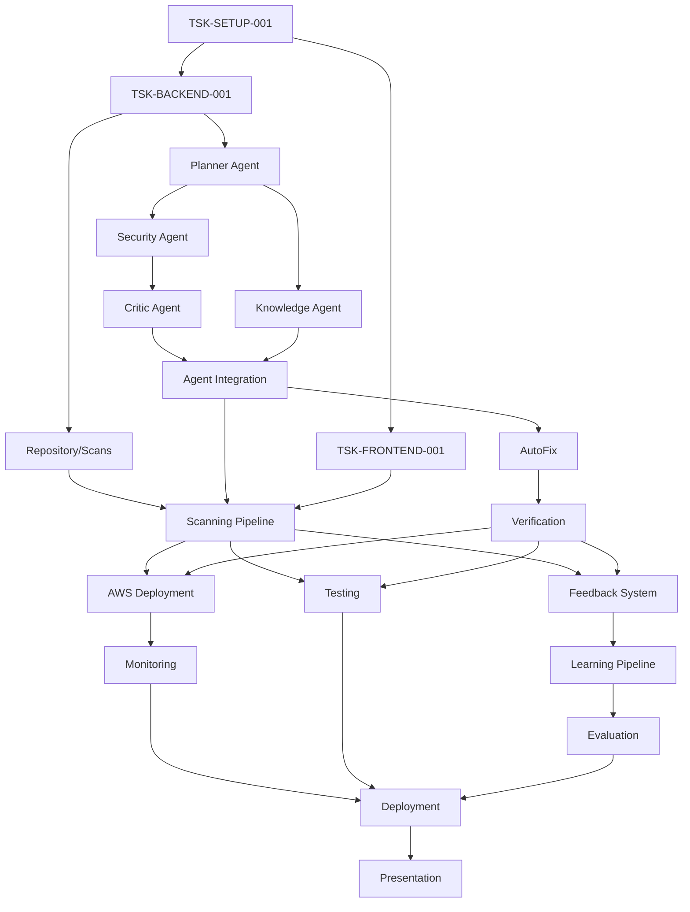

# SecureCode AI — Engineering Task Breakdown

> **Document Identifier:** `SCAI-ETB-001`
> **Version:** `1.0.0`
> **Status:** `ACTIVE`
> **Classification:** `INTERNAL — ENGINEERING`
> **Purpose:** Translate Implementation Blueprint into Executable Engineering Tasks

---

## Table of Contents

1. [Task Breakdown by Group](#1-task-breakdown-by-group)
   - [Project Setup](#project-setup)
   - [Backend](#backend)
   - [Frontend](#frontend)
   - [Planner Agent](#planner-agent)
   - [Security Agent](#security-agent)
   - [Critic Agent](#critic-agent)
   - [Knowledge Agent](#knowledge-agent)
   - [AutoFix](#autofix)
   - [Verification](#verification)
   - [Learning Pipeline](#learning-pipeline)
   - [Evaluation](#evaluation)
   - [AWS](#aws)
   - [Monitoring](#monitoring)
   - [Testing](#testing)
   - [Deployment](#deployment)
   - [Presentation](#presentation)
   - [Documentation](#documentation)
2. [Folder Specifications](#2-folder-specifications)
3. [API Specifications](#3-api-specifications)
4. [Agent Specifications](#4-agent-specifications)
5. [Critical Path](#5-critical-path)
6. [Parallel Development Matrix](#6-parallel-development-matrix)
7. [Task Dependency Graph](#7-task-dependency-graph)
8. [Folder Ownership Matrix](#8-folder-ownership-matrix)
9. [Risk Matrix](#9-risk-matrix)
10. [Daily Progress Checklist](#10-daily-progress-checklist)
11. [Definition of Done Checklist](#11-definition-of-done-checklist)

---

## 1. Task Breakdown by Group

### Project Setup

#### Task ID: `TSK-SETUP-001`
**Title:** Initialize Monorepo and CI/CD Pipeline
**Priority:** P0
**Owner:** Backend Engineer
**Dependencies:** None
**Estimated Complexity:** Low
**Estimated Time:** 1 Day
**Description:** Initialize the repository structure, Docker Compose stack (Postgres, Redis), and GitHub Actions CI/CD pipelines.
**Business Purpose:** Ensure all engineers can build the app locally from a consistent baseline.
**Technical Purpose:** Provide reproducible dev environment and automated continuous integration.
**Folder:** `docker/`, `scripts/`, `.github/`
**Files:** `docker-compose.yml`, `setup.sh`, `ci.yml`, `cd.yml`
**Classes:** N/A
**Functions:** N/A
**Database Models:** N/A
**API Endpoints:** N/A
**Frontend Components:** N/A
**Agent Changes:** N/A
**Prompt Changes:** N/A
**AWS Services:** N/A
**Security Considerations:** Ensure `.env` is listed in `.gitignore` and `.env.example` contains no real secrets.
**Acceptance Criteria:** `docker-compose up` starts all services. CI pipeline passes on empty repository.
**Testing Strategy:** Verify CI pipeline runs pre-commit hooks and tests.
**Definition of Done:** PR merged, CI passes, all engineers can run `scripts/setup.sh` locally.

### Backend

#### Task ID: `TSK-BACKEND-001`
**Title:** Implement Base Django Application and Auth API
**Priority:** P0
**Owner:** Backend Engineer
**Dependencies:** `TSK-SETUP-001`
**Estimated Complexity:** Medium
**Estimated Time:** 2 Days
**Description:** Create Django project, common models, user authentication (JWT), RBAC, and repository/scan models.
**Business Purpose:** Secure multi-tenant foundation for backend operations.
**Technical Purpose:** Establish API routing, JWT auth, Celery setup, and baseline ORM schema.
**Folder:** `backend/accounts/`, `backend/common/`, `backend/config/`, `backend/repositories/`
**Files:** `models.py`, `serializers.py`, `views.py`, `urls.py`, `tasks.py`
**Classes:** `User`, `Organisation`, `Repository`, `Scan`, `ScanResult`
**Functions:** `health_check`, `clone_repository`
**Database Models:** `User`, `Organisation`, `Repository`, `Scan`, `ScanResult`
**API Endpoints:** `POST /api/v1/auth/login/`, `POST /api/v1/auth/register/`, `GET /api/v1/repositories/`, `POST /api/v1/scans/`
**Frontend Components:** N/A
**Agent Changes:** N/A
**Prompt Changes:** N/A
**AWS Services:** N/A
**Security Considerations:** Password hashing, JWT signing, object-level permissions (users only see their org's data).
**Acceptance Criteria:** Users can register/login. Repositories can be added.
**Testing Strategy:** Pytest for auth views and model validation.
**Definition of Done:** Endpoints return 200/201, tests pass, models migrated.

### Frontend

#### Task ID: `TSK-FRONTEND-001`
**Title:** Build SPA Shell and Dashboard
**Priority:** P0
**Owner:** Frontend Engineer
**Dependencies:** `TSK-SETUP-001`
**Estimated Complexity:** Medium
**Estimated Time:** 3 Days
**Description:** Implement Vite/React frontend, routing, Redux store, API client, auth flows, and layout shell.
**Business Purpose:** Provide the user-facing interface for repository connection and scan initiation.
**Technical Purpose:** Establish UI state management and backend communication layer.
**Folder:** `frontend/src/pages/`, `frontend/src/store/`, `frontend/src/services/`, `frontend/src/layouts/`
**Files:** `apiClient.ts`, `AppRouter.tsx`, `authSlice.ts`, `DashboardPage.tsx`
**Classes:** N/A
**Functions:** Axios interceptors for JWT injection
**Database Models:** N/A
**API Endpoints:** Consumes `POST /api/v1/auth/login/`, `GET /api/v1/repositories/`
**Frontend Components:** `LoginPage`, `DashboardPage`, `AppLayout`, `Sidebar`
**Agent Changes:** N/A
**Prompt Changes:** N/A
**AWS Services:** N/A
**Security Considerations:** Secure token storage, XSS prevention.
**Acceptance Criteria:** User can login via UI, view dashboard, and protected routes block unauthenticated access.
**Testing Strategy:** Vitest for reducers, Playwright for auth E2E flow.
**Definition of Done:** Auth flow functional in browser, Redux state properly synchronised.

### Planner Agent

#### Task ID: `TSK-PLANNER-001`
**Title:** Implement Planner Agent Workflow
**Priority:** P1
**Owner:** AI Engineer 1
**Dependencies:** `TSK-BACKEND-001`
**Estimated Complexity:** High
**Estimated Time:** 2 Days
**Description:** Analyze repository file trees, prioritize high-risk files, and generate token-safe scan batches.
**Business Purpose:** Intelligent scan planning that stays within budget and prioritizes critical code.
**Technical Purpose:** `PlannerAgent` logic, Bedrock API integration, and Pydantic state modeling.
**Folder:** `ai/planner/`, `ai/agents/`
**Files:** `agent.py`, `state.py`, `logic.py`, `planner_prompts.py`
**Classes:** `PlannerAgent`, `WorkflowState`, `ScanPlan`, `ScanBatch`
**Functions:** `classify_file_type`, `construct_batches`
**Database Models:** N/A
**API Endpoints:** N/A
**Frontend Components:** N/A
**Agent Changes:** `PlannerAgent` logic
**Prompt Changes:** Planner `<system>`, `<context>`, `<task>` definitions
**AWS Services:** Amazon Bedrock (Claude 3 Haiku)
**Security Considerations:** Prevent prompt injection from malicious filenames.
**Acceptance Criteria:** Batches never exceed 50 files. SQL/Auth files prioritized.
**Testing Strategy:** Pytest with mocked Bedrock returning valid plans.
**Definition of Done:** Agent outputs Pydantic-validated `ScanPlan` for 500+ file mock repos.

### Security Agent

#### Task ID: `TSK-SECURITY-001`
**Title:** Implement Security Detection Agent
**Priority:** P1
**Owner:** AI Engineer 1
**Dependencies:** `TSK-PLANNER-001`
**Estimated Complexity:** High
**Estimated Time:** 3 Days
**Description:** Analyze source code to detect OWASP/CWE vulnerabilities with confidence scoring.
**Business Purpose:** Core vulnerability detection engine.
**Technical Purpose:** Claude 3.5 Sonnet integration, structured finding extraction.
**Folder:** `ai/security/`
**Files:** `agent.py`, `schemas.py`, `detectors.py`, `security_prompts.py`
**Classes:** `SecurityAgent`, `Finding`
**Functions:** Parsing LLM response into `Finding` models
**Database Models:** Maps to `ScanResult`
**API Endpoints:** N/A
**Frontend Components:** N/A
**Agent Changes:** `SecurityAgent` logic
**Prompt Changes:** Security prompt with OWASP Top 10 negative/positive examples.
**AWS Services:** Amazon Bedrock (Claude 3.5 Sonnet)
**Security Considerations:** Source code must not be retained by AWS Bedrock (opt-out required).
**Acceptance Criteria:** Detects OWASP vulnerabilities, outputs valid CWE IDs, confidence > 0.0.
**Testing Strategy:** Pytest on vulnerable code snippets (SQLi, XSS).
**Definition of Done:** Correctly identifies known vulnerabilities in test dataset.

### Critic Agent

#### Task ID: `TSK-CRITIC-001`
**Title:** Implement Critic Validation Agent
**Priority:** P1
**Owner:** AI Engineer 1
**Dependencies:** `TSK-SECURITY-001`
**Estimated Complexity:** Medium
**Estimated Time:** 2 Days
**Description:** Validate Security Agent findings to reduce false positives.
**Business Purpose:** Ensure high-quality findings and minimize developer fatigue from false positives.
**Technical Purpose:** Quality scoring, rule-based validation, and LLM critique.
**Folder:** `ai/critic/`
**Files:** `agent.py`, `validators.py`, `schemas.py`, `critic_prompts.py`
**Classes:** `CriticAgent`, `ValidationResult`
**Functions:** Finding validation rules (e.g., line number presence)
**Database Models:** N/A
**API Endpoints:** N/A
**Frontend Components:** N/A
**Agent Changes:** `CriticAgent` logic
**Prompt Changes:** Critic critique criteria
**AWS Services:** Amazon Bedrock (Claude 3.5 Sonnet)
**Security Considerations:** N/A
**Acceptance Criteria:** Rejects findings without line numbers or with vague explanations.
**Testing Strategy:** Unit tests feeding bad findings and verifying rejection.
**Definition of Done:** Agent successfully filters out intentionally bad mock findings.

### Knowledge Agent

#### Task ID: `TSK-KNOWLEDGE-001`
**Title:** Implement OWASP/CWE Knowledge Retrieval
**Priority:** P2
**Owner:** AI Engineer 1
**Dependencies:** `TSK-PLANNER-001`
**Estimated Complexity:** Medium
**Estimated Time:** 2 Days
**Description:** Retrieve vulnerability context and inject into other agents' prompts.
**Business Purpose:** Enrich analysis with authoritative definitions.
**Technical Purpose:** Vector store setup, Titan embeddings, retrieval logic.
**Folder:** `ai/knowledge/`, `ai/memory/`
**Files:** `agent.py`, `knowledge_base.py`, `retriever.py`
**Classes:** `KnowledgeAgent`, `RetrievalResult`
**Functions:** Vector similarity search
**Database Models:** N/A
**API Endpoints:** N/A
**Frontend Components:** N/A
**Agent Changes:** `KnowledgeAgent` logic
**Prompt Changes:** N/A
**AWS Services:** Amazon Bedrock (Titan Embeddings)
**Security Considerations:** N/A
**Acceptance Criteria:** Top-k retrieval latency < 2s, returns relevant CWE context.
**Testing Strategy:** Querying "SQL injection" returns CWE-89.
**Definition of Done:** Knowledge context successfully injected into Security Agent state.

### AutoFix

#### Task ID: `TSK-AUTOFIX-001`
**Title:** Implement AutoFix Patch Generation
**Priority:** P1
**Owner:** AI Engineer 2
**Dependencies:** `TSK-CRITIC-001`
**Estimated Complexity:** High
**Estimated Time:** 3 Days
**Description:** Generate minimal, Git-compatible unified diffs to fix vulnerabilities.
**Business Purpose:** Automated remediation without human intervention.
**Technical Purpose:** GitPython integration, LLM patch generation, constraint enforcement.
**Folder:** `ai/patches/`, `backend/patches/`
**Files:** `agent.py`, `diff_generator.py`, `patch_applier.py`, `autofix_prompts.py`
**Classes:** `AutoFixAgent`, `Patch`
**Functions:** `generate_unified_diff`, `apply_patch`
**Database Models:** `Patch`, `PullRequest`
**API Endpoints:** `GET /api/v1/patches/`
**Frontend Components:** Patch diff viewer in UI
**Agent Changes:** `AutoFixAgent` logic
**Prompt Changes:** AutoFix safety constraints (e.g., "Do not delete tests").
**AWS Services:** Amazon Bedrock (Claude 3.5 Sonnet)
**Security Considerations:** Patch must not introduce new backdoors.
**Acceptance Criteria:** Generates valid unified diffs that apply cleanly.
**Testing Strategy:** Test against vulnerable files and verify `git apply` succeeds.
**Definition of Done:** Patches generated for SQLi and XSS apply without conflicts.

### Verification

#### Task ID: `TSK-VERIFICATION-001`
**Title:** Implement Verification Pipeline
**Priority:** P1
**Owner:** AI Engineer 2
**Dependencies:** `TSK-AUTOFIX-001`
**Estimated Complexity:** High
**Estimated Time:** 3 Days
**Description:** Validate patches using AST, Bandit, Semgrep, and Pytest.
**Business Purpose:** Guarantee patch correctness before showing to user.
**Technical Purpose:** Tool execution wrappers, fail-fast aggregation logic.
**Folder:** `ai/verification/`, `backend/verification/`
**Files:** `agent.py`, `bandit_runner.py`, `semgrep_runner.py`, `pytest_runner.py`, `aggregator.py`
**Classes:** `VerificationAgent`, `VerificationResult`
**Functions:** Tool subprocessing, pass/fail aggregation
**Database Models:** `Verification`
**API Endpoints:** `GET /api/v1/verifications/`
**Frontend Components:** Verification status badges
**Agent Changes:** `VerificationAgent` logic
**Prompt Changes:** N/A (Tool-based)
**AWS Services:** N/A
**Security Considerations:** Sandbox execution of untrusted patched code.
**Acceptance Criteria:** Syntax failure skips Semgrep/Pytest. All tools must pass for global PASS.
**Testing Strategy:** Supply broken patches and verify rejection.
**Definition of Done:** Pipeline successfully fails bad patches and passes good patches.

### Learning Pipeline

#### Task ID: `TSK-LEARNING-001`
**Title:** Implement Feedback loop and Training Trigger
**Priority:** P2
**Owner:** AI Engineer 2
**Dependencies:** `TSK-VERIFICATION-001`
**Estimated Complexity:** Medium
**Estimated Time:** 2 Days
**Description:** Capture feedback, generate JSONL, and launch SageMaker training.
**Business Purpose:** Continuous model improvement based on human feedback.
**Technical Purpose:** JSONL generation, SageMaker API integration.
**Folder:** `ai/training/`, `backend/reviews/`, `backend/training/`
**Files:** `dataset_generator.py`, `trainer.py`, `models.py`
**Classes:** `TrainingDataset`, `TrainingJob`, `Feedback`
**Functions:** `generate_dataset`, `launch_training_job`
**Database Models:** `Feedback`, `TrainingDataset`, `TrainingJob`
**API Endpoints:** `POST /api/v1/feedback/`, `POST /api/v1/training/jobs/launch/`
**Frontend Components:** Feedback UI (star rating)
**Agent Changes:** N/A
**Prompt Changes:** N/A
**AWS Services:** Amazon SageMaker, S3
**Security Considerations:** Strip PII from training datasets.
**Acceptance Criteria:** Generates valid JSONL, successfully calls SageMaker CreateTrainingJob.
**Testing Strategy:** Unit tests for JSONL schema validation.
**Definition of Done:** SageMaker training job transitions to "In Progress".

### Evaluation

#### Task ID: `TSK-EVALUATION-001`
**Title:** Implement Evaluation Pipeline
**Priority:** P2
**Owner:** AI Engineer 2
**Dependencies:** `TSK-LEARNING-001`
**Estimated Complexity:** High
**Estimated Time:** 3 Days
**Description:** Benchmark challenger models against champion models.
**Business Purpose:** Ensure only superior models reach production.
**Technical Purpose:** F1 score calculation, regression testing, model registry.
**Folder:** `ai/evaluation/`, `backend/evaluation/`
**Files:** `benchmark.py`, `metrics.py`, `comparator.py`, `leaderboard.py`
**Classes:** `ModelVersion`, `EvaluationRun`
**Functions:** Precision/Recall calculation
**Database Models:** `ModelVersion`, `EvaluationRun`, `EvaluationResult`
**API Endpoints:** `GET /api/v1/evaluations/leaderboard/`
**Frontend Components:** Leaderboard dashboard page
**Agent Changes:** N/A
**Prompt Changes:** N/A
**AWS Services:** Amazon SageMaker
**Security Considerations:** N/A
**Acceptance Criteria:** Correctly calculates F1 score. Promotes challenger if F1 > Champion + 2%.
**Testing Strategy:** Mock evaluations ensuring strict promotion criteria.
**Definition of Done:** Leaderboard accurately ranks models based on benchmark scores.

### AWS

#### Task ID: `TSK-AWS-001`
**Title:** Provision AWS Production Infrastructure
**Priority:** P1
**Owner:** Backend Engineer
**Dependencies:** `TSK-BACKEND-001`
**Estimated Complexity:** High
**Estimated Time:** 3 Days
**Description:** Deploy ECS, RDS, Redis, S3, ALB, and Secrets Manager.
**Business Purpose:** Secure, scalable cloud environment.
**Technical Purpose:** Infrastructure as Code / AWS Console configuration.
**Folder:** N/A (Infrastructure)
**Files:** N/A
**Classes:** N/A
**Functions:** N/A
**Database Models:** N/A
**API Endpoints:** N/A
**Frontend Components:** N/A
**Agent Changes:** N/A
**Prompt Changes:** N/A
**AWS Services:** ECS Fargate, RDS PostgreSQL, ElastiCache Redis, S3, ALB, Secrets Manager
**Security Considerations:** Encrypted at rest, private subnets for DB, HTTPS only.
**Acceptance Criteria:** ECS tasks run, connect to RDS, accessible via ALB.
**Testing Strategy:** End-to-end health check of production URL.
**Definition of Done:** Infrastructure fully provisioned and stable.

### Monitoring

#### Task ID: `TSK-MONITORING-001`
**Title:** Configure Observability and Alerts
**Priority:** P2
**Owner:** Backend Engineer
**Dependencies:** `TSK-AWS-001`
**Estimated Complexity:** Low
**Estimated Time:** 1 Day
**Description:** Setup CloudWatch dashboards and alarms.
**Business Purpose:** Proactive issue detection.
**Technical Purpose:** Metrics extraction and alerting logic.
**Folder:** `backend/monitoring/`
**Files:** `views.py` (metrics endpoints)
**Classes:** N/A
**Functions:** CloudWatch metric emission
**Database Models:** N/A
**API Endpoints:** `/api/v1/health/`
**Frontend Components:** N/A
**Agent Changes:** N/A
**Prompt Changes:** N/A
**AWS Services:** Amazon CloudWatch
**Security Considerations:** No PII in logs.
**Acceptance Criteria:** Dashboards show API latency and error rates. Alarms fire on >5% errors.
**Testing Strategy:** Trigger synthetic errors to test alarms.
**Definition of Done:** Dashboards active and alerts routed to team.

### Testing

#### Task ID: `TSK-TESTING-001`
**Title:** Implement E2E and Integration Tests
**Priority:** P1
**Owner:** Frontend Engineer
**Dependencies:** `TSK-FRONTEND-001`, `TSK-BACKEND-001`
**Estimated Complexity:** Medium
**Estimated Time:** 2 Days
**Description:** Write Playwright E2E tests and Pytest integration tests.
**Business Purpose:** Prevent regressions on critical user paths.
**Technical Purpose:** Achieve coverage targets (Backend 80%, Frontend 75%).
**Folder:** `backend/`, `frontend/e2e/`
**Files:** `test_integration.py`, `scan_flow.spec.ts`
**Classes:** N/A
**Functions:** N/A
**Database Models:** N/A
**API Endpoints:** N/A
**Frontend Components:** N/A
**Agent Changes:** N/A
**Prompt Changes:** N/A
**AWS Services:** N/A
**Security Considerations:** N/A
**Acceptance Criteria:** Coverage targets met. CI runs Playwright tests.
**Testing Strategy:** Full E2E flow from login to patch view.
**Definition of Done:** Coverage thresholds pass in GitHub Actions.

### Deployment

#### Task ID: `TSK-DEPLOY-001`
**Title:** Production Readiness and Security Audit
**Priority:** P1
**Owner:** Backend Engineer
**Dependencies:** `TSK-AWS-001`, `TSK-TESTING-001`
**Estimated Complexity:** Medium
**Estimated Time:** 2 Days
**Description:** Final configuration, secrets rotation, load testing, and security scanning.
**Business Purpose:** Ensure system is safe for external use.
**Technical Purpose:** Pre-deployment validation.
**Folder:** N/A
**Files:** N/A
**Classes:** N/A
**Functions:** N/A
**Database Models:** N/A
**API Endpoints:** N/A
**Frontend Components:** N/A
**Agent Changes:** N/A
**Prompt Changes:** N/A
**AWS Services:** All
**Security Considerations:** Penetration testing, vulnerability scanning (Bandit/Semgrep).
**Acceptance Criteria:** Load test passes 100 concurrent requests. Zero critical security findings.
**Testing Strategy:** Load testing, manual security review.
**Definition of Done:** Production checklist 100% complete.

### Presentation

#### Task ID: `TSK-PRESENTATION-001`
**Title:** Prepare Investor Demo
**Priority:** P1
**Owner:** Frontend Engineer
**Dependencies:** `TSK-DEPLOY-001`
**Estimated Complexity:** Low
**Estimated Time:** 1 Day
**Description:** Seed demo repository, polish UI, and record fallback video.
**Business Purpose:** Flawless 15-minute investor demonstration.
**Technical Purpose:** Reliable, deterministic demo environment.
**Folder:** `scripts/`
**Files:** `seed_demo.py`
**Classes:** N/A
**Functions:** N/A
**Database Models:** N/A
**API Endpoints:** N/A
**Frontend Components:** N/A
**Agent Changes:** N/A
**Prompt Changes:** N/A
**AWS Services:** N/A
**Security Considerations:** N/A
**Acceptance Criteria:** Demo completes < 15 min. Fallback video recorded.
**Testing Strategy:** Rehearse flow end-to-end.
**Definition of Done:** Demo environment active and validated by CTO.

### Documentation

#### Task ID: `TSK-DOCS-001`
**Title:** Finalize Documentation Suite
**Priority:** P2
**Owner:** AI Engineer 1
**Dependencies:** All Technical Tasks
**Estimated Complexity:** Low
**Estimated Time:** 1 Day
**Description:** Review and update `docs/` to reflect actual implementation.
**Business Purpose:** Maintain source of truth for future onboarding.
**Technical Purpose:** Ensure documentation accuracy.
**Folder:** `docs/`
**Files:** `api.md`, `architecture.md`, `database.md`, etc.
**Classes:** N/A
**Functions:** N/A
**Database Models:** N/A
**API Endpoints:** N/A
**Frontend Components:** N/A
**Agent Changes:** N/A
**Prompt Changes:** N/A
**AWS Services:** N/A
**Security Considerations:** Remove sensitive data from docs.
**Acceptance Criteria:** All docs updated, cross-references resolve.
**Testing Strategy:** Manual review against codebase.
**Definition of Done:** Documentation approved by CTO.

---

## 2. Folder Specifications

| Folder | Owner | Purpose | Files | Responsibilities | Dependencies | Expected Pull Requests | Expected Merge Order |
|--------|-------|---------|-------|------------------|--------------|------------------------|----------------------|
| `ai/agents/` | AI Engineer 1 | LangGraph Orchestration | `base.py`, `state.py`, `orchestrator.py` | Graph execution, error routing | None | Orchestrator PR | 2 |
| `ai/planner/` | AI Engineer 1 | Scan Planning | `agent.py`, `logic.py` | Batching files, risk sorting | `ai/agents/` | Planner Agent PR | 3 |
| `ai/security/` | AI Engineer 1 | Vulnerability Detection | `agent.py`, `detectors.py` | LLM calls for CWE detection | `ai/planner/` | Security Agent PR | 4 |
| `ai/critic/` | AI Engineer 1 | Finding Validation | `agent.py`, `validators.py` | Quality scoring, rejection | `ai/security/` | Critic Agent PR | 5 |
| `ai/knowledge/`| AI Engineer 1 | Context Retrieval | `agent.py`, `retriever.py` | Vector search OWASP DB | None | Knowledge Agent PR | 3 |
| `ai/patches/` | AI Engineer 2 | AutoFix Generation | `agent.py`, `diff_generator.py` | Git diff creation | `ai/critic/` | AutoFix PR | 6 |
| `ai/verification/`| AI Engineer 2 | Patch Validation | `agent.py`, `bandit_runner.py` | Tool execution, aggregation | `ai/patches/` | Verification PR | 7 |
| `ai/training/` | AI Engineer 2 | Fine-Tuning | `trainer.py`, `dataset_generator.py`| JSONL gen, SageMaker jobs | None | Training PR | 8 |
| `ai/evaluation/`| AI Engineer 2 | Model Comparison | `benchmark.py`, `comparator.py`| F1 calc, leaderboard | `ai/training/` | Evaluation PR | 9 |
| `backend/accounts/`| Backend Engineer | Auth & RBAC | `models.py`, `views.py` | JWT generation, Users | None | Auth PR | 1 |
| `backend/repositories/`| Backend Engineer| Repos & Scans | `models.py`, `tasks.py` | Git clone, Celery jobs | `backend/accounts/`| Repos PR | 2 |
| `backend/patches/`| Backend Engineer| Patch Storage | `models.py`, `views.py` | Diff storage, PR records | `backend/repositories/`| Patches API PR | 3 |
| `frontend/src/pages/`| Frontend Engineer| UI Views | `DashboardPage.tsx`, etc | React UI rendering | None | UI Pages PR | 3 |
| `frontend/src/store/`| Frontend Engineer| State Mgt | `authSlice.ts`, etc | Redux state, thunks | None | State PR | 2 |
| `docker/` | Backend Engineer| Containerization| `docker-compose.yml`, `*.Dockerfile`| Environment builds | None | Infra PR | 1 |

---

## 3. API Specifications

| API | Owner | Inputs | Outputs | Frontend Consumer | Database Usage | Agent Usage | Security | Validation |
|-----|-------|--------|---------|-------------------|----------------|-------------|----------|------------|
| `POST /api/v1/auth/register/` | Backend Engineer | Email, Password | JWT Tokens, User Profile | `RegisterPage` | Creates `User` | None | Public | Email format, password strength |
| `POST /api/v1/auth/login/` | Backend Engineer | Email, Password | JWT Tokens | `LoginPage` | Reads `User` | None | Public | Password hash match |
| `POST /api/v1/repositories/` | Backend Engineer | Repo URL, Branch | Repository Object | `RepositoriesPage` | Creates `Repository` | None | JWT (Engineer) | Valid Git URL |
| `POST /api/v1/scans/` | Backend Engineer | Repository ID | Scan ID | `RepositoryDetailPage`| Creates `Scan` | Initiates Planner | JWT (Engineer) | Repo ownership check |
| `GET /api/v1/findings/` | Backend Engineer | Scan ID (query) | List of Findings | `FindingsPage` | Reads `ScanResult` | Written by Security Agent | JWT (Engineer) | Scan ownership check |
| `GET /api/v1/patches/` | Backend Engineer | Scan ID (query) | List of Patches | `PatchesPage` | Reads `Patch` | Written by AutoFix | JWT (Engineer) | Scan ownership check |
| `POST /api/v1/feedback/` | Backend Engineer | Patch ID, Score, Text | Feedback Object | `PatchReviewPage` | Creates `Feedback` | Used by Learning Pipeline | JWT (Engineer) | 1-5 Score limit |
| `POST /api/v1/training/jobs/launch/` | Backend Engineer | Config override (opt) | Job ID | `TrainingPage` | Creates `TrainingJob`| None | JWT (Admin) | Valid SageMaker config |

---

## 4. Agent Specifications

| Agent | Owner | Prompt | Memory | Inputs | Outputs | Dependencies | Testing | Metrics |
|-------|-------|--------|--------|--------|---------|--------------|---------|---------|
| **Planner** | AI Eng 1 | `planner_prompts.py` | `WorkflowState` | File tree | `ScanPlan` | None | Pytest with mock Bedrock | Latency, Input Tokens |
| **Security** | AI Eng 1 | `security_prompts.py`| `WorkflowState` | Source code | `list[Finding]` | Planner Agent | Vulnerable code snippets | Latency, Finding Count |
| **Critic** | AI Eng 1 | `critic_prompts.py` | `WorkflowState` | `list[Finding]` | `ValidationResult` | Security Agent | Edge case findings | Rejection Rate |
| **Knowledge**| AI Eng 1 | N/A (RAG system) | `KnowledgeBase` | Finding topic | `KnowledgeEntry` | None | Vector similarity test | Retrieval Latency |
| **AutoFix** | AI Eng 2 | `autofix_prompts.py` | `WorkflowState` | Source code, `Finding` | `Patch` | Critic Agent | Git apply dry-run tests | Latency, Output Tokens |
| **Verification**| AI Eng 2 | N/A (Tool based) | `WorkflowState` | `Patch` | `VerificationResult`| AutoFix Agent | Intentional bad patches | Pass/Fail Rate |

---

## 5. Critical Path

1. **Phase 1: Project Setup** (Prerequisite for all)
2. **Phase 2: Backend Foundation** (Prerequisite for DB / UI)
3. **Phase 4: Repository Module** (Prerequisite for Scans)
4. **Phase 9: Agent Integration** (Depends on Phases 5, 6, 7, 8)
5. **Phase 10: Scanning Pipeline** (Connects UI to Agents)
6. **Phase 11: AutoFix** (Completes remediation)
7. **Phase 12: Verification** (Gates patch delivery)
8. **Phase 16: AWS Deployment** (Required for production demo)

---

## 6. Parallel Development Matrix

| Resource | Week 1 | Week 2 | Week 3 |
|----------|--------|--------|--------|
| **Backend Engineer** | Phases 1, 2 | Phases 4, 10 | Phases 13, 16, 17 |
| **Frontend Engineer**| Phase 3 | Phases 4, 10 (UI) | Phases 13 (UI), 20 |
| **AI Engineer 1** | Phases 5, 8 | Phases 6, 7 | Phase 9, 21 |
| **AI Engineer 2** | Phases 11, 12 | Phase 14 | Phase 15 |

---

## 7. Task Dependency Graph

---

## 8. Folder Ownership Matrix

| Folder | Primary Owner | Secondary Reviewer |
|--------|---------------|--------------------|
| `backend/` | Backend Engineer | CTO |
| `frontend/` | Frontend Engineer | Backend Engineer |
| `ai/planner/`, `security/`, `critic/` | AI Engineer 1 | AI Engineer 2 |
| `ai/patches/`, `verification/`, `training/` | AI Engineer 2 | AI Engineer 1 |
| `docker/`, `.github/` | Backend Engineer | CTO |
| `docs/` | AI Engineer 1 | All Engineers |

---

## 9. Risk Matrix

| Risk | Probability | Impact | Mitigation Strategy |
|------|-------------|--------|---------------------|
| Bedrock API Rate Limits | High | High | Implement exponential backoff in `BaseAgent`; batch LLM calls safely. |
| AI Hallucinations | Medium | High | Critic agent validation; Verification pipeline enforcing correct AST/Pytest. |
| Complex UI State Sync | Medium | Medium | Use Redux Toolkit carefully; rely on polling for async scan statuses. |
| Docker/ECS Memory OOM | Low | High | Resource limits enforced in `docker-compose.yml` and ECS Task Def. |
| Schedule Slip on Agents | Medium | High | AI Engineers develop in parallel using mocked API interfaces early. |

---

## 10. Daily Progress Checklist

- [ ] Blockers identified and communicated in stand-up.
- [ ] Code committed to branch `{type}/{ticket-id}/{short-description}`.
- [ ] Pre-commit hooks passing locally.
- [ ] Unit tests written for new logic.
- [ ] PR created if feature segment complete.
- [ ] PR reviews completed (max 24h turnaround).
- [ ] Jira / Linear task status updated.

---

## 11. Definition of Done Checklist

- [ ] **Authored**: Primary engineer has written feature code.
- [ ] **Self-Reviewed**: Passes local linters, formatters, and type checkers.
- [ ] **Tested**: Unit/Integration tests pass with required coverage.
- [ ] **Peer-Reviewed**: Approved by at least 1 other engineer.
- [ ] **Documented**: API docs, docstrings, and `docs/` updated.
- [ ] **Merged**: PR merged into `develop` or `main`.
- [ ] **Deployed**: CI/CD pipeline deploys code to staging successfully.
- [ ] **Verified**: Product Owner / CTO validates business requirement met.
