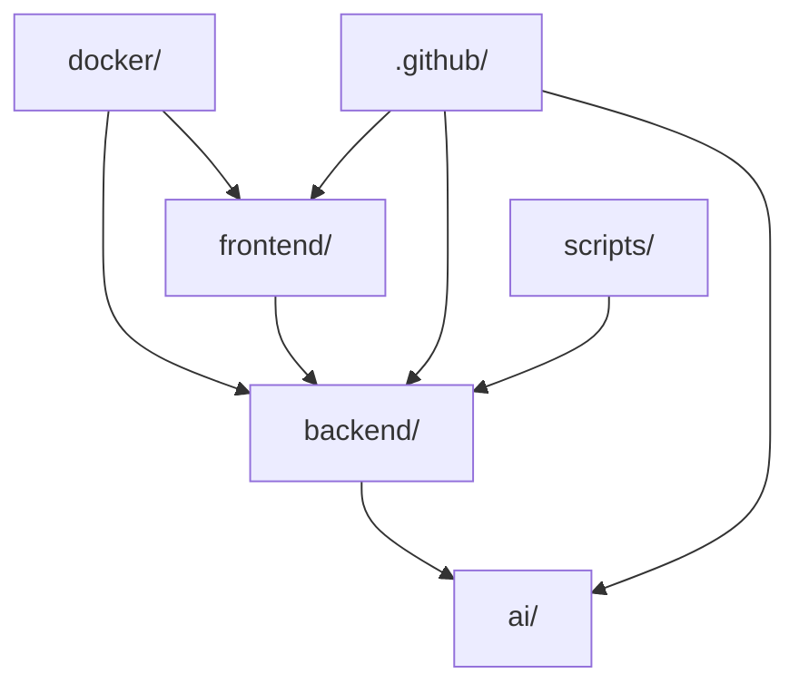

# SecureCode AI — File-Level Implementation Guide

> **Document Identifier:** `SCAI-FIG-001`  
> **Version:** `1.0.0`  
> **Status:** `ACTIVE`  
> **Classification:** `INTERNAL — ENGINEERING MASTER REFERENCE`  
> **Author:** Chief Software Architect & Principal Staff Engineer  
> **Dependencies:** `SCAI-DMP-001`, `SCAI-IMP-001`, `SCAI-ETB-001`, `SCAI-SEP-001`  

---

## Table of Contents

1. [Architectural Overview & System Monorepo Structure](#1-architectural-overview--system-monorepo-structure)
2. [Directory Specifications](#2-directory-specifications)
   - [`backend/`](#backend-directory)
   - [`frontend/`](#frontend-directory)
   - [`ai/`](#ai-directory)
   - [`docker/`](#docker-directory)
   - [`scripts/`](#scripts-directory)
   - [`.github/`](#github-directory)
3. [File Specifications — Backend Services (`backend/`)](#3-file-specifications--backend-services-backend)
   - [`backend/config/settings.py`](#backendconfigsettingspy)
   - [`backend/config/wsgi.py` & `asgi.py`](#backendconfigwsgipy--asgipy)
   - [`backend/config/celery.py`](#backendconfigcelerypy)
   - [`backend/accounts/models.py`](#backendaccountsmodelspy)
   - [`backend/accounts/serializers.py`](#backendaccountsserializerspy)
   - [`backend/accounts/views.py`](#backendaccountsviewspy)
   - [`backend/repositories/models.py`](#backendrepositoriesmodelspy)
   - [`backend/repositories/tasks.py`](#backendrepositoriestaskspy)
   - [`backend/repositories/views.py`](#backendrepositoriesviewspy)
   - [`backend/patches/models.py`](#backendpatchesmodelspy)
   - [`backend/patches/views.py`](#backendpatchesviewspy)
   - [`backend/verification/models.py`](#backendverificationmodelspy)
   - [`backend/reviews/models.py`](#backendreviewsmodelspy)
   - [`backend/training/models.py` & `tasks.py`](#backendtrainingmodelspy--taskspy)
   - [`backend/evaluation/models.py`](#backendevaluationmodelspy)
4. [File Specifications — Frontend SPA (`frontend/`)](#4-file-specifications--frontend-spa-frontend)
   - [`frontend/src/services/apiClient.ts`](#frontendtservicesapiclientts)
   - [`frontend/src/store/authSlice.ts`](#frontendstoreauthslicets)
   - [`frontend/src/store/scanSlice.ts`](#frontendstorescanslicets)
   - [`frontend/src/pages/LoginPage.tsx`](#frontendpagesloginpagetsx)
   - [`frontend/src/pages/DashboardPage.tsx`](#frontendpagesdashboardpagetsx)
   - [`frontend/src/pages/RepositoriesPage.tsx`](#frontendpagesrepositoriespagetsx)
   - [`frontend/src/pages/ScanDetailPage.tsx`](#frontendpagesscandetailpagetsx)
   - [`frontend/src/pages/FindingsPage.tsx`](#frontendpagesfindingspagetsx)
   - [`frontend/src/pages/PatchesPage.tsx`](#frontendpagespatchespagetsx)
   - [`frontend/src/pages/TrainingPage.tsx`](#frontendpagestrainingpagetsx)
   - [`frontend/src/pages/EvaluationPage.tsx`](#frontendpagesevaluationpagetsx)
5. [File Specifications — AI Core & Agents (`ai/`)](#5-file-specifications--ai-core--agents-ai)
   - [`ai/agents/base.py`](#aiagentsbasepy)
   - [`ai/agents/state.py`](#aiagentsstatepy)
   - [`ai/agents/orchestrator.py`](#aiagentsorchestratorpy)
   - [`ai/planner/agent.py`](#aiplanneragentpy)
   - [`ai/security/agent.py`](#aisecurityagentpy)
   - [`ai/critic/agent.py`](#aicriticagentpy)
   - [`ai/knowledge/agent.py`](#aiknowledgeagentpy)
   - [`ai/patches/agent.py`](#aipatchesagentpy)
   - [`ai/verification/agent.py`](#aiverificationagentpy)
   - [`ai/training/trainer.py`](#aitrainingtrainerpy)
   - [`ai/evaluation/benchmark.py`](#aievaluationbenchmarkpy)
6. [File Specifications — Infrastructure & DevOps (`docker/`, `scripts/`, `.github/`)](#6-file-specifications--infrastructure--devops)
   - [`docker/docker-compose.yml`](#dockerdocker-composeyml)
   - [`docker/backend.Dockerfile`](#dockerbackenddockerfile)
   - [`docker/frontend.Dockerfile`](#dockerfrontenddockerfile)
   - [`scripts/setup.sh`](#scriptssetupsh)
   - [`.github/workflows/ci.yml`](#githubworkflowsciyml)
7. [System Dependency Graphs & Architecture Matrices](#7-system-dependency-graphs--architecture-matrices)
   - [Folder Dependency Graph](#folder-dependency-graph)
   - [Module Dependency Matrix](#module-dependency-matrix)
   - [Expected File Count & Lines of Code (LOC) Matrix](#expected-file-count--lines-of-code-loc-matrix)
   - [Testing Coverage Matrix](#testing-coverage-matrix)
   - [Documentation Matrix](#documentation-matrix)
   - [Future Expansion Plan](#future-expansion-plan)

---

## 1. Architectural Overview & System Monorepo Structure

SecureCode AI is built on a four-layer architecture:
1. **Layer 1: Infrastructure** — AWS ECS Fargate, RDS PostgreSQL, ElastiCache Redis, S3, SageMaker, EventBridge, CloudWatch.
2. **Layer 2: AI Core Engine** — LangGraph stateful orchestrator powering 6 agents (Planner, Security, Critic, Knowledge, AutoFix, Verification).
3. **Layer 3: Backend REST Services** — Django REST Framework application managing state, authentication, queue orchestration, and external interfaces.
4. **Layer 4: Frontend SPA** — React 18 + TypeScript SPA providing responsive interactive scanning dashboards and remediation workflows.

```
SecureCode-AI/
├── ai/
│   ├── agents/          # Base agent abstraction, state definitions, LangGraph graph
│   ├── planner/         # Planner Agent (File classification & token batching)
│   ├── security/        # Security Agent (OWASP / CWE vulnerability detection)
│   ├── critic/          # Critic Agent (Quality validation & false-positive filtering)
│   ├── knowledge/       # Knowledge Agent (RAG vector similarity search)
│   ├── patches/         # AutoFix Agent (Unified diff patch generator)
│   ├── verification/    # Verification Agent (Multi-tool sandbox runner)
│   ├── training/        # QLoRA fine-tuning & dataset builder
│   ├── evaluation/      # Model evaluation & champion/challenger leaderboard
│   ├── prompts/         # Version-controlled prompt template library
│   ├── memory/          # Short-term conversation & long-term knowledge memory
│   └── utils/           # Shared AI helper utilities
├── backend/
│   ├── accounts/        # JWT auth, user profile, organisation multi-tenancy
│   ├── api/             # Root URL routing, DRF viewsets, error handlers
│   ├── common/          # BaseModel, audit logging, request middleware
│   ├── config/          # Django settings, WSGI, ASGI, Celery app config
│   ├── evaluation/      # Model version registry & evaluation ORM models
│   ├── monitoring/      # Health checks & CloudWatch metrics
│   ├── patches/         # Patch storage & GitHub PR integration ORM models
│   ├── repositories/    # Repo ingestion, scan tracking & findings ORM models
│   ├── reviews/         # Engineer patch rating & feedback ORM models
│   ├── training/        # Dataset metadata & SageMaker training job ORM models
│   └── verification/    # Tool execution verification result ORM models
├── frontend/
│   └── src/
│       ├── components/  # Reusable UI component library (ShadCN / Tailwind)
│       ├── pages/       # Route-level React page components
│       ├── store/       # Redux Toolkit slices (auth, repo, scan, patch)
│       ├── services/    # Axios HTTP client API service layer
│       ├── hooks/       # Custom React state & polling hooks
│       ├── contexts/    # Global React Context providers
│       ├── layouts/     # Page layout wrappers (AppLayout, AuthLayout)
│       ├── routes/      # React Router configuration with auth guards
│       ├── types/       # TypeScript type definitions & interfaces
│       └── utils/       # Formatting, date, & diff helpers
├── docker/              # Multi-stage Dockerfiles & Compose configurations
├── scripts/             # Environment setup, execution, & seeding scripts
├── docs/                # Project documentation suite
└── .github/             # GitHub Actions CI/CD workflows
```

---

## 2. Directory Specifications

### `backend/` Directory
- **Purpose:** Provide secure, multi-tenant Django REST APIs, database state management, and async background job execution via Celery.
- **Responsibilities:** Authentication, RBAC, repository ingestion, scan orchestration dispatch, result storage, feedback capture.
- **Owner:** Backend Engineer
- **Dependencies:** PostgreSQL 15, Redis 7, Celery 5.3+, `ai/` package modules.
- **Parent Modules:** Monorepo Root (`/`)
- **Child Modules:** `accounts/`, `api/`, `common/`, `config/`, `repositories/`, `patches/`, `verification/`, `reviews/`, `training/`, `evaluation/`, `monitoring/`.
- **Security Considerations:** Enforces JWT verification, rate limiting, ORM parameterization, and strict object-level RBAC.
- **Future Expansion:** Webhook handlers for automatic GitHub App events.

---

### `frontend/` Directory
- **Purpose:** Single Page Application (SPA) providing real-time security dashboard views, code patch inspection, and fine-tuning controls.
- **Responsibilities:** User authentication UI, repository connection, live scan progress rendering, interactive diff viewing, feedback entry.
- **Owner:** Frontend Engineer
- **Dependencies:** React 18, TypeScript 5, Vite, Tailwind CSS, Redux Toolkit, Axios.
- **Parent Modules:** Monorepo Root (`/`)
- **Child Modules:** `src/components/`, `src/pages/`, `src/store/`, `src/services/`, `src/hooks/`, `src/routes/`.
- **Security Considerations:** Secure JWT storage in httpOnly cookies / safe state, XSS sanitization of rendering diffs.
- **Future Expansion:** Real-time WebSocket scan telemetry updates via Django Channels.

---

### `ai/` Directory
- **Purpose:** LangGraph stateful multi-agent system orchestrating autonomous scanning, patching, verification, and learning.
- **Responsibilities:** Code parsing, risk batching, vulnerability analysis, critique validation, RAG lookup, diff generation, tool verification sandbox execution.
- **Owner:** AI Engineer 1 (Agents & Prompts) & AI Engineer 2 (Patches, Verification, Training & Evaluation)
- **Dependencies:** `langgraph`, `langchain`, `boto3` (Amazon Bedrock), `transformers`, `peft`, `bandit`, `semgrep`.
- **Parent Modules:** Monorepo Root (`/`)
- **Child Modules:** `agents/`, `planner/`, `security/`, `critic/`, `knowledge/`, `patches/`, `verification/`, `training/`, `evaluation/`, `prompts/`, `memory/`.
- **Security Considerations:** Strict prompt guardrails to prevent injection, isolated subprocess execution for security verification tools.
- **Future Expansion:** Multi-language parser extensions for C/C++, Java, Go, and Rust.

---

### `docker/` Directory
- **Purpose:** Containerization specifications for localized development parity and production deployment.
- **Responsibilities:** Multi-stage builds for backend, frontend, nginx proxy, and compose service orchestration.
- **Owner:** Backend Engineer
- **Dependencies:** Docker Engine 24+, Docker Compose v2.
- **Parent Modules:** Monorepo Root (`/`)
- **Child Modules:** None
- **Security Considerations:** Non-root execution in Docker containers, minimal Alpine base images.
- **Future Expansion:** Helm charts for Kubernetes deployment.

---

### `scripts/` Directory
- **Purpose:** Operational scripts for developer environment setup, database seeding, and deployment execution.
- **Responsibilities:** Bootstrapping python virtualenvs, seeding mock demo data, running test suites.
- **Owner:** Backend Engineer
- **Dependencies:** Bash, Python 3.11+.
- **Parent Modules:** Monorepo Root (`/`)
- **Child Modules:** None
- **Security Considerations:** No production credentials hardcoded in scripts.
- **Future Expansion:** Automated DB backup and restore scripts.

---

### `.github/` Directory
- **Purpose:** Automation workflows for Continuous Integration and Continuous Deployment.
- **Responsibilities:** Automated linting, SAST security scanning, unit test execution, and AWS deployment triggers.
- **Owner:** Backend Engineer
- **Dependencies:** GitHub Actions runner environment.
- **Parent Modules:** Monorepo Root (`/`)
- **Child Modules:** `workflows/` (`ci.yml`, `cd.yml`).
- **Security Considerations:** GitHub secrets storage for AWS deployment credentials.
- **Future Expansion:** Automated PR preview deployments.

---

## 3. File Specifications — Backend Services (`backend/`)

---

### `backend/config/settings.py`
- **Purpose:** Central Django application settings file.
- **Reason for Existence:** Defines database connections, installed apps, middleware, security configuration, and external credentials.
- **Responsibilities:** Environment variable parsing, Django app configuration, JWT settings, CORS settings, Celery setup.
- **Imports:** `os`, `pathlib.Path`, `datetime.timedelta`, `environ`.
- **Exports:** Django settings constants (`DATABASES`, `INSTALLED_APPS`, `REST_FRAMEWORK`, `SIMPLE_JWT`).
- **Environment Variables:** `ENVIRONMENT`, `DEBUG`, `SECRET_KEY`, `POSTGRES_DB`, `POSTGRES_USER`, `POSTGRES_PASSWORD`, `POSTGRES_HOST`, `POSTGRES_PORT`, `REDIS_URL`, `AWS_REGION`, `AWS_BEDROCK_MODEL_ID`.
- **Security Rules:** `DEBUG=False` in production, `SECRET_KEY` pulled from environment/AWS Secrets Manager, HSTS enabled in prod.
- **Error Handling:** Throws `ImproperlyConfigured` if critical env vars are missing.
- **Definition of Done:** Django system check `python manage.py check` passes with zero warnings.

---

### `backend/config/wsgi.py` & `asgi.py`
- **Purpose:** Application server gateway interfaces.
- **Responsibilities:** Exposes `application` callable for WSGI (Gunicorn) and ASGI (Uvicorn).
- **Imports:** `os`, `django.core.wsgi.get_wsgi_application`, `django.core.asgi.get_asgi_application`.
- **Design Pattern:** Factory Pattern.
- **Performance Optimisation:** Pre-loading Django app registry.
- **Definition of Done:** Gunicorn successfully binds and serves requests via `application`.

---

### `backend/config/celery.py`
- **Purpose:** Celery asynchronous task queue initialization.
- **Responsibilities:** Connects Celery app instance to Redis broker and result backend, discovers app tasks.
- **Imports:** `os`, `celery.Celery`, `django.conf.settings`.
- **Exports:** `app` (Celery application instance).
- **Environment Variables:** `CELERY_BROKER_URL`, `CELERY_RESULT_BACKEND`.
- **Definition of Done:** Celery worker boots with `celery -A backend.config worker -l info`.

---

### `backend/accounts/models.py`
- **Purpose:** Define User and Organisation domain database models.
- **Responsibilities:** Multi-tenant user accounts, RBAC role assignment, password management.
- **Imports:** `uuid`, `django.db.models`, `django.contrib.auth.models.AbstractUser`, `backend.common.models.BaseModel`.
- **Classes:**
  - `Organisation(BaseModel)`:
    - Fields: `name` (CharField), `slug` (SlugField, unique).
  - `User(AbstractUser, BaseModel)`:
    - Fields: `id` (UUIDField, pk), `email` (EmailField, unique), `organisation` (ForeignKey to `Organisation`), `role` (CharField: `ADMIN`, `ENGINEER`, `VIEWER`).
- **Indexes:** `idx_users_email`, `idx_users_organisation_id`.
- **Security:** Password field stored using PBKDF2 with SHA256 hashing.
- **Expected Unit Tests:** User model creation, role assignment, organisation foreign key resolution.
- **Definition of Done:** Migration applied cleanly, unit tests pass.

---

### `backend/accounts/serializers.py`
- **Purpose:** DRF serializers for user registration, authentication, and profile management.
- **Classes:** `UserRegistrationSerializer`, `UserLoginSerializer`, `UserProfileSerializer`.
- **Validation:** Validates password complexity (min 8 chars, 1 digit, 1 special char) and email uniqueness.
- **Definition of Done:** Serializers parse valid JSON payloads and reject invalid data with clear 400 error dictionary.

---

### `backend/accounts/views.py`
- **Purpose:** DRF authentication and user profile viewsets.
- **Endpoints:** `POST /api/v1/auth/register/`, `POST /api/v1/auth/login/`, `POST /api/v1/auth/refresh/`, `GET /api/v1/users/me/`.
- **Classes:** `RegisterView`, `LoginView`, `UserProfileView`.
- **Permissions:** Register/Login are `AllowAny`; UserProfileView requires `IsAuthenticated`.
- **Definition of Done:** Register returns 201 + JWT; Login returns 200 + JWT access/refresh tokens.

---

### `backend/repositories/models.py`
- **Purpose:** Models for Git repositories, security scan jobs, and vulnerability scan findings.
- **Classes:**
  - `Repository(BaseModel)`: `name`, `url`, `branch`, `organisation`, `status` (`PENDING`, `CLONED`, `ERROR`), `file_tree` (JSONField).
  - `Scan(BaseModel)`: `repository`, `branch`, `scan_type` (`FULL`, `INCREMENTAL`), `status` (`QUEUED`, `RUNNING`, `COMPLETED`, `FAILED`), `total_findings`.
  - `ScanResult(BaseModel)`: `scan`, `file_path`, `line_number`, `vulnerability_type`, `owasp_category`, `cwe_id`, `severity` (`CRITICAL`, `HIGH`, `MEDIUM`, `LOW`), `confidence` (FloatField), `description`, `explanation`, `code_snippet`.
- **Indexes:** `idx_repositories_organisation_id`, `idx_scans_repository_id`, `idx_scan_results_scan_id`, `idx_scan_results_severity`.
- **Definition of Done:** Migrations executed, foreign keys and indexes created successfully.

---

### `backend/repositories/tasks.py`
- **Purpose:** Celery background tasks for Git repository cloning and scan orchestration invocation.
- **Functions:**
  - `clone_repository(repository_id: str) -> bool`: Clones target repository to local temp volume, extracts file tree, updates `Repository.file_tree`.
  - `run_scan_task(scan_id: str) -> None`: Fetches `Scan`, invokes `ai.agents.orchestrator.ScanOrchestrator.run_scan()`, persists resulting findings to `ScanResult`.
- **Exception Handling:** Catches Git clone errors, sets `Scan.status = FAILED`, logs traceback via `structlog`.
- **Definition of Done:** Async Celery tasks run end-to-end without blocking main HTTP worker thread.

---

### `backend/repositories/views.py`
- **Purpose:** Viewsets for repository management, scan initiation, and findings browsing.
- **Endpoints:** `/api/v1/repositories/`, `/api/v1/scans/`, `/api/v1/scans/:id/status/`, `/api/v1/findings/`.
- **Permissions:** `IsEngineer` or `IsAdmin`. Enforces object-level filtering by user's `Organisation`.
- **Definition of Done:** Returns paginated JSON responses with standard error envelope.

---

### `backend/patches/models.py`
- **Purpose:** Database models for generated code patches and GitHub Pull Requests.
- **Classes:**
  - `Patch(BaseModel)`: `scan_result` (FK), `scan` (FK), `file_path`, `original_code`, `patched_code`, `unified_diff`, `status` (`GENERATED`, `VERIFIED`, `APPROVED`, `REJECTED`).
  - `PullRequest(BaseModel)`: `scan` (FK), `repository` (FK), `github_pr_url`, `branch_name`, `status` (`DRAFT`, `OPEN`, `MERGED`, `CLOSED`).
- **Definition of Done:** Models store clean unified diff strings and track PR lifecycle state.

---

### `backend/patches/views.py`
- **Purpose:** REST API endpoints for viewing and approving generated code patches.
- **Endpoints:** `GET /api/v1/patches/`, `GET /api/v1/patches/:id/`, `POST /api/v1/patches/:id/approve/`.
- **Permissions:** `IsAuthenticated`, `IsEngineer`.
- **Definition of Done:** Approving a patch triggers PR creation task and updates patch status to `APPROVED`.

---

### `backend/verification/models.py`
- **Purpose:** Database model storing tool verification pipeline run results.
- **Classes:**
  - `Verification(BaseModel)`: `patch` (FK), `passed` (BooleanField), `syntax_check_passed` (Bool), `bandit_passed` (Bool), `semgrep_passed` (Bool), `pytest_passed` (Bool), `execution_logs` (JSONField).
- **Definition of Done:** Stores granular pass/fail output per tool for audit trail.

---

### `backend/reviews/models.py`
- **Purpose:** Models capturing human engineer feedback on generated patches.
- **Classes:**
  - `Feedback(BaseModel)`: `patch` (FK), `user` (FK), `score` (IntegerField, 1-5), `comment` (TextField, nullable), `is_accurate` (BooleanField).
- **Definition of Done:** Feedback stored cleanly for consumption by training dataset generator.

---

### `backend/training/models.py` & `tasks.py`
- **Purpose:** Fine-tuning dataset metadata storage and SageMaker job tracking.
- **Classes:**
  - `TrainingDataset(BaseModel)`: `name`, `record_count`, `s3_uri`, `format` (`JSONL`).
  - `TrainingJob(BaseModel)`: `dataset` (FK), `sagemaker_job_name`, `status` (`QUEUED`, `IN_PROGRESS`, `COMPLETED`, `FAILED`), `hyperparameters` (JSONField).
- **Tasks:** `generate_dataset_task()`, `launch_sagemaker_job_task()`.
- **Definition of Done:** Async training job execution tracks SageMaker status and updates model state.

---

### `backend/evaluation/models.py`
- **Purpose:** Model registry and champion/challenger benchmark evaluation tracking.
- **Classes:**
  - `ModelVersion(BaseModel)`: `model_id`, `version_tag`, `is_champion` (Bool), `s3_artifact_path`.
  - `EvaluationRun(BaseModel)`: `model_version` (FK), `f1_score` (Float), `precision` (Float), `recall` (Float), `patch_compile_rate` (Float).
- **Definition of Done:** Benchmark scores correctly stored and leaderboard view populated.

---

## 4. File Specifications — Frontend SPA (`frontend/`)

---

### `frontend/src/services/apiClient.ts`
- **Purpose:** Centralized Axios HTTP client instance.
- **Responsibilities:** Attaches JWT Bearer token to headers, intercepts 401 Unauthorized responses to perform refresh token exchange.
- **Hooks/Utils:** Axios interceptors.
- **Error States:** Clears auth state and redirects to `/login` if token refresh fails.
- **Definition of Done:** All outgoing API calls inherit base URL and token authorization automatically.

---

### `frontend/src/store/authSlice.ts`
- **Purpose:** Redux Toolkit state slice for managing user authentication state.
- **State:** `{ user: UserProfile | null, token: string | null, isAuthenticated: boolean, loading: boolean }`.
- **Actions:** `setCredentials`, `logout`, `setLoading`.
- **Definition of Done:** Credentials correctly persisted and restored from secure state.

---

### `frontend/src/store/scanSlice.ts`
- **Purpose:** Redux slice managing active scans, progress, and findings list.
- **State:** `{ activeScan: Scan | null, findings: Finding[], loading: boolean }`.
- **Definition of Done:** Synchronizes live findings and scan progress with backend polling responses.

---

### `frontend/src/pages/LoginPage.tsx`
- **Component Purpose:** Renders user login form.
- **Props:** None.
- **Hooks:** `useAuth()`, `useNavigate()`, `useState()`.
- **State:** `{ email: "", password: "", error: "" }`.
- **API Calls:** Calls `authService.login()`.
- **Accessibility:** Form inputs labeled with explicit `htmlFor` tags and ARIA attributes.
- **Definition of Done:** User logs in cleanly and is redirected to `/` dashboard.

---

### `frontend/src/pages/DashboardPage.tsx`
- **Component Purpose:** Main overview page displaying security scanning summary metrics.
- **Hooks:** `useSelector()` for auth/scan state, `useEffect()` for initial metric fetch.
- **Components:** `MetricCard`, `RecentScansTable`, `SeverityDistributionChart`.
- **Definition of Done:** Renders responsive summary cards with accurate metric counts.

---

### `frontend/src/pages/RepositoriesPage.tsx`
- **Component Purpose:** View connected Git repositories and register new ones.
- **State:** `{ repositories: Repository[], isModalOpen: boolean, newUrl: "" }`.
- **API Calls:** `repoService.getRepositories()`, `repoService.connectRepository()`.
- **Definition of Done:** Modal submits valid URL, triggers backend clone, and appends new repository to list.

---

### `frontend/src/pages/ScanDetailPage.tsx`
- **Component Purpose:** Real-time scan execution monitoring page.
- **Hooks:** `useParams()`, `useScanPolling(scanId)`.
- **State:** `{ scan: ScanDetails, activeTab: "findings" | "patches" }`.
- **Definition of Done:** Displays live progress bar and status badges updating every 3 seconds during scan execution.

---

### `frontend/src/pages/FindingsPage.tsx`
- **Component Purpose:** Filterable vulnerability finding table.
- **Props:** `{ scanId: string }`.
- **State:** `{ severityFilter: "ALL", categoryFilter: "ALL" }`.
- **Definition of Done:** Filtering controls dynamically update table rows without full page re-render.

---

### `frontend/src/pages/PatchesPage.tsx`
- **Component Purpose:** Interactive diff viewer and verification status panel.
- **Components:** `DiffViewer` (using `react-diff-viewer-continued`), `VerificationBadges`, `FeedbackModal`.
- **Definition of Done:** Displays clean side-by-side diff with syntax highlighting and verification badges.

---

### `frontend/src/pages/TrainingPage.tsx`
- **Component Purpose:** Fine-tuning dataset management and training job execution interface.
- **API Calls:** `trainingService.getDatasets()`, `trainingService.launchJob()`.
- **Definition of Done:** Lists generated JSONL datasets and triggers SageMaker job launch.

---

### `frontend/src/pages/EvaluationPage.tsx`
- **Component Purpose:** Leaderboard ranking champion vs challenger AI models.
- **Components:** `LeaderboardTable`, `ModelComparisonCard`.
- **Definition of Done:** Accurately highlights champion model and displays F1/Precision/Recall metrics.

---

## 5. File Specifications — AI Core & Agents (`ai/`)

---

### `ai/agents/base.py`
- **Purpose:** Abstract base class for all autonomous AI agents.
- **Responsibilities:** Wraps boto3 Amazon Bedrock SDK calls, enforces token budgets, implements retry logic with exponential backoff, parses structured Pydantic responses.
- **Imports:** `abc.ABC`, `boto3`, `structlog`, `pydantic.BaseModel`, `tenacity.retry`.
- **Classes:**
  - `BaseAgent(ABC)`:
    - `__init__(model_id: str, temperature: float = 0.0)`
    - `invoke(prompt: str, response_schema: Type[T]) -> T`
- **Exception Handling:** Catches `BedrockError`, retries 3 times with backoff (1s, 2s, 4s). Throws `AgentInvocationError` if exhausted.
- **Design Pattern:** Template Method Pattern.
- **Definition of Done:** Subclasses instantiate cleanly and execute Bedrock invocations with structured response parsing.

---

### `ai/agents/state.py`
- **Purpose:** Global state schema definitions for LangGraph agent graph.
- **Classes:**
  - `WorkflowState(BaseModel)`:
    - `repository_id: UUID`
    - `file_tree: list[str]`
    - `scan_plan: ScanPlan | None`
    - `findings: list[Finding]`
    - `knowledge_context: list[KnowledgeEntry]`
    - `patches: list[Patch]`
    - `verifications: list[VerificationResult]`
    - `errors: list[AgentError]`
- **Definition of Done:** State object strictly validates all inter-agent messages via Pydantic.

---

### `ai/agents/orchestrator.py`
- **Purpose:** LangGraph `StateGraph` workflow definition and node registration.
- **Responsibilities:** Registers agent nodes, defines conditional retry routing edges, manages state transitions.
- **Imports:** `langgraph.graph.StateGraph`, `ai.agents.state.WorkflowState`, `ai.agents.edges.*`.
- **Classes:**
  - `ScanOrchestrator`:
    - `build_graph() -> CompiledGraph`
- **Graph Nodes:** `plan_scan`, `analyse_security`, `retrieve_knowledge`, `validate_findings`, `generate_patch`, `verify_patch`.
- **Conditional Edges:** `should_retry_security` (Critic rejection → Security), `should_retry_autofix` (Verification failure → AutoFix).
- **Definition of Done:** Graph compiles and executes end-to-end scan graph with state updates.

---

### `ai/planner/agent.py`
- **Purpose:** Planner Agent logic for file classification and token batching.
- **Class:** `PlannerAgent(BaseAgent)`
- **Prompt:** `ai/prompts/planner_prompts.py`
- **Input:** `file_tree: list[str]`
- **Output:** `ScanPlan` (`batches: list[ScanBatch]`, max 50 files per batch)
- **Token Budget:** 8,000 input tokens, 4,000 output tokens. Model: Claude 3 Haiku.
- **Definition of Done:** Produces valid Pydantic `ScanPlan` with high-risk files prioritized.

---

### `ai/security/agent.py`
- **Purpose:** Security Agent detecting OWASP Top 10 / CWE vulnerabilities.
- **Class:** `SecurityAgent(BaseAgent)`
- **Prompt:** `ai/prompts/security_prompts.py`
- **Input:** Source code file contents, `KnowledgeEntry` context.
- **Output:** `list[Finding]` (`owasp_category`, `cwe_id`, `severity`, `confidence`, `code_snippet`).
- **Token Budget:** 100,000 input tokens, 8,000 output tokens. Model: Claude 3.5 Sonnet.
- **Definition of Done:** Accurately extracts structured vulnerability findings from source code.

---

### `ai/critic/agent.py`
- **Purpose:** Critic Agent validating findings and filtering false positives.
- **Class:** `CriticAgent(BaseAgent)`
- **Prompt:** `ai/prompts/critic_prompts.py`
- **Input:** `list[Finding]`
- **Output:** `ValidationResult` (`is_valid: bool`, `rejection_reason: str`).
- **Definition of Done:** Filters out vague findings or findings missing exact line numbers.

---

### `ai/knowledge/agent.py`
- **Purpose:** Knowledge Agent executing vector similarity search over OWASP/CWE database.
- **Class:** `KnowledgeAgent`
- **Embeddings:** Amazon Bedrock Titan Embeddings (`amazon.titan-embed-text-v1`).
- **Input:** Vulnerability query / topic string.
- **Output:** `list[KnowledgeEntry]` (Top 5 matches, threshold >= 0.7).
- **Definition of Done:** Returns relevant CWE explanations in under 2 seconds.

---

### `ai/patches/agent.py`
- **Purpose:** AutoFix Agent generating minimal unified diff code patches.
- **Class:** `AutoFixAgent(BaseAgent)`
- **Prompt:** `ai/prompts/autofix_prompts.py`
- **Input:** Source code, validated `Finding`.
- **Output:** `Patch` (`unified_diff`, `patched_code`).
- **Constraints:** Enforces rule: "Do NOT delete test files, modify CI scripts, or introduce unapproved dependencies".
- **Definition of Done:** Generates unified diff string that applies cleanly via `git apply`.

---

### `ai/verification/agent.py`
- **Purpose:** Verification Agent executing tool sandbox evaluation.
- **Class:** `VerificationAgent`
- **Runners:** `SyntaxChecker`, `BanditRunner`, `SemgrepRunner`, `PytestRunner`.
- **Output:** `VerificationResult` (`passed: bool`, individual tool status fields).
- **Fail-Fast Rule:** If `SyntaxChecker` fails, subsequent execution steps are skipped immediately.
- **Definition of Done:** Evaluates patch across all tools and aggregate decision is returned.

---

### `ai/training/trainer.py`
- **Purpose:** Launch SageMaker QLoRA fine-tuning jobs.
- **Class:** `SageMakerTrainer`
- **Inputs:** `s3_dataset_uri: str`, `hyperparameters: dict`.
- **Outputs:** `sagemaker_job_id: str`.
- **Instance Type:** `ml.g5.2xlarge`.
- **Definition of Done:** Successfully initiates SageMaker `CreateTrainingJob` API call.

---

### `ai/evaluation/benchmark.py`
- **Purpose:** Benchmark evaluation suite comparing candidate models.
- **Class:** `BenchmarkEvaluator`
- **Metrics Calculated:** Precision, Recall, F1 Score, Patch Compilation Rate, Latency.
- **Promotion Rule:** Challenger F1 score must exceed Champion F1 score by at least 2.0%.
- **Definition of Done:** Evaluates model performance on test set and computes final promotion recommendation.

---

## 6. File Specifications — Infrastructure & DevOps

---

### `docker/docker-compose.yml`
- **Purpose:** Development multi-container orchestration.
- **Services:** `postgres` (port 5432), `redis` (port 6379), `backend` (port 8000), `celery_worker`, `frontend` (port 3000).
- **Volumes:** `postgres_data` (persistent database volume).
- **Definition of Done:** `docker-compose up` boots all 5 containers successfully.

---

### `docker/backend.Dockerfile`
- **Purpose:** Container build for Django backend and Celery worker.
- **Base Image:** `python:3.11-slim`.
- **Steps:** Installs system packages (`build-essential`, `libpq-dev`, `git`), copies `requirements.txt`, installs pip packages, copies app code.
- **CMD:** `gunicorn --bind 0.0.0.0:8000 --workers 4 backend.config.wsgi:application`.
- **Definition of Done:** Builds cleanly and passes security scanning via Trivy/Docker Scan.

---

### `docker/frontend.Dockerfile`
- **Purpose:** Multi-stage production container build for React SPA.
- **Build Stage:** `node:18-alpine` (`npm install && npm run build`).
- **Production Stage:** `nginx:alpine` (copies build dist to `/usr/share/nginx/html`).
- **EXPOSE:** `80`.
- **Definition of Done:** Nginx serves compiled static React bundle cleanly.

---

### `scripts/setup.sh`
- **Purpose:** Developer machine setup automation.
- **Actions:** Checks `.env`, creates python virtualenv, installs `requirements.txt`, installs frontend npm packages.
- **Definition of Done:** Completes execution without errors on macOS and Linux.

---

### `.github/workflows/ci.yml`
- **Purpose:** Continuous Integration pipeline execution.
- **Triggers:** Push/PR to `main` and `develop`.
- **Jobs:** `backend-tests` (Black, Flake8, Bandit, Pytest), `frontend-tests` (ESLint, Vitest, npm build).
- **Definition of Done:** Pipeline runs on GitHub Actions and reports pass status.

---

## 7. System Dependency Graphs & Architecture Matrices

### Folder Dependency Graph



---

### Module Dependency Matrix

| Importing Module | `backend/` | `frontend/` | `ai/` | AWS Services | PostgreSQL | Redis |
|------------------|------------|-------------|-------|--------------|------------|-------|
| `backend/` | Self | No | Yes (Python import) | Yes (S3, Secrets) | Yes | Yes |
| `frontend/` | Yes (HTTP REST API) | Self | No | No | No | No |
| `ai/` | No | No | Self | Yes (Bedrock, SageMaker) | No | No |

---

### Expected File Count & Lines of Code (LOC) Matrix

| Module / Layer | Expected File Count | Target LOC | Language |
|----------------|---------------------|------------|----------|
| **Backend Services (`backend/`)** | 35 Files | ~4,500 LOC | Python 3.11 |
| **Frontend SPA (`frontend/`)** | 42 Files | ~5,200 LOC | TypeScript / React |
| **AI Core & Agents (`ai/`)** | 28 Files | ~3,800 LOC | Python 3.11 |
| **Docker & Scripts (`docker/`, `scripts/`)** | 10 Files | ~600 LOC | Shell / YAML / Dockerfile |
| **CI/CD Workflows (`.github/`)** | 2 Files | ~250 LOC | YAML |
| **Total Project Baseline** | **117 Files** | **~14,350 LOC** | Mixed |

---

### Testing Coverage Matrix

| Component Layer | Test Framework | Target Line Coverage | Target Branch Coverage |
|-----------------|----------------|----------------------|------------------------|
| Backend Models & Views | Pytest + DRF Test Client | 85% | 75% |
| Frontend Components & Redux | Vitest + React Testing Library | 75% | 65% |
| AI Agent Invocations | Pytest + Mock Bedrock SDK | 85% | 75% |
| Verification Tools Sandbox | Pytest + Mock Subprocess | 90% | 80% |
| Full System E2E | Playwright | Core User Flows | N/A |

---

### Documentation Matrix

| Document | File Path | Scope |
|----------|-----------|-------|
| Documentation Master Plan | `docs/DOCUMENTATION_MASTER_PLAN.md` | Governance & Documentation Standards |
| System Architecture | `docs/architecture.md` | Architecture Breakdown & Interactions |
| REST API Specification | `docs/api.md` | OpenAPI Specs & Endpoints |
| Agents Specification | `docs/agents.md` | AI Agent Prompts & LangGraph Specifications |
| Implementation Blueprint | `docs/IMPLEMENTATION_BLUEPRINT.md` | Master Phased Build Order |
| Task Breakdown | `docs/ENGINEERING_TASK_BREAKDOWN.md` | Discrete Engineer Tasks & Assignment |
| Sprint Execution Plan | `docs/SPRINT_EXECUTION_PLAN.md` | 15-Day Daily Sprint Schedule |
| File-Level Implementation Guide | `docs/FILE_LEVEL_IMPLEMENTATION_GUIDE.md` | File-by-File Technical Code Specs |

---

### Future Expansion Plan

1. **Multi-Language AST Parsers:** Extend `VerificationAgent` to support tree-sitter AST checking for Java, Go, C/C++, and Rust.
2. **GitHub App Webhook Autopilot:** Automatic PR scanning and auto-patch generation triggered by `pull_request.opened` GitHub events.
3. **IDE Plugin Integration:** VSCode and JetBrains extensions communicating directly with backend scan endpoints for local in-editor patching.
4. **On-Premise LLM Engine:** Support for self-hosted vLLM / Ollama clusters alongside AWS Bedrock for air-gapped enterprise deployments.

---

## Change Log

| Version | Date | Author | Description |
|---------|------|--------|-------------|
| 1.0.0 | 2026-07-29 | Chief Software Architect | Initial release of Master File-Level Implementation Guide |

---

## Referenced By

This document is referenced by all software engineers, code reviewers, and tech leads as the single authoritative file-by-file specification for the SecureCode AI platform.
