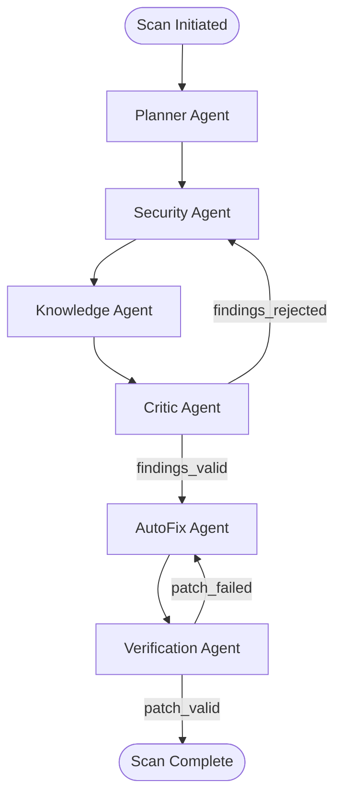
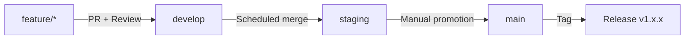
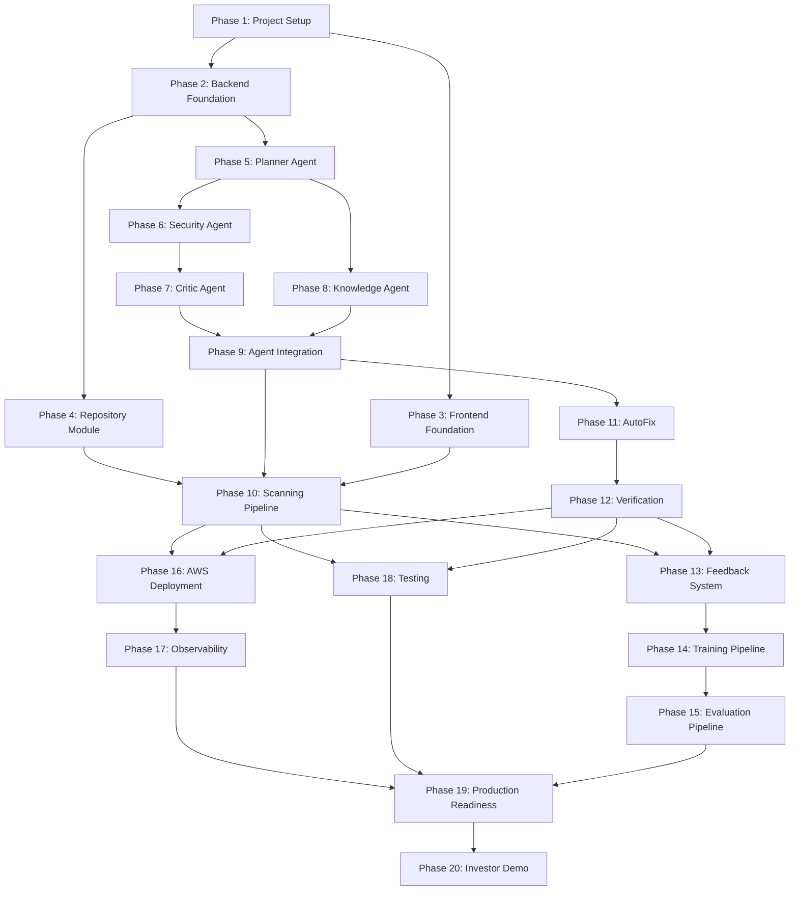

# SecureCode AI — Implementation Blueprint

> **Document Identifier:** `SCAI-IMP-001`
> **Version:** `1.0.0`
> **Status:** `ACTIVE`
> **Classification:** `INTERNAL — ENGINEERING`
> **Created:** `2026-07-29`
> **Last Revised:** `2026-07-29`
> **Author:** CTO / Principal Architect / Staff Software Engineer
> **Approved By:** Engineering Leadership
> **Canonical Path:** `docs/IMPLEMENTATION_BLUEPRINT.md`
> **Purpose:** System Architecture, Component Specification, Operations
> **Dependencies:** `SCAI-DMP-001`

The key words "MUST", "MUST NOT", "REQUIRED", "SHALL", "SHALL NOT", "SHOULD", "SHOULD NOT", "RECOMMENDED", "MAY", and "OPTIONAL" in this document are to be interpreted as described in [RFC 2119](https://www.ietf.org/rfc/rfc2119.txt).

---

## Table of Contents

1. [Executive Summary](#1-executive-summary)
2. [Implementation Philosophy](#2-implementation-philosophy)
3. [Architecture Validation](#3-architecture-validation)
4. [Folder Ownership](#4-folder-ownership)
5. [Repository Structure](#5-repository-structure)
6. [Git Strategy](#6-git-strategy)
7. [Coding Standards](#7-coding-standards)
8. [Development Standards](#8-development-standards)
9. [Code Review Standards](#9-code-review-standards)
10. [CI/CD Standards](#10-cicd-standards)
11. [Environment Setup](#11-environment-setup)
12. [Docker Setup](#12-docker-setup)
13. [Database Setup](#13-database-setup)
14. [Frontend Setup](#14-frontend-setup)
15. [Backend Setup](#15-backend-setup)
16. [AI Setup](#16-ai-setup)
17. [AWS Setup](#17-aws-setup)
18. [Monitoring Setup](#18-monitoring-setup)
19. [Logging Setup](#19-logging-setup)
20. [Security Setup](#20-security-setup)
21. [Complete End-to-End Build Order](#21-complete-end-to-end-build-order)
22. [Phase 1 — Project Setup](#phase-1--project-setup)
23. [Phase 2 — Backend Foundation](#phase-2--backend-foundation)
24. [Phase 3 — Frontend Foundation](#phase-3--frontend-foundation)
25. [Phase 4 — Repository Module](#phase-4--repository-module)
26. [Phase 5 — Planner Agent](#phase-5--planner-agent)
27. [Phase 6 — Security Agent](#phase-6--security-agent)
28. [Phase 7 — Critic Agent](#phase-7--critic-agent)
29. [Phase 8 — Knowledge Agent](#phase-8--knowledge-agent)
30. [Phase 9 — Agent Integration](#phase-9--agent-integration)
31. [Phase 10 — Scanning Pipeline](#phase-10--scanning-pipeline)
32. [Phase 11 — AutoFix](#phase-11--autofix)
33. [Phase 12 — Verification](#phase-12--verification)
34. [Phase 13 — Feedback System](#phase-13--feedback-system)
35. [Phase 14 — Training Pipeline](#phase-14--training-pipeline)
36. [Phase 15 — Evaluation Pipeline](#phase-15--evaluation-pipeline)
37. [Phase 16 — AWS Deployment](#phase-16--aws-deployment)
38. [Phase 17 — Observability](#phase-17--observability)
39. [Phase 18 — Testing](#phase-18--testing)
40. [Phase 19 — Production Readiness](#phase-19--production-readiness)
41. [Phase 20 — Investor Demo](#phase-20--investor-demo)
42. [Failure Scenarios](#42-failure-scenarios)
43. [Rollback Strategy](#43-rollback-strategy)
44. [Deployment Strategy](#44-deployment-strategy)
45. [Testing Strategy](#45-testing-strategy)
46. [Release Strategy](#46-release-strategy)
47. [Documentation Updates](#47-documentation-updates)

---

## 1. Executive Summary

This document is the master engineering implementation blueprint for SecureCode AI. It specifies the exact sequence of work, dependencies, deliverables, and acceptance criteria required to build the platform from an empty repository to a production-ready, investor-demonstrable system.

SecureCode AI is an enterprise-grade autonomous AI Security Engineer platform. Six specialised agents — Planner, Security, Critic, Knowledge, AutoFix, and Verification — collaborate through a LangGraph directed graph workflow to ingest repositories, detect OWASP Top 10 / CWE vulnerabilities, generate verified patches, and deliver Git-ready pull requests. A closed-loop learning pipeline captures engineer feedback, generates JSONL training datasets, fine-tunes models on Amazon SageMaker via PEFT/QLoRA, and promotes superior models through a champion/challenger evaluation framework.

The platform runs on a four-layer architecture: React + TypeScript + Vite frontend, Django REST Framework backend with Celery task queue, LangGraph AI Core powered by Amazon Bedrock, and AWS infrastructure (ECS Fargate, RDS PostgreSQL, ElastiCache Redis, S3, SageMaker, EventBridge, CloudWatch).

This blueprint covers 20 implementation phases. Each phase specifies its purpose, dependencies, owners, folders used, files created, classes, functions, models, database changes, API changes, frontend changes, AI changes, testing, logging, monitoring, deployment, acceptance criteria, and definition of done.

---

## 2. Implementation Philosophy

### 2.1 Build Order is Law

Every phase depends on the completion of prior phases. No phase may begin until its declared dependencies are met. Skipping phases creates technical debt that compounds exponentially.

### 2.2 Vertical Slices Over Horizontal Layers

Each phase delivers a vertically complete slice: database model → API endpoint → frontend page → test → monitoring. No phase delivers "all models" or "all API endpoints" in isolation.

### 2.3 Correctness Over Speed

A patch that introduces a new bug is worse than no patch. Every generated patch passes Bandit, Semgrep, syntax checking, and Pytest before being surfaced to the user. The Verification pipeline MUST prove correctness before any patch is proposed.

### 2.4 Security First

The platform that fixes security bugs MUST itself be the most secure system in the organisation. No shortcut in authentication, authorisation, secret management, or data handling is acceptable.

### 2.5 Closed-Loop Feedback

The system MUST improve with every interaction. Engineer feedback is the highest-value training signal. Feedback is stored, structured, and fed into the fine-tuning pipeline.

### 2.6 Observable by Default

If it is not logged, it did not happen. If it is not metriced, it cannot be improved. Every agent invocation emits structured logs via structlog. Every API call emits latency and status metrics. Every LLM call logs token usage, latency, and model version.

### 2.7 Cost Awareness

AWS and LLM API costs scale with usage. Token budgets per agent invocation, S3 lifecycle policies, and ECS auto-scaling with cost-ceiling guards are mandatory.

---

## 3. Architecture Validation

### 3.1 Four-Layer Architecture

```
┌──────────────────────────────────────┐
│        Layer 4: Frontend (React)     │  ← Communicates with Layer 3 only via REST API
├──────────────────────────────────────┤
│        Layer 3: Backend (Django)     │  ← Communicates with Layer 2 via Python imports
├──────────────────────────────────────┤
│        Layer 2: AI Core (LangGraph)  │  ← Communicates with Layer 1 via boto3 SDK
├──────────────────────────────────────┤
│    Layer 1: Infrastructure (AWS)     │  ← Managed services, no upstream dependencies
└──────────────────────────────────────┘
```

### 3.2 Communication Boundaries (Enforced)

| From | To | Allowed Mechanism | Prohibited |
|------|----|-------------------|-----------:|
| Frontend → Backend | REST API over HTTPS | Direct DB access, direct AI imports |
| Backend → AI Core | Python function calls, Celery task dispatch | Direct AWS SDK calls for AI services |
| AI Core → AWS | boto3 SDK, LangChain integrations | Direct HTTP to AWS endpoints |
| Backend → Database | Django ORM | Raw SQL (except migrations and annotated perf queries) |
| Backend → Redis | django-redis cache backend, Celery broker | Direct redis-py (except scoped caching utilities) |

### 3.3 Data Flow Patterns

1. **Synchronous**: Frontend → Backend API → AI Core → Backend API → Frontend
2. **Asynchronous**: Frontend → Backend API (returns task ID) → Celery Worker → AI Core → Celery Result → Backend (persists) → Frontend (polls/WebSocket)
3. **Batch**: EventBridge Schedule → Celery Beat → Training Pipeline → SageMaker → Model Registry → Evaluation → Promotion Decision

### 3.4 Agent Workflow Validation

The six agents execute in the following LangGraph directed graph:



---

## 4. Folder Ownership

| Owner | ID | Owned Directories |
|-------|----|-----------------:|
| **Backend Engineer** | BE-1 | `backend/accounts/`, `backend/api/`, `backend/common/`, `backend/config/`, `backend/evaluation/`, `backend/monitoring/`, `backend/patches/`, `backend/repositories/`, `backend/reviews/`, `backend/training/`, `backend/verification/` |
| **Frontend Engineer** | FE-1 | `frontend/src/components/`, `frontend/src/pages/`, `frontend/src/store/`, `frontend/src/services/`, `frontend/src/hooks/`, `frontend/src/contexts/`, `frontend/src/layouts/`, `frontend/src/routes/`, `frontend/src/types/`, `frontend/src/utils/`, `frontend/src/styles/`, `frontend/src/animations/`, `frontend/src/constants/`, `frontend/src/assets/` |
| **AI Engineer 1** | AI-1 | `ai/planner/`, `ai/security/`, `ai/critic/`, `ai/knowledge/`, `ai/prompts/`, `ai/memory/`, `ai/agents/` |
| **AI Engineer 2** | AI-2 | `ai/patches/`, `ai/verification/`, `ai/training/`, `ai/evaluation/`, `ai/utils/` |
| **Shared** | ALL | `docker/`, `nginx/`, `scripts/`, `docs/`, `.github/workflows/` |

---

## 5. Repository Structure

```
SecureCode-AI/
├── ai/                    # AI Core — agents, training, evaluation
│   ├── __init__.py
│   ├── agents/            # Base agent classes and orchestrator
│   ├── planner/           # Planner Agent module
│   ├── security/          # Security Agent module
│   ├── critic/            # Critic Agent module
│   ├── knowledge/         # Knowledge Agent module
│   ├── patches/           # AutoFix Agent (patch generation)
│   ├── verification/      # Verification Agent module
│   ├── training/          # Fine-tuning pipeline
│   ├── evaluation/        # Model evaluation pipeline
│   ├── prompts/           # Prompt template library
│   ├── memory/            # Agent memory (short-term + long-term)
│   └── utils/             # Shared AI utilities
├── backend/               # Django REST Framework application
│   ├── accounts/          # User management, authentication
│   ├── api/               # API routing and viewsets
│   ├── common/            # Shared utilities, base models
│   ├── config/            # Django settings, WSGI, ASGI
│   ├── evaluation/        # Model evaluation backend
│   ├── monitoring/        # Observability endpoints
│   ├── patches/           # Patch management models/views
│   ├── repositories/      # Repository ingestion models/views
│   ├── reviews/           # Review and feedback models/views
│   ├── training/          # Training job management
│   └── verification/      # Verification result storage
├── frontend/              # React + TypeScript + Vite SPA
│   └── src/
│       ├── components/    # Reusable UI components
│       ├── pages/         # Route-level page components
│       ├── store/         # Redux Toolkit state management
│       ├── services/      # API client services
│       ├── hooks/         # Custom React hooks
│       ├── contexts/      # React context providers
│       ├── layouts/       # Page layout wrappers
│       ├── routes/        # React Router configuration
│       ├── types/         # TypeScript type definitions
│       ├── utils/         # Utility functions
│       ├── styles/        # Global CSS and Tailwind config
│       ├── animations/    # Animation definitions
│       ├── constants/     # Application constants
│       └── assets/        # Static assets
├── docker/                # Container configuration
│   ├── docker-compose.yml
│   ├── backend.Dockerfile
│   ├── frontend.Dockerfile
│   └── nginx.Dockerfile
├── nginx/                 # Reverse proxy configuration
│   └── default.conf
├── scripts/               # Development and deployment scripts
│   ├── setup.sh
│   ├── run.sh
│   ├── deploy.sh
│   └── seed_db.py
├── docs/                  # Documentation suite
├── .github/               # CI/CD workflows
│   └── workflows/
│       ├── ci.yml
│       └── cd.yml
├── .env.example
├── .pre-commit-config.yaml
├── requirements.txt
└── package.json
```

---

## 6. Git Strategy

### 6.1 Branch Model (Modified Git Flow)



### 6.2 Protected Branches

| Branch | Protection Rules |
|--------|-----------------:|
| `main` | Requires 1 approval, requires CI pass, no force push, no deletion |
| `staging` | Requires CI pass, no force push |
| `develop` | No restrictions (integration branch) |

### 6.3 Branch Naming

Pattern: `{type}/{ticket-id}/{short-description}`

| Type | Usage | Example |
|------|-------|---------:|
| `feature` | New functionality | `feature/SCAI-42/planner-agent-workflow` |
| `fix` | Bug fixes | `fix/SCAI-57/scan-timeout-handling` |
| `docs` | Documentation changes | `docs/SCAI-99/api-specification` |
| `refactor` | Code restructuring | `refactor/SCAI-63/agent-base-class` |
| `infra` | Infrastructure / CI/CD | `infra/SCAI-71/ecs-task-definition` |
| `test` | Test additions | `test/SCAI-80/security-agent-unit-tests` |

### 6.4 Commit Message Format (Conventional Commits)

```
{type}({scope}): {description}

{optional body}

{optional footer}
```

Types: `feat`, `fix`, `docs`, `style`, `refactor`, `test`, `chore`, `perf`, `security`.

Scopes: `backend`, `frontend`, `ai`, `infra`, `docs`, `agents`, `training`, `evaluation`.

### 6.5 Pull Request Template

Every PR MUST include: Summary, Motivation, Changes (bulleted file list), Testing, Documentation, Pre-merge Checklist (tests pass, lint pass, docs updated).

---

## 7. Coding Standards

### 7.1 Python (Backend + AI)

| Standard | Rule |
|----------|-----:|
| Formatter | Black (line length 88) |
| Linter | Flake8 + Bandit |
| Type Hints | Required on all public functions |
| Docstrings | Google style, required on all public classes/functions |
| Naming | `lower_snake_case` for modules, functions, variables. `PascalCase` for classes |
| Imports | stdlib → third-party → local, separated by blank lines |
| Max function length | 50 lines |
| Max file length | 500 lines |
| Data validation | Pydantic `>=2.4.0` for all inter-agent state |
| Django models | Type annotations on all fields via `django-stubs` |

### 7.2 TypeScript (Frontend)

| Standard | Rule |
|----------|-----:|
| Formatter | Prettier |
| Linter | ESLint with React/TypeScript config |
| Naming | `PascalCase` for components/types. `camelCase` for functions/variables |
| Components | Functional components with hooks exclusively |
| State | Redux Toolkit for global state. Local `useState` for component state |
| API Calls | Centralised via `frontend/src/services/apiClient.ts` using axios |
| Props | Typed interfaces, not inline types |

### 7.3 Database

| Entity | Convention | Example |
|--------|-----------|---------:|
| Tables | `lower_snake_case`, plural | `scan_results` |
| Columns | `lower_snake_case` | `created_at` |
| Primary keys | `id` (UUID) | `id` |
| Foreign keys | `{referenced_table_singular}_id` | `repository_id` |
| Indexes | `idx_{table}_{column}` | `idx_scan_results_repository_id` |
| Enums | `UPPER_SNAKE_CASE` values | `CRITICAL`, `HIGH`, `MEDIUM`, `LOW` |

### 7.4 API

| Entity | Convention | Example |
|--------|-----------|---------:|
| URL paths | `lower-kebab-case`, plural nouns | `/api/v1/scan-results/` |
| Query params | `lower_snake_case` | `?severity=high&page_size=20` |
| Request/Response body | `lower_snake_case` JSON | `{ "repository_id": "uuid" }` |
| Custom headers | `X-SecureCode-{Name}` | `X-SecureCode-Request-Id` |

---

## 8. Development Standards

### 8.1 Local Development Requirements

| Tool | Minimum Version |
|------|----------------:|
| Python | 3.11+ |
| Node.js | 18+ |
| Docker Desktop | Latest |
| Docker Compose | 3.8+ |
| PostgreSQL (via Docker) | 15+ |
| Redis (via Docker) | 7+ |
| Git | 2.40+ |
| AWS CLI | 2.x |

### 8.2 Environment Configuration

All secrets in `.env` for local development. Production secrets from AWS Secrets Manager at runtime. `.env.example` committed with placeholder values. `.env` is in `.gitignore`.

Required environment variables:

| Variable | Purpose | Example |
|----------|---------|--------:|
| `ENVIRONMENT` | Runtime environment | `development` |
| `DEBUG` | Django debug mode | `True` |
| `SECRET_KEY` | Django secret key | `change-me-in-production-...` |
| `POSTGRES_DB` | Database name | `securecodeai_db` |
| `POSTGRES_USER` | Database user | `securecodeai_admin` |
| `POSTGRES_PASSWORD` | Database password | `securecodeai_password` |
| `POSTGRES_HOST` | Database host | `postgres` |
| `POSTGRES_PORT` | Database port | `5432` |
| `REDIS_URL` | Redis connection | `redis://redis:6379/0` |
| `CELERY_BROKER_URL` | Celery broker | `redis://redis:6379/1` |
| `AWS_REGION` | AWS region | `us-east-1` |
| `AWS_BEDROCK_MODEL_ID` | Bedrock model | `anthropic.claude-3-5-sonnet-20240620-v1:0` |
| `VITE_API_BASE_URL` | Frontend API base | `http://localhost:8000/api/v1` |

---

## 9. Code Review Standards

### 9.1 Review Requirements

- Every PR requires at least 1 approval before merge.
- Backend PRs: Reviewed by CTO or peer engineer.
- Frontend PRs: Reviewed by CTO or Backend Engineer (API contract).
- AI PRs: Reviewed by peer AI engineer + CTO.
- Infrastructure PRs: Reviewed by CTO + Backend Engineer.

### 9.2 Review Checklist

- [ ] Code follows naming conventions from Section 7.
- [ ] All public functions have type hints and docstrings.
- [ ] No secrets hardcoded.
- [ ] Tests added or updated for every changed function.
- [ ] No `TODO` or `FIXME` comments without linked GitHub issues.
- [ ] Imports cleaned (no unused imports).
- [ ] Pre-commit hooks pass (Black, Flake8, Prettier).
- [ ] Database migrations included if models changed.
- [ ] API documentation updated if endpoints changed.

---

## 10. CI/CD Standards

### 10.1 CI Pipeline (`.github/workflows/ci.yml`)

Triggers: Push to `main` and `develop`. Pull requests to `main`.

| Stage | Actions | Failure Blocks Merge |
|-------|---------|---------------------:|
| **Lint** | Black check, Flake8, ESLint, Prettier | Yes |
| **Security Scan** | Bandit (`backend/` + `ai/`), Semgrep (full repo) | Yes |
| **Backend Tests** | `pytest backend/ --cov --cov-fail-under=80` | Yes |
| **AI Tests** | `pytest ai/ --cov --cov-fail-under=85` | Yes |
| **Frontend Build** | `cd frontend && npm install && npm run build` | Yes |
| **Frontend Tests** | `cd frontend && npm test` | Yes |

### 10.2 CD Pipeline (`.github/workflows/cd.yml`)

Triggers: Push of version tags (`v*`).

| Stage | Actions |
|-------|--------:|
| **Build Docker Images** | Build `backend.Dockerfile`, `frontend.Dockerfile`, `nginx.Dockerfile` |
| **Push to ECR** | Push images to Amazon ECR |
| **Deploy to ECS** | Update ECS task definitions, deploy new service revision |
| **Run Migrations** | Execute Django migrations on RDS |
| **Health Check** | Verify `/api/v1/health/` returns 200 |
| **Notify** | Post to team Slack channel |

---

## 11. Environment Setup

### 11.1 Bootstrap Sequence

```bash
# 1. Clone repository
$ git clone <repo-url> SecureCode-AI && cd SecureCode-AI

# 2. Run setup script
$ bash scripts/setup.sh

# 3. Start infrastructure services
$ docker-compose -f docker/docker-compose.yml up -d postgres redis

# 4. Apply migrations
$ source venv/bin/activate
$ python backend/manage.py migrate

# 5. Seed development data
$ python scripts/seed_db.py

# 6. Start backend
$ python backend/manage.py runserver 0.0.0.0:8000

# 7. Start Celery worker (separate terminal)
$ celery -A backend.config worker -l info

# 8. Start frontend (separate terminal)
$ cd frontend && npm run dev
```

### 11.2 Docker Full-Stack (Alternative)

```bash
$ cp .env.example .env
$ docker-compose -f docker/docker-compose.yml up --build
```

Services available:
- Frontend: `http://localhost:3000`
- Backend API: `http://localhost:8000/api/v1/`
- PostgreSQL: `localhost:5432`
- Redis: `localhost:6379`

---

## 12. Docker Setup

### 12.1 Service Architecture

| Service | Dockerfile | Port | Purpose |
|---------|-----------|-----:|--------:|
| `postgres` | `postgres:15-alpine` (image) | 5432 | Primary database |
| `redis` | `redis:7-alpine` (image) | 6379 | Cache + Celery broker |
| `backend` | `docker/backend.Dockerfile` | 8000 | Django REST API |
| `celery_worker` | `docker/backend.Dockerfile` | N/A | Async task processing |
| `frontend` | `docker/frontend.Dockerfile` | 3000 (mapped to 80) | React SPA |
| `nginx` | `docker/nginx.Dockerfile` | 80, 443 | Reverse proxy |

### 12.2 Build Contexts

- Backend Dockerfile: Context is repo root (`..`). Copies `requirements.txt`, `backend/`, `ai/`.
- Frontend Dockerfile: Multi-stage build. Node 18 for build, Nginx Alpine for serving.
- Nginx Dockerfile: Copies `nginx/default.conf` into container.

### 12.3 Volume Mounts (Development)

| Volume | Mount | Purpose |
|--------|------:|--------:|
| `postgres_data` | `/var/lib/postgresql/data` | Persist database across restarts |
| `../backend` | `/app/backend` | Hot-reload backend code |
| `../ai` | `/app/ai` | Hot-reload AI code |

---

## 13. Database Setup

### 13.1 PostgreSQL Configuration

| Parameter | Value |
|-----------|------:|
| Engine | PostgreSQL 15+ |
| Local | Docker container `postgres:15-alpine` |
| Production | Amazon RDS `scai-prod-rds-primary` |
| Encryption | AES-256 via RDS encryption |
| Connection Pool | PgBouncer, 50 connections per backend instance |

### 13.2 Table Inventory

| Table | Django App | Purpose |
|-------|-----------|--------:|
| `users` | `accounts` | User accounts with RBAC roles |
| `organisations` | `accounts` | Multi-tenant organisation grouping |
| `repositories` | `repositories` | Connected Git repositories |
| `scans` | `repositories` | Scan job records |
| `scan_results` | `repositories` | Individual vulnerability findings |
| `patches` | `patches` | Generated code patches |
| `verifications` | `verification` | Verification pipeline results |
| `pull_requests` | `patches` | Created PR records |
| `feedback` | `reviews` | Engineer feedback on patches |
| `training_datasets` | `training` | JSONL dataset metadata |
| `training_jobs` | `training` | SageMaker training job records |
| `model_versions` | `evaluation` | Model registry entries |
| `evaluation_runs` | `evaluation` | Evaluation pipeline runs |
| `evaluation_results` | `evaluation` | Per-test-case evaluation scores |
| `audit_log` | `common` | Security audit trail |

### 13.3 Migration Strategy

- Django migrations managed per app.
- Migrations run before deployment via CI/CD pipeline.
- Backward-compatible migrations only (no column drops in same release as code change).
- Destructive migrations require a two-phase rollout: Phase 1 stops using the column, Phase 2 drops it.

---

## 14. Frontend Setup

### 14.1 Technology Stack

| Technology | Version | Purpose |
|-----------|--------:|--------:|
| React | 18+ | UI framework |
| TypeScript | 5+ | Type safety |
| Vite | Latest | Build tool, HMR |
| Tailwind CSS | 3+ | Utility-first CSS |
| ShadCN UI | Latest | Component library |
| Redux Toolkit | Latest | Global state management |
| React Router | 6+ | Client-side routing |
| Axios | Latest | HTTP client |
| Vitest | Latest | Unit testing |
| Playwright | Latest | E2E testing |

### 14.2 Key Pages

| Route | Page Component | Purpose |
|-------|---------------|--------:|
| `/` | `DashboardPage` | Overview metrics, recent scans |
| `/login` | `LoginPage` | JWT authentication |
| `/register` | `RegisterPage` | User registration |
| `/repositories` | `RepositoriesPage` | List/connect repositories |
| `/repositories/:id` | `RepositoryDetailPage` | Repo details, scan history |
| `/scans/:id` | `ScanDetailPage` | Findings, patches, verification |
| `/scans/:id/findings` | `FindingsPage` | Vulnerability list with filters |
| `/scans/:id/patches` | `PatchesPage` | Generated patches, diffs |
| `/training` | `TrainingPage` | Training jobs, datasets |
| `/evaluation` | `EvaluationPage` | Model leaderboard, comparisons |
| `/settings` | `SettingsPage` | User/org configuration |

### 14.3 Redux Store Shape

```typescript
interface RootState {
  auth: AuthState;           // JWT tokens, user profile
  repositories: RepoState;   // repository list, selected repo
  scans: ScanState;          // scan list, active scan, findings
  patches: PatchState;       // patches, verifications, PRs
  training: TrainingState;   // datasets, training jobs
  evaluation: EvalState;     // model versions, leaderboard
  ui: UIState;               // loading states, notifications
}
```

---

## 15. Backend Setup

### 15.1 Django Project Configuration

| Setting | Value |
|---------|------:|
| Project name | `config` (in `backend/config/`) |
| WSGI module | `backend.config.wsgi:application` |
| ASGI module | `backend.config.asgi:application` |
| Production server | Gunicorn, 4 workers, bind `0.0.0.0:8000` |
| Auth backend | JWT via `djangorestframework-simplejwt` |
| API schema | drf-spectacular for OpenAPI 3.0 generation |

### 15.2 Django App Catalog

| App | Responsibility | Models |
|-----|---------------|-------:|
| `accounts` | User registration, login, JWT, RBAC | `User`, `Organisation` |
| `api` | URL routing, root viewsets | N/A (routes only) |
| `common` | Base model class, shared utilities, audit log | `BaseModel`, `AuditLog` |
| `config` | Django settings, WSGI, ASGI, Celery config | N/A |
| `repositories` | Repo CRUD, scan initiation, findings | `Repository`, `Scan`, `ScanResult` |
| `patches` | Patch storage, PR creation | `Patch`, `PullRequest` |
| `reviews` | Engineer feedback collection | `Feedback` |
| `verification` | Verification result storage | `Verification` |
| `training` | Training dataset and job management | `TrainingDataset`, `TrainingJob` |
| `evaluation` | Model registry, evaluation results | `ModelVersion`, `EvaluationRun`, `EvaluationResult` |
| `monitoring` | Health check, metrics endpoints | N/A (views only) |

### 15.3 Celery Architecture

| Queue | Tasks | Priority |
|-------|------:|--------:|
| `default` | General tasks | Normal |
| `scans` | `run_scan`, `process_scan_batch` | High |
| `ai` | `invoke_planner`, `invoke_security`, `invoke_critic`, `invoke_autofix`, `invoke_verification` | High |
| `training` | `generate_dataset`, `launch_training_job`, `run_evaluation` | Low |
| `notifications` | `send_scan_complete_notification`, `send_pr_created_notification` | Low |

### 15.4 API Endpoint Inventory

| Group | Base Path | Key Endpoints |
|-------|----------|-------------:|
| Auth | `/api/v1/auth/` | `POST login/`, `POST register/`, `POST refresh/`, `POST logout/` |
| Repos | `/api/v1/repositories/` | `GET`, `POST`, `GET :id`, `PUT :id`, `DELETE :id` |
| Scans | `/api/v1/scans/` | `GET`, `POST`, `GET :id`, `GET :id/status/` |
| Findings | `/api/v1/findings/` | `GET` (filtered by scan), `GET :id` |
| Patches | `/api/v1/patches/` | `GET` (filtered by scan), `GET :id`, `POST :id/approve/` |
| Verifications | `/api/v1/verifications/` | `GET` (filtered by patch), `GET :id` |
| PRs | `/api/v1/pull-requests/` | `GET`, `POST`, `GET :id` |
| Feedback | `/api/v1/feedback/` | `GET`, `POST`, `GET :id` |
| Training | `/api/v1/training/` | `GET datasets/`, `POST datasets/generate/`, `GET jobs/`, `POST jobs/launch/` |
| Evaluations | `/api/v1/evaluations/` | `GET runs/`, `POST runs/`, `GET leaderboard/` |
| Dashboard | `/api/v1/dashboard/` | `GET summary/`, `GET metrics/` |
| Users | `/api/v1/users/` | `GET me/`, `PUT me/`, `GET` (admin only) |
| Health | `/api/v1/health/` | `GET` (public, no auth) |

---

## 16. AI Setup

### 16.1 Agent Catalog

| Agent | LangGraph Node | Class | Module | Model | Max Input Tokens | Max Output Tokens |
|-------|---------------|-------|--------|------:|----------------:|-----------------:|
| Planner | `plan_scan` | `PlannerAgent` | `ai/planner/` | Claude 3 Haiku | 8,000 | 4,000 |
| Security | `analyse_security` | `SecurityAgent` | `ai/security/` | Claude 3.5 Sonnet | 100,000 | 8,000 |
| Critic | `validate_findings` | `CriticAgent` | `ai/critic/` | Claude 3.5 Sonnet | 16,000 | 4,000 |
| Knowledge | `retrieve_knowledge` | `KnowledgeAgent` | `ai/knowledge/` | Claude 3 Haiku | 32,000 | 4,000 |
| AutoFix | `generate_patch` | `AutoFixAgent` | `ai/patches/` | Claude 3.5 Sonnet | 100,000 | 16,000 |
| Verification | `verify_patch` | `VerificationAgent` | `ai/verification/` | N/A (tool-based) | 16,000 | 4,000 |

### 16.2 State Management

Every agent reads from and writes to a Pydantic-validated state object. Raw dictionaries are prohibited as inter-agent communication.

```python
# ai/agents/state.py
class WorkflowState(BaseModel):
    repository_id: UUID
    repository_url: str
    branch: str
    file_tree: list[str]
    scan_plan: ScanPlan | None
    findings: list[Finding]
    knowledge_context: list[KnowledgeEntry]
    patches: list[Patch]
    verifications: list[VerificationResult]
    errors: list[AgentError]
    metadata: WorkflowMetadata
```

### 16.3 Prompt Template Structure

Every prompt follows the XML-section format defined in the Documentation Master Plan Section 25:

```python
TEMPLATE_NAME: str = """
<system>{system_instruction}</system>
<context>{context_data}</context>
<task>{task_description}</task>
<constraints>{constraints}</constraints>
<output_format>{output_schema}</output_format>
<examples>{few_shot_examples}</examples>
"""
```

### 16.4 Model Configuration

| Use Case | Model | Provider |
|----------|------:|--------:|
| Security analysis (high-stakes) | Claude 3.5 Sonnet | Amazon Bedrock |
| Patch generation (code writing) | Claude 3.5 Sonnet | Amazon Bedrock |
| Explanation generation | Claude 3 Haiku | Amazon Bedrock |
| Fine-tuned model (post-training) | Custom (Mistral 7B / CodeLlama) | Amazon SageMaker |

---

## 17. AWS Setup

### 17.1 Resource Naming Convention

All AWS resources: `scai-{environment}-{service}-{purpose}`

| Resource | Name |
|----------|-----:|
| ECS Cluster | `scai-prod-ecs-cluster` |
| ECS Backend Service | `scai-prod-ecs-backend` |
| ECS Celery Service | `scai-prod-ecs-celery` |
| RDS Instance | `scai-prod-rds-primary` |
| ElastiCache | `scai-prod-redis` |
| S3 Training Data | `scai-prod-s3-training-data` |
| S3 Model Artifacts | `scai-prod-s3-model-artifacts` |
| S3 Repo Storage | `scai-prod-s3-repositories` |
| Secrets Manager | `scai-prod-secretsmanager-django` |
| EventBridge Rule | `scai-prod-eventbridge-training-trigger` |
| SageMaker Endpoint | `scai-prod-sagemaker-finetune` |
| CloudWatch Log Group | `scai-prod-logs-backend` |

### 17.2 Region Strategy

Primary: `us-east-1` (broadest Bedrock model availability).
DR: `us-west-2` (S3 cross-region replication for training data and model artifacts).

### 17.3 Required Tags (Every Resource)

| Tag Key | Example |
|---------|--------:|
| `Project` | `SecureCodeAI` |
| `Environment` | `prod` / `staging` / `dev` |
| `Owner` | `backend-team` / `ai-team` |
| `CostCenter` | `engineering` |
| `ManagedBy` | `terraform` / `manual` |
| `DataClassification` | `confidential` / `internal` |

---

## 18. Monitoring Setup

### 18.1 Health Check Endpoints

| Endpoint | Checks | Expected Response |
|----------|-------:|-----------------:|
| `GET /api/v1/health/` | Database, Redis, Celery worker | `200 {"status": "healthy", ...}` |
| `GET /api/v1/health/db/` | PostgreSQL connection | `200 {"database": "connected"}` |
| `GET /api/v1/health/redis/` | Redis connection | `200 {"redis": "connected"}` |

### 18.2 Key Metrics

| Category | Metric | Target |
|----------|-------:|-------:|
| API | P50 latency (GET) | < 100ms |
| API | P99 latency (GET) | < 500ms |
| API | P50 latency (POST) | < 200ms |
| Scans | P50 completion time | < 5 min |
| AI | Planner P50 latency | < 5s |
| AI | Security Agent P50 | < 30s |
| AI | AutoFix P50 | < 30s |
| AI | Verification P50 | < 60s |
| AI | Token usage per scan | Tracked |
| System | Concurrent scans | 10 per cluster |
| System | API req/s | 100 per instance |

### 18.3 Alerting Rules

| Alert | Condition | Severity |
|-------|----------|--------:|
| API Error Rate | > 5% 5xx in 5 min | Critical |
| Scan Timeout | Scan > 15 min | Warning |
| Database Connection Pool | > 80% utilised | Warning |
| Celery Queue Depth | > 100 pending tasks | Warning |
| LLM Error Rate | > 10% failures in 10 min | Critical |
| Disk Usage | > 85% | Warning |

---

## 19. Logging Setup

### 19.1 Structured Logging

All Python services use `structlog>=23.1.0` with JSON output in production.

```python
import structlog

logger = structlog.get_logger()

logger.info(
    "scan_initiated",
    repository_id=str(repo_id),
    branch="main",
    scan_type="full",
    user_id=str(user.id),
)
```

### 19.2 Log Levels

| Level | Usage |
|-------|------:|
| `DEBUG` | Detailed diagnostic info (local dev only) |
| `INFO` | Normal operations: scan started, agent invoked, patch generated |
| `WARNING` | Recoverable anomalies: rate limit approached, retry triggered |
| `ERROR` | Operation failed but system continues: agent timeout, parse error |
| `CRITICAL` | System-level failure: database unreachable, Bedrock unavailable |

### 19.3 Required Log Fields

Every log entry MUST include: `timestamp`, `level`, `event`, `request_id`, `service` (backend/celery/ai), `environment`.

Agent log entries additionally include: `agent_name`, `model_id`, `input_tokens`, `output_tokens`, `latency_ms`.

### 19.4 Log Destinations

| Environment | Destination |
|------------|------------|
| Local development | stdout (JSON) |
| Staging | CloudWatch Log Group `scai-staging-logs-*` |
| Production | CloudWatch Log Group `scai-prod-logs-*`, 90-day retention |

---

## 20. Security Setup

### 20.1 Authentication

- JWT bearer tokens on all endpoints except `/api/v1/auth/login/`, `/api/v1/auth/register/`, and `/api/v1/health/`.
- RS256 signing with rotating keys in AWS Secrets Manager.
- Access tokens: 15-minute expiry.
- Refresh tokens: 7-day expiry, rotation enforced.

### 20.2 Authorisation (RBAC)

| Role | Permissions |
|------|------------|
| `admin` | Full access. User management. Organisation settings |
| `engineer` | CRUD repositories, trigger scans, view findings, submit feedback |
| `viewer` | Read-only access to scan results and dashboards |

Every DRF viewset MUST define `permission_classes` explicitly.

### 20.3 Secret Management

- No secrets on disk in production. All from AWS Secrets Manager at runtime.
- `.env` for local development only, listed in `.gitignore`.
- `.env.example` committed with placeholder values.

### 20.4 Data Protection

- At rest: AES-256 (SSE-S3 for S3, RDS encryption for PostgreSQL).
- In transit: TLS 1.3 for all connections.
- Source code uploads: S3 with 90-day retention, auto-delete.
- PII fields tagged `[PII]` in schema documentation.

### 20.5 Pre-Commit Security Hooks

Enforced via `.pre-commit-config.yaml`: trailing whitespace, YAML/JSON validation, Black, Flake8, Prettier. Bandit and Semgrep run in CI.

---

## 21. Complete End-to-End Build Order

The following diagram shows the phase dependency chain. An arrow from Phase A to Phase B means A MUST be complete before B begins.



---

## Phase 1 — Project Setup

| Attribute | Value |
|-----------|------:|
| **Phase Number** | 1 |
| **Purpose** | Establish the monorepo skeleton, tooling, CI/CD, Docker infrastructure, and development environment |
| **Business Goal** | Enable all four engineers to begin development in parallel from a consistent, reproducible environment |
| **Technical Goal** | Working Docker Compose stack with PostgreSQL, Redis, Django shell, React dev server, and passing CI pipeline |
| **Dependencies** | None (first phase) |
| **Owners** | CTO (primary), BE-1 (backend scaffold), FE-1 (frontend scaffold) |
| **Contributors** | AI-1, AI-2 |

### Folders Used

`backend/config/`, `backend/common/`, `frontend/src/`, `docker/`, `nginx/`, `scripts/`, `.github/workflows/`, root config files.

### Files Created

| File | Purpose |
|------|--------:|
| `backend/config/settings.py` | Django settings with env-var driven configuration |
| `backend/config/urls.py` | Root URL configuration |
| `backend/config/wsgi.py` | WSGI entry point |
| `backend/config/asgi.py` | ASGI entry point |
| `backend/config/celery.py` | Celery application instance |
| `backend/config/__init__.py` | Celery app import |
| `backend/common/models.py` | `BaseModel` with `id` (UUID), `created_at`, `updated_at` |
| `backend/common/__init__.py` | Package init |
| `backend/manage.py` | Django management command entry |
| `frontend/src/App.tsx` | Root React component |
| `frontend/src/main.tsx` | Vite entry point |
| `frontend/vite.config.ts` | Vite configuration |
| `frontend/tsconfig.json` | TypeScript configuration |
| `frontend/tailwind.config.js` | Tailwind CSS configuration |
| `frontend/postcss.config.js` | PostCSS configuration |
| `frontend/package.json` | Frontend dependencies |
| `docker/docker-compose.yml` | Full service stack definition |
| `docker/backend.Dockerfile` | Python 3.11 + Django image |
| `docker/frontend.Dockerfile` | Node 18 + Nginx multi-stage |
| `docker/nginx.Dockerfile` | Nginx reverse proxy |
| `nginx/default.conf` | Proxy routing config |
| `scripts/setup.sh` | Environment bootstrap |
| `scripts/run.sh` | Local dev startup |
| `scripts/seed_db.py` | Development data seeder |
| `.github/workflows/ci.yml` | CI pipeline |
| `.github/workflows/cd.yml` | CD pipeline |
| `.pre-commit-config.yaml` | Pre-commit hooks |
| `.env.example` | Environment template |
| `.gitignore` | Git exclusions |
| `requirements.txt` | Python dependencies |
| `package.json` | Root workspace config |
| `README.md` | Project overview |

### Classes

| Class | Module | Purpose |
|-------|--------|--------:|
| `BaseModel` | `backend/common/models.py` | Abstract base with UUID pk, timestamps |

### Functions

| Function | Module | Purpose |
|----------|--------|--------:|
| `health_check` | `backend/monitoring/views.py` | Returns system health status |

### Models

`BaseModel` (abstract): `id` (UUID, pk), `created_at` (DateTime, auto), `updated_at` (DateTime, auto).

### Database Changes

- Initial Django migration for `common` app.
- PostgreSQL 15 container provisioned.

### API Changes

| Endpoint | Method | Auth | Purpose |
|----------|--------|-----:|--------:|
| `/api/v1/health/` | GET | No | System health check |

### Frontend Changes

- Vite + React 18 + TypeScript scaffold.
- Tailwind CSS configured.
- ShadCN UI installed.
- Router skeleton with `/` route.

### AI Changes

- `ai/__init__.py` created.
- Empty package directories for all 12 AI modules.

### Testing

- `pytest` runs and reports 0 errors.
- `npm run build` completes without errors.
- Docker Compose `up` starts all 5 services.

### Logging

- structlog configured in Django settings.
- JSON output format set as default.

### Monitoring

- `/api/v1/health/` endpoint returns `200`.

### Deployment

- Docker Compose runs locally.
- CI pipeline passes on `develop` push.

### Acceptance Criteria

- [ ] `docker-compose up --build` starts all services without errors.
- [ ] `curl localhost:8000/api/v1/health/` returns `200`.
- [ ] `curl localhost:3000` returns the React app shell.
- [ ] `pytest backend/` runs with 0 errors.
- [ ] CI pipeline passes on GitHub Actions.
- [ ] Pre-commit hooks execute Black, Flake8, Prettier.
- [ ] `.env.example` contains all required variables.

### Definition of Done

Phase 1 is done when all four engineers can independently clone the repo, run `scripts/setup.sh`, run `docker-compose up`, and access the frontend at `localhost:3000` and the health endpoint at `localhost:8000/api/v1/health/`.

---

## Phase 2 — Backend Foundation

| Attribute | Value |
|-----------|------:|
| **Phase Number** | 2 |
| **Purpose** | Build the Django application skeleton with authentication, user management, and the base API infrastructure |
| **Business Goal** | Secure multi-tenant foundation for all backend features |
| **Technical Goal** | JWT authentication, RBAC, serializers, viewsets, pagination, error handling, Celery integration |
| **Dependencies** | Phase 1 |
| **Owners** | BE-1 (primary) |
| **Contributors** | CTO (review) |

### Folders Used

`backend/accounts/`, `backend/api/`, `backend/config/`, `backend/common/`

### Files Created

| File | Purpose |
|------|--------:|
| `backend/accounts/models.py` | `User`, `Organisation` models |
| `backend/accounts/serializers.py` | Registration, login, user serializers |
| `backend/accounts/views.py` | Auth viewsets (register, login, refresh, logout) |
| `backend/accounts/urls.py` | Auth URL routing |
| `backend/accounts/permissions.py` | RBAC permission classes (`IsAdmin`, `IsEngineer`, `IsViewer`) |
| `backend/accounts/tests/` | Auth test suite |
| `backend/api/urls.py` | Root API URL configuration with versioning |
| `backend/api/pagination.py` | Standard pagination class |
| `backend/api/exceptions.py` | Standardised error envelope handler |
| `backend/common/middleware.py` | Request ID injection, structured logging middleware |
| `backend/common/audit.py` | `AuditLog` model and writer |

### Classes

| Class | Module | Purpose |
|-------|--------|--------:|
| `User` | `accounts/models.py` | Custom user with `role`, `organisation_id` |
| `Organisation` | `accounts/models.py` | Multi-tenant grouping |
| `AuditLog` | `common/audit.py` | Immutable audit trail |
| `StandardPagination` | `api/pagination.py` | `page_size=20`, max 100 |
| `IsAdmin` | `accounts/permissions.py` | Admin-only permission |
| `IsEngineer` | `accounts/permissions.py` | Engineer+ permission |
| `IsViewer` | `accounts/permissions.py` | Viewer+ permission |

### Functions

| Function | Module | Purpose |
|----------|--------|--------:|
| `custom_exception_handler` | `api/exceptions.py` | Standardised error response `{error_code, message, details, request_id}` |

### Models

- `User`: `id` (UUID), `email` (unique), `password` (hashed), `role` (enum: admin/engineer/viewer), `organisation_id` (FK), `is_active`, `created_at`, `updated_at`.
- `Organisation`: `id` (UUID), `name`, `slug` (unique), `created_at`, `updated_at`.
- `AuditLog`: `id` (UUID), `user_id` (FK), `action`, `resource_type`, `resource_id`, `details` (JSON), `ip_address`, `created_at`.

### Database Changes

- Migrations for `accounts` app: `users`, `organisations` tables.
- Migration for `common` app: `audit_log` table.
- Index: `idx_users_email`, `idx_users_organisation_id`, `idx_audit_log_user_id`.

### API Changes

| Endpoint | Method | Auth | Purpose |
|----------|--------|-----:|--------:|
| `/api/v1/auth/register/` | POST | No | User registration |
| `/api/v1/auth/login/` | POST | No | Returns JWT access + refresh tokens |
| `/api/v1/auth/refresh/` | POST | No | Refresh access token |
| `/api/v1/auth/logout/` | POST | Yes | Blacklist refresh token |
| `/api/v1/users/me/` | GET | Yes | Current user profile |
| `/api/v1/users/me/` | PUT | Yes | Update profile |

### Frontend Changes

None in this phase.

### AI Changes

None in this phase.

### Testing

- Unit tests for User model, serializers, auth views.
- Test: register → login → access protected endpoint → refresh → logout.
- Coverage target: 80%+ for `accounts/`.

### Logging

- Middleware injects `request_id` into every request.
- Auth events logged: `user_registered`, `user_logged_in`, `user_logged_out`, `token_refreshed`.

### Monitoring

- Health check extended: database connectivity verified.

### Deployment

- Migrations applied via `python backend/manage.py migrate`.

### Acceptance Criteria

- [ ] User can register, login, receive JWT, access protected endpoint, refresh token, and logout.
- [ ] RBAC enforced: viewer cannot access admin endpoints.
- [ ] Error responses follow standardised envelope format.
- [ ] Pagination works on list endpoints.
- [ ] Audit log records all auth events.
- [ ] 80%+ test coverage on `accounts/`.

### Definition of Done

Phase 2 is done when the authentication flow is end-to-end functional, RBAC is enforced, and all auth tests pass in CI.

---

## Phase 3 — Frontend Foundation

| Attribute | Value |
|-----------|------:|
| **Phase Number** | 3 |
| **Purpose** | Build the React application shell with routing, auth integration, layout system, and API client |
| **Business Goal** | User-facing interface for login, navigation, and dashboard shell |
| **Technical Goal** | Auth flow, protected routes, Redux store, API service layer, responsive layout |
| **Dependencies** | Phase 1 |
| **Owners** | FE-1 (primary) |
| **Contributors** | BE-1 (API contract) |

### Folders Used

`frontend/src/pages/`, `frontend/src/components/`, `frontend/src/store/`, `frontend/src/services/`, `frontend/src/hooks/`, `frontend/src/layouts/`, `frontend/src/routes/`, `frontend/src/types/`, `frontend/src/styles/`, `frontend/src/contexts/`

### Files Created

| File | Purpose |
|------|--------:|
| `frontend/src/services/apiClient.ts` | Axios instance with interceptors |
| `frontend/src/services/authService.ts` | Login, register, refresh, logout API calls |
| `frontend/src/store/index.ts` | Redux store configuration |
| `frontend/src/store/authSlice.ts` | Auth state management |
| `frontend/src/store/uiSlice.ts` | UI loading/notification state |
| `frontend/src/pages/LoginPage.tsx` | Login form |
| `frontend/src/pages/RegisterPage.tsx` | Registration form |
| `frontend/src/pages/DashboardPage.tsx` | Dashboard shell |
| `frontend/src/layouts/AuthLayout.tsx` | Layout for auth pages |
| `frontend/src/layouts/AppLayout.tsx` | Layout for authenticated pages (sidebar, header) |
| `frontend/src/routes/AppRouter.tsx` | Route definitions with auth guards |
| `frontend/src/hooks/useAuth.ts` | Auth convenience hook |
| `frontend/src/contexts/AuthContext.tsx` | Auth state provider |
| `frontend/src/types/Auth.ts` | Auth-related TypeScript interfaces |
| `frontend/src/styles/globals.css` | Global Tailwind imports |

### Classes / Components

`LoginPage`, `RegisterPage`, `DashboardPage`, `AuthLayout`, `AppLayout`, `AppRouter`, `ProtectedRoute`, `Sidebar`, `Header`.

### Testing

- Vitest unit tests for `authSlice`, `apiClient`.
- Auth flow integration test: login → redirect to dashboard.

### Acceptance Criteria

- [ ] User can login via the React UI and see the dashboard.
- [ ] Unauthenticated users are redirected to `/login`.
- [ ] JWT tokens stored securely (httpOnly cookies or secure localStorage with XSS mitigations).
- [ ] API client automatically attaches JWT and handles 401 with token refresh.
- [ ] Responsive layout renders on mobile and desktop.

### Definition of Done

Phase 3 is done when a user can register, login, and see the dashboard shell in the browser, with protected route enforcement.

---

## Phase 4 — Repository Module

| Attribute | Value |
|-----------|------:|
| **Phase Number** | 4 |
| **Purpose** | Build the repository ingestion pipeline: CRUD, Git clone, file tree extraction, S3 storage |
| **Business Goal** | Users can connect Git repositories for security scanning |
| **Technical Goal** | Repository model, viewset, Git integration via GitPython, S3 upload, file tree extraction |
| **Dependencies** | Phase 2 |
| **Owners** | BE-1 (primary) |
| **Contributors** | AI-1 (file tree format), FE-1 (repo list UI) |

### Folders Used

`backend/repositories/`, `frontend/src/pages/`, `frontend/src/store/`, `frontend/src/services/`

### Files Created

| File | Purpose |
|------|--------:|
| `backend/repositories/models.py` | `Repository`, `Scan`, `ScanResult` models |
| `backend/repositories/serializers.py` | Repo and scan serializers |
| `backend/repositories/views.py` | Repository and scan viewsets |
| `backend/repositories/tasks.py` | `clone_repository` Celery task |
| `backend/repositories/urls.py` | Repo URL routing |
| `backend/repositories/services.py` | Git clone, file tree extraction logic |
| `backend/repositories/tests/` | Repository test suite |
| `frontend/src/pages/RepositoriesPage.tsx` | Repository list page |
| `frontend/src/pages/RepositoryDetailPage.tsx` | Single repo detail |
| `frontend/src/store/repoSlice.ts` | Repository state management |
| `frontend/src/services/repoService.ts` | Repo API calls |
| `frontend/src/types/Repository.ts` | Repository TypeScript interfaces |

### Models

- `Repository`: `id` (UUID), `name`, `url`, `branch` (default `main`), `organisation_id` (FK), `status` (enum: `pending`/`cloned`/`error`), `file_tree` (JSON), `last_scanned_at`, `created_at`, `updated_at`.
- `Scan`: `id` (UUID), `repository_id` (FK), `branch`, `scan_type` (enum: `full`/`incremental`), `status` (enum: `queued`/`running`/`completed`/`failed`), `started_at`, `completed_at`, `total_findings`, `created_at`.
- `ScanResult`: `id` (UUID), `scan_id` (FK), `file_path`, `line_number`, `vulnerability_type`, `owasp_category`, `cwe_id`, `severity` (enum: `CRITICAL`/`HIGH`/`MEDIUM`/`LOW`), `confidence` (float), `description`, `explanation`, `code_snippet`, `created_at`.

### Database Changes

- Migrations for `repositories` app: `repositories`, `scans`, `scan_results` tables.
- Indexes: `idx_repositories_organisation_id`, `idx_scans_repository_id`, `idx_scan_results_scan_id`, `idx_scan_results_severity`.

### API Changes

| Endpoint | Method | Auth | Purpose |
|----------|--------|-----:|--------:|
| `/api/v1/repositories/` | GET | Yes | List user's repositories |
| `/api/v1/repositories/` | POST | Yes | Connect a new repository |
| `/api/v1/repositories/:id/` | GET | Yes | Repository details |
| `/api/v1/repositories/:id/` | PUT | Yes | Update repository |
| `/api/v1/repositories/:id/` | DELETE | Yes | Remove repository |
| `/api/v1/scans/` | POST | Yes | Initiate a scan |
| `/api/v1/scans/:id/` | GET | Yes | Scan details |
| `/api/v1/scans/:id/status/` | GET | Yes | Scan status polling |
| `/api/v1/findings/` | GET | Yes | List findings (filtered by scan) |
| `/api/v1/findings/:id/` | GET | Yes | Finding detail |

### Acceptance Criteria

- [ ] User can add a repository via URL.
- [ ] Celery task clones the repo and extracts the file tree.
- [ ] File tree stored as JSON on the Repository model.
- [ ] Scan can be initiated and returns a scan ID.
- [ ] Frontend displays repository list and detail pages.
- [ ] Object-level permissions: users can only see their organisation's repos.

### Definition of Done

Phase 4 is done when a user can connect a repository, see its file tree, and initiate a scan that creates a Scan record in `queued` status.

---

## Phase 5 — Planner Agent

| Attribute | Value |
|-----------|------:|
| **Phase Number** | 5 |
| **Purpose** | Implement the Planner Agent that analyses repository structure and produces a batched scan plan |
| **Business Goal** | Intelligent scan planning that prioritises high-risk files and stays within token budgets |
| **Technical Goal** | `PlannerAgent` class, Pydantic state models, prompt template, file batching algorithm |
| **Dependencies** | Phase 2 |
| **Owners** | AI-1 (primary) |
| **Contributors** | AI-2 (review) |

### Folders Used

`ai/planner/`, `ai/agents/`, `ai/prompts/`

### Files Created

| File | Purpose |
|------|--------:|
| `ai/agents/base.py` | `BaseAgent` abstract class with Bedrock invocation, retry, timeout |
| `ai/agents/state.py` | `WorkflowState` global Pydantic model |
| `ai/agents/__init__.py` | Public interface exports |
| `ai/planner/agent.py` | `PlannerAgent` class |
| `ai/planner/state.py` | `PlannerState`, `ScanPlan`, `ScanBatch` Pydantic models |
| `ai/planner/logic.py` | File classification, risk prioritisation, batch construction |
| `ai/planner/__init__.py` | Public exports |
| `ai/prompts/planner_prompts.py` | Planner prompt template (versioned) |
| `ai/planner/tests/test_planner.py` | Planner unit tests |

### Classes

| Class | Purpose |
|-------|--------:|
| `BaseAgent` | Abstract: Bedrock invocation, retry (3 attempts, exponential backoff), timeout (configurable), structured output parsing |
| `WorkflowState` | Global state: `repository_id`, `file_tree`, `scan_plan`, `findings`, `patches`, `verifications`, `errors` |
| `PlannerAgent` | Analyses file tree, classifies files, produces `ScanPlan` |
| `ScanPlan` | `batches: list[ScanBatch]`, `total_files`, `estimated_tokens` |
| `ScanBatch` | `files: list[str]`, `priority: int`, `estimated_tokens: int` |

### Functions

| Function | Purpose |
|----------|--------:|
| `classify_file_type(path: str) -> FileType` | Categorise file by extension and name patterns |
| `calculate_risk_priority(path: str, file_type: FileType) -> int` | Heuristic risk score (SQL-related files → higher priority) |
| `construct_batches(files: list, max_files: int = 50) -> list[ScanBatch]` | Group files into token-budget-safe batches |

### AI Changes

- Bedrock client wrapper in `BaseAgent` with `boto3`.
- Planner prompt template with `<system>`, `<context>`, `<task>`, `<constraints>`, `<output_format>` sections.
- Token budget: 8,000 input, 4,000 output.
- Temperature: 0 (deterministic).

### Testing

- Unit tests with mocked Bedrock responses.
- Test: small repo (5 files) → single batch.
- Test: large repo (500 files) → multiple batches, max 50 per batch.
- Test: empty repo → empty plan with warning.

### Acceptance Criteria

- [ ] `PlannerAgent` accepts a file tree and returns a valid `ScanPlan`.
- [ ] Batches never exceed 50 files.
- [ ] Files with `sql`, `auth`, `login`, `password` in the name are prioritised.
- [ ] Output is Pydantic-validated (no raw dicts).
- [ ] Unit tests pass with mocked Bedrock.

### Definition of Done

Phase 5 is done when `PlannerAgent` produces correct scan plans for repos of 1, 50, and 500+ files, all validated by Pydantic, with all unit tests passing.

---

## Phase 6 — Security Agent

| Attribute | Value |
|-----------|------:|
| **Phase Number** | 6 |
| **Purpose** | Implement the Security Agent that analyses source code and detects OWASP Top 10 / CWE vulnerabilities |
| **Business Goal** | Automated vulnerability detection with confidence scoring and severity classification |
| **Technical Goal** | `SecurityAgent` class, OWASP/CWE detection, structured findings output, false positive mitigation |
| **Dependencies** | Phase 5 |
| **Owners** | AI-1 (primary) |
| **Contributors** | BE-1 (OWASP accuracy review) |

### Folders Used

`ai/security/`, `ai/prompts/`

### Files Created

| File | Purpose |
|------|--------:|
| `ai/security/agent.py` | `SecurityAgent` class |
| `ai/security/schemas.py` | `Finding`, `SecurityAnalysis` Pydantic models |
| `ai/security/detectors.py` | OWASP category-specific detection logic |
| `ai/security/__init__.py` | Public exports |
| `ai/prompts/security_prompts.py` | Security analysis prompt template |
| `ai/security/tests/test_security.py` | Security agent tests |

### Classes

| Class | Purpose |
|-------|--------:|
| `SecurityAgent` | Analyses code files, produces `list[Finding]` |
| `Finding` | `file_path`, `line_number`, `vulnerability_type`, `owasp_category`, `cwe_id`, `severity`, `confidence`, `description`, `explanation`, `code_snippet` |

### AI Changes

- Claude 3.5 Sonnet for high-stakes security reasoning.
- Token budget: 100,000 input (large files), 8,000 output.
- Prompt includes OWASP Top 10 reference data, negative examples ("Do NOT flag..."), confidence scoring instructions.
- Response parsed into Pydantic `Finding` objects.

### Testing

- Test: SQL injection detection (CWE-89) with vulnerable code snippet.
- Test: XSS detection (CWE-79).
- Test: clean code → zero findings.
- Test: confidence threshold filtering.

### Acceptance Criteria

- [ ] Detects all OWASP Top 10 (2021) categories.
- [ ] Every finding includes `owasp_category`, `cwe_id`, `severity`, `confidence`.
- [ ] Confidence scores are between 0.0 and 1.0.
- [ ] Findings below confidence threshold 0.3 are filtered.

### Definition of Done

Phase 6 is done when the Security Agent correctly detects at least one vulnerability from each of the top 3 OWASP categories (Injection, Broken Auth, XSS) in test code samples.

---

## Phase 7 — Critic Agent

| Attribute | Value |
|-----------|------:|
| **Phase Number** | 7 |
| **Purpose** | Implement the Critic Agent that validates findings and patches for quality, accuracy, and completeness |
| **Business Goal** | Reduce false positives and ensure explanation quality before user delivery |
| **Technical Goal** | `CriticAgent` class, validation rules, quality scoring, rejection-and-retry feedback loop |
| **Dependencies** | Phase 6 |
| **Owners** | AI-1 (primary) |
| **Contributors** | AI-2 (review) |

### Folders Used

`ai/critic/`, `ai/prompts/`

### Files Created

| File | Purpose |
|------|--------:|
| `ai/critic/agent.py` | `CriticAgent` class |
| `ai/critic/validators.py` | Validation rule implementations |
| `ai/critic/schemas.py` | `ValidationResult`, `QualityScore` Pydantic models |
| `ai/critic/__init__.py` | Public exports |
| `ai/prompts/critic_prompts.py` | Critic prompt template |
| `ai/critic/tests/test_critic.py` | Critic agent tests |

### Classes

| Class | Purpose |
|-------|--------:|
| `CriticAgent` | Validates findings for accuracy, completeness, explanation quality |
| `ValidationResult` | `finding_id`, `is_valid`, `rejection_reason`, `quality_score` |

### AI Changes

- Claude 3.5 Sonnet, 16K input / 4K output.
- Validation rules: finding must reference line number, explanation must not exceed 500 words, confidence must be > 0.3.
- Rejection routes back to Security Agent via LangGraph conditional edge.

### Acceptance Criteria

- [ ] Valid findings pass through unchanged.
- [ ] Findings without line numbers are rejected.
- [ ] Findings with vague explanations (< 20 words) are rejected.
- [ ] Rejection reason codes are enumerated and testable.

### Definition of Done

Phase 7 is done when the Critic correctly approves valid findings and rejects findings that violate any validation rule.

---

## Phase 8 — Knowledge Agent

| Attribute | Value |
|-----------|------:|
| **Phase Number** | 8 |
| **Purpose** | Implement the Knowledge Agent for OWASP/CWE context retrieval and injection into other agents' prompts |
| **Business Goal** | Enrich security analysis with authoritative vulnerability knowledge |
| **Technical Goal** | Vector store, embedding model, OWASP/CWE knowledge base, context injection mechanism |
| **Dependencies** | Phase 5 |
| **Owners** | AI-1 (primary) |
| **Contributors** | CTO (review) |

### Folders Used

`ai/knowledge/`, `ai/memory/`, `ai/prompts/`

### Files Created

| File | Purpose |
|------|--------:|
| `ai/knowledge/agent.py` | `KnowledgeAgent` class |
| `ai/knowledge/knowledge_base.py` | OWASP/CWE data loading and indexing |
| `ai/knowledge/retriever.py` | Vector similarity retrieval |
| `ai/knowledge/schemas.py` | `KnowledgeEntry`, `RetrievalResult` Pydantic models |
| `ai/knowledge/__init__.py` | Public exports |
| `ai/memory/short_term.py` | In-memory conversation buffer |
| `ai/memory/long_term.py` | Persistent knowledge store |
| `ai/knowledge/tests/test_knowledge.py` | Knowledge agent tests |

### AI Changes

- Bedrock Titan Embeddings for vector generation.
- Chunk size: 512 tokens, overlap: 50 tokens.
- Top-k retrieval: 5, similarity threshold: 0.7.
- Context injection: retrieved knowledge formatted and inserted into `<context>` section of Security and AutoFix prompts.

### Acceptance Criteria

- [ ] OWASP Top 10 data indexed and retrievable.
- [ ] CWE descriptions retrievable by CWE ID.
- [ ] Context injection produces valid prompt sections.
- [ ] Retrieval latency < 2 seconds.

### Definition of Done

Phase 8 is done when querying "SQL injection" returns relevant OWASP A03 and CWE-89 context.

---

## Phase 9 — Agent Integration

| Attribute | Value |
|-----------|------:|
| **Phase Number** | 9 |
| **Purpose** | Wire all agents into the LangGraph directed graph workflow with state transitions and conditional routing |
| **Business Goal** | End-to-end AI pipeline from scan plan to validated findings |
| **Technical Goal** | LangGraph `StateGraph` definition, node registration, edge functions, error handling, orchestrator module |
| **Dependencies** | Phase 7, Phase 8 |
| **Owners** | AI-1 (primary), AI-2 (integration) |
| **Contributors** | BE-1 (Celery integration) |

### Folders Used

`ai/agents/`

### Files Created

| File | Purpose |
|------|--------:|
| `ai/agents/orchestrator.py` | LangGraph `StateGraph` definition with all nodes and edges |
| `ai/agents/edges.py` | Conditional edge functions (`should_retry_security`, `should_retry_autofix`) |
| `ai/agents/errors.py` | Agent error handling, timeout enforcement |
| `ai/agents/tests/test_orchestrator.py` | Integration test with mocked agents |

### Classes

| Class | Purpose |
|-------|--------:|
| `ScanOrchestrator` | Builds and compiles the LangGraph `StateGraph` |

### Functions

| Function | Purpose |
|----------|--------:|
| `build_scan_graph() -> CompiledGraph` | Constructs the full agent workflow graph |
| `should_retry_security(state) -> str` | Conditional: route to security or autofix |
| `should_retry_autofix(state) -> str` | Conditional: route to autofix or end |
| `run_scan(repository_id, branch) -> WorkflowState` | Entry point for scan execution |

### Acceptance Criteria

- [ ] Full graph executes: Planner → Security → Knowledge → Critic → end (no AutoFix/Verification yet).
- [ ] Critic rejection routes back to Security Agent (max 2 retries).
- [ ] Errors are captured in `WorkflowState.errors`.
- [ ] Graph execution with mocked Bedrock completes in < 30 seconds.

### Definition of Done

Phase 9 is done when the orchestrator runs the full finding-discovery loop (Planner → Security → Knowledge → Critic) end-to-end with mocked LLM responses.

---

## Phase 10 — Scanning Pipeline

| Attribute | Value |
|-----------|------:|
| **Phase Number** | 10 |
| **Purpose** | Connect the AI agent workflow to the backend via Celery tasks and expose scan results to the frontend |
| **Business Goal** | Users can trigger scans and see vulnerability findings in the UI |
| **Technical Goal** | Celery scan task, result persistence, frontend scan/finding pages, real-time status polling |
| **Dependencies** | Phase 4, Phase 9, Phase 3 |
| **Owners** | BE-1 (backend), FE-1 (frontend), AI-1 (orchestrator integration) |
| **Contributors** | AI-2 |

### Folders Used

`backend/repositories/`, `frontend/src/pages/`, `frontend/src/store/`, `frontend/src/services/`

### Files Created

| File | Purpose |
|------|--------:|
| `backend/repositories/tasks.py` | `run_scan` Celery task (calls `ScanOrchestrator.run_scan()`) |
| `frontend/src/pages/ScanDetailPage.tsx` | Scan results, findings list |
| `frontend/src/pages/FindingsPage.tsx` | Filterable findings table |
| `frontend/src/store/scanSlice.ts` | Scan state management |
| `frontend/src/services/scanService.ts` | Scan API calls |
| `frontend/src/types/Scan.ts` | Scan TypeScript interfaces |

### Acceptance Criteria

- [ ] `POST /api/v1/scans/` creates a scan and dispatches a Celery task.
- [ ] Celery task calls the AI orchestrator and persists findings to `scan_results`.
- [ ] Scan status transitions: `queued` → `running` → `completed` (or `failed`).
- [ ] Frontend displays scan progress via polling.
- [ ] Findings page shows vulnerability type, severity, file, line, description.
- [ ] Findings filterable by severity and OWASP category.

### Definition of Done

Phase 10 is done when a user can trigger a scan from the UI, wait for completion, and view detected vulnerabilities with severity, OWASP category, and code snippets.

---

## Phase 11 — AutoFix

| Attribute | Value |
|-----------|------:|
| **Phase Number** | 11 |
| **Purpose** | Implement the AutoFix Agent that generates minimal, Git-compatible patches for detected vulnerabilities |
| **Business Goal** | Automated remediation — patches generated without human intervention |
| **Technical Goal** | `AutoFixAgent` class, GitPython diff generation, minimal patch strategy, safety constraints |
| **Dependencies** | Phase 9 |
| **Owners** | AI-2 (primary) |
| **Contributors** | AI-1 (review), BE-1 (Git integration) |

### Folders Used

`ai/patches/`, `ai/prompts/`, `backend/patches/`

### Files Created

| File | Purpose |
|------|--------:|
| `ai/patches/agent.py` | `AutoFixAgent` class |
| `ai/patches/diff_generator.py` | GitPython unified diff generation |
| `ai/patches/patch_applier.py` | Patch application and conflict detection |
| `ai/patches/schemas.py` | `Patch`, `PatchMetadata` Pydantic models |
| `ai/patches/__init__.py` | Public exports |
| `ai/prompts/autofix_prompts.py` | Patch generation prompt template |
| `ai/patches/tests/test_autofix.py` | AutoFix agent tests |
| `backend/patches/models.py` | `Patch`, `PullRequest` Django models |
| `backend/patches/serializers.py` | Patch serializers |
| `backend/patches/views.py` | Patch viewsets |
| `backend/patches/urls.py` | Patch URL routing |

### Models (Django)

- `Patch`: `id` (UUID), `scan_result_id` (FK to `ScanResult`), `scan_id` (FK), `file_path`, `original_code`, `patched_code`, `unified_diff`, `status` (enum: `generated`/`verified`/`approved`/`rejected`), `created_at`.
- `PullRequest`: `id` (UUID), `scan_id` (FK), `repository_id` (FK), `github_pr_url`, `branch_name`, `status` (enum: `draft`/`open`/`merged`/`closed`), `created_at`.

### Safety Constraints (Enforced in Prompt)

- Patch MUST NOT delete test files.
- Patch MUST NOT modify CI configuration.
- Patch MUST NOT change database schemas.
- Patch MUST NOT introduce new dependencies without justification.
- Patch MUST be the smallest possible change that fixes the vulnerability.

### Acceptance Criteria

- [ ] AutoFix generates valid unified diffs.
- [ ] Patches apply cleanly to the original file via GitPython.
- [ ] SQL injection fix produces parameterised query.
- [ ] XSS fix adds output encoding.
- [ ] All safety constraints are enforced.

### Definition of Done

Phase 11 is done when the AutoFix Agent generates compilable, applicable patches for at least 3 vulnerability types (SQL injection, XSS, hardcoded secrets).

---

## Phase 12 — Verification

| Attribute | Value |
|-----------|------:|
| **Phase Number** | 12 |
| **Purpose** | Implement the Verification Agent that validates patches through Bandit, Semgrep, syntax checking, and Pytest |
| **Business Goal** | Zero unverified patches reach the user — every fix is provably correct |
| **Technical Goal** | Multi-tool verification pipeline, sandbox execution, pass/fail aggregation, retry on failure |
| **Dependencies** | Phase 11 |
| **Owners** | AI-2 (primary) |
| **Contributors** | AI-1 (review), BE-1 (tool runners) |

### Folders Used

`ai/verification/`, `backend/verification/`

### Files Created

| File | Purpose |
|------|--------:|
| `ai/verification/agent.py` | `VerificationAgent` class |
| `ai/verification/runners/bandit_runner.py` | Bandit execution wrapper |
| `ai/verification/runners/semgrep_runner.py` | Semgrep execution wrapper |
| `ai/verification/runners/pytest_runner.py` | Pytest execution wrapper |
| `ai/verification/runners/syntax_checker.py` | AST parse validation |
| `ai/verification/aggregator.py` | Result aggregation and pass/fail logic |
| `ai/verification/schemas.py` | `VerificationResult`, `ToolResult` Pydantic models |
| `ai/verification/__init__.py` | Public exports |
| `ai/verification/tests/test_verification.py` | Verification agent tests |
| `backend/verification/models.py` | `Verification` Django model |
| `backend/verification/serializers.py` | Verification serializers |
| `backend/verification/views.py` | Verification viewsets |

### Verification Pipeline (Ordered, Fail-Fast)

1. **Syntax Check**: `ast.parse()` on patched file. Fail → skip remaining tools.
2. **Bandit Scan**: `bandit -r {patched_file} -f json`. Fail if new HIGH/CRITICAL findings.
3. **Semgrep Scan**: `semgrep --config auto {patched_file} --json`. Fail if new findings.
4. **Pytest**: Run relevant test files. Fail if any test fails.
5. **Aggregate**: ALL tools must pass. Any failure → patch rejected → retry via AutoFix.

### Pass/Fail Decision Logic (Truth Table)

| Syntax | Bandit | Semgrep | Pytest | Result |
|--------|--------|---------|--------|-------:|
| Pass | Pass | Pass | Pass | **PASS** |
| Fail | Skip | Skip | Skip | **FAIL** |
| Pass | Fail | Any | Any | **FAIL** |
| Pass | Pass | Fail | Any | **FAIL** |
| Pass | Pass | Pass | Fail | **FAIL** |

### Acceptance Criteria

- [ ] Verification pipeline executes all 4 tools in order.
- [ ] Fail-fast: syntax failure skips Bandit/Semgrep/Pytest.
- [ ] Passing patch transitions to `verified` status.
- [ ] Failing patch routes back to AutoFix (max 2 retries).
- [ ] Tool timeout: 30s per tool, 180s total.

### Definition of Done

Phase 12 is done when a generated patch passes through the full verification pipeline and the result is persisted.

---

## Phase 13 — Feedback System

| Attribute | Value |
|-----------|------:|
| **Phase Number** | 13 |
| **Purpose** | Build the engineer feedback collection system for patches |
| **Business Goal** | Capture human judgment to improve future model performance |
| **Technical Goal** | Feedback model, API endpoint, frontend feedback UI, feedback storage |
| **Dependencies** | Phase 10, Phase 12 |
| **Owners** | BE-1 (backend), FE-1 (frontend) |
| **Contributors** | AI-2 (training integration) |

### Files Created

| File | Purpose |
|------|--------:|
| `backend/reviews/models.py` | `Feedback` model |
| `backend/reviews/serializers.py` | Feedback serializer |
| `backend/reviews/views.py` | Feedback viewset |
| `backend/reviews/urls.py` | Feedback URL routing |
| `frontend/src/pages/PatchReviewPage.tsx` | Patch review with feedback form |
| `frontend/src/components/FeedbackForm.tsx` | Star rating + text feedback component |

### Models

- `Feedback`: `id` (UUID), `patch_id` (FK), `user_id` (FK), `score` (int 1-5), `comment` (text, nullable), `is_accurate` (bool), `created_at`.

### API Changes

| Endpoint | Method | Auth | Purpose |
|----------|--------|-----:|--------:|
| `/api/v1/feedback/` | POST | Yes | Submit feedback on a patch |
| `/api/v1/feedback/` | GET | Yes | List feedback (admin/engineer) |

### Acceptance Criteria

- [ ] Engineer can rate a patch 1-5 and add a text comment.
- [ ] Feedback persisted and linked to patch.
- [ ] Feedback available for training pipeline consumption.

### Definition of Done

Phase 13 is done when an engineer can review a patch, submit a rating, and the feedback is stored in the database.

---

## Phase 14 — Training Pipeline

| Attribute | Value |
|-----------|------:|
| **Phase Number** | 14 |
| **Purpose** | Build the closed-loop learning pipeline: feedback → JSONL dataset → SageMaker fine-tuning |
| **Business Goal** | System improves with every scan through continuous model fine-tuning |
| **Technical Goal** | JSONL dataset generation, SageMaker training job launcher, model registry, EventBridge triggers |
| **Dependencies** | Phase 13 |
| **Owners** | AI-2 (primary) |
| **Contributors** | AI-1 (review), BE-1 (backend integration) |

### Folders Used

`ai/training/`, `backend/training/`

### Files Created

| File | Purpose |
|------|--------:|
| `ai/training/dataset_generator.py` | Converts feedback + patches into JSONL records |
| `ai/training/jsonl_writer.py` | JSONL file writer with validation |
| `ai/training/trainer.py` | SageMaker training job launcher |
| `ai/training/model_registry.py` | Model version tracking |
| `ai/training/schemas.py` | `TrainingRecord`, `TrainingConfig` Pydantic models |
| `ai/training/__init__.py` | Public exports |
| `ai/training/tests/test_training.py` | Training pipeline tests |
| `backend/training/models.py` | `TrainingDataset`, `TrainingJob` Django models |
| `backend/training/serializers.py` | Training serializers |
| `backend/training/views.py` | Training viewsets |
| `backend/training/tasks.py` | `generate_dataset`, `launch_training_job` Celery tasks |

### JSONL Training Record Format

```json
{"instruction": "Fix the SQL injection vulnerability in the following code.", "input": "cursor.execute(f\"SELECT * FROM users WHERE id = {user_id}\")", "output": "cursor.execute(\"SELECT * FROM users WHERE id = %s\", (user_id,))", "vulnerability_type": "CWE-89", "severity": "CRITICAL", "language": "python", "feedback_score": 5, "engineer_id": "eng-001"}
```

### SageMaker Configuration

| Parameter | Value |
|-----------|------:|
| Base model | Mistral 7B (or CodeLlama 7B) |
| Fine-tuning method | PEFT + QLoRA |
| QLoRA rank | 16 |
| QLoRA alpha | 32 |
| Learning rate | 2e-4 |
| Batch size | 4 |
| Epochs | 3 |
| Instance type | `ml.g5.2xlarge` |
| S3 data path | `s3://scai-prod-s3-training-data/datasets/` |
| S3 model path | `s3://scai-prod-s3-model-artifacts/models/` |

### Acceptance Criteria

- [ ] JSONL dataset generated from feedback data.
- [ ] Each JSONL record validates against the schema.
- [ ] SageMaker training job launches successfully.
- [ ] Model artifacts uploaded to S3.
- [ ] Model version registered in the model registry.
- [ ] EventBridge trigger configured (weekly, or on 100 new feedback items).

### Definition of Done

Phase 14 is done when the pipeline generates a valid JSONL dataset from feedback, launches a SageMaker training job, and registers the resulting model.

---

## Phase 15 — Evaluation Pipeline

| Attribute | Value |
|-----------|------:|
| **Phase Number** | 15 |
| **Purpose** | Build the model evaluation and champion/challenger comparison system |
| **Business Goal** | Data-driven model promotion — only models that outperform the incumbent go to production |
| **Technical Goal** | Benchmark suite, metrics calculation, comparison protocol, promotion criteria, leaderboard |
| **Dependencies** | Phase 14 |
| **Owners** | AI-2 (primary) |
| **Contributors** | AI-1 (benchmark design), CTO (review) |

### Folders Used

`ai/evaluation/`, `backend/evaluation/`

### Files Created

| File | Purpose |
|------|--------:|
| `ai/evaluation/benchmark.py` | Benchmark suite with test cases per OWASP category |
| `ai/evaluation/metrics.py` | Precision, Recall, F1, patch compilation rate, latency |
| `ai/evaluation/comparator.py` | Champion vs challenger comparison with statistical significance |
| `ai/evaluation/leaderboard.py` | Model leaderboard management |
| `ai/evaluation/schemas.py` | `BenchmarkResult`, `ComparisonResult` Pydantic models |
| `ai/evaluation/__init__.py` | Public exports |
| `ai/evaluation/tests/test_evaluation.py` | Evaluation tests |
| `backend/evaluation/models.py` | `ModelVersion`, `EvaluationRun`, `EvaluationResult` Django models |
| `backend/evaluation/views.py` | Evaluation viewsets, leaderboard endpoint |

### Promotion Criteria

| Metric | Threshold |
|--------|--------:|
| F1 Score | Challenger MUST exceed Champion by ≥ 2% |
| Patch compilation rate | ≥ 95% |
| Latency increase | ≤ 10% |
| Regression count | 0 (no test cases that Champion passed but Challenger failed) |

### Safe Rollout Strategy

| Stage | Traffic % | Duration | Rollback Trigger |
|-------|----------|----------|----------------:|
| Canary | 5% | 24 hours | Error rate > 5% |
| Limited | 25% | 48 hours | F1 drop > 1% |
| Majority | 75% | 48 hours | Any regression |
| Full | 100% | Permanent | N/A |

### Acceptance Criteria

- [ ] Benchmark suite covers all OWASP Top 10 categories.
- [ ] Metrics calculated: Precision, Recall, F1, compilation rate, latency.
- [ ] Champion/challenger comparison produces a promotion recommendation.
- [ ] Leaderboard endpoint returns ranked model versions.

### Definition of Done

Phase 15 is done when a trained model can be evaluated against the benchmark suite, compared to the champion, and promoted or rejected based on defined criteria.

---

## Phase 16 — AWS Deployment

| Attribute | Value |
|-----------|------:|
| **Phase Number** | 16 |
| **Purpose** | Deploy the platform to AWS production infrastructure |
| **Business Goal** | Production-grade, scalable, secure cloud deployment |
| **Technical Goal** | ECS Fargate services, RDS PostgreSQL, ElastiCache Redis, S3 buckets, ALB, Secrets Manager, IAM roles |
| **Dependencies** | Phase 10, Phase 12 |
| **Owners** | CTO (primary), BE-1 |
| **Contributors** | AI-1, AI-2 |

### AWS Resources Provisioned

| Service | Resource | Configuration |
|---------|---------|-------------:|
| ECS | Backend service | 2 tasks, 1 vCPU / 2GB each |
| ECS | Celery worker service | 2 tasks, 2 vCPU / 4GB each |
| ECS | Frontend service | 2 tasks, 0.5 vCPU / 1GB each |
| RDS | PostgreSQL 15 | `db.t3.medium`, Multi-AZ, encrypted |
| ElastiCache | Redis 7 | `cache.t3.micro`, single node |
| S3 | Training data bucket | Versioned, encrypted, 90-day lifecycle |
| S3 | Model artifacts bucket | Versioned, cross-region replicated |
| S3 | Repository storage bucket | 90-day retention |
| ALB | Application Load Balancer | HTTPS termination, path-based routing |
| Secrets Manager | Django secrets | `SECRET_KEY`, `DB_PASSWORD`, JWT keys |
| ECR | Docker image registry | One repo per service |
| CloudWatch | Log groups | 90-day retention |

### Acceptance Criteria

- [ ] All services running on ECS Fargate.
- [ ] Health check passes from ALB.
- [ ] HTTPS enforced on all endpoints.
- [ ] Secrets loaded from Secrets Manager (not env vars).
- [ ] Database encrypted at rest and in transit.
- [ ] Auto-scaling configured (min 2, max 8 tasks).

### Definition of Done

Phase 16 is done when the platform is accessible via HTTPS on the production domain, with all services healthy.

---

## Phase 17 — Observability

| Attribute | Value |
|-----------|------:|
| **Phase Number** | 17 |
| **Purpose** | Implement comprehensive monitoring, alerting, and dashboard infrastructure |
| **Business Goal** | Proactive detection of issues before users are affected |
| **Technical Goal** | CloudWatch metrics, alarms, dashboards, structured log analysis, SLA monitoring |
| **Dependencies** | Phase 16 |
| **Owners** | BE-1 (primary), CTO |
| **Contributors** | AI-2 (AI metrics) |

### Deliverables

- CloudWatch dashboards: API latency, error rates, scan throughput, agent performance, cost tracking.
- CloudWatch alarms: error rate > 5%, scan timeout > 15 min, queue depth > 100, disk > 85%.
- Custom metrics emitter for AI: token usage per scan, cost per scan, model version in use.
- Health check endpoints for all dependencies.

### Acceptance Criteria

- [ ] Dashboard displays real-time API latency, error rate, scan count.
- [ ] Alerts fire on error rate spike (tested with synthetic errors).
- [ ] AI metrics tracked: tokens, latency, cost per agent invocation.
- [ ] SLA monitoring: P99 latency tracked against targets.

### Definition of Done

Phase 17 is done when all alerting rules are active and the dashboard shows live production metrics.

---

## Phase 18 — Testing

| Attribute | Value |
|-----------|------:|
| **Phase Number** | 18 |
| **Purpose** | Achieve coverage targets and implement the complete test pyramid |
| **Business Goal** | Confidence that the system works correctly before release |
| **Technical Goal** | Unit, integration, E2E, security, prompt regression, and performance tests |
| **Dependencies** | Phase 10, Phase 12 |
| **Owners** | CTO (strategy), ALL (execution) |
| **Contributors** | All engineers |

### Coverage Targets

| Layer | Line Coverage | Branch Coverage |
|-------|-------------:|---------------:|
| Backend | 80% | 70% |
| Frontend | 75% | 65% |
| AI agents | 85% | 75% |
| API endpoints | 90% | 80% |

### Test Types

| Type | Framework | Command |
|------|----------|--------:|
| Backend unit | Pytest | `pytest backend/ --cov` |
| Backend integration | Pytest + Docker services | `pytest backend/ -m integration` |
| Frontend unit | Vitest + React Testing Library | `npm run test` |
| Frontend E2E | Playwright | `npx playwright test` |
| AI agent unit | Pytest + mocked Bedrock | `pytest ai/ --cov` |
| Prompt regression | Pytest + snapshot | `pytest ai/tests/prompts/` |
| API contract | Pytest + drf-spectacular | `pytest backend/api/tests/` |
| Security | Bandit + Semgrep | `bandit -r backend/ ai/` and `semgrep --config auto .` |

### Acceptance Criteria

- [ ] All coverage targets met.
- [ ] Zero security findings from Bandit/Semgrep on production code.
- [ ] E2E test: register → login → add repo → trigger scan → view findings.
- [ ] Prompt regression tests prevent unintended prompt changes.

### Definition of Done

Phase 18 is done when all test suites pass in CI, coverage targets are met, and zero critical security findings exist.

---

## Phase 19 — Production Readiness

| Attribute | Value |
|-----------|------:|
| **Phase Number** | 19 |
| **Purpose** | Final hardening, performance tuning, security audit, and production checklist |
| **Business Goal** | System is ready for external users and investor demonstration |
| **Technical Goal** | Load testing, penetration testing, disaster recovery validation, documentation completion |
| **Dependencies** | Phase 17, Phase 18, Phase 15 |
| **Owners** | CTO (primary) |
| **Contributors** | All engineers |

### Production Checklist

- [ ] All API endpoints return correct CORS headers.
- [ ] Rate limiting configured: 100 req/min per user.
- [ ] HSTS headers enabled.
- [ ] HTTP → HTTPS redirect active.
- [ ] Database backup verified: RDS automated snapshots enabled.
- [ ] Disaster recovery tested: restore from snapshot in < 1 hour.
- [ ] Secrets rotation procedure documented and tested.
- [ ] Load test: 100 concurrent API requests sustained for 5 minutes.
- [ ] Load test: 10 concurrent scans without timeout.
- [ ] All documentation in `docs/` reviewed and updated.
- [ ] Rollback procedure tested: revert ECS to previous task definition.
- [ ] On-call rotation established.

### Acceptance Criteria

- [ ] Load test passes without errors.
- [ ] No critical or high security findings from penetration test.
- [ ] Disaster recovery RTO < 1 hour, RPO < 1 hour.
- [ ] All `docs/` documents reflect current implementation.

### Definition of Done

Phase 19 is done when the production checklist is 100% complete and signed off by the CTO.

---

## Phase 20 — Investor Demo

| Attribute | Value |
|-----------|------:|
| **Phase Number** | 20 |
| **Purpose** | Prepare and validate the investor demonstration |
| **Business Goal** | 15-minute live demo that showcases the full scan-fix-verify-learn loop |
| **Technical Goal** | Demo repository with planted vulnerabilities, pre-seeded data, fallback recordings |
| **Dependencies** | Phase 19 |
| **Owners** | CTO (presenter) |
| **Contributors** | FE-1 (UI polish), AI-1 (demo tuning) |

### Demo Flow (15 minutes)

| Step | Duration | Action |
|------|--------:|-------:|
| 1. Problem Statement | 2 min | Present the cost of security vulnerabilities |
| 2. Repository Connection | 1 min | Connect demo repository |
| 3. Scan Initiation | 1 min | Trigger full scan |
| 4. Real-Time Results | 3 min | Watch findings appear as agents work |
| 5. Patch Review | 3 min | Review generated patches with diffs |
| 6. Verification Results | 2 min | Show Bandit/Semgrep/Pytest pass |
| 7. PR Creation | 1 min | Create pull request on GitHub |
| 8. Learning Pipeline | 2 min | Submit feedback, show training trigger |

### Demo Repository

Pre-seeded with vulnerabilities:
- SQL injection in `users/views.py`
- XSS in `templates/profile.html`
- Hardcoded secret in `config/settings.py`
- Insecure deserialization in `api/handlers.py`

### Fallback Plan

- Pre-recorded video of the full demo flow.
- Screenshots of every screen captured and saved in `docs/assets/images/`.
- Local environment fallback if AWS is unreachable.

### Acceptance Criteria

- [ ] Demo completes in under 15 minutes.
- [ ] At least 3 vulnerabilities detected and patched live.
- [ ] All patches pass verification.
- [ ] PR created on the demo repository.
- [ ] Fallback video available and tested.

### Definition of Done

Phase 20 is done when the demo has been rehearsed twice and the CTO can execute it without technical issues.

---

## 42. Failure Scenarios

| Scenario | Impact | Detection | Mitigation |
|----------|--------|-----------|----------:|
| Bedrock API unreachable | Scans fail | CloudWatch alarm on LLM error rate | Retry with exponential backoff (3 attempts). Surface error to user. Queue for retry |
| PostgreSQL connection exhaustion | API 500 errors | Connection pool monitoring | PgBouncer connection pooling, max 50 connections, alert at 80% |
| Redis failure | Celery tasks stall | Health check on Redis | Celery retries with backoff. Redis sentinel for HA in production |
| Celery worker crash | Tasks stuck in queue | Queue depth alarm | Auto-restart via ECS, task timeout (15 min) |
| SageMaker training failure | No model update | Training job status monitoring | Retry job. Alert AI-2. Manual investigation |
| Git clone timeout | Repository ingestion fails | Task timeout alarm | Retry with increased timeout. Limit repo size to 500MB |
| LLM hallucination | False positive findings | Critic Agent validation | Confidence threshold (0.3 minimum). Critic rejects low-quality findings |
| Patch breaks tests | Bad patch surfaced | Verification pipeline | Pipeline rejects patch. Retry via AutoFix (max 2 retries) |

---

## 43. Rollback Strategy

### 43.1 Application Rollback

1. Identify the broken ECS task definition revision.
2. Update ECS service to the previous task definition revision.
3. ECS performs rolling deployment to the previous version.
4. Verify health check passes.
5. Time target: < 10 minutes.

### 43.2 Database Rollback

1. Django migrations support reverse migrations (`RunSQL` with reverse SQL).
2. For data-destructive migrations: restore from RDS automated snapshot.
3. RPO: < 1 hour (snapshot frequency).
4. RTO: < 1 hour (restoration time).

### 43.3 Model Rollback

1. Revert the `active_model_version` in the model registry to the previous champion.
2. Update the feature flag to route 100% traffic to the previous model.
3. No deployment required — model selection is configuration-driven.

---

## 44. Deployment Strategy

### 44.1 Environments

| Environment | Purpose | Deployment Trigger |
|------------|---------|------------------:|
| `development` | Local Docker Compose | Manual (`docker-compose up`) |
| `staging` | Pre-production validation | Merge to `staging` branch |
| `production` | Live user traffic | Manual promotion from `staging` to `main` + version tag |

### 44.2 Blue/Green Deployment

ECS supports rolling updates. New task definition deployed alongside existing tasks. Old tasks drained after new tasks pass health checks. Zero-downtime deployment.

### 44.3 Pre-Deployment Checklist

- [ ] All CI tests pass.
- [ ] Database migrations tested on staging.
- [ ] Rollback procedure verified.
- [ ] Monitoring dashboards reviewed.
- [ ] On-call engineer notified.

---

## 45. Testing Strategy

### 45.1 Test Pyramid

```
         ┌──────────┐
         │  E2E (5%) │        Playwright
         ├──────────┤
         │ Integration│       Pytest + Docker
         │   (15%)   │
         ├──────────┤
         │   Unit    │        Pytest, Vitest
         │   (80%)   │
         └──────────┘
```

### 45.2 Mocking Strategy

| External Service | Mock Mechanism |
|-----------------|-------------:|
| Amazon Bedrock | `unittest.mock.patch` on `boto3.client` with fixture responses |
| GitHub API | `responses` library or `httpretty` |
| Amazon S3 | `moto` library |
| Bandit / Semgrep | Subprocess mock with captured stdout |
| PostgreSQL | Django test database (in-memory SQLite for unit, PostgreSQL for integration) |

### 45.3 Test Naming

Pattern: `test_{method}_{scenario}_{expected_outcome}`

Example: `test_security_agent_detect_sql_injection_returns_critical_finding`

---

## 46. Release Strategy

### 46.1 Semantic Versioning

`MAJOR.MINOR.PATCH`:
- MAJOR: Breaking API changes, agent workflow restructuring.
- MINOR: New features, new agents, new endpoints.
- PATCH: Bug fixes, prompt improvements, dependency updates.

### 46.2 Release Process

1. Create release branch from `staging`: `release/v1.2.0`.
2. Run full test suite.
3. Update `CHANGELOG.md`.
4. Merge to `main`.
5. Tag: `git tag v1.2.0`.
6. CD pipeline triggers: build → push to ECR → deploy to ECS.
7. Post-deployment health check.
8. Announce release.

---

## 47. Documentation Updates

Every phase MUST update the following documentation:

| Document | Update Required |
|----------|---------------:|
| `README.md` | Setup instructions if environment changes |
| `docs/api.md` | New API endpoints |
| `docs/architecture.md` | Architecture changes |
| `docs/database.md` | New tables, columns, migrations |
| `docs/agents.md` | New agents, workflow changes |
| `docs/aws.md` | New AWS resources |
| `docs/deployment.md` | Deployment procedure changes |
| `docs/training.md` | Training pipeline changes |
| `.env.example` | New environment variables |

---

## Change Log

| Version | Date | Author | Description |
|---------|------|--------|------------|
| 1.0.0 | 2026-07-29 | CTO / Principal Architect | Initial creation of the Implementation Blueprint |

---

## Referenced By

This document is referenced by all engineering team members as the master build sequence. It is the operational counterpart to the Documentation Master Plan (`SCAI-DMP-001`).

---

## Glossary

| Term | Definition |
|------|-----------:|
| **Agent** | An autonomous AI component within the LangGraph workflow that performs a single category of reasoning |
| **AutoFix** | The process of automatically generating a code patch that remediates a detected vulnerability |
| **Champion Model** | The currently deployed production model serving as the evaluation baseline |
| **Challenger Model** | A newly fine-tuned model compared against the champion during evaluation |
| **CWE** | Common Weakness Enumeration — a list of software weakness types |
| **Finding** | A single vulnerability detected by the Security Agent |
| **JSONL** | JSON Lines format — each line is a valid JSON object, used for training datasets |
| **LangGraph** | A library for building stateful, multi-agent workflows as directed graphs |
| **OWASP** | Open Worldwide Application Security Project — provides the OWASP Top 10 |
| **Patch** | A code modification generated by the AutoFix Agent, formatted as a unified diff |
| **PEFT** | Parameter-Efficient Fine-Tuning — updating only a small subset of model parameters |
| **QLoRA** | Quantized Low-Rank Adaptation — combines quantisation with LoRA for memory-efficient fine-tuning |
| **Scan** | A complete security analysis of a repository producing zero or more findings |
| **SAST** | Static Application Security Testing — analysing source code without executing it |
| **Verification** | Validating a generated patch through syntax checking, Bandit, Semgrep, and Pytest |
| **Workflow** | The LangGraph directed graph orchestrating agent invocations for a scan |
