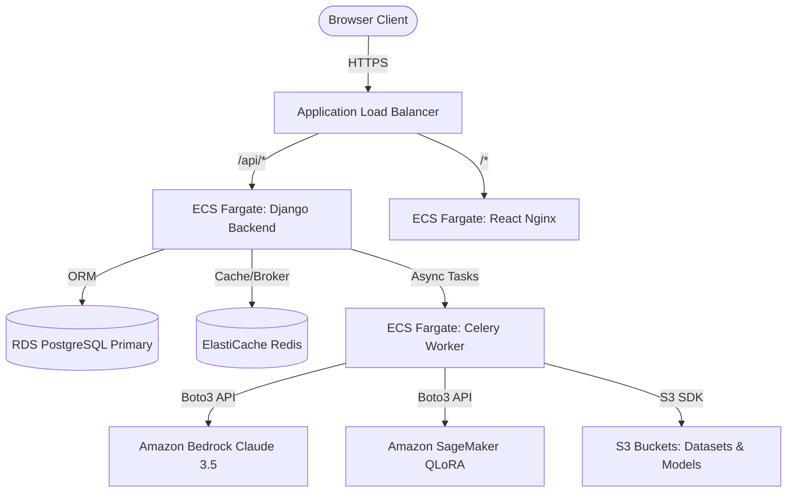

# SecureCode AI — Master Sprint Execution Plan

> **Document Identifier:** `SCAI-SEP-001`  
> **Version:** `1.0.0`  
> **Status:** `ACTIVE`  
> **Classification:** `INTERNAL — ENGINEERING MANAGEMENT`  
> **Author:** Principal Engineering Manager & Technical Program Manager  
> **Dependencies:** `SCAI-DMP-001`, `SCAI-IMP-001`, `SCAI-ETB-001`  

---

## Table of Contents

1. [Executive Overview & Execution Timeline](#1-executive-overview--execution-timeline)
2. [Team Allocation & Roles](#2-team-allocation--roles)
3. [Sprint Structure & High-Level Objectives](#3-sprint-structure--high-level-objectives)
   - [Sprint 1: Core Foundation & Initial Agents (Days 1–5)](#sprint-1-core-foundation--initial-agents-days-15)
   - [Sprint 2: Orchestration, Remediation & Verification (Days 6–10)](#sprint-2-orchestration-remediation--verification-days-610)
   - [Sprint 3: Continuous Learning, Deployment & Investor Demo (Days 11–15)](#sprint-3-continuous-learning-deployment--investor-demo-days-1115)
4. [Day-by-Day Execution Plan](#4-day-by-day-execution-plan)
   - [Day 1: Monorepo Bootstrapping & Core Architecture](#day-1-monorepo-bootstrapping--core-architecture)
   - [Day 2: Authentication Backend & React State Shell](#day-2-authentication-backend--react-state-shell)
   - [Day 3: Repository Ingestion & Planner Agent](#day-3-repository-ingestion--planner-agent)
   - [Day 4: Security Analysis Agent & Knowledge Store](#day-4-security-analysis-agent--knowledge-store)
   - [Day 5: Critic Agent & Sprint 1 Integration](#day-5-critic-agent--sprint-1-integration)
   - [Day 6: LangGraph Multi-Agent Orchestrator](#day-6-langgraph-multi-agent-orchestrator)
   - [Day 7: AutoFix Agent & Unified Diff Engine](#day-7-autofix-agent--unified-diff-engine)
   - [Day 8: Verification Sandbox & Multi-Tool Runners](#day-8-verification-sandbox--multi-tool-runners)
   - [Day 9: Scanning Pipeline & Frontend Results View](#day-9-scanning-pipeline--frontend-results-view)
   - [Day 10: Feedback Loop & Sprint 2 Integration](#day-10-feedback-loop--sprint-2-integration)
   - [Day 11: Dataset Generator & SageMaker QLoRA Pipeline](#day-11-dataset-generator--sagemaker-qlora-pipeline)
   - [Day 12: Evaluation Benchmark & Model Leaderboard](#day-12-evaluation-benchmark--model-leaderboard)
   - [Day 13: AWS Production Deployment & CloudWatch Monitoring](#day-13-aws-production-deployment--cloudwatch-monitoring)
   - [Day 14: System Hardening, E2E Testing & Code Freeze](#day-14-system-hardening-e2e-testing--code-freeze)
   - [Day 15: Investor Demo Rehearsal & Release Candidate](#day-15-investor-demo-rehearsal--release-candidate)
5. [Engineer-Specific Work Allocation](#5-engineer-specific-work-allocation)
   - [Backend Engineer](#backend-engineer)
   - [Frontend Engineer](#frontend-engineer)
   - [AI Engineer 1](#ai-engineer-1)
   - [AI Engineer 2](#ai-engineer-2)
6. [Milestones, Code Freeze & Demo Schedule](#6-milestones-code-freeze--demo-schedule)
7. [Integration & Merge Strategy](#7-integration--merge-strategy)
8. [Testing & Quality Assurance Plan](#8-testing--quality-assurance-plan)
9. [AWS Deployment Plan](#9-aws-deployment-plan)
10. [Investor & Judge Demo Flow](#10-investor--judge-demo-flow)
11. [Standard Operating Checklists](#11-standard-operating-checklists)
    - [Daily Stand-up Format](#daily-stand-up-format)
    - [Code Review Checklist](#code-review-checklist)
    - [Merge Checklist](#merge-checklist)
    - [Testing Checklist](#testing-checklist)
    - [Deployment Checklist](#deployment-checklist)
    - [Demo Checklist](#demo-checklist)
    - [Final Release Checklist](#final-release-checklist)

---

## 1. Executive Overview & Execution Timeline

The SecureCode AI project is organized into a rigorous 15-day, 3-sprint engineering execution plan. The goal is to build, verify, deploy, and demonstrate an autonomous, multi-agent AI security engineering platform.

```
┌──────────────────────────────────────────────────────────────────────────────────┐
│                                15-DAY TIMELINE                                   │
├──────────────────────────┬──────────────────────────┬────────────────────────────┤
│   Sprint 1 (Days 1–5)    │   Sprint 2 (Days 6–10)   │    Sprint 3 (Days 11–15)   │
│ Foundation & Base Agents │ Orchestration & AutoFix  │ Learning, Cloud & Demo     │
└──────────────────────────┴──────────────────────────┴────────────────────────────┘
```

---

## 2. Team Allocation & Roles

| Role | Primary Responsibilities | Core Focus Areas |
|------|--------------------------|------------------|
| **Backend Engineer (BE)** | Django REST Framework, Celery workers, PostgreSQL/Redis models, AWS infra setup, Docker, CI/CD | `backend/`, `docker/`, `scripts/`, Infrastructure |
| **Frontend Engineer (FE)** | React 18, TypeScript, Vite, Tailwind CSS, Redux Toolkit, E2E Playwright tests, UI polishing | `frontend/` |
| **AI Engineer 1 (AI-1)** | LangGraph orchestrator, Planner Agent, Security Agent, Critic Agent, Knowledge Agent (RAG) | `ai/planner/`, `security/`, `critic/`, `knowledge/`, `agents/` |
| **AI Engineer 2 (AI-2)** | AutoFix Agent, Verification Agent, Training Pipeline (SageMaker QLoRA), Evaluation Benchmark | `ai/patches/`, `verification/`, `training/`, `evaluation/` |

---

## 3. Sprint Structure & High-Level Objectives

### Sprint 1: Core Foundation & Initial Agents (Days 1–5)
- **Objectives:** Establish monorepo CI/CD infrastructure, JWT multi-tenant authentication, React SPA shell, repository ingestion pipeline, and isolated AI agents (Planner, Security, Knowledge, Critic).
- **Deliverables:** Working Docker stack, Auth API, Repository CRUD, standalone Planner, Security, Knowledge, and Critic agents.
- **Dependencies:** Monorepo skeleton initialized.
- **Definition of Done:** All Sprint 1 unit tests pass, Docker container boots cleanly, basic security scan analysis runs in isolated agent testing.
- **Success Criteria:** 80%+ Backend test coverage, 0 failing linters/formatters.

### Sprint 2: Orchestration, Remediation & Verification (Days 6–10)
- **Objectives:** Implement the LangGraph directed-graph orchestrator, AutoFix Agent, multi-tool Verification sandbox (Bandit, Semgrep, AST, Pytest), async Celery scanning pipeline, and Findings/Patches UI views.
- **Deliverables:** Complete scan-to-patch execution graph, automated patch verification, real-time UI polling dashboard, engineer feedback API.
- **Dependencies:** Sprint 1 deliverables completed and merged.
- **Definition of Done:** End-to-end scanning and patch generation cycle working locally via Docker Compose.
- **Success Criteria:** 100% of generated patches pass syntax check before submission to verification.

### Sprint 3: Continuous Learning, Deployment & Investor Demo (Days 11–15)
- **Objectives:** Implement SageMaker fine-tuning pipeline, evaluation benchmark leaderboard, AWS ECS/RDS/S3 deployment, CloudWatch monitoring, system hardening, and investor demo rehearsal.
- **Deliverables:** Active AWS cloud deployment, closed-loop training dataset builder, model promotion evaluator, 15-minute live demo environment.
- **Dependencies:** Sprint 2 end-to-end flow operational.
- **Definition of Done:** Production release candidate running on AWS ECS with zero critical security vulnerabilities.
- **Success Criteria:** Live demo completes cleanly under 15 minutes with at least 3 vulnerabilities detected, patched, and verified.

---

## 4. Day-by-Day Execution Plan

---

### Day 1: Monorepo Bootstrapping & Core Architecture

#### Morning Goals
- Align team on Git flow, branch protection, and coding standards.
- Initialize monorepo directory layout and developer environment setup script.

#### Engineering Tasks
- **BE:** Execute Task `TSK-SETUP-001`. Create `docker-compose.yml`, `docker/backend.Dockerfile`, `docker/frontend.Dockerfile`, `docker/nginx.Dockerfile`, `scripts/setup.sh`, `.env.example`, and `.github/workflows/ci.yml`.
- **FE:** Initialize Vite React 18 TypeScript app in `frontend/`, configure Tailwind CSS, PostCSS, and install ShadCN UI components.
- **AI-1:** Setup `ai/` package structure, configure `boto3` Bedrock wrapper in `ai/agents/base.py`, and define initial `WorkflowState` schema.
- **AI-2:** Configure local testing harnesses for security static analysis tools (Bandit, Semgrep, AST parser).

#### Parallel Work
- BE sets up Docker Compose while FE initializes React SPA. AI-1 and AI-2 construct shared state schemas in `ai/agents/state.py`.

#### Merge Plan
- `feature/setup-monorepo` → `develop` (End of Day).

#### Testing
- `bash scripts/setup.sh` boots Python virtual environment and installs Node dependencies without errors.
- `docker-compose up` launches PostgreSQL, Redis, Backend, and Frontend containers.

#### Documentation
- Update `README.md` with local setup instructions.

#### Risk Checks
- Ensure secret key placeholders in `.env.example` are secure and non-confidential.

#### End-of-Day Deliverables
- Functional monorepo, passing CI workflow skeleton, booting Docker containers.

---

### Day 2: Authentication Backend & React State Shell

#### Morning Goals
- Deliver JWT authentication backend and frontend auth state management.

#### Engineering Tasks
- **BE:** Execute Task `TSK-BACKEND-001` (Auth segment). Implement `User` and `Organisation` models, DRF auth viewsets (`/api/v1/auth/login/`, `/api/v1/auth/register/`), and permission classes (`IsAdmin`, `IsEngineer`).
- **FE:** Execute Task `TSK-FRONTEND-001` (Auth segment). Build `apiClient.ts` with Axios interceptors, `authSlice.ts` in Redux Toolkit, `LoginPage.tsx`, and `RegisterPage.tsx`.
- **AI-1:** Draft Planner Agent prompt templates in `ai/prompts/planner_prompts.py` using standard XML format (`<system>`, `<context>`, `<task>`).
- **AI-2:** Implement unified diff generation utilities in `ai/patches/diff_generator.py` using `gitpython`.

#### Parallel Work
- BE builds auth API endpoints; FE builds corresponding login UI forms simultaneously.

#### Merge Plan
- `feature/auth-backend` and `feature/auth-frontend` merged into `develop`.

#### Testing
- Pytest tests for user registration, token generation, and invalid credential handling.
- Vitest unit tests for Redux `authSlice` actions.

#### Documentation
- Document Auth API contracts in `docs/api.md`.

#### Risk Checks
- Verify JWT tokens expire appropriately (15 mins access, 7 days refresh).

#### End-of-Day Deliverables
- Working user login and registration flow in UI backed by Django JWT authentication.

---

### Day 3: Repository Ingestion & Planner Agent

#### Morning Goals
- Enable repository linking in backend and intelligent scan planning in AI engine.

#### Engineering Tasks
- **BE:** Execute Task `TSK-BACKEND-001` (Repo segment) & Task `TSK-SETUP-001` (Repo ingestion). Create `Repository` and `Scan` models, Celery task `clone_repository`, and DRF Viewsets (`/api/v1/repositories/`).
- **FE:** Build `RepositoriesPage.tsx` and `RepositoryDetailPage.tsx` to list and connect Git repositories via API.
- **AI-1:** Execute Task `TSK-PLANNER-001`. Build `PlannerAgent` in `ai/planner/agent.py`, file classification heuristics in `ai/planner/logic.py`, and token batching logic.
- **AI-2:** Implement patch application and conflict checking logic in `ai/patches/patch_applier.py`.

#### Parallel Work
- BE connects Git cloning Celery task while AI-1 builds Planner Agent logic against file trees.

#### Merge Plan
- `feature/repo-ingestion` and `feature/planner-agent` merged into `develop`.

#### Testing
- Unit tests for file tree batching ensuring batches never exceed 50 files.
- Integration test for cloning a public Git repository.

#### Documentation
- Update `docs/database.md` with `repositories` and `scans` table definitions.

#### Risk Checks
- Confirm cloned git repos are deleted or handled safely in temporary volumes.

#### End-of-Day Deliverables
- Git repositories can be registered via API/UI and processed by `PlannerAgent` into a `ScanPlan`.

---

### Day 4: Security Analysis Agent & Knowledge Store

#### Morning Goals
- Construct vulnerability detection engine and OWASP/CWE vector knowledge store.

#### Engineering Tasks
- **BE:** Create `ScanResult` model in `backend/repositories/models.py` and findings endpoint `/api/v1/findings/`.
- **FE:** Build `FindingsPage.tsx` with severity filter controls (CRITICAL, HIGH, MEDIUM, LOW).
- **AI-1:** Execute Task `TSK-SECURITY-001` & Task `TSK-KNOWLEDGE-001`. Implement `SecurityAgent` in `ai/security/agent.py`, detection prompts, Bedrock Claude 3.5 Sonnet invocation, and `KnowledgeAgent` vector store in `ai/knowledge/`.
- **AI-2:** Build Bandit execution wrapper in `ai/verification/runners/bandit_runner.py`.

#### Parallel Work
- AI-1 constructs security detection logic while BE prepares `ScanResult` database tables.

#### Merge Plan
- `feature/security-agent` and `feature/knowledge-agent` merged into `develop`.

#### Testing
- Test `SecurityAgent` against vulnerable test code snippets (SQLi, XSS). Verify `Finding` output schema.
- Vector retrieval test verifying "SQL injection" query yields CWE-89 details.

#### Documentation
- Update `docs/agents.md` with Security and Knowledge agent specifications.

#### Risk Checks
- Ensure prompt constraints prevent false findings on clean code snippets.

#### End-of-Day Deliverables
- Security Agent detecting OWASP Top 10 vulnerabilities with Knowledge store context injection.

---

### Day 5: Critic Agent & Sprint 1 Integration

#### Morning Goals
- Implement Critic Agent validation and consolidate all Sprint 1 features.

#### Engineering Tasks
- **BE:** Implement pagination and filtering for `/api/v1/findings/` by severity and OWASP category.
- **FE:** Connect `FindingsPage.tsx` to live backend findings API endpoint.
- **AI-1:** Execute Task `TSK-CRITIC-001`. Implement `CriticAgent` in `ai/critic/agent.py`, quality scoring rules, and rejection logic.
- **AI-2:** Build Semgrep execution wrapper in `ai/verification/runners/semgrep_runner.py`.

#### Parallel Work
- AI-1 finishes Critic validation logic; FE connects findings UI views; BE optimizes query filtering.

#### Merge Plan
- Merge all Sprint 1 feature branches to `develop`. Create release tag `v0.1.0-sprint1`.

#### Testing
- Run complete Sprint 1 test suite (`pytest backend/`, `pytest ai/`, `npm test`).
- Verify Critic Agent correctly rejects invalid or incomplete findings.

#### Documentation
- Update `docs/architecture.md` with initial single-agent testing results.

#### Risk Checks
- Verify no critical open bugs remain before Sprint 1 sign-off.

#### End-of-Day Deliverables
- Fully validated Sprint 1 code baseline tagged `v0.1.0-sprint1`.

---

### Day 6: LangGraph Multi-Agent Orchestrator

#### Morning Goals
- Wire individual agents into a unified stateful LangGraph directed workflow graph.

#### Engineering Tasks
- **BE:** Create `run_scan` Celery task in `backend/repositories/tasks.py` to trigger graph orchestrator asynchronously.
- **FE:** Build scan progress polling and status indicator components in `ScanDetailPage.tsx`.
- **AI-1:** Execute Task `TSK-AGENT-INTEGRATION` (`TSK-PLANNER-001` completion). Build `ScanOrchestrator` in `ai/agents/orchestrator.py`, conditional routing functions in `ai/agents/edges.py`, and state persistence.
- **AI-2:** Build Pytest and syntax checker runners in `ai/verification/runners/`.

#### Parallel Work
- AI-1 constructs LangGraph workflow while BE integrates task invocation into Celery workers.

#### Merge Plan
- `feature/langgraph-orchestrator` merged into `develop`.

#### Testing
- Integration test executing complete graph: `Planner` → `Security` → `Knowledge` → `Critic`.

#### Documentation
- Document LangGraph state graph in `docs/agents.md`.

#### Risk Checks
- Ensure max recursion limit (10 iterations) is configured on graph execution to prevent infinite loops.

#### End-of-Day Deliverables
- Operational multi-agent LangGraph scan graph running inside Celery task queue.

---

### Day 7: AutoFix Agent & Unified Diff Engine

#### Morning Goals
- Construct AutoFix Agent for automated code patch generation.

#### Engineering Tasks
- **BE:** Execute Task `TSK-AUTOFIX-001` (Backend segment). Create `Patch` and `PullRequest` models in `backend/patches/models.py`, serializers, and `/api/v1/patches/` views.
- **FE:** Build `PatchesPage.tsx` and interactive unified diff viewer component.
- **AI-1:** Integrate AutoFix node into LangGraph orchestrator graph.
- **AI-2:** Execute Task `TSK-AUTOFIX-001` (AI segment). Implement `AutoFixAgent` in `ai/patches/agent.py`, system prompts, and safety constraints (no test deletion).

#### Parallel Work
- AI-2 builds patch generator agent while BE establishes Patch storage schema and API.

#### Merge Plan
- `feature/autofix-agent` merged into `develop`.

#### Testing
- Unit tests verifying generated unified diffs apply cleanly via `git apply`.

#### Documentation
- Update `docs/database.md` with `patches` table schema.

#### Risk Checks
- Ensure AutoFix prompt explicitly prohibits modifying CI configurations or deleting unit tests.

#### End-of-Day Deliverables
- AutoFix Agent producing valid, Git-applicable unified diff code patches.

---

### Day 8: Verification Sandbox & Multi-Tool Runners

#### Morning Goals
- Build multi-tool verification pipeline to validate patches.

#### Engineering Tasks
- **BE:** Create `Verification` model in `backend/verification/models.py` and endpoint `/api/v1/verifications/`.
- **FE:** Add verification status badges and tool log expandable accordions to `PatchesPage.tsx`.
- **AI-1:** Add conditional retry edge in LangGraph graph (`Verification` failure → re-invoke `AutoFix`).
- **AI-2:** Execute Task `TSK-VERIFICATION-001`. Implement `VerificationAgent` in `ai/verification/agent.py` and result aggregator in `ai/verification/aggregator.py`.

#### Parallel Work
- AI-2 connects tool runners (Bandit, Semgrep, AST, Pytest) while BE builds verification storage endpoints.

#### Merge Plan
- `feature/verification-pipeline` merged into `develop`.

#### Testing
- Feed broken patches to verification pipeline; confirm fail-fast behavior stops execution on AST parse errors.

#### Documentation
- Update `docs/architecture.md` with Verification pass/fail decision matrix.

#### Risk Checks
- Verify tool execution timeouts (30s per tool) prevent infinite hangs during verification.

#### End-of-Day Deliverables
- Automated verification pipeline evaluating patch security and correctness prior to approval.

---

### Day 9: Scanning Pipeline & Frontend Results View

#### Morning Goals
- Connect full end-to-end scanning pipeline to UI.

#### Engineering Tasks
- **BE:** Optimize scan job status polling endpoint `/api/v1/scans/:id/status/` with Redis caching.
- **FE:** Execute Task `TSK-FRONTEND-001` (Scan pipeline views). Finalize `ScanDetailPage.tsx`, `FindingsPage.tsx`, and `PatchesPage.tsx`.
- **AI-1:** Optimize token usage across Planner, Security, and Critic agents.
- **AI-2:** Refine patch verification logging and stdout capture.

#### Parallel Work
- FE polished scan detail pages while BE tunes Celery scan task execution and status tracking.

#### Merge Plan
- `feature/scan-pipeline-ui` merged into `develop`.

#### Testing
- End-to-end integration test: User submits repo → Scan executes → Findings displayed → Patches generated → Verification passed.

#### Documentation
- Update `docs/api.md` with complete scan status schemas.

#### Risk Checks
- Confirm scan job failures correctly set status to `failed` and log traceback to DB.

#### End-of-Day Deliverables
- Fully functional scan-to-patch pipeline controllable entirely from web UI.

---

### Day 10: Feedback Loop & Sprint 2 Integration

#### Morning Goals
- Implement engineer feedback collection and finalize Sprint 2 baseline.

#### Engineering Tasks
- **BE:** Execute Task `TSK-FEEDBACK-001`. Implement `Feedback` model in `backend/reviews/models.py` and endpoint `/api/v1/feedback/`.
- **FE:** Build star rating and feedback comment modal component in `PatchReviewPage.tsx`.
- **AI-1:** Ensure all multi-agent state errors are cleanly captured in `WorkflowState.errors`.
- **AI-2:** Prepare dataset generator skeleton in `ai/training/dataset_generator.py`.

#### Parallel Work
- BE builds feedback API while FE integrates review modal into patch UI.

#### Merge Plan
- Merge all Sprint 2 feature branches to `develop`. Tag release `v0.2.0-sprint2`.

#### Testing
- Verify feedback submission persists rating and comment linked to patch ID.
- Run complete test suite across backend, frontend, and AI core.

#### Documentation
- Update `docs/README.md` with Sprint 2 feature set.

#### Risk Checks
- Ensure feedback submissions are restricted to authorized organization users.

#### End-of-Day Deliverables
- Sprint 2 feature set fully integrated, tested, and tagged `v0.2.0-sprint2`.

---

### Day 11: Dataset Generator & SageMaker QLoRA Pipeline

#### Morning Goals
- Build closed-loop training dataset generator and SageMaker training trigger.

#### Engineering Tasks
- **BE:** Execute Task `TSK-TRAINING-001` (Backend segment). Create `TrainingDataset` and `TrainingJob` models in `backend/training/models.py`, tasks, and endpoints `/api/v1/training/jobs/launch/`.
- **FE:** Build `TrainingPage.tsx` to view datasets and launch fine-tuning jobs.
- **AI-1:** Support prompt metadata tracking for fine-tuning dataset export.
- **AI-2:** Execute Task `TSK-TRAINING-001` (AI segment). Implement `dataset_generator.py`, `jsonl_writer.py`, and SageMaker QLoRA launcher in `ai/training/trainer.py`.

#### Parallel Work
- AI-2 constructs training dataset export and SageMaker launcher while BE builds training tracking API.

#### Merge Plan
- `feature/training-pipeline` merged into `develop`.

#### Testing
- Validate output JSONL files conform strictly to instruction-tuning schema.
- Mock SageMaker `CreateTrainingJob` API call.

#### Documentation
- Update `docs/training.md` with fine-tuning hyperparameters and QLoRA config.

#### Risk Checks
- Ensure user PII and confidential tokens are scrubbed from training datasets.

#### End-of-Day Deliverables
- Functional JSONL dataset generation and SageMaker QLoRA fine-tuning launch pipeline.

---

### Day 12: Evaluation Benchmark & Model Leaderboard

#### Morning Goals
- Build evaluation framework to benchmark fine-tuned models against production champions.

#### Engineering Tasks
- **BE:** Create `ModelVersion`, `EvaluationRun`, and `EvaluationResult` models in `backend/evaluation/models.py` and leaderboard endpoint `/api/v1/evaluations/leaderboard/`.
- **FE:** Build `EvaluationPage.tsx` with interactive model leaderboard table.
- **AI-1:** Refine model version metadata injection into agent headers.
- **AI-2:** Execute Task `TSK-EVALUATION-001`. Implement `benchmark.py`, `metrics.py` (Precision/Recall/F1), `comparator.py`, and `leaderboard.py`.

#### Parallel Work
- AI-2 constructs benchmark suite while BE builds model evaluation registry endpoints.

#### Merge Plan
- `feature/evaluation-pipeline` merged into `develop`.

#### Testing
- Run mock evaluation run; verify model promotion trigger fires only when Challenger F1 > Champion F1 + 2%.

#### Documentation
- Update `docs/training.md` with model promotion governance criteria.

#### Risk Checks
- Confirm candidate model promotion requires 0 security regressions on core benchmark cases.

#### End-of-Day Deliverables
- Evaluation pipeline comparing challenger models against champion models with UI leaderboard.

---

### Day 13: AWS Production Deployment & CloudWatch Monitoring

#### Morning Goals
- Provision AWS cloud production environment and observability stack.

#### Engineering Tasks
- **BE:** Execute Task `TSK-AWS-001` & Task `TSK-MONITORING-001`. Provision ECS Fargate, RDS PostgreSQL, ElastiCache Redis, S3 buckets, ALB, Secrets Manager, and CloudWatch alarms.
- **FE:** Build production bundle (`npm run build`), verify environment variables (`VITE_API_BASE_URL`).
- **AI-1:** Validate AWS Bedrock access from ECS container tasks using IAM execution roles.
- **AI-2:** Configure SageMaker endpoint connection settings for production inference.

#### Parallel Work
- BE provisions Terraform/AWS infra while FE and AI prepare production build artifacts.

#### Merge Plan
- `feature/aws-deployment` merged into `develop`.

#### Testing
- Execute `/api/v1/health/` request against production ALB URL.
- Test CloudWatch alarm trigger on synthetic error injection.

#### Documentation
- Update `docs/aws.md` and `docs/deployment.md` with production ARNs and architecture details.

#### Risk Checks
- Verify all database connections and S3 storage are encrypted at rest and in transit.

#### End-of-Day Deliverables
- Fully provisioned AWS production environment running SecureCode AI platform.

---

### Day 14: System Hardening, E2E Testing & Code Freeze

#### Morning Goals
- Execute system security hardening, full test suite validation, and code freeze.

#### Engineering Tasks
- **BE:** Execute Task `TSK-DEPLOY-001`. Perform CORS verification, rate limiting (100 req/min), and DB snapshot verification.
- **FE:** Execute Task `TSK-TESTING-001`. Execute full Playwright E2E test suite against staging environment.
- **AI-1:** Finalize prompt regression test suite in `ai/tests/prompts/`.
- **AI-2:** Verify verification tool sandbox resource boundaries.

#### Parallel Work
- FE runs E2E test suite while BE executes load testing and security scans.

#### Merge Plan
- Merge `develop` into `staging`. Tag Release Candidate `v1.0.0-rc1`. **CODE FREEZE IN EFFECT.**

#### Testing
- Run complete test pyramid: Pytest backend (80%+ coverage), Vitest frontend (75%+ coverage), Playwright E2E.
- Run Bandit and Semgrep SAST checks against system codebase.

#### Documentation
- Complete all pending updates across `docs/`.

#### Risk Checks
- Ensure zero critical/high security issues remain in SAST report.

#### End-of-Day Deliverables
- Hardened Release Candidate `v1.0.0-rc1` deployed to production staging environment under code freeze.

---

### Day 15: Investor Demo Rehearsal & Release Candidate

#### Morning Goals
- Execute investor demo rehearsals, validate demo data, and cut final release.

#### Engineering Tasks
- **BE:** Execute Task `TSK-PRESENTATION-001` (Backend segment). Run `scripts/seed_demo.py` to prepare target vulnerability repository.
- **FE:** Execute Task `TSK-PRESENTATION-001` (Frontend segment). Perform final UI polish, animation checks, and record fallback video.
- **AI-1:** Verify live Bedrock inference responses for demo repository files.
- **AI-2:** Validate live patch generation and verification speed during rehearsal.

#### Parallel Work
- Entire team conducts 2 complete live demo rehearsals under timer (target < 15 mins).

#### Merge Plan
- Merge `staging` into `main`. Tag official release `v1.0.0`. **DEMO FREEZE IN EFFECT.**

#### Testing
- Dry run of 15-minute live investor demo script.
- Verify fallback demonstration video is rendered and ready.

#### Documentation
- Publish final release notes in `CHANGELOG.md`.

#### Risk Checks
- Confirm local offline fallback environment is ready in case of internet instability.

#### End-of-Day Deliverables
- Tested 15-minute live investor demo, production deployment `v1.0.0`, and fallback video.

---

## 5. Engineer-Specific Work Allocation

### Backend Engineer

| Day | Daily Tasks | Expected Files | Expected PRs | Expected APIs | Expected Classes | Testing | Docs |
|-----|-------------|----------------|--------------|---------------|------------------|---------|------|
| **1** | Monorepo & Docker | `docker-compose.yml`, `backend.Dockerfile` | `feature/setup-monorepo` | N/A | N/A | Docker boot test | `README.md` |
| **2** | Auth Backend & RBAC | `accounts/models.py`, `accounts/views.py` | `feature/auth-backend` | `/api/v1/auth/login/`, `register/` | `User`, `Organisation` | Auth Pytest | `docs/api.md` |
| **3** | Repos & Celery | `repositories/models.py`, `tasks.py` | `feature/repo-ingestion` | `/api/v1/repositories/` | `Repository`, `Scan` | Git clone test | `docs/database.md` |
| **4** | Scan Results API | `repositories/models.py`, `views.py` | `feature/findings-api` | `/api/v1/findings/` | `ScanResult` | Findings query test | `docs/api.md` |
| **5** | Pagination & Filter | `api/pagination.py`, `api/exceptions.py` | `feature/api-refinement` | Filter params | `StandardPagination` | API error envelope test | N/A |
| **6** | Async Scan Task | `repositories/tasks.py` | `feature/scan-task` | `/api/v1/scans/:id/status/` | `ScanTask` | Celery async test | `docs/architecture.md` |
| **7** | Patches DB & API | `patches/models.py`, `patches/views.py` | `feature/patches-backend` | `/api/v1/patches/` | `Patch`, `PullRequest` | Patch ORM test | `docs/database.md` |
| **8** | Verification Storage| `verification/models.py`, `views.py` | `feature/verification-db` | `/api/v1/verifications/` | `Verification` | Verification view test | N/A |
| **9** | Redis Caching | `config/settings.py` | `feature/redis-cache` | Cache headers | N/A | Cache hit test | `docs/aws.md` |
| **10**| Feedback API | `reviews/models.py`, `reviews/views.py` | `feature/feedback-backend` | `/api/v1/feedback/` | `Feedback` | Feedback submission test| N/A |
| **11**| Training DB & Task | `training/models.py`, `training/tasks.py` | `feature/training-db` | `/api/v1/training/jobs/launch/`| `TrainingDataset`, `TrainingJob`| Training job test | `docs/training.md` |
| **12**| Evaluation Registry| `evaluation/models.py`, `views.py` | `feature/eval-registry` | `/api/v1/evaluations/leaderboard/`| `ModelVersion`, `EvaluationRun`| Registry query test | N/A |
| **13**| AWS Infra Deploy | CloudWatch config, Docker builds | `feature/aws-deployment` | Production domain | N/A | ALB health check | `docs/deployment.md` |
| **14**| Hardening & Load | `config/settings.py` | `feature/hardening` | Rate limits | N/A | Locust load test | N/A |
| **15**| Demo Data Seeding | `scripts/seed_demo.py` | `feature/demo-seeding` | N/A | N/A | Seed script validation | `CHANGELOG.md` |

---

### Frontend Engineer

| Day | Daily Tasks | Expected Files | Expected PRs | Expected Components | Expected State | Testing | Docs |
|-----|-------------|----------------|--------------|---------------------|----------------|---------|------|
| **1** | Vite & React Setup | `package.json`, `vite.config.ts` | `feature/frontend-setup` | App Shell | N/A | Build check | N/A |
| **2** | Auth UI & Redux | `LoginPage.tsx`, `authSlice.ts` | `feature/auth-frontend` | `LoginPage`, `RegisterPage` | `authSlice` | Vitest auth test | N/A |
| **3** | Repository Views | `RepositoriesPage.tsx` | `feature/repo-ui` | `RepositoriesPage`, `RepoDetail` | `repoSlice` | Component render test | N/A |
| **4** | Findings Table | `FindingsPage.tsx` | `feature/findings-ui` | `FindingsPage`, `SeverityBadge` | `scanSlice` | Table filter test | N/A |
| **5** | API Integration | `services/scanService.ts` | `feature/ui-integration` | `FindingsTable` | `scanSlice` | API mock test | N/A |
| **6** | Progress Polling | `ScanDetailPage.tsx` | `feature/scan-progress` | `ProgressBar`, `ScanStatus` | `scanSlice` | Polling hook test | N/A |
| **7** | Patch Diff Viewer | `PatchesPage.tsx`, `DiffViewer.tsx` | `feature/diff-viewer` | `PatchesPage`, `DiffViewer` | `patchSlice` | Diff parse test | N/A |
| **8** | Verification Badges| `VerificationBadges.tsx` | `feature/verif-badges` | `ToolAccordion`, `StatusBadge` | `patchSlice` | Badge state test | N/A |
| **9** | Full Scan UI Sync | `ScanDetailPage.tsx` | `feature/scan-ui-sync` | Full Scan Dashboard | `scanSlice` | Integration test | N/A |
| **10**| Feedback UI | `PatchReviewPage.tsx`, `RatingModal.tsx`| `feature/feedback-ui` | `FeedbackModal`, `StarRating` | `patchSlice` | Modal submission test | N/A |
| **11**| Training View | `TrainingPage.tsx` | `feature/training-ui` | `TrainingPage`, `DatasetTable` | `trainingSlice`| Render test | N/A |
| **12**| Leaderboard Page | `EvaluationPage.tsx` | `feature/leaderboard-ui` | `EvaluationPage`, `Leaderboard` | `evalSlice` | Table sort test | N/A |
| **13**| Production Build | `vite.config.ts` | `feature/prod-build` | Minified bundle | N/A | Bundle size audit | N/A |
| **14**| E2E Testing | `frontend/e2e/scan.spec.ts` | `feature/e2e-tests` | N/A | N/A | Playwright E2E | N/A |
| **15**| Demo Polish & Video| `DemoMode.tsx`, fallback video | `feature/demo-polish` | Presentation Layout | N/A | Rehearsal validation | N/A |

---

### AI Engineer 1

| Day | Daily Tasks | Expected Files | Expected PRs | Expected Agents / Modules | Expected State | Testing | Docs |
|-----|-------------|----------------|--------------|---------------------------|----------------|---------|------|
| **1** | AI Base & State | `ai/agents/base.py`, `state.py` | `feature/ai-base` | `BaseAgent` | `WorkflowState` | Schema check | N/A |
| **2** | Planner Prompts | `ai/prompts/planner_prompts.py` | `feature/planner-prompts` | Prompt Templates | N/A | Prompt format check | N/A |
| **3** | Planner Agent | `ai/planner/agent.py`, `logic.py` | `feature/planner-agent` | `PlannerAgent` | `ScanPlan` | Batching unit test | `docs/agents.md` |
| **4** | Security & Knowledge| `ai/security/agent.py`, `ai/knowledge/agent.py`| `feature/security-agent` | `SecurityAgent`, `KnowledgeAgent`| `Finding` | Snippet detection test | `docs/agents.md` |
| **5** | Critic Agent | `ai/critic/agent.py` | `feature/critic-agent` | `CriticAgent` | `ValidationResult` | Rejection logic test | `docs/agents.md` |
| **6** | LangGraph Workflow | `ai/agents/orchestrator.py`, `edges.py` | `feature/langgraph-flow` | `ScanOrchestrator` | Compiled Graph | Graph execution test | `docs/agents.md` |
| **7** | AutoFix Graph Node | `ai/agents/orchestrator.py` | `feature/autofix-node` | Graph Node Routing | Updated Graph | Edge transition test | N/A |
| **8** | Retry Routing | `ai/agents/edges.py` | `feature/retry-routing` | Conditional Edges | Updated Graph | Re-invocation test | N/A |
| **9** | Token Optimization | Prompt token budgeting | `feature/token-opt` | Optimized Agents | N/A | Token count check | N/A |
| **10**| Error State Handling| `ai/agents/errors.py` | `feature/ai-errors` | Error Handler | `WorkflowState.errors`| Error capture test | N/A |
| **11**| Fine-Tuning Metadata| Prompt tracking | `feature/prompt-metadata` | Prompt Metadata Exporter | N/A | Metadata format test | N/A |
| **12**| Model Headers | Dynamic model ID injection | `feature/model-headers` | Model Context Handler | N/A | Header injection test| N/A |
| **13**| Bedrock IAM Check | IAM task execution roles | `feature/bedrock-iam` | Bedrock Client Wrapper | N/A | Bedrock ping test | `docs/aws.md` |
| **14**| Prompt Regression | `ai/tests/prompts/test_reg.py` | `feature/prompt-testing` | Prompt Test Suite | N/A | Snapshot tests | N/A |
| **15**| Demo Live Prep | Pre-warmed model prompts | `feature/demo-ai-prep` | Demo Config | N/A | Live execution test | N/A |

---

### AI Engineer 2

| Day | Daily Tasks | Expected Files | Expected PRs | Expected Agents / Modules | Expected State | Testing | Docs |
|-----|-------------|----------------|--------------|---------------------------|----------------|---------|------|
| **1** | Tool Harness Setup | Local Bandit/Semgrep check | `feature/tool-harness` | N/A | N/A | Binary call test | N/A |
| **2** | Diff Utilities | `ai/patches/diff_generator.py` | `feature/diff-utils` | Diff Generator | N/A | Git diff unit test | N/A |
| **3** | Patch Application | `ai/patches/patch_applier.py` | `feature/patch-applier` | Patch Applier | N/A | Patch apply test | N/A |
| **4** | Bandit Runner | `ai/verification/runners/bandit_runner.py`| `feature/bandit-runner` | Bandit Runner | `ToolResult` | Mock Bandit test | N/A |
| **5** | Semgrep Runner | `ai/verification/runners/semgrep_runner.py`| `feature/semgrep-runner` | Semgrep Runner | `ToolResult` | Mock Semgrep test | N/A |
| **6** | Pytest & AST Runner| `ai/verification/runners/pytest_runner.py`| `feature/pytest-runner` | Pytest Runner, AST Checker| `ToolResult` | AST parse test | N/A |
| **7** | AutoFix Agent | `ai/patches/agent.py` | `feature/autofix-agent` | `AutoFixAgent` | `Patch` | Patch creation test | `docs/agents.md` |
| **8** | Verification Agent | `ai/verification/agent.py`, `aggregator.py` | `feature/verif-agent` | `VerificationAgent` | `VerificationResult`| Fail-fast test | `docs/architecture.md`|
| **9** | Verif Log Capture | Stdout/stderr JSON capture | `feature/verif-logs` | Output Logger | N/A | Log capture test | N/A |
| **10**| Dataset Gen Setup | `ai/training/dataset_generator.py` | `feature/dataset-gen` | Dataset Generator | JSONL Record | JSONL format test | N/A |
| **11**| SageMaker QLoRA | `ai/training/trainer.py` | `feature/sagemaker-qlora` | SageMaker Trainer | `TrainingConfig` | Mock SageMaker test | `docs/training.md` |
| **12**| Benchmark Suite | `ai/evaluation/benchmark.py`, `metrics.py` | `feature/eval-benchmark` | Benchmark Suite, Metrics | `ComparisonResult` | F1 calculation test | `docs/training.md` |
| **13**| SageMaker Endpoint | Connection config | `feature/sagemaker-ep` | Inference Endpoint Client | N/A | Endpoint ping test | `docs/aws.md` |
| **14**| Sandbox Boundary | Subprocess limits | `feature/sandbox-limits` | Subprocess Guard | N/A | Timeout test | N/A |
| **15**| Patch Timing Audit | Rehearsal latency measurement | `feature/patch-audit` | Benchmark Audit | N/A | Latency check | N/A |

---

## 6. Milestones, Code Freeze & Demo Schedule

| Milestone | Target Day | Description | Gating Criteria |
|-----------|------------|-------------|-----------------|
| **M1: Baseline Architecture** | Day 5 | Monorepo, Auth, Repos & Standalone Agents operational | Sprint 1 test suite passing |
| **M2: Scanning & AutoFix Pipeline** | Day 10 | Complete LangGraph execution, AutoFix, & Verification in UI | End-to-end local scan functional |
| **M3: AWS Infrastructure Active** | Day 13 | ECS, RDS, Redis, S3, ALB deployed on AWS | Public ALB `/health/` returns 200 |
| **M4: Code Freeze** | Day 14 | All feature code merged to `staging`; Release Candidate cut | `v1.0.0-rc1` cut, 0 open P0/P1 bugs |
| **M5: Demo Freeze** | Day 15 | Environment locked; Fallback video rendered; Live rehearsal complete | Final `v1.0.0` tag merged to `main` |

---

## 7. Integration & Merge Strategy

### Branching Standard
- Primary Branches: `main` (Production), `staging` (Pre-production), `develop` (Integration).
- Feature Branches: `{type}/{ticket-id}/{short-description}` (e.g., `feature/SCAI-42/planner-agent`).

### Daily Integration Sequence
```
┌────────────────────────────────────────────────────────┐
│               DAILY MERGE CYCLE (17:00)                │
├────────────────────────────────────────────────────────┤
│ 1. Local Rebase against origin/develop                │
│ 2. Execute local test suite & pre-commit hooks         │
│ 3. Push feature branch & open PR                       │
│ 4. Peer Code Review & CI execution                     │
│ 5. Approval & Squash Merge to origin/develop           │
└────────────────────────────────────────────────────────┘
```

---

## 8. Testing & Quality Assurance Plan

### Coverage Thresholds

| Test Suite | Target Coverage | Tooling | Execution Frequency |
|------------|-----------------|---------|---------------------|
| Backend Unit & Integration | 80% Line / 70% Branch | Pytest, Pytest-cov | Every PR & Push |
| Frontend Component & State | 75% Line / 65% Branch | Vitest, React Testing Library | Every PR & Push |
| AI Agent & Graph State | 85% Line / 75% Branch | Pytest, Mock Bedrock | Every PR & Push |
| End-to-End System | Core User Journeys | Playwright | Nightly & Staging Deploy |
| Static Security Analysis | 0 High/Critical Findings | Bandit, Semgrep | Every PR & Push |

---

## 9. AWS Deployment Plan



### AWS Deployment Steps (Day 13)
1. Build & tag production ECR Docker images (`backend`, `frontend`, `nginx`).
2. Push images to Amazon ECR repositories (`scai-prod-ecr-*`).
3. Apply database migrations on Amazon RDS PostgreSQL instance.
4. Deploy updated ECS Task Definitions to `scai-prod-ecs-cluster`.
5. Run ALB target group health check until all tasks report `Healthy`.

---

## 10. Investor & Judge Demo Flow

### 15-Minute Live Demo Script

| Minute | Stage | Speaker Action | System Activity |
|--------|-------|----------------|-----------------|
| **00:00 - 02:00** | Introduction | Introduce SecureCode AI value proposition | Display Dashboard Overview |
| **02:00 - 03:00** | Repository Connect | Input target repository URL and trigger scan | POST `/api/v1/scans/` dispatches Celery task |
| **03:00 - 06:00** | Autonomous Scan | Explain multi-agent reasoning graph | LangGraph executes Planner → Security → Knowledge → Critic |
| **06:00 - 09:00** | Finding Review | Inspect detected OWASP SQLi vulnerability | Display vulnerability detail, code snippet, & explanation |
| **09:00 - 11:00** | AutoFix & Verification | Show auto-generated patch & verification checks | AutoFix generates unified diff; Verification runs AST/Bandit/Pytest |
| **11:00 - 13:00** | One-Click PR & Feedback | Click "Approve & Create PR" and submit 5-star rating | Pull Request created on GitHub; Feedback logged to DB |
| **13:00 - 15:00** | Learning Loop & Q&A | Show Training Page dataset builder & leaderboard | Display fine-tuning dataset export & model leaderboard |

---

## 11. Standard Operating Checklists

### Daily Stand-up Format
- [ ] **What did you complete yesterday?** (Reference Task ID & PR)
- [ ] **What will you complete today?** (Reference Task ID)
- [ ] **Are there any blockers?** (Technical, API contract, or resource dependency)
- [ ] **Are all local tests passing and code pushed?**

---

### Code Review Checklist
- [ ] **Naming:** Follows naming conventions (`lower_snake_case` Python, `camelCase`/`PascalCase` TS).
- [ ] **Typing:** Explicit type annotations present on all Python functions and TypeScript props.
- [ ] **Security:** No hardcoded secrets, SQL concatenation, or unvalidated inputs.
- [ ] **Documentation:** Docstrings updated for all modified classes and functions.
- [ ] **Testing:** Unit test file created or updated; coverage target maintained.
- [ ] **Cleanliness:** No commented-out debug code or `console.log` statements remaining.

---

### Merge Checklist
- [ ] Branch rebased against latest `origin/develop`.
- [ ] CI workflow checks pass 100% (Lint, Security Scan, Unit Tests).
- [ ] At least 1 peer approval received.
- [ ] Merge performed using **Squash and Merge** with Conventional Commit message.
- [ ] Feature branch deleted after successful merge.

---

### Testing Checklist
- [ ] Backend unit tests pass (`pytest backend/`).
- [ ] AI core tests pass (`pytest ai/`).
- [ ] Frontend tests pass (`npm test`).
- [ ] SAST tools pass with zero high/critical issues (`bandit`, `semgrep`).
- [ ] Playwright E2E suite passes on staging (`npx playwright test`).

---

### Deployment Checklist
- [ ] Target release tag created (`vX.Y.Z`).
- [ ] AWS ECR images built, scanned, and tagged.
- [ ] RDS database backup snapshot taken prior to migration.
- [ ] Django migrations applied successfully (`python manage.py migrate`).
- [ ] ECS service updated and task count scaled to operational target.
- [ ] ALB target group health check status verified `Healthy`.
- [ ] `/api/v1/health/` returns `200 OK`.

---

### Demo Checklist
- [ ] Seed script executed (`python scripts/seed_demo.py`).
- [ ] Target demonstration repository verified accessible on GitHub.
- [ ] AWS Bedrock API quotas checked.
- [ ] Browser cache cleared; zoom set to 110% for display readability.
- [ ] Fallback MP4 demonstration video verified ready on local desktop.

---

### Final Release Checklist
- [ ] Code freeze enforced; all PRs merged to `main`.
- [ ] Final release version tag `v1.0.0` pushed to GitHub.
- [ ] Production application accessible over HTTPS on primary domain.
- [ ] `CHANGELOG.md` updated with full release notes.
- [ ] All 27 documentation files in `docs/` verified consistent and active.
- [ ] Formal release sign-off approved by Principal Engineering Manager.

---

## Change Log

| Version | Date | Author | Description |
|---------|------|--------|-------------|
| 1.0.0 | 2026-07-29 | Principal Engineering Manager | Initial release of Master Sprint Execution Plan |

---

## Referenced By

This document is referenced by all engineering team members, project leads, and deployment automation scripts as the operational execution standard for the SecureCode AI platform.
